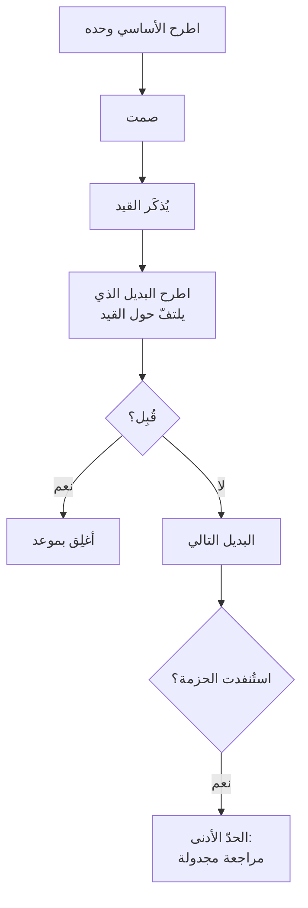

# المقايضة الذكية (Smart Bartering)
> [!info] تعريف مختصر
> المقايضة الذكية هي ألّا تدخل تفاوضًا بطلب واحد، بل بـ**حزمة**: طلب أساسي ومجموعة بدائل مرتّبة بتكلفتها على الطرف الآخر. فيتحوّل «لا» من **رفض لك** إلى **اختيار بين بنود**.

## الشرح العلمي والاحترافي
المشكلة التي تحلّها نفسية لا تفاوضية: **«لا» على طلب واحد تُقرأ رفضًا لشخصك**، فتُنتج صراعًا شخصيًّا حتى لو كان الرفض لسبب موضوعي. أمّا «لا» على بند من حزمة فتُقرأ **مفاضلة** — والفرق كلّه في وجود البدائل لا في صياغة الطلب.

| المستوى | ما هو؟ | مثال (طلب زيادة) |
|---|---|---|
| **الأساسي** | ما تريده فعلًا | زيادة بنسبة كذا |
| **البديل الأوّل** | تكلفته أقلّ عليه | تغيير المسمّى + مسؤوليات معلنة |
| **البديل الثاني** | تكلفة شبه معدومة | يوم عمل عن بُعد أسبوعيًّا |
| **البديل الثالث** | استثمار مشترك | شهادة أو تدريب تُموّله الشركة |
| **الحدّ الأدنى** | ما دونه لا تدخل | مراجعة مجدولة بتاريخ محدّد |

**ولا تُخلَط بـ[[BATNA]]:** المقايضة الذكية بدائل **داخل** التفاوض تُحدّد **بمَ تخرج**؛ و BATNA بديل **خارجه** يُحدّد **متى تنسحب**. وأنت تحتاج الاثنين: حزمة غنيّة بلا BATNA تجعلك تُساوم من موقع ضعف؛ و BATNA قويّ بلا حزمة يجعل النقاش ثنائيًّا — إمّا الطلب وإمّا الرحيل.

## أين ومتى يُستخدم
- التفاوض على راتب أو ترقية أو صلاحية.
- طلب موارد أو أداة أو ميزانية من الإدارة.
- التفاوض مع عميل على نطاق أو موعد أو سعر.
- التفاوض مع فريق آخر على أولوية تسليم بيني.

## مثال وسيناريو تطبيقي
> [!example] مدير مشروع يطلب زيادة. الطلب المفرد: «أحتاج زيادة بنسبة كذا.» فيقول المدير: «الميزانية مغلقة هذا الربع.» — وانتهى النقاش عند «لا»، وبقي في ذهن الطرفين أنّ **طلبًا رُفِض**. أمّا بالحزمة: يُطرَح الأساسي أوّلًا مُؤطَّرًا بالخسارة، **ويُصمَت**، وحين يُذكَر القيد («الميزانية مغلقة») **يُطرَح البديل الذي يلتفّ حول ذلك القيد بعينه**: «مفهوم — وحتى يُفتَح باب الميزانية، أيناسبك أن نُثبّت المسمّى الجديد الآن مع مراجعة للراتب في يناير؟ ويهمّني أيضًا تدريب كذا إن كان بندًا منفصلًا في ميزانية التطوير.» **لاحظ أنّ البديل طُرح بعد معرفة القيد لا قبله** — فبدا حلًّا لمشكلة المدير نفسه لا تراجعًا.

## خطوات أو مخطّط
1. اكتب الأساسي، ثم **ثلاثة بدائل مرتّبة بتكلفتها على الطرف الآخر** (لا بأهمّيتها لك).
2. حدّد **حدّك الأدنى**: ما دونه لا تدخل التفاوض أصلًا.
3. حدّد [[BATNA]]: ماذا تفعل إن رُفض كلّ شيء؟
4. اطرح **الأساسي وحده** مُؤطَّرًا بالخسارة، ثم اصمت.
5. استمع حتى يُذكَر **القيد**.
6. اطرح البديل الذي **يلتفّ حول ذلك القيد تحديدًا**.
7. أغلِق على شيء محدّد بموعد — ولو كان مراجعة مجدولة.

## ⚠️ مفاهيم خاطئة شائعة
> [!warning]
> - **ليست تنازلًا مُسبَقًا.** البدائل لا تُطرَح مع الأساسي بل بعده؛ وطرحها كلّها دفعةً واحدة يُترجَم أنّ الطلب الأساسي غير جادّ.
> - **ليست بديلًا عن القوّة التفاوضية.** القوّة تُبنى في الأشهر السابقة — بشبكة علاقات ومهارة قابلة للنقل ومدّخر يُتيح رفضًا — لا في دقائق الاجتماع.
> - **البدائل تُرتَّب بتكلفتها عليه لا بأهمّيتها لك** — فالغرض تسهيل قول «نعم» على شيء.

## ❌ ممارسات خاطئة في المشاريع
> [!failure]
> - **الدخول بسلاح واحد** — يضعك في طريق مسدود باحتمال واحد، ويُحوّل الرفض إلى صراع شخصي.
> - **التلميح إلى أنّك «الملاذ الوحيد»** حين تكون بالفعل كذلك — يُقرأ ابتزازًا وإن كان صحيحًا، ويُنتج استياءً يظهر لاحقًا.
> - **تجاهل التوقيت** — طلب في وقت تسريحات أو أزمة سيولة يُقرأ انعدام وعي بالسياق مهما كانت الحزمة جيّدة. الحل: احفظ الطلب حيًّا بمراجعة مجدولة.
> - **افتراض أنّ النصيحة تصلح للجميع** — من لديه التزامات عاجلة أو تأشيرة مرتبطة بوظيفته لا يملك BATNA ولا ترف التأجيل؛ ونصيحته الصادقة **بناء البديل أوّلًا** لا إتقان تقنية اجتماع.

## 🔗 مصطلحات ومفاهيم ذات صلة
[[BATNA]] | [[Anchoring]] | [[Loss Framing]] | [[Positive Refusal]] | [[Positions vs Interests]] | [[Opportunity Cost]] | [[Ackerman Model]]

> [!tip] 💡 إثراء عملي — كورس لعبة العقل
> بناء الحزمة، وقواعد التوقيت وميزان القوى، وورشة ملفّ التفاوض: [[09 - التفاوض على القيمة - التثبيت والخسارة والمقايضة]].
