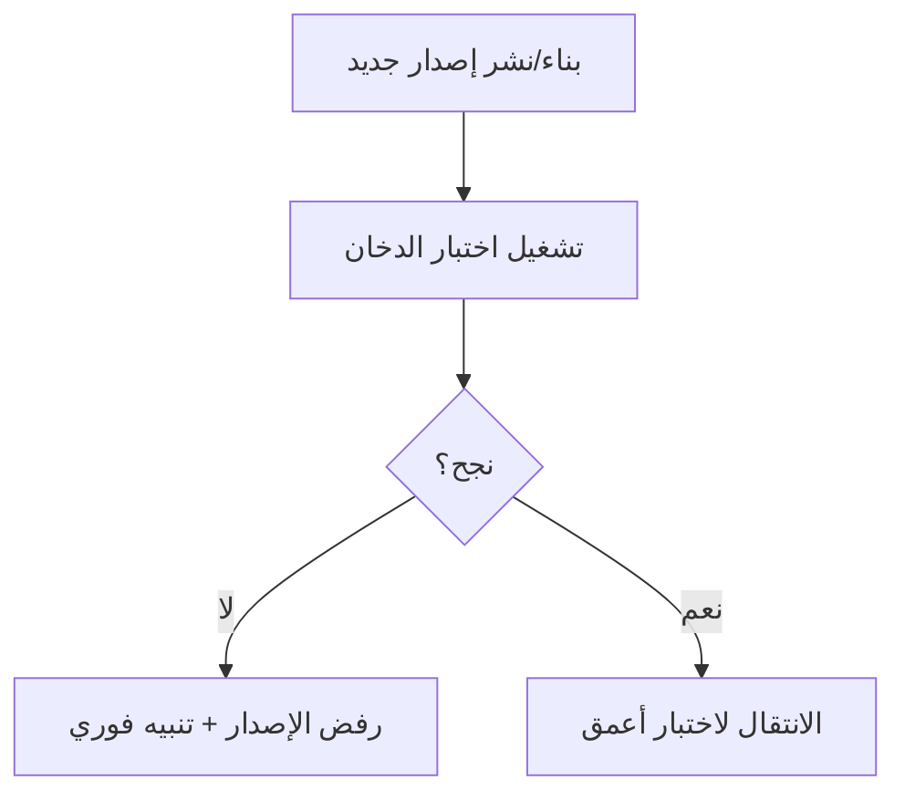

# اختبار الدخان (Smoke Testing)
> [!info] تعريف مختصر
> اختبار الدخان هو مجموعة صغيرة وسريعة من الاختبارات تُجرى فور توفر إصدار جديد للتأكد من أن الوظائف الأساسية للنظام تعمل، قبل الانتقال لاختبار أعمق وأشمل.

## الشرح العلمي والاحترافي
جاء الاسم من هندسة الأجهزة الإلكترونية: عند تشغيل جهاز جديد لأول مرة، يتحقق المهندس أولًا من عدم خروج دخان منه قبل فحص باقي الوظائف بدقة. في البرمجيات، الفكرة مشابهة: هل النظام "يشتعل" بشكل سليم أصلًا؟ هل يفتح التطبيق؟ هل يمكن تسجيل الدخول؟ هل الصفحة الرئيسية تظهر؟

اختبار الدخان:
- **سطحي وسريع** (دقائق، وليس ساعات).
- يغطي **أهم المسارات الحرجة فقط** (Critical Paths)، وليس كل التفاصيل.
- يُجرى **فور كل بناء جديد (Build)** أو نشر جديد، غالبًا بشكل آلي ضمن [[CI and CD]].
- إذا فشل، يُرفَض الإصدار فورًا (Build Rejected) ولا يُكمل الفريق اختبارًا أعمق، لأن لا فائدة من اختبار تفاصيل نظام معطّل أساسًا.

الفرق بينه وبين [[Regression Testing]]: اختبار الدخان يجيب على سؤال "هل يعمل النظام أصلًا؟" (تغطية عريضة وسطحية)، بينما اختبار الانحدار يجيب على سؤال "هل ما زال كل شيء يعمل كما كان بعد التغييرات؟" (تغطية أعمق وأشمل، وقد يستغرق وقتًا أطول بكثير).

## أين ومتى يُستخدم
- فور كل بناء (Build) جديد للتطبيق، قبل تسليمه لفريق الاختبار أو للنشر.
- كخطوة أولى تلقائية في خط [[CI and CD]] (Smoke Test Suite) تعمل خلال دقائق من كل Commit.
- قبل بدء اختبار [[UAT]] للتأكد أن البيئة صالحة للاختبار أصلًا.
- بعد كل عملية نشر إلى بيئة الإنتاج (Production) للتأكد من نجاح النشر ([[Staging vs Production Environment]]).

## مثال وسيناريو تطبيقي
> [!example]
> فريق تطبيق "حجزي" لحجز الفنادق ينشر إصدارًا جديدًا كل يوم عبر [[CI and CD]]. بعد كل نشر، يشغّل النظام تلقائيًا مجموعة اختبار دخان مكوّنة من 8 اختبارات فقط تستغرق 3 دقائق:
> 1. فتح التطبيق بنجاح.
> 2. تسجيل الدخول بحساب تجريبي.
> 3. البحث عن فندق في مدينة الرياض.
> 4. عرض تفاصيل فندق واحد.
> 5. إضافة فندق للحجز.
> 6. الوصول لصفحة الدفع.
> 7. تسجيل الخروج.
> 8. فتح صفحة "مساعدة العملاء".
>
> يوم الثلاثاء، فشل الاختبار رقم 3 (البحث لا يُرجع أي نتائج) بسبب خطأ في نشر قاعدة البيانات. رفض النظام الإصدار تلقائيًا، وأُرسل تنبيه فوري لفريق التطوير، فتم التراجع (Rollback) خلال 10 دقائق دون أن يصل الخلل لأي مستخدم حقيقي، ودون إضاعة وقت فريق الاختبار الكامل (ساعات) في اختبار إصدار معطّل أصلًا.

## خطوات أو مخطّط
1. تحديد أهم 5-10 مسارات حرجة في النظام (تسجيل الدخول، الوظيفة الأساسية، الدفع...).
2. أتمتة هذه المسارات كحزمة اختبار دخان (Smoke Suite) صغيرة.
3. ربطها بخط [[CI and CD]] لتعمل تلقائيًا بعد كل بناء أو نشر.
4. عند الفشل، رفض الإصدار فورًا وإشعار الفريق.
5. عند النجاح، الانتقال لاختبار أعمق ([[Regression Testing]] أو [[UAT]]).

## ⚠️ مفاهيم خاطئة شائعة
> [!warning]
> - **"اختبار الدخان يغني عن اختبار الانحدار"**: خطأ؛ الدخان سطحي جدًا ولا يكفي وحده لضمان جودة الإصدار كاملًا.
> - **"كلما زادت اختبارات الدخان كان أفضل"**: خطأ، فالهدف هو السرعة (دقائق) والتغطية العريضة فقط؛ إضافة تفاصيل كثيرة تحوّله لاختبار انحدار كامل وتُبطئ العملية.
> - **"يمكن تشغيله يدويًا فقط عند الحاجة"**: أفضل ممارسة هي أتمتته الكاملة ليعمل تلقائيًا مع كل بناء دون تدخل بشري.

## ❌ ممارسات خاطئة في المشاريع
> [!failure]
> - تجاهل نتيجة فشل اختبار الدخان والاستمرار في الاختبار العميق رغم فشله؛ الحل إيقاف العمل فورًا عند الفشل (Fail Fast).
> - جعل حزمة اختبار الدخان طويلة جدًا (30 دقيقة أو أكثر) فتفقد الغرض من سرعتها؛ الحل الاكتفاء بأهم المسارات الحرجة فقط.
> - عدم تحديث حزمة اختبار الدخان مع تطور المنتج، فتبقى تغطي ميزات قديمة وتتجاهل ميزات جديدة حرجة؛ الحل مراجعتها دوريًا كل بضعة أشهر.

## 🔗 مصطلحات ومفاهيم ذات صلة
[[Regression Testing]] | [[CI and CD]] | [[Risk-Based Testing]] | [[UAT]] | [[Staging vs Production Environment]] | [[Shift-Left and Shift-Right]] | [[QA vs QC]] | [[Hotfix]]
