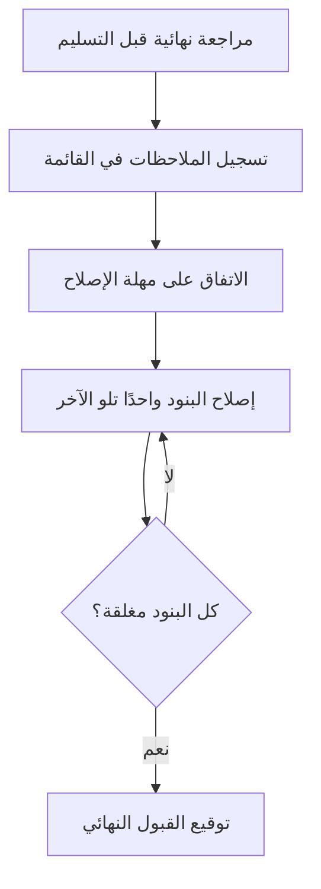

# قائمة الملاحظات (Snag List)
> [!info] تعريف مختصر
> قائمة الملاحظات هي سجل بكل العيوب والنواقص الصغيرة المتبقية في مُخرَج شبه مكتمل (مبنى، منتج، ميزة برمجية)، تُجمع قبل التسليم النهائي حتى تُصلَح جميعها ويُعتمد العمل كمكتمل تمامًا.

## الشرح العلمي والاحترافي
المصطلح أصله من مجال البناء والتشييد (يُعرف أيضًا بـ Punch List)، حيث يجول مهندس أو مالك المشروع في مبنى شبه جاهز قبل التسليم، ويسجّل كل ملاحظة بسيطة: باب لا يُغلق جيدًا، لون طلاء غير مطابق، مقبض مكسور. القائمة لا تشمل عيوبًا هيكلية كبرى (تلك تُعالَج قبل هذه المرحلة أصلًا)، بل فقط التفاصيل الصغيرة (Cosmetic/Minor Issues) التي تمنع القبول النهائي الكامل.

انتقل المفهوم لاحقًا لعالم البرمجيات وإدارة المشاريع بشكل عام: قبل [[Sign-off]] أو [[Closure vs Handover]] لأي تسليم (ميزة، موقع إلكتروني، تقرير)، يقوم صاحب المصلحة أو العميل بمراجعة أخيرة وتسجيل كل ملاحظة بسيطة يريد إصلاحها قبل القبول التام: نص فيه خطأ إملائي، زر بحجم غير متناسق، أيقونة مفقودة.

الفرق بين Snag List وقائمة الأخطاء العادية (Bug List): قائمة الملاحظات تُستخدم تحديدًا في **المرحلة الأخيرة قبل التسليم النهائي**، وتحتوي عادة على مشاكل **بسيطة الخطورة (Low Severity)** لا تمنع الاستخدام، لكنها تمنع اعتبار العمل "مكتملًا 100%" وفق معايير [[Definition of Done]].

## أين ومتى يُستخدم
- في مشاريع البناء والتشييد، عند التسليم النهائي للمبنى.
- في مشاريع تطوير البرمجيات، عند المراجعة النهائية لواجهة مستخدم أو موقع قبل الإطلاق الرسمي.
- في مرحلة [[UAT]] الأخيرة، كملحق يضم الملاحظات التجميلية التي لا تستحق تصنيفها كأخطاء حرجة تمنع الإطلاق.
- عند [[Closure vs Handover]] أي مشروع، كخطوة قبل [[Sign-off]] النهائي من العميل.

## مثال وسيناريو تطبيقي
> [!example]
> شركة "بنيان" للمقاولات سلّمت فيلا سكنية لعميلها "أبو خالد". قبل التوقيع النهائي، جال المهندس المشرف مع العميل في الفيلا وسجّلا قائمة ملاحظات من 12 بندًا: مقبض باب غرفة النوم مرتخٍ، بلاط في الحمام الثاني به خدش بسيط، لون الطلاء في الممر مختلف قليلًا عن العينة المعتمدة، وهكذا.
>
> لم يمنع أي من هذه البنود سكن العائلة في الفيلا فورًا (لا توجد مشاكل هيكلية أو أمان)، لكن الشركة التزمت بإصلاح كل البنود الاثني عشر خلال أسبوعين، وبعدها فقط وقّع العميل على استمارة القبول النهائي (Final Sign-off) وأُطلقت الدفعة الأخيرة من [[Milestone-based Payment]].
>
> بالمثل، في مشروع برمجي، طبّقت شركة تطوير مماثل الفكرة: قبل إطلاق موقع تجاري جديد، راجع العميل الموقع وسجّل قائمة ملاحظات من 7 بنود (محاذاة زر غير متناسقة، شعار صغير جدًا في الفوتر، رابط واحد لا يفتح في تبويب جديد)، والتزم الفريق بإصلاحها خلال 3 أيام قبل التوقيع النهائي على استلام المشروع.

## خطوات أو مخطّط
1. مراجعة نهائية للمُخرَج قبيل التسليم (جولة ميدانية أو مراجعة شاشة بشاشة).
2. تسجيل كل ملاحظة صغيرة في قائمة موحّدة (البند، الموقع، درجة الأهمية، المسؤول).
3. الاتفاق مع الفريق المنفّذ على مهلة زمنية لإصلاح كل البنود.
4. إصلاح البنود وإغلاقها واحدًا تلو الآخر.
5. مراجعة أخيرة للتأكد من إغلاق كل البنود.
6. توقيع [[Sign-off]] النهائي بعد إغلاق القائمة كاملة.

## ⚠️ مفاهيم خاطئة شائعة
> [!warning]
> - **"قائمة الملاحظات تعني أن المشروع فيه مشاكل كبيرة"**: خطأ؛ هي بطبيعتها تضم فقط ملاحظات بسيطة وتجميلية، لا عيوبًا جوهرية.
> - **"يجب انتظار إغلاق القائمة كاملة قبل استخدام المُخرَج"**: غير صحيح غالبًا؛ يمكن البدء بالاستخدام (السكن، إطلاق الموقع) مع الاستمرار في إصلاح البنود بالتوازي، حسب الاتفاق.
> - **"القائمة مسؤولية فريق التنفيذ وحده"**: في الواقع، صاحب المصلحة أو العميل هو من يشارك أساسًا في إعدادها، لأنها تعكس معايير قبوله هو.

## ❌ ممارسات خاطئة في المشاريع
> [!failure]
> - ترك قائمة الملاحظات مفتوحة دون مهلة زمنية محددة، فتتراكم البنود ولا تُغلَق أبدًا؛ الحل تحديد موعد نهائي واضح لكل بند.
> - خلط بنود القائمة مع أخطاء حرجة كبرى في نفس السجل؛ الحل الفصل الواضح بين قائمة الملاحظات (بسيطة) وسجل الأخطاء الحرجة (Critical Bugs).
> - توقيع القبول النهائي قبل إغلاق أي بند في القائمة دون توثيق التزام كتابي بالإصلاح؛ الحل ربط الدفعة الأخيرة أو التوقيع النهائي بإغلاق القائمة فعليًا، أو بالحصول على التزام مكتوب بموعد الإصلاح.

## 🔗 مصطلحات ومفاهيم ذات صلة
[[Sign-off]] | [[Closure vs Handover]] | [[Definition of Done]] | [[UAT]] | [[Severity vs Priority]] | [[Milestone-based Payment]] | [[Issue Log]] | [[20 - Quality Management]]
