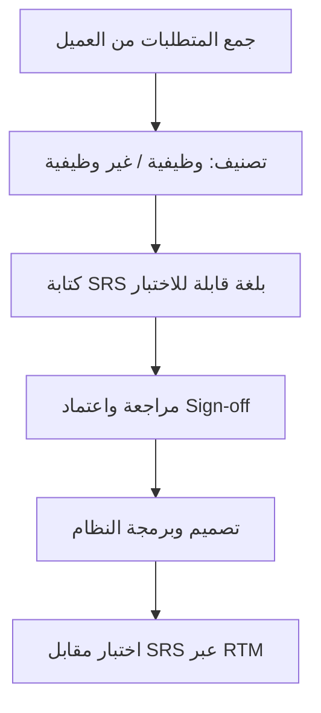

# وثيقة متطلبات البرمجيات (Software Requirements Specification)
> [!info] تعريف مختصر
> وثيقة متطلبات البرمجيات (Software Requirements Specification أو SRS) هي مستند رسمي شامل يصف بالتفصيل ماذا يجب أن يفعل النظام البرمجي (المتطلبات الوظيفية وغير الوظيفية)، ويُستخدم كمرجع متفق عليه بين العميل وفريق التطوير.

## الشرح العلمي والاحترافي
- تُعتبر SRS تطورًا أكثر تقنيةً وتفصيلًا من وثيقة متطلبات العمل ([[BRD]])؛ فبينما تركّز BRD على "لماذا" (الهدف التجاري)، تركّز SRS على "ماذا وكيف من الناحية التقنية" (الوظائف، الواجهات، الأداء، القيود).
- تتضمن عادة: المتطلبات الوظيفية (Functional Requirements) مثل "يجب أن يسمح النظام للمستخدم بتسجيل الدخول عبر البريد الإلكتروني"، والمتطلبات غير الوظيفية (Non-Functional Requirements) مثل الأداء والأمان وقابلية التوسع.
- تشمل أيضًا: نطاق المشروع، حالات الاستخدام (Use Cases)، مخططات تدفق البيانات، متطلبات الواجهة، والقيود التقنية (مثل نوع قاعدة البيانات أو المنصة المستهدفة).
- تهم لأنها تُشكّل [[Single Source of Truth|المصدر الواحد للحقيقة]] الذي يرجع إليه المطورون ومختبرو الجودة عند الشك في سلوك متوقع، وتقلل الغموض الذي يسبب إعادة العمل المكلفة.
- غالبًا ما تُستخدم كأساس لبناء مصفوفة تتبع المتطلبات ([[RTM]]) التي تربط كل متطلب باختباره الخاص للتأكد من عدم فقدان أي متطلب أثناء التطوير.
- في المنهجيات التقليدية (Waterfall) تُكتب SRS كاملة قبل بدء البرمجة وتُعتمد رسميًا (Sign-off)، بينما في المنهجيات الرشيقة (Agile) تُستبدل غالبًا بقصص المستخدم ([[User Stories]]) التي تُفصَّل تدريجيًا، لكن SRS لا تزال مفيدة في الأنظمة الكبيرة أو المنظمة (مثل الأنظمة الحكومية أو الطبية) التي تتطلب توثيقًا رسميًا دقيقًا.

## أين ومتى يُستخدم
- في مشاريع منهجية الشلال ([[04 - Waterfall]]) كوثيقة أساسية تُكتب في مرحلة التحليل قبل التصميم والبرمجة.
- في الأنظمة الخاضعة لتنظيم صارم (طبية، مالية، حكومية) حيث التوثيق الدقيق مطلوب قانونيًا أو تعاقديًا.
- عند التعاقد مع مورّد خارجي (Outsourcing) لتطوير نظام، لتحديد نطاق العمل بدقة وتفادي النزاعات لاحقًا.
- كمرجع لكتابة حالات اختبار القبول ([[UAT]]) والتحقق من اكتمال النظام قبل التسليم.

## مثال وسيناريو تطبيقي
> [!example] شركة "الوفاق" الطبية تعاقدت مع مطوّر خارجي لبناء نظام إدارة سجلات مرضى. قبل توقيع العقد، أعدّ محلل الأعمال وثيقة SRS من 40 صفحة تتضمن: 65 متطلبًا وظيفيًا (مثل "يجب أن يسجّل النظام كل تعديل على ملف المريض مع اسم الموظف والوقت")، و12 متطلبًا غير وظيفي (مثل "يجب أن يستجيب النظام خلال أقل من ثانيتين لأي استعلام").
> وقّع مدير المستشفى ومدير المشروع لدى المورّد على الوثيقة (Sign-off) في 2026-02-01. عند التسليم، استخدم فريق الجودة SRS نفسها لبناء 77 حالة اختبار، وعندما اكتشفوا أن ميزة "تنبيه انتهاء صلاحية الدواء" غير موجودة، رجعوا للوثيقة ووجدوا أنها كانت مذكورة صراحة كمتطلب رقم 34، فأُلزم المورّد بإضافتها دون تكلفة إضافية لأنها كانت موثقة ومعتمدة مسبقًا.

## خطوات أو مخطّط
1. اجمع المتطلبات من أصحاب المصلحة عبر مقابلات وورش عمل.
2. صنّف المتطلبات إلى وظيفية وغير وظيفية، ورتّبها حسب الأولوية (يمكن استخدام [[MoSCoW Prioritization]]).
3. اكتب كل متطلب بصيغة واضحة وقابلة للاختبار (تجنّب الغموض مثل "سريع" بدون رقم محدد).
4. راجع الوثيقة مع أصحاب المصلحة التقنيين وغير التقنيين للتأكد من الفهم المشترك.
5. احصل على اعتماد رسمي ([[Sign-off]]) قبل بدء التصميم والبرمجة.
6. اربط كل متطلب باختباره عبر [[RTM]] لضمان التغطية الكاملة.

## ⚠️ مفاهيم خاطئة شائعة
> [!warning]
> - الاعتقاد أن SRS هي نفسها [[BRD]]؛ الفرق أن BRD تصف الهدف التجاري بلغة الأعمال، بينما SRS تصف الحل التقني بلغة تفصيلية قابلة للتنفيذ والاختبار.
> - الظن أن SRS تُكتب مرة واحدة ولا تتغير أبدًا؛ في الواقع يجب تحديثها عبر [[Change Request]] رسمي عند حدوث تغييرات معتمدة.
> - الاعتقاد أن المشاريع الرشيقة (Agile) لا تحتاج SRS إطلاقًا؛ كثير من المشاريع الهجينة تستخدم نسخة مبسطة منها كإطار عام ثم تفصّل التفاصيل عبر [[User Stories]] في كل [[Sprint]].

## ❌ ممارسات خاطئة في المشاريع
> [!failure]
> - كتابة متطلبات غامضة غير قابلة للقياس (مثل "يجب أن يكون النظام سهل الاستخدام") بدل صياغتها بشكل قابل للاختبار (مثل "يجب أن يكمل 90% من المستخدمين الجدد عملية التسجيل خلال أقل من 3 دقائق").
> - تجاهل تحديث SRS بعد الموافقة على تغييرات لاحقة، مما يجعلها غير متطابقة مع النظام الفعلي ويسبب ارتباكًا لاحقًا (خرق مبدأ [[Single Source of Truth]]).
> - كتابة الوثيقة من طرف واحد (المطور فقط أو العميل فقط) دون مراجعة مشتركة، مما يؤدي لفجوة فهم تظهر متأخرة جدًا في مرحلة الاختبار أو التسليم.

## 🔗 مصطلحات ومفاهيم ذات صلة
[[Quality Attributes]] | [[Functional Specification]] | [[BRD]] | [[RTM]] | [[Single Source of Truth]] | [[Sign-off]] | [[Change Request]] | [[UAT]] | [[User Stories]] | [[MoSCoW Prioritization]] | [[04 - Waterfall]]
