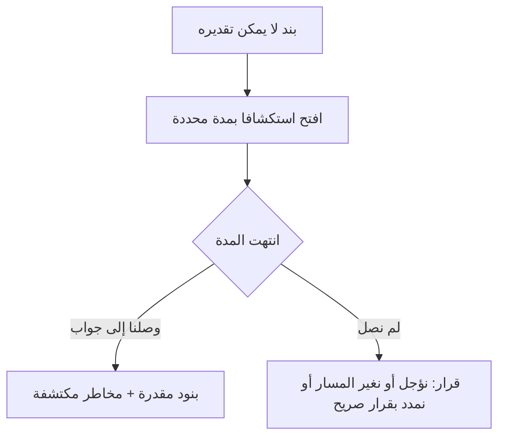

# الاستكشاف الزمني (Spike)

> [!info] تعريف مختصر
> الاستكشاف الزمني (Spike) هو بند عمل **محدَّد المدّة سلفًا** يُدرَج في قائمة الأعمال، مخرجه **معرفة** لا ميزة: جوابٌ عن سؤال تقني أو وظيفي يتعذّر معه تقدير بند آخر أو اتّخاذ قرار بشأنه. وينتهي بانتهاء مدّته سواء وصل إلى نتيجة قاطعة أو لم يصل.

## الشرح العلمي والاحترافي

- المصطلح آتٍ من [[Extreme Programming|البرمجة القصوى]] (XP)، حيث وُصف بأنه حلٌّ بسيط جدًّا يُكتب لاستكشاف احتمال تقني ثم **يُرمى** غالبًا، لا ليُبنى فوقه. ومن هنا جاءت تسميته: مسمار يُغرَز في المجهول ليقيس عمقه.
- علّة وجوده أن التقدير فرعٌ عن المعرفة. فحين يُطلب من الفريق تقدير بند لا يعرف ما بداخله، يكون الرقم الناتج تخمينًا مغلَّفًا بصيغة تقدير — والاستكشاف يشتري المعرفة الناقصة **بثمن معلوم** بدل أن يدفعها الفريق ثمنًا مجهولًا في منتصف السبرنت.
- **المدّة قيد لا هدف.** فالمخاطرة الحقيقية في الاستكشاف أن يتحوّل إلى بحث مفتوح بلا نهاية، ولذلك تُحدَّد المدّة قبل البدء ([[Timeboxing|بصندوق زمني]]) وتُحترم. وانتهاء المدّة بجواب «لم نستطع الحسم في يومين» **نتيجة صالحة**، لأنها بذاتها تغيّر الخطّة: فما لم يُحسم في يومين لن يُحسم في السبرنت.
- نوعان شائعان: **استكشاف تقني** (هل هذه المكتبة تدعم ما نحتاج؟ ما أثر هذا التصميم على الأداء؟)، و**استكشاف وظيفي** (كيف يستعمل المستخدمون هذه الشاشة فعلًا؟ وهل الافتراض الذي بنينا عليه صحيح؟).
- **لا يُحسب عادةً في [[18 - Velocity|السرعة]]**، لأنه لم يسلّم قيمة قابلة للاستعمال. ويُحجز له وقت من [[Capacity|الطاقة]] بوصفه عملًا حقيقيًّا يستهلك أيامًا، فيُخصم من المتاح ولا يُضاف إلى المنجَز.
- **ليس منصوصًا عليه في دليل سكرم**؛ هو ممارسة شائعة نافعة انتقلت من البرمجة القصوى واستقرّت في أكثر الفرق الرشيقة. ولا يمنع الدليل منه، إذ يجوز أن يحوي [[13 - Backlog|قائمة أعمال المنتج]] أي عمل يلزم لتحقيق هدف المنتج.
- يرتبط ارتباطًا وثيقًا بـ[[Reversible vs Irreversible Decisions|القرارات العكوسة وغير العكوسة]]: فالقرار الذي يصعب التراجع عنه (نموذج بيانات · اختيار مزوّد · بنية تكامل) يستحقّ استكشافًا قبله، والقرار الذي يُعدَّل في دقائق لا يستحقّ.

## أين ومتى يُستخدم

- في [[Backlog Refinement|تنقيح قائمة الأعمال]]، حين يعجز الفريق عن تقدير بند فيُفتح له استكشاف بدل إعطائه رقمًا اعتباطيًّا.
- في [[08 - Sprint Planning|تخطيط السبرنت]]، حين يُكتشف أن بندًا مرشّحًا يحمل مجهولًا يهدّد [[Sprint Goal|هدف السبرنت]].
- قبل اتّخاذ قرار معماري أو التزام تعاقدي بمزوّد خارجي، حيث تكون كلفة الخطأ عالية وكلفة الفحص منخفضة.
- في التحقّق من افتراض حرج ضمن [[Assumption Mapping|خريطة الافتراضات]]، حين يكون سقوط الافتراض قاتلًا للخطّة.

## مثال وسيناريو تطبيقي

> [!example] سيناريو ملموس
> فريق يبني منصّة تدريب، وفي قائمة أعماله بند: «إصدار شهادة معتمدة تلقائيًّا بعد انتهاء الدورة». وعند التقدير انقسم الفريق: أحدهم قال 5 نقاط والآخر 21، والسبب أن أحدًا لا يعرف هل نموذج الشهادة المعتمد من الجهة المانحة قابل للتوليد آليًّا أصلًا.
> فبدل أن يُختار رقم وسط بلا معنى، فُتح **استكشاف بمدّة يومين** سؤاله: «هل يمكن توليد الشهادة بالنموذج المعتمد برمجيًّا، وما الذي يلزم لذلك؟»
> **النتيجة بعد يومين:** النموذج قابل للتوليد، لكنه يشترط خطًّا عربيًّا محدَّدًا، **ورقم اعتماد يُصدَر يدويًّا من بوّابة الجهة**. فتحوّل البند الواحد الغامض إلى ثلاثة بنود واضحة قابلة للتقدير، وإلى **مخاطرة جديدة** مسجَّلة: أن الشهادة لن تصدر «فور انتهاء الدورة» كما وُعد العميل.
> ولو لم يُفتح الاستكشاف لاكتُشف رقم الاعتماد اليدوي في اليوم الأخير من السبرنت، أو في يوم الإطلاق.

## خطوات أو مخطّط

1. **صُغ سؤالًا واحدًا** يُجاب عنه بنعم/لا أو برقم — لا موضوعًا عامًّا للبحث.
2. **حدّد المدّة قبل البدء** (ساعات أو يوم أو يومان)، واكتبها في البند.
3. **حدّد المخرَج المطلوب**: توصية مكتوبة + تقدير للبند الأصلي + مخاطر اكتُشفت.
4. **نفّذ بأقلّ كود ممكن**، وعامِل ما تكتبه على أنه سيُرمى — فالغاية الجواب لا المنتج.
5. **أغلق البند بانتهاء المدّة** ولو لم تصل إلى يقين، وسجّل ما عرفته وما بقي مجهولًا.
6. **حوّل النتيجة** إلى بنود مقدَّرة في قائمة الأعمال، أو إلى قرار موثّق بعدم المضي.

## ⚠️ مفاهيم خاطئة شائعة

> [!warning]
> - الظنّ أن الاستكشاف «بند صعب». الفرق جوهري: البند ينتهي بتحقّق معايير قبوله، والاستكشاف ينتهي **بانتهاء وقته** ومخرجه معرفة.
> - الاعتقاد أن كود الاستكشاف يُبنى فوقه. أصله في البرمجة القصوى أن يُرمى، لأنه كُتب لاختبار احتمال لا ليُصان.
> - الظنّ أنه مذكور في دليل سكرم. هو ممارسة شائعة من البرمجة القصوى، لا نصّ في الدليل — وذكرها بلسان المرجع خطأ شائع.
> - الخلط بينه وبين [[Proof of Concept|إثبات المفهوم]] و[[Prototype|النموذج الأولي]]: الاستكشاف يجيب عن سؤال **يعطّل التقدير أو القرار** داخل تدفّق العمل، وإثبات المفهوم يثبت جدوى فكرة كاملة، والنموذج الأولي يختبر التجربة مع المستخدم.

## ❌ ممارسات خاطئة في المشاريع

> [!failure]
> - فتح استكشاف بلا سؤال محدَّد، فيتحوّل إلى بحث مفتوح يبتلع أيامًا. **التجنب:** لا يُفتح بند استكشاف بلا سؤال مكتوب في سطر واحد ومخرَج معلوم.
> - تمديد مدّته صمتًا كلّما اقتربت من النهاية. **التجنب:** التمديد قرار صريح يُتّخذ مرّة واحدة بمبرّر، وإلا فقد سقط الغرض من الصندوق الزمني.
> - احتساب نقاطه في السرعة، فترتفع الأرقام بلا قيمة مسلَّمة. **التجنب:** يُحجز له وقت من الطاقة ولا يُحسب في المنجَز.
> - إغراق السبرنت باستكشافات، فيصير الفريق باحثًا لا مسلِّمًا. **التجنب:** حدّ أعلى معلن — كاستكشاف واحد في السبرنت إلا لضرورة.
> - إهمال توثيق النتيجة، فيُعاد الاستكشاف نفسه بعد شهرين بشخص آخر. **التجنب:** كل استكشاف يُغلق بصفحة قرار قصيرة في [[Decision Log|سجل القرارات]].

## 🔗 مصطلحات ومفاهيم ذات صلة

[[Timeboxing]] | [[Proof of Concept]] | [[Prototype]] | [[Estimation]] | [[Backlog Refinement]] | [[Extreme Programming]] | [[Reversible vs Irreversible Decisions]] | [[Assumption Mapping]] | [[Technical Debt]] | [[Capacity]] | [[13 - Backlog]] | [[12 - Story Points]] | [[Decision Log]]

> [!tip] 💡 إثراء عملي — رحلة مشروع
> الاستكشاف الزمني وهو يُتّخذ قرارًا حقيقيًّا في مشروع كامل: [[03 - بناء قائمة الأعمال وترتيبها]].
