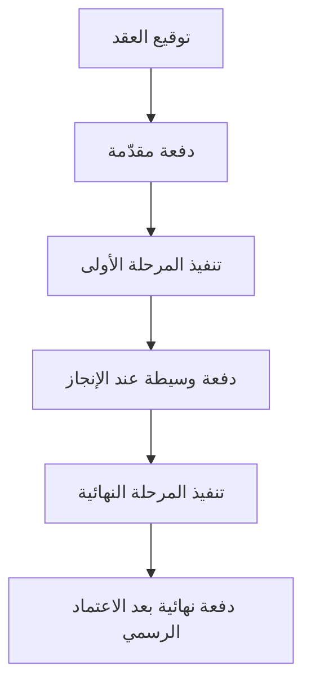

# تقسيم الدفعة (Split Payment)
> [!info] تعريف مختصر
> تقسيم الدفعة (Split Payment) هو ترتيب مالي يُقسَّم فيه إجمالي قيمة المشروع إلى دفعات جزئية تُسدَّد على مراحل زمنية أو عند إنجاز أجزاء محددة، بدلاً من دفعة واحدة كاملة في البداية أو النهاية.

## الشرح العلمي والاحترافي
- تقسيم الدفعة يوزّع المخاطر المالية بين العميل والمزوّد؛ العميل لا يدفع كامل المبلغ مقدّماً دون ضمان تسليم، والمزوّد لا ينتظر حتى نهاية المشروع الطويل ليحصل على أي دخل.
- يختلف عن [[Milestone-based Payment]] في أن التقسيم قد يكون زمنياً بحتاً (مثلاً: دفعة شهرية ثابتة) دون ربط مباشر بإنجاز معلم محدد، بينما الدفع المرتبط بالمعالم يُربط تحديداً بإنجاز فعلي وموثّق (غالباً بعد [[Sign-off]]).
- الصيغ الشائعة: دفعة مقدّمة (Down Payment) عادة بين 20% إلى 50%، تليها دفعات دورية، ثم دفعة نهائية بعد التسليم والاعتماد الرسمي.
- يُذكر تفصيلياً في وثيقة [[SOW]] ضمن بند الشروط المالية، ويُعد جزءاً من إدارة المخاطر المالية للمشروع.
- يساعد في تحسين التدفق النقدي (Cash Flow) لكلا الطرفين ويقلل من مخاطر التوقف الكامل عند حدوث خلاف في منتصف المشروع.

## أين ومتى يُستخدم
- في مشاريع العمل الحر (Freelance) والتعاقد مع وكالات تطوير خارجية.
- في المشاريع طويلة المدى (أكثر من شهرين) حيث يكون الدفع دفعة واحدة مخاطرة كبيرة على أي من الطرفين.
- في العقود التي تتضمن مراحل واضحة (تصميم، تطوير، اختبار، إطلاق) يمكن ربط كل مرحلة بدفعة منفصلة.
- عند التفاوض على عقود [[SOW]] جديدة، كبند أساسي من بنود الشروط المالية.

## مثال وسيناريو تطبيقي
> [!example] تعاقدت شركة ناشئة "توصيل فوري" مع استوديو تصميم لبناء هوية بصرية وتطبيق جوال، بقيمة إجمالية 12,000 دولار على مدى 3 أشهر. اتفق الطرفان على تقسيم الدفعة كالتالي: 30% (3,600 دولار) عند توقيع العقد كدفعة مقدّمة، 40% (4,800 دولار) في منتصف المشروع بعد تسليم التصميم واعتماد واجهات المستخدم، و30% (3,600 دولار) المتبقية بعد التسليم النهائي و[[Sign-off]] من العميل. في الشهر الثاني تأخر العميل عن دفع الدفعة الوسيطة لمدة أسبوعين، فأوقف الاستوديو العمل مؤقتاً وفق بند تعاقدي واضح، مما حمى الاستوديو من الاستمرار في العمل دون مقابل.

## خطوات أو مخطّط
1. تقدير التكلفة الإجمالية للمشروع.
2. تحديد عدد الدفعات المناسب (عادة 2 إلى 4 دفعات) بناءً على مدة المشروع وحجمه.
3. ربط كل دفعة بشرط زمني أو إنجاز محدد وموثّق في [[SOW]].
4. توضيح ما يحدث عند التأخر في الدفع (إيقاف العمل، غرامة تأخير).
5. توثيق جدول الدفعات في العقد وتوقيعه من الطرفين.
6. إصدار فاتورة لكل دفعة عند استحقاقها ومتابعة السداد.

## ⚠️ مفاهيم خاطئة شائعة
> [!warning]
> - الخلط بين تقسيم الدفعة و[[Milestone-based Payment]]؛ الأول قد يكون زمنياً فقط، والثاني مرتبط دائماً بإنجاز فعلي موثّق.
> - الاعتقاد بأن الدفعة المقدّمة تعني "التزاماً كاملاً" بإنهاء المشروع مهما حدث؛ في الواقع هي تغطي جزءاً من العمل المنجز فقط.
> - الظن بأن تقسيم الدفعة يُلغي الحاجة لعقد مكتوب؛ العكس صحيح، فهو يحتاج توثيقاً أدق لتفادي الخلافات حول توقيت كل دفعة.

## ❌ ممارسات خاطئة في المشاريع
> [!failure]
> - الاتفاق على تقسيم الدفعة شفهياً دون تحديد تواريخ أو شروط واضحة في العقد، مما يسبب نزاعات حول موعد الاستحقاق. تجنّبها بتوثيق جدول الدفعات في [[SOW]] بدقة.
> - الاستمرار في تنفيذ المراحل التالية رغم تأخر العميل عن سداد دفعة مستحقة. تجنّبها بربط بدء كل مرحلة جديدة باستلام الدفعة السابقة فعلياً.
> - تحديد دفعة نهائية كبيرة جداً (مثلاً 50%) تجعل المزوّد يتحمّل مخاطرة مالية كبيرة طوال المشروع. تجنّبها بتوزيع الدفعات بشكل متوازن يعكس التقدّم الفعلي في العمل.

## 🔗 مصطلحات ومفاهيم ذات صلة
[[Milestone-based Payment]] · [[SOW]] · [[Sign-off]] · [[Milestone]] · [[Change Request]] · [[BRD]]
