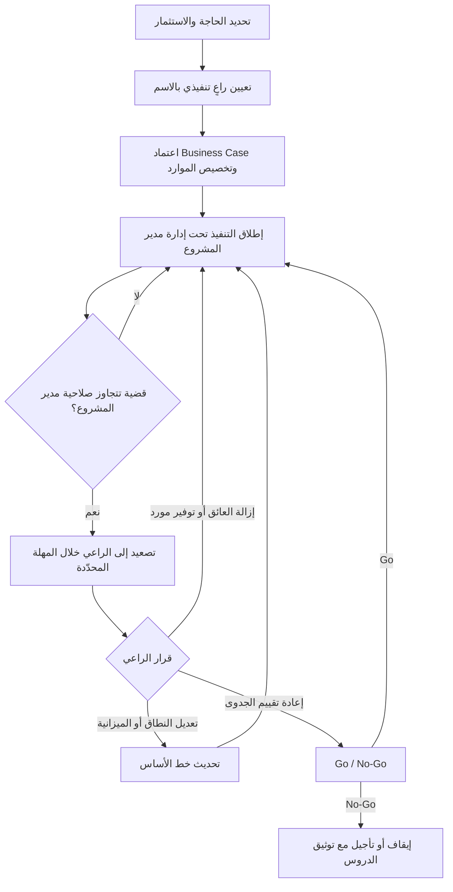

# الراعي التنفيذي (Sponsor)

> [!info] تعريف مختصر
> الراعي التنفيذي (Sponsor) هو المسؤول التنفيذي الذي **يملك مبرّر الاستثمار** في المشروع، ويوفّر التمويل والغطاء التنظيمي، ويملك القرار الاستراتيجي ونتيجته النهائية. ليس داعمًا معنويًّا ولا اسمًا في العرض التقديمي، بل صاحب السلطة الذي يعتمد [[Business Case]]، ويؤمّن الموارد، ويزيل العوائق بين الإدارات، ويبتّ في التصعيدات، ويتّخذ قرار [[Go or No-Go Decision]]. القاعدة العملية: **مدير المشروع مُساءَل عن التنفيذ، والراعي مُساءَل عن الفائدة**.

## الشرح العلمي والاحترافي
- **ملكية مبرّر الاستثمار**: المشروع في جوهره قرار استثماري — صرف مال ووقت وطاقة تنظيمية مقابل فائدة متوقّعة. الراعي هو من يملك هذا المنطق ويدافع عنه أمام الإدارة العليا: لماذا نُنفق 1.5 مليون على `ERP` بدل توظيف 10 موظفين؟ إن لم يكن هناك من يملك هذه الإجابة ويُساءَل عنها، فالمشروع بلا مالك حقيقي مهما كثر الحاضرون في اجتماعاته.
- **المسؤوليات الفعلية للراعي** (لا الشكلية):
  - **اعتماد [[Business Case]]** وإعادة تقييمه عند كل بوابة مرحلية: هل ما زال الاستثمار مبرَّرًا بالمعطيات الجديدة؟
  - **تأمين الموارد**: ليس المال فقط، بل الأخطر — **وقت الموظفين الأساسيين**. تخصيص محلّل المخزون 50% من وقته للمشروع قرار لا يستطيع مدير المشروع فرضه، ويستطيع الراعي.
  - **إزالة العوائق التنظيمية بين الإدارات**: حين يرفض قسم المشتريات تغيير دورة الاعتماد لأن "هكذا نعمل منذ 12 سنة"، لا يُحلّ الخلاف بمنطق فني بل بسلطة تنظيمية.
  - **البتّ في التصعيدات** ضمن [[Escalation Path]] وبسقف زمني ملزم.
  - **قرار [[Go or No-Go Decision]]**: الإطلاق أو التأجيل أو الإيقاف. وأصعب أشكاله هو **قرار الإيقاف** حين تسقط جدوى المشروع، وهو قرار لا يملكه غير الراعي.
  - **حماية المشروع من تغيّر الأولويات**: المشاريع نادرًا ما تموت بقرار؛ تموت اختناقًا حين تُسحب مواردها تدريجيًّا لصالح أولوية جديدة. الراعي هو خطّ الدفاع الوحيد هنا.
  - **قيادة رسالة التغيير**: الموظفون يقرؤون جدّية المشروع من مستوى من يتحدّث عنه. رسالة من الراعي تساوي عشر رسائل من فريق المشروع (راجع [[ADKAR Model]] — عنصر `Awareness` و`Desire` يُبنيان من القمّة).
- **الفرق بين الراعي ومدير المشروع**: مدير المشروع يدير **التنفيذ اليومي** — الخطة، الجدول، الفريق، المورّد، المخاطر التشغيلية، التقارير. الراعي يملك **النتيجة والقرار الاستراتيجي** — الجدوى، التمويل، الأولوية، الغطاء التنظيمي. مدير المشروع يمتلك سلطة **مستمدّة**، والراعي يمتلك سلطة **أصلية**. الاختبار الحاسم: إذا كان حلّ المشكلة يتطلّب أن يغيّر مدير إدارة أخرى أولوياته أو يتنازل عن جزء من صلاحياته، فهذه مشكلة راعٍ لا مشكلة مدير مشروع. ومن أخطر أنماط الفشل أن يُترك مدير المشروع يخوض معارك تنظيمية فوق وزنه الوظيفي.
- **الراعي ليس هو مالك المنتج ولا المستخدم الرئيسي**: قد يكون مدير المالية راعيًا لمشروع `ERP` بينما مالك عملية المخزون شخص آخر تمامًا. الراعي يقرّر ويحمي، وأصحاب العمليات يحدّدون المتطلبات. الخلط بينهما يُغرق الراعي في تفاصيل يجب ألّا يراها.
- **الراعي الغائب (`Absent Sponsor`) — العلامة الأخطر في مشاريع `ERP`**: هو راعٍ موجود على الورق، غائب عن الفعل: لا يحضر [[Steering Committee]] أو يرسل مندوبًا بلا صلاحية، لا يردّ على التصعيدات، لا يظهر في أي رسالة داخلية عن المشروع. آثاره التراكمية:
  - **بطء القرارات**: كل قرار يتجاوز صلاحية مدير المشروع يبقى معلّقًا أسابيع، فيتحوّل الجدول الزمني إلى وثيقة خيالية.
  - **ضعف التبنّي** (`Low Adoption`): الموظفون يستنتجون أن المشروع ليس أولوية حقيقية للإدارة، فيؤجّلون التدريب ويستمرّون في `Excel` الموازي.
  - **مقاومة الأقسام**: كل قسم يفاوض على تعديلات تخدمه، ولا سلطة تحسم بينها، فيتضخّم النطاق أو تتجمّد العملية.
  - **تحميل مدير المشروع مسؤولية بلا سلطة**، وهو مقدّمة شبه مؤكّدة للفشل ولاستنزاف الفريق.
  - إحصائيًّا، تُصنَّف "رعاية تنفيذية فعّالة" في أغلب دراسات أسباب نجاح/فشل المشاريع ضمن أعلى عاملين تأثيرًا، ويُقدَّر أن نحو ثلثي المشاريع المتعثّرة تشترك في ضعف الرعاية التنفيذية.
- **كيف يُقاس التزام الراعي** (بمؤشرات لا بانطباع):
  - **نسبة حضوره الشخصي** لجلسات لجنة التوجيه (المستهدف ≥ 90%، وبلا وكالة).
  - **زمن استجابته للتصعيد**: متوسط الأيام من رفع البند إلى قرار مُسجَّل (المستهدف ≤ 5 أيام عمل).
  - **عدد القرارات الحاسمة الصادرة عنه** خلال الربع (صفر قرار = رعاية صورية).
  - **ظهوره في اتصالات التغيير**: عدد الرسائل/الكلمات الموجَّهة للموظفين باسمه.
  - **نسبة الموارد الملتزَم بها فعليًّا** مقابل المخطَّطة (`Committed vs Planned Resource %`).
  - **معدّل تنفيذ التزاماته**: كم من الوعود التي قطعها في اللجنة نُفِّذت في موعدها.

## أين ومتى يُستخدم
- **قبل بدء المشروع**: تسمية الراعي شرط لاعتماد الميثاق. مشروع بلا راعٍ مُسمّى بالاسم — لا بالمنصب — لا ينبغي أن يبدأ.
- **في مشاريع `ERP` والتحوّل الرقمي**: حيث يمتدّ الأثر على كل الأقسام، ويصبح الغطاء التنظيمي أهم من الخبرة الفنية.
- **عند إعداد [[Stakeholder Map]] و[[Power-Interest Grid]]**: الراعي هو نقطة الارتكاز في الربع الأعلى (سلطة عالية/اهتمام عالٍ)، ومن خلاله يُدار باقي أصحاب المصلحة المقاوِمين.
- **عند كل بوابة قرار**: اعتماد خط الأساس، قبول التسليمات الكبرى، قرار الإطلاق، وقرار إنهاء [[Hypercare]].
- **في إدارة التغيير**: الراعي هو "الوجه" الذي تُنسَب إليه رسالة التغيير في نموذج [[ADKAR Model]]، خاصة في مرحلتي الوعي والرغبة.
- **عند تعثّر المشروع أو تجاوز الميزانية**: الراعي هو من يقرّر إعادة التمويل، أو تقليص النطاق، أو الإيقاف الرحيم بدل النزيف البطيء.

## مثال وسيناريو تطبيقي
> [!example] شركة صناعية (900 موظف) تنفّذ `ERP` بميزانية 2.4 مليون ريال. عُيِّن نائب الرئيس للعمليات راعيًا اسميًّا، لكنه حضر جلستين فقط من أصل 7 لجلسات لجنة التوجيه في أول 5 أشهر، وأرسل مندوبًا في البقية.
> **النتائج المرصودة**: 14 بندًا مُصعَّدًا بقيت معلّقة بمتوسط 23 يوم عمل لكل بند؛ قسم المشتريات رفض التخلّي عن دورة اعتماد ورقية موازية؛ نسبة إتمام التدريب بلغت 41% فقط قبل الإطلاق المخطَّط؛ وانزلق تاريخ الإطلاق 11 أسبوعًا، بتكلفة إضافية قُدِّرت بـ 310,000 ريال (تمديد عقد المورّد وموارد الدعم).
> **التدخّل**: عرض مدير المشروع على لجنة التوجيه لوحة قياس التزام الرعاية بأرقام صريحة (زمن الاستجابة، الحضور، البنود المعلّقة، أثرها بالريال). فأُعيد تعريف الدور رسميًّا: راعٍ تنفيذي واحد (الرئيس التنفيذي للعمليات) بحضور شخصي إلزامي، وسقف استجابة 5 أيام عمل لأي تصعيد، وجلسة أسبوعية مدّتها 30 دقيقة مع مدير المشروع، ورسالة شهرية باسمه لكل الموظفين.
> **بعد 3 أشهر**: انخفض متوسط زمن حسم التصعيد من 23 إلى 4 أيام عمل؛ أُلغيت الدورة الورقية الموازية بقرار مكتوب واحد؛ ارتفعت نسبة إتمام التدريب إلى 88%؛ وتمّ الإطلاق بعد 3 أسابيع فقط من الموعد المُعاد جدولته. لم يتغيّر شيء في التقنية — تغيّرت ملكية القرار فقط.

## خطوات أو مخطّط
1. **تسمية الراعي بالاسم** في ميثاق المشروع، مع التحقّق من أنه يملك سلطة فعلية على الأقسام المتأثّرة وعلى الميزانية.
2. **عقد جلسة تعاقد الدور** (`Sponsor Onboarding`): شرح مكتوب لما هو متوقّع منه بالتحديد — قرارات، حضور، اتصالات، سقوف زمنية.
3. **الاتفاق على إيقاع ثابت**: جلسة ثنائية أسبوعية قصيرة مع مدير المشروع + [[Steering Committee]] شهريًّا.
4. **تحديد سقوف الصلاحية**: ما يعتمده مدير المشروع، وما يُرفَع إلى الراعي، وما يتجاوز الراعي إلى الإدارة العليا.
5. **تجهيز الراعي بالمعلومة لا بالتفاصيل**: [[Project Health Report]] من صفحة واحدة، وقرارات مطلوبة محدّدة بخيارات وتوصية، لا عرض حالة مفتوح.
6. **قياس التزام الرعاية شهريًّا** بالمؤشرات المذكورة أعلاه، وعرض النتيجة على اللجنة بلا مجاملة.
7. **إعادة التفاوض أو التصعيد** إن استمرّ الغياب: طلب تغيير الراعي أو تفويض صلاحياته رسميًّا لشخص حاضر.

## ⚠️ مفاهيم خاطئة شائعة
> [!warning]
> - **"الراعي هو من يدفع فقط"**: التمويل أسهل مسؤولياته. قيمته الحقيقية في السلطة التنظيمية التي تفتح الأبواب المغلقة بين الإدارات.
> - **"أي مدير كبير يصلح راعيًا"**: الراعي يجب أن يملك سلطة على **الأقسام المتأثّرة تحديدًا**. راعٍ من إدارة لا تملك نفوذًا على المخزون لن ينفع مشروعًا محوره المخزون.
> - **"الراعي يجب أن يفهم التفاصيل التقنية"**: لا. مطلوب منه أن يفهم الجدوى والمخاطر والمقايضات، لا بنية قاعدة البيانات. إغراقه بالتفاصيل يُبعده عن الجلسات.
> - **"تعدّد الرعاة يقوّي المشروع"**: العكس — تعدّد الرعاة يعني تعدّد الأولويات وتفتّت المساءلة. راعٍ واحد مُساءَل، وبقيّة التنفيذيين أعضاء في لجنة التوجيه.
> - **"الراعي يتدخّل عند الأزمات فقط"**: الرعاية التفاعلية متأخّرة دائمًا. أثر الراعي الأكبر يكون في القرارات المبكّرة: الأولوية، الموارد، والنطاق.
> - **الخلط بين الراعي والراعي المالي فقط**: من يوقّع الشيك دون امتلاك مبرّر الاستثمار هو ممول لا راعٍ.

## ❌ ممارسات خاطئة في المشاريع
> [!failure]
> - **تعيين راعٍ اسمي لمجرّد استيفاء المنهجية**: يُكتب اسمه في الميثاق ثم لا يُرى مجدّدًا، فيبقى المشروع بلا مظلّة عند أول خلاف بين إدارتين. **الحل**: جلسة تعاقد دور مكتوبة تحدّد الالتزامات بالأرقام (حضور، زمن استجابة، اتصالات)، ورفض إطلاق المشروع دون قبولها.
> - **قبول الحضور بالوكالة الدائم في لجنة التوجيه**: المندوب ينقل ولا يقرّر، فتتحوّل اللجنة إلى جلسة إحاطة. **الحل**: قاعدة "لا وكالة في قرارات النطاق والميزانية"، وتأجيل البند بدل اتخاذ قرار هشّ.
> - **إغراق الراعي بتقارير تفصيلية طويلة**: 30 شريحة أسبوعيًّا تضمن أنه لن يقرأ شيئًا. **الحل**: صفحة واحدة: الحالة، أعلى 3 مخاطر، والقرارات المطلوبة منه بخيارات وتوصية واضحة.
> - **ترك مدير المشروع يخوض معارك تنظيمية فوق مستواه**: مثل مطالبة مدير قسم بتفريغ موظف نصف وقته. **الحل**: قاعدة تصعيد صريحة — أي عائق يتطلّب تغيير أولويات إدارة أخرى يُرفَع إلى الراعي خلال 48 ساعة.
> - **عدم قياس أداء الرعاية إطلاقًا**: يُقاس كل شيء في المشروع إلا أخطر عامل نجاح فيه. **الحل**: إدراج مؤشرات الرعاية (زمن الاستجابة، الحضور، البنود المعلّقة وأثرها المالي) ضمن [[Project Health Report]] الشهري.
> - **غياب الراعي عن اتصالات التغيير**: تصدر كل الرسائل باسم فريق المشروع، فيقرأ الموظفون المشروع كمبادرة تقنية لا كتوجّه مؤسسي. **الحل**: خطّة اتصال يظهر فيها الراعي في اللحظات المفصلية (الانطلاق، ما قبل الإطلاق، ما بعد الاستقرار) وفق [[ADKAR Model]].
> - **الاحتفاظ براعٍ فقد سلطته أو انشغل بأولوية أخرى**: يستمرّ الاسم بينما اختفت القدرة على الفعل. **الحل**: مراجعة ملاءمة الراعي عند كل بوابة مرحلية، وطلب تغييره رسميًّا عبر لجنة التوجيه عند الحاجة.

## 🔗 مصطلحات ومفاهيم ذات صلة
[[Steering Committee]] | [[Governance]] | [[Business Case]] | [[Stakeholder Map]] | [[Power-Interest Grid]] | [[Escalation Path]] | [[Go or No-Go Decision]] | [[ADKAR Model]]
