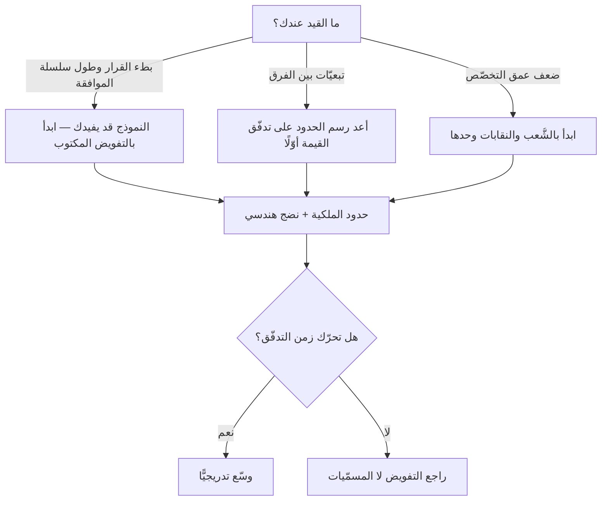

# نموذج سبوتيفاي (Spotify Model)

> [!info] تعريف مختصر
> **نموذج سبوتيفاي** وصفٌ لطريقة تنظيم فرق الهندسة في شركة سبوتيفاي سنة 2012، نشره **هنريك كنيبرغ وأندرس إيفارسون** في ورقة عنوانها *Scaling Agile @ Spotify*. ويقوم على أربع وحدات: **السرب (Squad)** فريقٌ صغير مستقلّ يملك مهمّته، و**القبيلة (Tribe)** تجمّع أسراب تعمل في مجال متقارب، و**الشُّعبة (Chapter)** رابطةُ أصحاب التخصّص الواحد داخل القبيلة وعبرها تجري الإدارة المباشرة، و**النقابة (Guild)** جماعة اهتمام تطوّعية تعبر الشركة كلّها.
> **وليس إطار عمل.** فليس له مرجع رسمي ولا شهادة ولا جهة تحكمه، ولم تعرضه سبوتيفاي يومًا للتبنّي. وأصحاب الورقة أنفسهم وصفوها في صدرها بأنها **لقطة لحظية** لطريقة عمل متغيّرة.

## الشرح العلمي والاحترافي

**المشكلة التي وُلد منها** واحدة: كيف تتوسّع منظّمة هندسية من فرقٍ قليلة إلى ثلاثين فريقًا في ثلاث مدن، دون أن تشتري التنسيقَ بثمن الاستقلال؟ فالحلّ المألوف عند التوسّع طبقةُ إدارة تنسّق فوق الفرق، وثمنها أن يصير كل قرار انتظارًا.

**والوحدات الأربع** بُنيت جوابًا عن هذا السؤال بعينه:

1. **السرب (Squad)** — الوحدة الأساسية. فريق صغير (ثمانية فأقلّ) [[Cross-functional Team|متعدّد المهارات]] و[[Self-Organizing Team|منظّم ذاتيًّا]]، له **مهمّة طويلة المدى** لا مشروع ينتهي، ويملك جزءًا من المنتج من طرفه إلى طرفه. ووصفته الورقة بأنه «شركة ناشئة مصغّرة»، وله أن يختار طريقة عمله: منهم من يعمل بسكرم، ومنهم من يعمل بكانبان.
2. **القبيلة (Tribe)** — تجمّع أسراب تشتغل في مجال متقارب، يقودها قائد قبيلة مسؤول عن تهيئة البيئة لا عن توجيه العمل. **وحدّها أقلّ من مئة شخص**، وقد صرّحت الورقة بعلّة الرقم: [[Dunbar's Number|عدد دنبار]] — أن العلاقات التي يحفظها الإنسان محدودة، وأن الجماعة إذا تجاوزت هذا الحدّ نشأت فيها قواعد ولوائح تعوّض ما فقدته من معرفة شخصية.
3. **الشُّعبة (Chapter)** — أصحاب التخصّص الواحد داخل القبيلة: مختبرو القبيلة كلّهم، أو مطوّرو الواجهات كلّهم. **وهنا موضع الإدارة المباشرة:** فقائد الشُّعبة هو المدير المباشر لأعضائها — يعنى بالنموّ المهني والرواتب والتقييم — وهو مع ذلك عضو عامل في أحد الأسراب.
4. **النقابة (Guild)** — جماعة اهتمام تطوّعية تعبر القبائل والمكاتب كلّها: نقابة اختبار، نقابة قيادة رشيقة. **بلا حدود ولا عضوية إلزامية**، وهي أقرب ما في النموذج إلى [[Community of Practice|جماعة الممارسة]].

**والفكرة الحاكمة التي تُنسى حين يُنسخ النموذج** هي **الاستقلال المتوائم (Aligned Autonomy)**، وشعارها في الورقة: أسراب **مرتبطة ارتباطًا رخوًا، متوائمة توائمًا محكمًا**. ومؤدّاها أن القيادة مسؤولة عن **«ما» المشكلة ولماذا هي مهمّة**، والسرب مسؤول عن **«كيف» تُحلّ** — فالاستقلال يزيد كلّما زاد وضوح الاتّجاه، لا كلّما قلّ. والذي يأخذ الأسماء ويترك هذه المعادلة يحصل على مصفوفة إدارية جديدة لا على استقلال.

**وبنيته مصفوفة (Matrix)** بمحورين: السرب محور **ما يُبنى**، والشُّعبة محور **كيف يُبنى ببراعة**. وعبّرت عنها الورقة بأن السرب هو «الأين تجلس»، والشُّعبة هي «الأين تنمو».

> [!danger] كيف يفشل؟ — وسبوتيفاي أوّل من قال ذلك
> ثلاث صور موثّقة، لا مقدَّرة:
>
> 1. **أنه لم يكن مطبَّقًا كما اشتُهر حتى داخل سبوتيفاي.** كتب **جيرمايا لي** — وقد عمل في الشركة — مقالةً سنة 2020 بعنوان *Failed #SquadGoals* يبيّن فيها أن كثيرًا ممّا وُصف كان **طموحًا** لا واقعًا قائمًا، وأن ما رآه الناس فيديوهين تعريفيّين سنة 2014 لا تقريرَ حالة.
> 2. **أن الاستقلال قُدِّم على التعاون.** فالنموذج يُحسن جوابَ «كيف يعمل السرب وحده؟» ويترك سؤال «كيف تعمل ثلاثة أسراب على شيء واحد؟» بلا آلية. ولهذا أُضيفت في سبوتيفاي لاحقًا ترتيبات لم تكن في الورقة الأصلية — كـ**الثلاثي** (قائد قبيلة · قائد منتج · قائد تصميم) و**التحالف** بين القبائل — ترقيعًا لفجوة المواءمة بين الأسراب.
> 3. **وأشدّها خفاءً: نسخُ الأسماء دون نقل ما تحتها.** فمنظّمة تعيد تسمية فرقها «أسرابًا» ومديريها «قادة شُعب» وهي ما تزال تُصعّد كل قرار، إنما اشترت **مفردات جديدة لصوامع قديمة**. وخفاء هذه الصورة أنها تُنتج كل علامات النجاح الظاهرة: هيكل معلن، ومسمّيات حديثة، ورضًا في العرض التقديمي.
>
> **والمعيار العملي:** انظر إلى آخر قرار تقني اتّخذه السرب — هل نفّذه، أم رفعه؟ فإن كان يرفعه، فعندك أسماء سبوتيفاي وإدارةُ ما قبلها.

> [!info] إضافة مرجعية — لماذا «الشُّعبة» لا «الفصل»؟
> يشيع في الترجمات العربية مقابلُ **«الفصل»** لـ`Chapter`، وهو نقلٌ للمعنى الخطأ من الكلمة الإنجليزية: فـ`Chapter` هنا بمعناه المستعمل في الجمعيات والنقابات — **الفرع المحلّي** لتنظيم أوسع — لا بمعنى فصل الكتاب. ويزيده إشكالًا أن «الفصل» في هذه الموسوعة موضوعٌ لفصول الكتب والدورات، فتصير الجملة الواحدة تحتمل معنيين. فاعتُمدت **«الشُّعبة»**، وبقي الأصل الإنجليزي معها عند أوّل ظهور، و«الفصل» مذكور في `aliases` ليجده الباحث. وهذا اختيار تحريريّ في هذه الموسوعة، لا حكمٌ على المقابل الآخر.

## أين ومتى يُستخدم

- **مصدرَ أفكار** عند إعادة تصميم منظّمة هندسية متوسّطة إلى كبيرة، لا وصفةً تُنقل.
- **حين تكون مشكلتك بعينها** هي التي حلّها: منظّمة كبرت فصار كل قرار ينتظر موافقة، وأنت تريد أن تُعيد القرار إلى من يعرف تفاصيله.
- **في فصل خطّي التنظيم:** تجربةُ فصل الانتماء إلى المنتج (السرب) عن الانتماء إلى التخصّص (الشُّعبة) نافعة **بذاتها** ولو لم يُؤخذ النموذج كلّه، وقد تبنّتها منظّمات كثيرة بأسماء أخرى.
- **مادّةً تعليمية** في نقاش التوسّع: هو أشهر مثال مكتوب على أن **الهيكل التنظيمي أداة تصميم** لا معطًى موروثًا.

> [!warning] متى لا يُستخدَم؟
> - **في منظّمة لا تفوّض.** فالنموذج كلّه مبنيّ على التفويض؛ فإن لم يكن عندك، فأنت تبني هيكلًا لن يعمل عليه شيء.
> - **دون النضج الهندسي الذي حمله.** فالسرب لا يستطيع أن يشحن وحده بلا [[CI and CD|تكامل وتسليم مستمرّين]] وملكية واضحة للخدمة؛ ومن دونها يصير «الاستقلال» عجزًا موزّعًا.
> - **في مؤسّسة تحتاج أثرًا حوكميًّا موثّقًا** (كالبنوك والجهات الحكومية): النموذج لا يعرّف مصنوعًا ولا حدثًا ولا مسار تصعيد، فلا يُسأل ما ليس فيه.
> - **بوصفه بديلًا عن [[SAFe]] أو [[02 - Scrum|سكرم]]**: هذان يجيبان عن أسئلة لا يطرحها هو أصلًا.

## مثال وسيناريو تطبيقي

> [!example] شركة «مدار» للتقنية المالية — 120 مهندسًا، وهيكل جديد بلا نتيجة
> **ما فُعل:** أُعيد تنظيم الشركة في ثلاث «قبائل» وأربعة عشر «سربًا»، وسُمّي مديرو التخصّصات «قادة شُعب»، وأُنشئت ثلاث «نقابات». وأُعلن التحوّل في لقاء عامّ، وطُبع الهيكل الجديد.
> **ما ظهر بعد أربعة أشهر:** [[Flow Time|زمن التدفّق]] كما هو، وعدد الاجتماعات ارتفع، والأسراب تشكو من أن كل ميزة تمرّ بثلاثة أسراب.
> **التشخيص:** ثلاث علامات مجتمعة — أن ميزانية كل سرب ما تزال تُعتمد من لجنة ربعية، وأن قرار اختيار المكتبات ما يزال عند «معماريّ المؤسّسة»، وأن الأسراب قُسّمت **بالتخصّص التقني** لا [[Value Stream|بتدفّق القيمة]] فبقيت التبعيّات كما كانت. أي أن المنقول هو التسميات، والمتروك هو التفويض وحدود الملكية.
> **ما نفع فعلًا:** إعادة رسم حدود الأسراب على تدفّقات القيمة (تسجيل ودفع · إقراض · تقارير)، ونقل قرارَي المكتبات والنشر إلى السرب، وإبقاء الشُّعب على حالها. فانخفض زمن التدفّق دون أن يتغيّر اسم واحد في الهيكل بعد ذلك.
> **الدرس:** ما غيّر النتيجة لم يكن الهيكل، بل **ما يستطيع السرب أن يقرّره بلا إذن**.

## خطوات أو مخطّط

فإن أردت أن تستفيد منه لا أن تنسخه:

1. **اسأل عن المشكلة قبل الحلّ:** ما القيد عندك — بطء القرار؟ أم التبعيّات؟ أم ضعف التخصّص؟ فلكلٍّ علاج مختلف، وواحد منها فقط يعالجه هذا النموذج.
2. **ارسم حدود الفرق على تدفّقات القيمة** لا على الطبقات التقنية (وهذا مقتضى [[Conway's Law|قانون كونواي]]).
3. **حدِّد صراحةً ما يقرّره الفريق بلا إذن** — واكتبه. فالتفويض غير المكتوب يتبخّر عند أول خلاف.
4. **افصل خطّ النموّ المهني عن خطّ المنتج**: من يقيّمك ليس بالضرورة من تعمل معه يوميًّا.
5. **عالج التعاون بين الفرق صراحةً**، فهذه فجوة النموذج المعروفة: من يملك المبادرة التي تعبر ثلاثة فرق؟
6. **قِس النتيجة لا الهيكل:** زمن التدفّق إلى الإنتاج، ونسبة القرارات المصعَّدة. فإن لم يتحرّكا، فالهيكل تغيّر والعمل لم يتغيّر.

## ⚠️ مفاهيم خاطئة شائعة

> [!warning]
> - **عدّه إطار عمل.** لا مرجع رسمي له ولا شهادة ولا هيئة، ولا يعرّف دورًا إلزاميًّا ولا حدثًا ولا مصنوعًا. وبمعيار القاعدة السادسة عندنا هو **وصف حالة** — ولهذا نسمّيه «نموذجًا» لا «إطارًا».
> - **ظنّ أنه بديل عن سكرم.** الأسراب نفسها كانت تعمل بسكرم أو كانبان؛ فالنموذج يصف **ما فوق الفريق** لا ما بداخله.
> - **حسبانه ثابتًا.** الورقة سنة 2012 وصفت شركةً في طور تغيّر سريع، وسبوتيفاي غيّرت تنظيمها مرارًا بعدها. فالحديث عن «نموذج سبوتيفاي» بصيغة الحاضر حديثٌ عن وثيقة لا عن شركة.
> - **حصره في الأسماء الأربعة.** أثقل ما فيه فكرتان لا اسم لهما في الهيكل: الاستقلال المتوائم، وفصل خطّ الإدارة عن خطّ العمل.
> - **قراءة تبرّؤ سبوتيفاي منه على أنه إبطال.** لم يقل أحد إن ما فعلته الشركة كان خطأً؛ إنما قيل إنه **لم يكن وصفةً**، وإن نسخه بلا سياقه هو الخطأ.

## ❌ ممارسات خاطئة في المشاريع

> [!failure]
> - **إعادة التسمية بوصفها تحوّلًا** — تصير الفرق «أسرابًا» والمديرون «قادة شُعب» ولا يتغيّر قرار واحد. **الحلّ:** ابدأ بقائمة القرارات المنقولة إلى الفريق، ثم سمِّ ما شئت.
> - **تقسيم الأسراب بالتخصّص التقني** (واجهات · خلفية · جودة) — فتزيد التبعيّات وتبقى المسمّيات. **الحلّ:** التقسيم بتدفّق القيمة.
> - **إهمال ما يعبر الأسراب** — فتضيع المبادرات الكبيرة بين ثلاثة فرق «مستقلّة» لا يملكها أحد. **الحلّ:** عيِّن مالكًا واحدًا لكل مبادرة عابرة قبل انطلاقها.
> - **جعل قائد الشُّعبة مديرًا متفرّغًا** — فينقلب الترتيب إلى طبقة إدارة جديدة فوق الفرق. **الحلّ:** يبقى عضوًا عاملًا كما في الأصل، وإلّا فأنت أمام هيكل آخر باسم مستعار.
> - **الاستشهاد بسبوتيفاي لتبرير قرار داخلي** — «هكذا تفعل سبوتيفاي» حجّةٌ سقطت منذ 2020. **الحلّ:** برهن على القرار بمشكلتك أنت، وقد نبّه على هذا صاحبا الورقة نفساهما.

## 🔗 مصطلحات ومفاهيم ذات صلة

[[SAFe]] | [[Self-Organizing Team]] | [[Cross-functional Team]] | [[Community of Practice]] | [[Two-Pizza Team]] | [[Conway's Law]] | [[Brooks's Law]] | [[Dunbar's Number]] | [[Empowerment]] | [[Command and Control]] | [[Value Stream]] | [[Alignment]] | [[02 - Scrum]] | [[10 - النسخة الثانية والتوسّع]]
