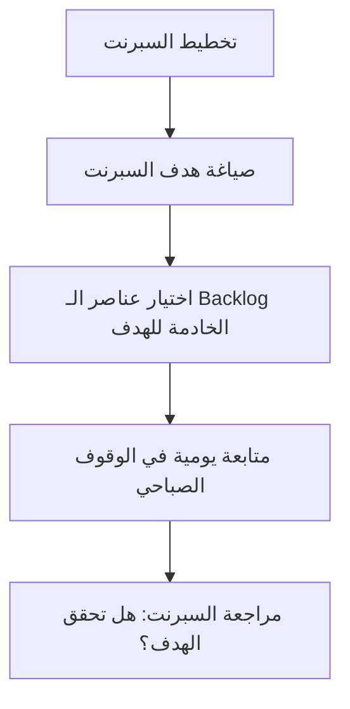

# هدف السبرنت (Sprint Goal)
> [!info] تعريف مختصر
> هدف السبرنت (Sprint Goal) هو جملة قصيرة تصف الغاية الأساسية التي يسعى الفريق لتحقيقها خلال [[14 - Sprint]] واحد. يمنح الفريق بوصلة واحدة توحّد قراراته اليومية، بدل أن يكون العمل مجرد قائمة مهام منفصلة.

## الشرح العلمي والاحترافي
- هدف السبرنت جزء رسمي من إطار عمل سكرم ([[02 - Scrum]])؛ يُصاغ أثناء [[08 - Sprint Planning]] بالتعاون بين [[05 - Product Owner]] والفريق.
- هو ليس قائمة عناصر الـ Backlog المختارة، بل "لماذا" اختير هذا العمل؛ يربط عناصر [[13 - Backlog]] المتفرقة بغرض واحد واضح ذي قيمة للعميل أو العمل.
- وجود هدف واضح يمنح الفريق مرونة: إذا تبيّن أثناء السبرنت أن إحدى المهام المخطَّطة لم تعد ضرورية لتحقيق الهدف، يمكن استبدالها بأخرى أنسب دون المساس بالتزام السبرنت الأساسي.
- يُستخدم الهدف كمرجع في [[07 - Daily Standup]] لمساءلة الفريق: "هل ما زلنا في طريقنا لتحقيق الهدف؟"، وفي [[09 - Sprint Review]] لتقييم النجاح الفعلي مقابل الغاية المعلنة، لا فقط مقابل عدد المهام المنجزة.
- هدف سبرنت جيد يتّبع غالباً معايير [[SMART Goals]]: محدد، قابل للقياس، واقعي، ومرتبط بزمن السبرنت.

## أين ومتى يُستخدم
- يُصاغ في بداية كل سبرنت أثناء [[08 - Sprint Planning]]، ويظل معروضاً بشكل بارز على [[16 - Task Boards]] طوال مدة السبرنت.
- يُستخدم يومياً في [[07 - Daily Standup]] لضبط الأولويات، وفي [[09 - Sprint Review]] لتقييم النتيجة النهائية أمام أصحاب المصلحة.
- مفيد بشكل خاص في المشاريع متعددة الفرق حيث يحتاج كل فريق فهم كيف يخدم عمله هدفاً أكبر مشتركاً.

## مثال وسيناريو تطبيقي
> [!example] سيناريو
> فريق تطوير تطبيق توصيل طعام يخطط لسبرنت مدته أسبوعان. بدل اختيار قائمة عشوائية من المهام، يتفق الفريق مع مالك المنتج على هدف السبرنت: "تمكين العميل من تتبع طلبه لحظياً على الخريطة".
> يختار الفريق من [[13 - Backlog]] فقط القصص المرتبطة بهذا الهدف: دمج واجهة برمجة تطبيقات الخرائط، وتحديث موقع السائق كل 10 ثوانٍ، وإشعار العميل عند اقتراب السائق.
> في منتصف السبرنت، يكتشف الفريق أن قصة "دعم اللغة الفرنسية في الواجهة" كانت مجدولة أيضاً، لكنها لا تخدم الهدف؛ فيقرر الفريق تأجيلها إلى سبرنت لاحق والتركيز على تحقيق الهدف المعلن، مما يحافظ على تماسك السبرنت وقيمته للعميل.

## خطوات أو مخطّط
1. مالك المنتج يعرض أولويات الأعمال ورؤيته للقيمة المطلوبة قبل بداية السبرنت.
2. الفريق يناقش السعة المتاحة ([[Capacity]]) ويختار عناصر [[13 - Backlog]] القابلة للإنجاز.
3. صياغة جملة واحدة واضحة تلخّص الغرض المشترك لهذه العناصر.
4. عرض الهدف بشكل بارز (لوحة، أداة تتبع) طوال السبرنت.
5. مراجعة التقدم نحو الهدف يومياً في [[07 - Daily Standup]].
6. تقييم تحقق الهدف فعلياً في [[09 - Sprint Review]]، بغض النظر عن عدد المهام المفردة المنجزة.

## ⚠️ مفاهيم خاطئة شائعة
> [!warning]
> - الخلط بين هدف السبرنت وقائمة المهام؛ الهدف هو الغرض من العمل لا تعداد المهام نفسها.
> - الاعتقاد أن إنجاز كل المهام المخطط لها يعني تلقائياً تحقيق الهدف؛ قد تُنجز كل المهام ويظل الهدف غير محقق إذا لم تخدم القيمة المطلوبة.
> - افتراض أن الهدف ثابت لا يمكن مناقشته؛ يمكن تعديل الخطة التفصيلية أثناء السبرنت طالما الهدف نفسه محفوظ.

## ❌ ممارسات خاطئة في المشاريع
> [!failure]
> - صياغة هدف عام جداً مثل "تحسين النظام" لا يوجّه أي قرار عملي. التجنب: صياغة هدف محدد وقابل للتحقق خلال مدة السبرنت.
> - تجاهل الهدف بعد وضعه والعودة للعمل كقائمة مهام منفصلة. التجنب: استحضاره في كل اجتماع وقوف صباحي كمرجع للأولويات.
> - وضع أهداف متعددة متضاربة في سبرنت واحد يشتت تركيز الفريق. التجنب: الاتفاق على هدف واحد رئيسي واضح لكل سبرنت.

## 🔗 مصطلحات ومفاهيم ذات صلة
[[08 - Sprint Planning]] | [[14 - Sprint]] | [[02 - Scrum]] | [[13 - Backlog]] | [[05 - Product Owner]] | [[SMART Goals]] | [[07 - Daily Standup]] | [[09 - Sprint Review]] | [[Stretch Goal]] | [[Outcome vs Output]]
