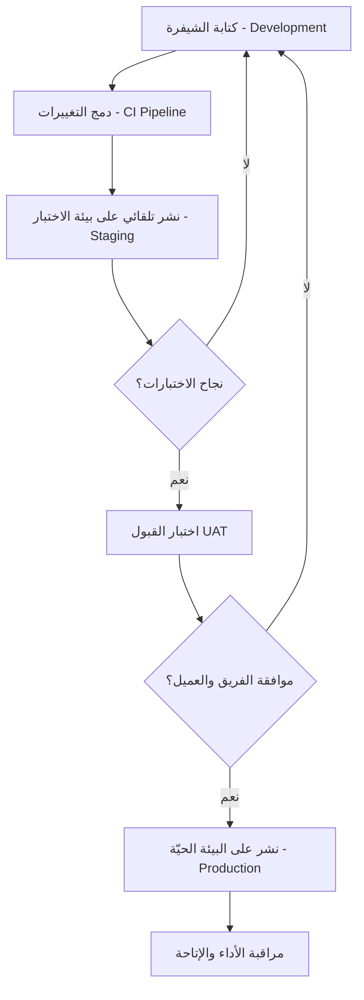

# بيئة الاختبار مقابل البيئة الحيّة (Staging vs Production Environment)
> [!info] تعريف مختصر
> بيئة الاختبار (Staging) هي نسخة طبق الأصل تقريبًا من النظام الحقيقي تُستخدم لتجربة التغييرات قبل نشرها. البيئة الحيّة (Production) هي النظام الفعلي الذي يستخدمه المستخدمون الحقيقيون. القاعدة الذهبية: لا شيء يصل إلى الإنتاج قبل أن يُختبر في بيئة الاختبار.

## الشرح العلمي والاحترافي
في أي مشروع برمجي احترافي، لا يوجد بيئة واحدة فقط للتطوير والتشغيل، بل عدة بيئات متدرّجة، وأشهرها:
- **بيئة التطوير (Development)**: حيث يكتب المبرمجون الشيفرة ويجرّبونها محليًا.
- **بيئة الاختبار (Staging / Testing)**: نسخة مطابقة قدر الإمكان للإنتاج (نفس إعدادات الخادم، قاعدة بيانات مشابهة، نفس التكاملات) يُنشر عليها الإصدار الجديد أولًا ليتأكد الفريق أن كل شيء يعمل كما هو متوقع، بما في ذلك اختبار القبول من المستخدم (راجع [[UAT]]).
- **البيئة الحيّة (Production)**: النظام الذي يتعامل معه العملاء الحقيقيون ببياناتهم الحقيقية. أي خطأ هنا له أثر مباشر على الأعمال والسمعة.

الفكرة الجوهرية أن بيئة الاختبار تعمل كـ"حاجز أمان" (safety net): إذا احتوى الإصدار على عيوب (bugs)، يُكتشف ذلك في بيئة الاختبار حيث الضرر محدود، بدلًا من اكتشافه بعد وصوله للمستخدمين. لهذا ترتبط هذه البيئات ارتباطًا وثيقًا بخطوط أنابيب [[CI and CD]] الآلية، حيث يمر كل تغيير في الشيفرة عبر مراحل بناء واختبار تلقائي قبل أن يُسمح بترقيته من بيئة إلى أخرى.

من الناحية التقنية، يجب أن تكون بيئة الاختبار مطابقة للإنتاج قدر الإمكان (نفس نظام التشغيل، نفس إصدارات المكتبات، بنية بيانات مشابهة) وإلا فقد "ينجح" الاختبار في Staging ثم يفشل في Production بسبب اختلاف الإعدادات - وهذه مشكلة شائعة جدًا يُطلق عليها أحيانًا "يعمل عندي لكن لا يعمل في الإنتاج".

## أين ومتى يُستخدم
- في كل مشروع برمجي احترافي بغض النظر عن المنهجية (Agile أو Waterfall)، خصوصًا في تطوير الويب والتطبيقات وواجهات الـ API.
- عند كل عملية نشر (deployment) أو إصدار جديد (release)، قبل الوصول للمستخدم النهائي.
- قبل تنفيذ [[UAT]] الرسمي مع العميل أو أصحاب المصلحة.
- عند اختبار [[Hotfix]] عاجل: حتى الإصلاحات الطارئة يُفضّل تمريرها عبر Staging إن أمكن الوقت، أو على الأقل عبر [[Smoke Testing]] سريع.

## مثال وسيناريو تطبيقي
> [!example] فريق تطوير تطبيق توصيل طعام "توصيلة" يريد إطلاق ميزة جديدة: دفع إلكتروني عبر محفظة رقمية.
> 1. يطوّر الفريق الميزة على أجهزتهم المحلية (Development).
> 2. عند اكتمالها، يُدمَج الكود عبر خط CI/CD وتُنشر النسخة تلقائيًا على خادم Staging المطابق لبيئة الإنتاج (نفس قاعدة بيانات PostgreSQL بنسخة تجريبية من البيانات، ونفس بوابة الدفع لكن في وضع "sandbox" وهمي).
> 2. يقوم فريق ضمان الجودة QA بإجراء [[Regression Testing]] و[[Smoke Testing]] على Staging لمدة يومين، ويطلب من مدير المنتج تنفيذ [[UAT]] للتأكد من أن تدفق الدفع سليم من منظور المستخدم.
> 3. يُكتشف خطأ: عند إلغاء الطلب بعد الدفع، لا يُرد المبلغ تلقائيًا. يُصلَح الخطأ في Staging ويُعاد الاختبار.
> 4. بعد الموافقة والـ[[Sign-off]]، يُنشر الإصدار على Production خلال نافذة زمنية منخفضة الاستخدام (مثلًا الساعة 3 فجرًا)، مع خطة تراجع (rollback plan) جاهزة إن ظهرت مشكلة غير متوقعة تؤثر على [[Uptime]].

## خطوات أو مخطّط

1. تطوير الميزة محليًا.
2. دمج الكود وتشغيل الاختبارات الآلية.
3. النشر على بيئة الاختبار (Staging).
4. تنفيذ اختبارات الانحدار والقبول.
5. الحصول على الموافقة النهائية.
6. النشر على البيئة الحيّة (Production) مع خطة مراقبة وتراجع.

## ⚠️ مفاهيم خاطئة شائعة
> [!warning]
> - الاعتقاد أن "نجاح الاختبار على جهازي المحلي" يكفي لضمان عمله في الإنتاج؛ فالبيئات المختلفة قد تُظهر أخطاء مختلفة تمامًا.
> - الخلط بين بيئة الاختبار الآلي (Testing) وبيئة الاختبار قبل الإطلاق (Staging)؛ فالأولى قد تكون مجرد حاويات مؤقتة، بينما الثانية أقرب ما يكون لصورة طبق الأصل من الإنتاج.
> - الظن أن بيئة الاختبار لا تحتاج إلى حماية أو نسخ احتياطي لأنها "ليست حقيقية"، رغم أنها قد تحتوي على بيانات حساسة منسوخة من الإنتاج.

## ❌ ممارسات خاطئة في المشاريع
> [!failure]
> - **تجاهل بيئة الاختبار تحت ضغط الوقت** والنشر مباشرة على Production لتوفير الوقت؛ هذا يرفع احتمال حدوث [[Escaped Defect Rate]] مرتفع ويؤثر سلبًا على [[Uptime]].
> - **استخدام بيانات إنتاج حقيقية غير مموّهة** في بيئة الاختبار دون الالتزام بسياسات الخصوصية مثل [[PDPL]]، مما يعرّض بيانات المستخدمين الحقيقية للخطر في بيئة أقل أمانًا.
> - **عدم مزامنة إعدادات Staging مع Production** (نسخة مختلفة من قاعدة البيانات أو مكتبة برمجية)، فيعمل الكود في الاختبار ويفشل في الإنتاج، فيما يُعرف بمشكلة "التوازي الوهمي" بين البيئتين.

## 🔗 مصطلحات ومفاهيم ذات صلة
[[CI and CD]] | [[UAT]] | [[Smoke Testing]] | [[Regression Testing]] | [[Hotfix]] | [[Uptime]] | [[RTO and RPO]] | [[Sign-off]] | [[PDPL]] | [[Escaped Defect Rate]]
