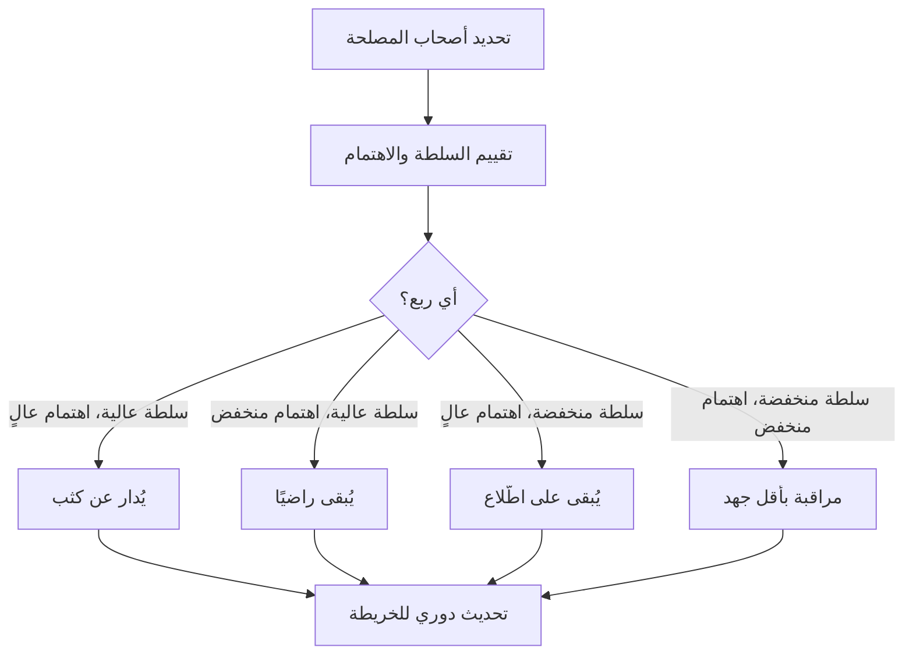

# خريطة أصحاب المصلحة (Stakeholder Map)
> [!info] تعريف مختصر
> خريطة أصحاب المصلحة أداة بصرية تُصنّف كل الأشخاص والجهات المتأثرين بالمشروع أو المؤثرين فيه، حسب مستوى **سلطتهم (Power)** واهتمامهم أو **تأثّرهم (Interest)** بنتائجه. تساعد فريق المشروع على تحديد مَن يجب إشراكه، ومتى، وبأي أسلوب تواصل.

## الشرح العلمي والاحترافي
- صاحب المصلحة (Stakeholder) هو أي فرد أو مجموعة أو منظمة يمكن أن تتأثر بقرارات المشروع أو نتائجه، أو تؤثر فيها؛ سواء كان ذلك بشكل مباشر (العميل، الفريق) أو غير مباشر (جهة تنظيمية، مورّد).
- أشهر أداة لبناء الخريطة هي **مصفوفة السلطة والاهتمام (Power/Interest Grid)**، وتقسّم أصحاب المصلحة إلى أربع فئات:
  1. سلطة عالية + اهتمام عالٍ → **يُدارون عن كثب (Manage Closely)**.
  2. سلطة عالية + اهتمام منخفض → **يُبقَون راضين (Keep Satisfied)**.
  3. سلطة منخفضة + اهتمام عالٍ → **يُبقَون على اطّلاع (Keep Informed)**.
  4. سلطة منخفضة + اهتمام منخفض → **مراقبة بأقل جهد (Monitor)**.
- الهدف ليس رسم الخريطة لمرة واحدة، بل تحديثها دوريًا لأن مواقع الأشخاص تتغيّر مع مراحل المشروع (مثلًا مورّد كان غير مهتم قد يصبح مؤثرًا عند التسليم).
- الخريطة تُغذّي مباشرة [[Communication Plan]] لأنها تحدّد لكل فئة نوع الرسائل وتكرارها وقناتها.

## أين ومتى يُستخدم
- تُبنى في مرحلة **بدء المشروع (Initiation)** ضمن أي منهجية (Waterfall أو Agile)، وتُراجَع عند بداية كل مرحلة أو [[14 - Sprint|سبرنت]] كبير.
- يستخدمها مدير المشروع أو [[05 - Product Owner|مالك المنتج]] لتحديد أولويات التواصل وإدارة التوقعات.
- ضرورية في المشاريع ذات الأطراف الكثيرة: عملاء، إدارة عليا، فرق تقنية، جهات تنظيمية، مستخدمون نهائيون.

## مثال وسيناريو تطبيقي
> [!example]
> شركة "نُظم" تبني تطبيق دفع إلكتروني جديد. عند بدء المشروع، جمع مدير المشروع أحمد أصحاب المصلحة التالية أسماءهم:
> - **مديرة العمليات سارة** (سلطة عالية، اهتمام عالٍ) → موافقتها ضرورية لكل قرار، تُبقى في اجتماعات أسبوعية.
> - **البنك المركزي كجهة رقابية** (سلطة عالية، اهتمام منخفض حاليًا) → يُرسَل له تقرير امتثال شهري لإبقائه راضيًا دون إغراقه بالتفاصيل.
> - **فريق الدعم الفني** (سلطة منخفضة، اهتمام عالٍ) → يُبقى على اطّلاع عبر قناة داخلية أسبوعية لأنه سيتأثر مباشرة بأي مشكلة بعد الإطلاق.
> - **موظفو قسم آخر غير مرتبط** (سلطة منخفضة، اهتمام منخفض) → يُكتفى بمراقبتهم دون جهد تواصل إضافي.
> بعد ثلاثة أشهر، عندما اقترب موعد الإطلاق، انتقل فريق الدعم الفني إلى خانة "يُدار عن كثب" لأن دوره أصبح حرجًا في الأسبوع الأول من الإطلاق.

## خطوات أو مخطّط
1. حصر جميع الأطراف المحتملين (عصف ذهني مع الفريق والرعاة).
2. تقييم كل طرف من حيث السلطة والاهتمام (منخفض/عالٍ).
3. وضع كل طرف في الربع المناسب من المصفوفة.
4. تحديد استراتيجية تواصل مخصّصة لكل ربع.
5. مراجعة الخريطة دوريًا وتحديثها عند تغيّر الظروف.

## ⚠️ مفاهيم خاطئة شائعة
> [!warning]
> - الاعتقاد أن الخريطة تُرسم مرة واحدة في بداية المشروع ولا تحتاج تحديثًا، بينما مواقع الأطراف تتغيّر مع الزمن.
> - الخلط بين "الاهتمام" و"الدعم": صاحب مصلحة قد يكون شديد الاهتمام لكنه معارض للمشروع، وهذا يتطلب استراتيجية مختلفة عن الداعم المتحمس.
> - تجاهل أصحاب المصلحة غير الرسميين (مثل قائد رأي داخل فريق العميل) لأنهم لا يحملون منصبًا رسميًا، مع أن تأثيرهم الفعلي قد يكون كبيرًا.

## ❌ ممارسات خاطئة في المشاريع
> [!failure]
> - الاكتفاء بإرسال بريد إلكتروني عام لكل الأطراف دون تخصيص الرسالة حسب موقعهم في المصفوفة، ما يهدر وقت أصحاب السلطة العالية برسائل غير مهمة لهم.
> - عدم إشراك صاحب مصلحة ذي سلطة عالية في وقت مبكر، ثم مفاجأته بقرار جاهز، فيعترض ويعطّل المشروع في مرحلة متأخرة ومكلفة.
> - الاعتماد على تخمين شخصي لمواقع الأطراف دون التحقق منهم فعليًا عبر مقابلات قصيرة، ما يؤدي إلى تصنيف خاطئ واستراتيجية تواصل غير فعالة.

## 🔗 مصطلحات ومفاهيم ذات صلة
[[Communication Plan]], [[21 - Stakeholder Communication]], [[Sign-off]], [[Alignment]], [[SPOC]]
