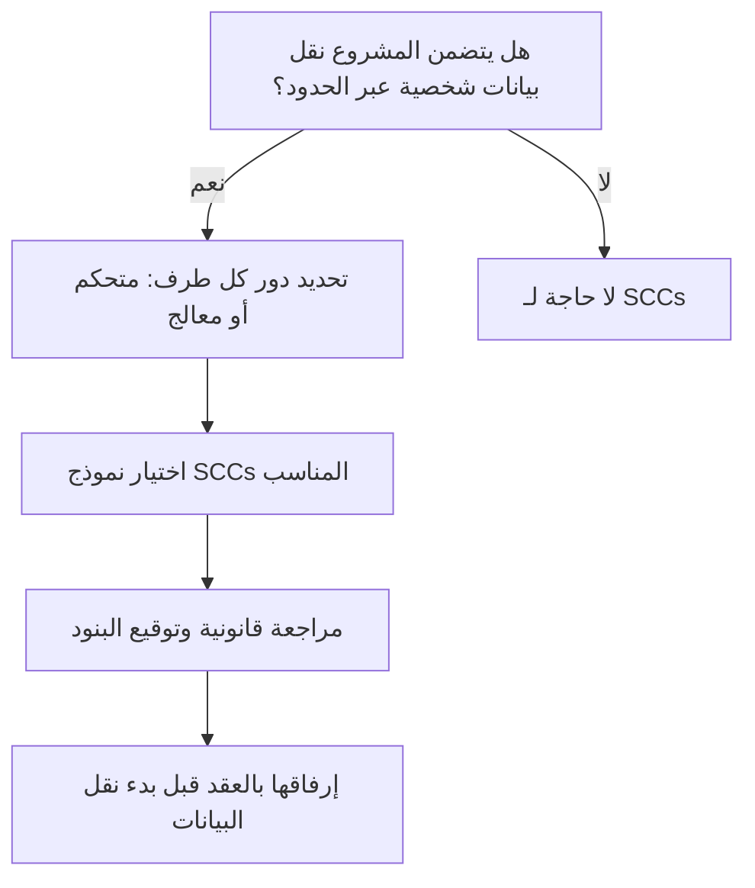

# البنود التعاقدية القياسية (Standard Contractual Clauses)
> [!info] تعريف مختصر
> البنود التعاقدية القياسية (Standard Contractual Clauses، اختصارًا SCCs) هي نماذج تعاقدية معتمدة من جهة تنظيمية (مثل المفوضية الأوروبية) تُستخدم لضمان حماية قانونية كافية عند نقل البيانات الشخصية بين دولتين تختلفان في مستوى حماية البيانات، غالبًا بين دولة داخل الاتحاد الأوروبي ودولة خارجه.

## الشرح العلمي والاحترافي
- عندما يعمل مشروع برمجي مع مستخدمين أو عملاء في الاتحاد الأوروبي، وتخزَّن بياناتهم أو تُعالج خارج الاتحاد (مثلًا في خادم بمصر أو الهند)، تفرض أنظمة حماية البيانات (مثل GDPR) ضمانات قانونية إضافية لهذا النقل.
- الـ SCCs هي نصوص تعاقدية جاهزة وموحّدة يوقّعها الطرفان (المُرسِل والمستقبِل للبيانات) دون الحاجة لصياغة عقد من الصفر؛ تُلزم المستقبِل بحماية البيانات بنفس مستوى الحماية المطلوب في بلد المصدر.
- تغطي بنودها: الغرض من معالجة البيانات، مدة الاحتفاظ بها، حقوق أصحاب البيانات (الوصول، الحذف)، إجراءات الأمن السيبراني، وآلية التبليغ عند حدوث اختراق.
- ترتبط وظيفيًا بمفهوم [[Controller vs Processor]] لأن البنود تحدّد التزامات كل طرف حسب دوره: هل هو "المتحكم" الذي يقرر كيفية استخدام البيانات أم "المعالج" الذي ينفّذ المعالجة نيابة عنه.
- من الناحية العملية، الـ SCCs جزء من مستندات الامتثال (Compliance) التي تُرفَق بعقود الموردين (SOW) وتُراجَع من قبل فريق قانوني أو مسؤول حماية البيانات (DPO).

## أين ومتى يُستخدم
- تُستخدم في مرحلة **التعاقد مع الموردين أو مزودي الخدمات السحابية (Vendor/Cloud Contracting)**، قبل توقيع أي اتفاقية تتضمّن نقل بيانات شخصية عبر الحدود.
- ضرورية عند اختيار مزود استضافة أو خدمة SaaS خارج الاتحاد الأوروبي بينما العميل أو مستخدمو النظام أوروبيون.
- يُراجعها فريق قانوني أو مسؤول الامتثال بالتعاون مع مدير المشروع أثناء إعداد [[SOW]] أو عقد الخدمة.

## مثال وسيناريو تطبيقي
> [!example]
> شركة برمجيات مصرية تطوّر نظام إدارة موارد بشرية لعميل ألماني. بيانات موظفي العميل الألمان (أسماء، رواتب، عناوين) ستُخزَّن على خوادم الشركة المصرية.
> قبل توقيع العقد، طلب المستشار القانوني للعميل الألماني توقيع البنود التعاقدية القياسية (SCCs) الصادرة عن المفوضية الأوروبية. وقّع الطرفان النموذج الذي يُلزم الشركة المصرية (بصفتها "معالج" وفق [[Controller vs Processor]]) بتطبيق تشفير البيانات، وإخطار العميل خلال 72 ساعة عند أي اختراق أمني، وحذف البيانات فور انتهاء العقد.
> بهذا التوقيع، أصبح نقل البيانات قانونيًا رغم اختلاف الدولتين، وتمكّن المشروع من الانطلاق دون عوائق تنظيمية.

## خطوات أو مخطّط
1. تحديد ما إذا كان المشروع يتضمّن نقل بيانات شخصية عبر حدود دولية.
2. تحديد دور كل طرف: متحكم أم معالج بيانات.
3. اختيار نموذج SCCs المناسب (متحكم-معالج، معالج-معالج، إلخ).
4. مراجعة البنود قانونيًا وتكييفها مع طبيعة المشروع.
5. توقيع البنود كملحق للعقد الرئيسي (SOW) قبل بدء نقل أي بيانات فعليًا.
6. توثيق البنود ضمن سجل الامتثال ومراجعتها دوريًا.

## ⚠️ مفاهيم خاطئة شائعة
> [!warning]
> - الاعتقاد أن توقيع SCCs كافٍ وحده لضمان الامتثال الكامل، بينما يتطلب الأمر أيضًا إجراءات تقنية فعلية مثل التشفير والتحكم بالوصول.
> - الخلط بين SCCs وبين اتفاقية معالجة البيانات العامة (DPA)؛ الـ SCCs نموذج محدد يُستخدم تحديدًا للنقل الدولي، وقد تُدمج ضمن DPA أوسع.
> - افتراض أن SCCs تُغني عن مراجعة قانون حماية البيانات المحلي في بلد المعالج (مثل [[PDPL]])، مع أنها تُكمّله ولا تحل محله.

## ❌ ممارسات خاطئة في المشاريع
> [!failure]
> - البدء في نقل البيانات الفعلي قبل توقيع البنود التعاقدية القياسية، بحجة "استعجال الجدول الزمني"، ما يعرّض الشركتين لمخالفة قانونية جسيمة.
> - نسخ نموذج SCCs قديم دون التأكد من أنه محدَّث وفق آخر إصدار معتمد من الجهة التنظيمية، فيصبح العقد غير سارٍ قانونيًا.
> - عدم إشراك مدير المشروع في مراجعة البنود، فيغفل عن التزامات تشغيلية (مثل مهلة الإبلاغ عن اختراق) تؤثر مباشرة على خطة الاستجابة للحوادث.

## 🔗 مصطلحات ومفاهيم ذات صلة
[[Controller vs Processor]], [[PDPL]], [[ROPA]], [[KYC]], [[SOW]]
