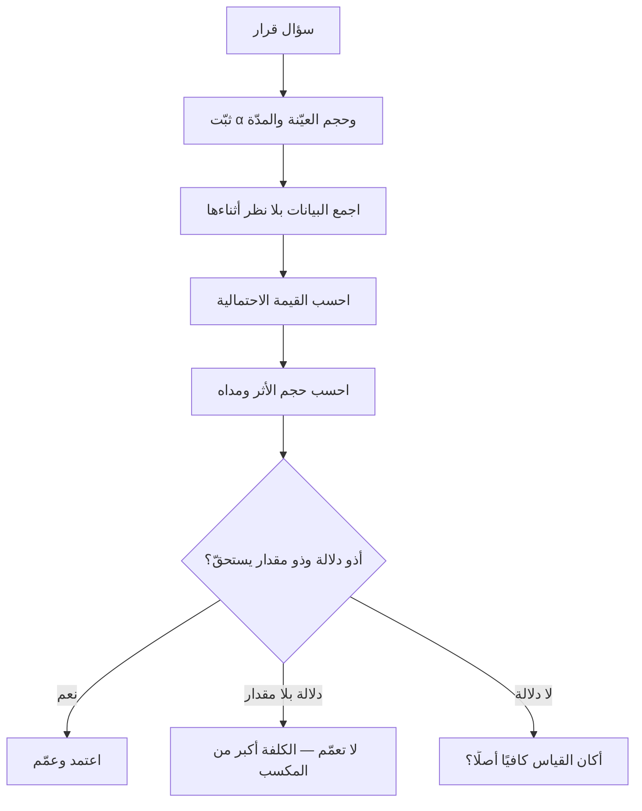

# الدلالة الإحصائية (Statistical Significance)

> [!info] تعريف مختصر
> **الدلالة الإحصائية** حكمٌ على سؤال واحد: **ما مقدار غرابة هذه البيانات لو لم يكن هناك فرق حقيقي أصلًا؟** فإن كانت غريبة بما يكفي — أي إن كانت **القيمة الاحتمالية (p-value)** أصغر من عتبةٍ اتُّفق عليها قبل النظر في البيانات — قيل إن الفرق «ذو دلالة»، ومعناه الدقيق: **يصعب ردّه إلى الصدفة وحدها**. ولا يعني أنه فرق مهمّ، ولا أنه كبير، ولا أن احتمال صحّته 95%. وأشهر اختباراتها في البيانات الفئوية — كنجاح وفشل، أو تفضيل نسخة على نسخة — **اختبار مربّع كاي (Chi-Square)**.

## الشرح العلمي والاحترافي

### 1. ما الذي تقوله القيمة الاحتمالية بالضبط؟

الاختبار يبدأ بافتراضٍ متعمَّد أنه **لا فرق**: النسختان سواء، والتغيير لم يصنع شيئًا. ثم يُحسب: لو كان ذلك الافتراض صحيحًا، فما احتمال أن نرى فرقًا بهذا الحجم أو أكبر بمحض الصدفة؟ ذلك الاحتمال هو **القيمة الاحتمالية**.

فـ`p = 0.03` تعني: *«لو لم يكن ثمّة فرق، لكان ظهور ما رأيناه يقع في ثلاث من كل مئة تجربة.»* وهي جملة عن **البيانات** بفرض انتفاء الفرق، لا جملة عن **الفرق** بفرض البيانات. وقلبُ الجملتين هو أشيع خطأ في قراءة الأرقام في المؤسّسات، وقد أفردت له الجمعية الإحصائية الأمريكية بيانًا صريحًا سنة 2016.

### 2. مستوى الدلالة يُختار قبل النظر — لا بعده

العتبة (α) قرارٌ عن **مقدار الإنذار الكاذب الذي تحتمله**: 0.05 يعني الرضا بأن تخطئ خمس مرّات من مئة فتظنّ فرقًا حيث لا فرق. وهي عُرفٌ لا قانون طبيعة؛ ويجوز تشديدها حيث يكون الخطأ مكلفًا، وتخفيفها في قرار قابل للتراجع.

**والشرط الحاكم أن تُثبَّت قبل رؤية النتيجة.** فالعتبة التي تُختار بعد النظر في البيانات لا تفعل شيئًا سوى تصديق ما رآه الناظر.

### 3. اختبار مربّع كاي: حالة البيانات الفئوية

حين لا تكون البيانات أرقامًا مستمرّة بل **أعدادًا في خانات** — نجح/فشل، اشترى/لم يشترِ، هذا الفريق/ذاك — يكون مربّع كاي (كارل بيرسون، 1900) هو الاختبار المعتاد. وفكرته بسيطة تُفهم بلا رياضيات:

1. يُحسب ما **كنت تتوقّعه** في كل خانة لو لم يكن للعامل أثر.
2. يُقارن بما **وقع فعلًا**.
3. تُجمَع الفروق بطريقة تعاقب الفروق الكبيرة أكثر من الصغيرة.
4. يُترجَم المجموع إلى قيمة احتمالية.

**وأشيع استعمالين له في المشاريع:** فحص هل يرتبط متغيّران فئويّان أصلًا (هل تختلف نسبة العيوب باختلاف الوحدة المنفِّذة؟)، ومقارنة نسب التحويل بين نسختين في [[AB Testing|اختبار أ/ب]].

**وحدّه الذي يُنسى:** أنه لا يصلح حين تكون الأعداد المتوقَّعة في الخانات صغيرة (القاعدة العملية: أقلّ من خمسة)، وأنه **يقول إن ثمّة ارتباطًا ولا يقول أيّهما سبب** — فهو خاضع لما في [[Correlation vs Causation|الارتباط والسببية]] كخضوع غيره.

### 4. الدلالة ليست الأهمية — وهذا أخطر ما في الباب

الفرق ذو الدلالة قد يكون **تافهًا**. فمع عيّنة كبيرة بما يكفي، يصير كل فرق تقريبًا ذا دلالة إحصائية، ولو كان تحسّنًا في نسبة التحويل مقداره جزء من عشرة آلاف. ولهذا لا يُتّخذ قرار على القيمة الاحتمالية وحدها، بل معها:

| ما تسأل عنه | ما يجيبه | ولماذا لا يكفي وحده |
|---|---|---|
| **أيمكن ردّه إلى الصدفة؟** | القيمة الاحتمالية | تصغُر بكِبَر العيّنة ولو كان الفرق مهملًا |
| **كم مقداره؟** | **حجم الأثر** (Effect Size) والفترة | لا يقول شيئًا عن احتمال الصدفة |
| **أيستحقّ كلفته؟** | حساب القيمة والكلفة | خارج الإحصاء أصلًا — وهو القرار |

> **السؤال الفارق:** القيمة الاحتمالية تجيب عن **«أهو حقيقي؟»**، وحجم الأثر عن **«وكم هو؟»**. والقرار لا يُتّخذ إلا بالاثنين، والثاني هو الذي يُنسى.

### 5. ثلاثة أعطال تُنتج نتائج «دالّة» وهي زائفة

1. **الاختلاس بالنظر (Peeking).** أن يُراقَب اختبار أ/ب يوميًّا ويُوقَف ساعةَ يبلغ الدلالة. وأثره أن احتمال الإنذار الكاذب يتجاوز العتبة المعلنة كثيرًا، لأن كل نظرة فرصة مستقلّة للصدفة. **والعلاج:** أن يُحدَّد حجم العيّنة ومدّة الاختبار قبل بدئه، أو تُستعمل طرق مصمَّمة للمراقبة المستمرّة.
2. **المقارنات المتعدّدة.** من فحص عشرين مؤشّرًا عند عتبة 0.05، فالمتوقَّع أن يجد **واحدًا دالًّا بالصدفة وحدها**. فالفحص الشامل الذي يُبلَّغ عنه بمؤشّره الوحيد الفائز ليس اكتشافًا بل فرزًا.
3. **ضعف القوّة الإحصائية.** أن تكون العيّنة أصغر من أن تكشف فرقًا حقيقيًّا موجودًا. فيُقرأ عدم الدلالة على أنه «لا فرق»، وهو في الحقيقة **«لم نقس ما يكفي لنرى»**.

## أين ومتى يُستخدم

- في قراءة نتائج [[AB Testing|اختبار أ/ب]] قبل تعميم نسخة على كل المستخدمين.
- في تحليل العيوب: هل يختلف [[Escaped Defect Rate|معدّل العيوب المتسرّبة]] باختلاف الوحدة أو نوع العمل اختلافًا يصعب ردّه إلى الصدفة؟
- في مرحلتَي «حلّل» و«تحقّق» من [[DMAIC]]، لإثبات أن التحسّن بعد التدخّل ليس تذبذبًا معتادًا.
- في نتائج الاستبيانات، حيث تُقارَن نسب بين فئات — وهو موضع مربّع كاي بامتياز.
- عند قراءة أي دراسة أو تقرير سوق قبل بناء قرار عليه، بالسؤال عن حجم العيّنة وحجم الأثر لا عن النتيجة وحدها.

## مثال وسيناريو تطبيقي

> [!example] سيناريو ملموس
> فريق منتج جرّب صياغة جديدة لزرّ الاشتراك. النتيجة بعد أسبوع:
>
> | النسخة | زائر | اشترك | النسبة |
> |---|---|---|---|
> | أ (الحالية) | 4,000 | 320 | 8.0% |
> | ب (الجديدة) | 4,000 | 372 | 9.3% |
>
> اختبار مربّع كاي أعطى `p = 0.03`. فأعلن الفريق أن «النسخة ب أفضل بثقة 97%» — وهي جملة خاطئة في لفظها ومعناها: الـ97% ليست احتمال صحّة الفرق، بل مقابلُ احتمال أن تُنتج الصدفةُ وحدها فرقًا بهذا الحجم.
>
> **والقراءة السليمة ثلاث جمل:** الفرق **1.3 نقطة مئوية** — وهذا حجم الأثر، وهو ما يُبنى عليه الحساب المالي. ومداه المعقول تقريبًا **بين 0.1 و2.5 نقطة**، وهو مدًى عريض يحتمل أن يكون المكسب هزيلًا. وردّه إلى الصدفة صعب، وليس مستحيلًا.
>
> **وما فعله الفريق بعدها هو موضع العبرة:** كان قد نظر في النتيجة يوميًّا منذ اليوم الثاني، وأوقف الاختبار في اليوم الذي عبرت فيه العتبة. فأُعيد التجريب بمدّة محدَّدة سلفًا، فاستقرّ الفرق عند **0.4 نقطة** بلا دلالة. أي أن النتيجة الأولى كانت من الاختلاس بالنظر لا من الزرّ.

## خطوات أو مخطّط

1. اكتب السؤال قرارًا لا فضولًا: **ماذا سأفعل إن كان الجواب نعم، وماذا إن كان لا؟**
2. حدّد العتبة (α) وحجم العيّنة والمدّة **قبل** بدء الجمع، واكتبها في [[Decision Log|سجلّ القرارات]].
3. اجمع البيانات كاملةً، ولا تنظر في النتيجة أثناءها.
4. احسب القيمة الاحتمالية بالاختبار المناسب — ومربّع كاي للبيانات الفئوية.
5. احسب **حجم الأثر ومداه**، ولا تكتفِ بالقيمة الاحتمالية.
6. قرّر بالمقدار والكلفة معًا، وصرّح بعدد ما فحصتَه من مؤشّرات لا بالفائز وحده.

## ⚠️ مفاهيم خاطئة شائعة

> [!warning]
> - **قراءة `p = 0.05` على أنها «احتمال 95% أن الفرق حقيقي».** وهي أشهر خطأ في الباب: القيمة الاحتمالية جملة عن البيانات بفرض انتفاء الفرق، لا العكس.
> - **الظنّ أن «ذو دلالة» تعني «مهمّ».** فمع عيّنة كبيرة يصير كل فرق تقريبًا ذا دلالة، والسؤال العملي مقداره لا وجوده.
> - **قراءة انتفاء الدلالة على أنه إثبات للتساوي.** فقد يكون سببه صِغَر العيّنة، وانتفاء الدليل ليس دليل الانتفاء.
> - **حسبان مربّع كاي دليلًا على السببية.** فهو يكشف ارتباطًا بين متغيّرين فئويّين، ويبقى تفسير الاتّجاه خارجه ([[Correlation vs Causation]]).
> - **الظنّ أن أرقام المشاريع الصغيرة تحتمل هذا الجهاز.** فمقارنة سبرنتين ببعضهما لا تُختبر إحصائيًّا؛ موضعها [[Control Chart|مخطط التحكّم]] و[[Trend Analysis|تحليل الاتجاه]].

## ❌ ممارسات خاطئة في المشاريع

> [!failure]
> - **إيقاف اختبار أ/ب ساعةَ يبلغ الدلالة.** وهو التطبيق العملي لخطأ الاختلاس بالنظر، وينتج عنه اعتماد تغييرات لا أثر لها.
> - **فحص عشرات المؤشّرات ثم الإبلاغ عن الفائز وحده** بلا ذكر عدد ما فُحص — فالقارئ يزن النتيجة بعدد المحاولات، ومنعُه ذلك تضليل ولو كان الحساب سليمًا.
> - **بناء التزام تعاقدي على فرق ذي دلالة وحجمه مجهول.** فالبند يُكتب بالمقدار لا بوجود الفرق.
> - **استعمال الدلالة الإحصائية درعًا في نقاش داخلي** — «الرقم دالّ إحصائيًّا» تُقال لإغلاق النقاش لا لفتحه، ومن سمعها لا يملك مراجعتها ما لم تُعرض العيّنة والعتبة وحجم الأثر معها.

## 🔗 مصطلحات ومفاهيم ذات صلة

[[Descriptive and Inferential Statistics]] | [[AB Testing]] | [[Correlation vs Causation]] | [[Control Chart]] | [[Trend Analysis]] | [[Anomaly Detection]] | [[Percentiles and Median vs Average]] | [[DMAIC]] | [[Six Sigma]] | [[Base Rate]] | [[Cognitive Bias]] | [[Decision Log]] | [[Vanity Metrics]] | [[Escaped Defect Rate]]
