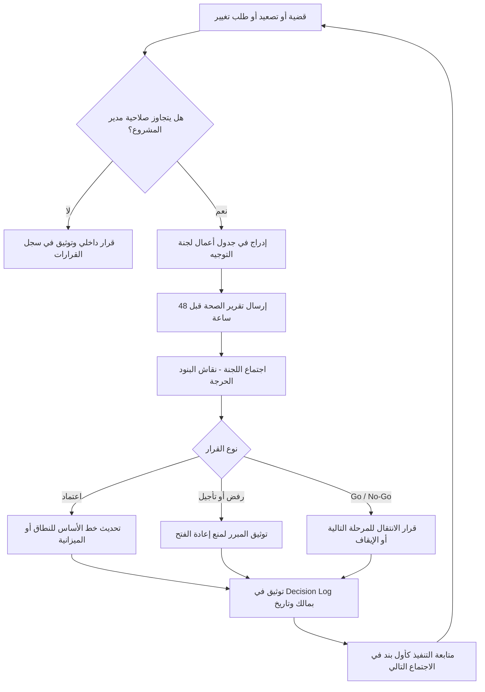

# لجنة التوجيه (Steering Committee)

> [!info] تعريف مختصر
> لجنة التوجيه (Steering Committee، وتُختصر SteerCo) هي **الهيئة الحاكمة العليا للمشروع**: مجموعة محدودة من أصحاب القرار التنفيذي تجتمع دوريًا لتوجيه المشروع في المسائل التي تتجاوز صلاحية مدير المشروع — البتّ في التصعيدات، اعتماد تغييرات النطاق والميزانية الكبرى، إصدار قرار [[Go or No-Go Decision]]، وحسم تعارض الأولويات بين الأقسام. اللجنة ليست جمهورًا يُعرض عليه التقدّم، بل **جهة تُصدر قرارات مُلزِمة وتتحمّل مسؤوليتها**.

## الشرح العلمي والاحترافي
- **موقعها في هيكل الحوكمة ([[Governance]])**: كل مشروع له ثلاث طبقات قرار: طبقة التنفيذ (الفريق)، طبقة الإدارة (مدير المشروع)، وطبقة الحوكمة (لجنة التوجيه). مدير المشروع يملك صلاحية داخل حدود مُعرَّفة: جدول متفق عليه، ميزانية معتمدة، نطاق مُثبَّت. أي قرار يتجاوز هذه الحدود — تمديد الجدول، تجاوز الميزانية بنسبة تتخطى عتبة معيّنة، تغيير النطاق جوهريًا، أو نزاع بين قسمين لا سلطة لمدير المشروع عليهما — يُصعَّد إلى اللجنة. بهذا المعنى فإن اللجنة ليست طبقة إشراف زائدة بل **صمّام أمان يمنع مدير المشروع من اتخاذ قرارات لا يملك تفويضها، ويمنع تجميد المشروع في انتظار مَن يقرّر**.
- **تكوينها القياسي** (يُفضَّل ألّا يتجاوز 5–8 أعضاء لأن اللجان الكبيرة لا تقرّر):
  - **الراعي التنفيذي ([[Sponsor]])**: رئيس اللجنة ومالك حالة العمل ([[Business Case]])، وهو مَن يملك الميزانية ويوقّع القرارات الكبرى. غيابه المتكرّر يُفرغ اللجنة من معناها.
  - **ممثل العميل / مالك العمل (Business Owner)**: صاحب القرار في الأولويات الوظيفية ومعايير القبول، ومسؤول عن توفير موارد الأعمال (مثل مختبِري [[UAT]]).
  - **ممثل المورّد أو الشريك المنفّذ (Vendor Representative)**: عادة مدير حساب أو مدير تسليم من الطرف الخارجي، يملك صلاحية الالتزام التعاقدي وتحريك الموارد ([[Vendor Management]]).
  - **مدير التسليم (Delivery Manager)**: المسؤول عن قدرة التنفيذ الفعلية وعن الالتزامات الفنية.
  - **مدير المشروع**: أمين سرّ اللجنة عمليًا — يُعدّ جدول الأعمال ويقدّم تقرير الصحّة ويوثّق القرارات، لكنه **ليس صاحب قرار داخلها** بل طالب قرار.
  - **أعضاء دائمون أو مدعوّون بحسب الحاجة**: الأمن المعلوماتي، الشؤون القانونية، المالية، الموارد البشرية — يُدعَون للبنود التي تخصّهم فقط.
- **ما تقرّره فعلًا (نطاق سلطتها)**:
  1. **البتّ في التصعيدات** الواردة عبر [[Escalation Path]]: نزاع على أولوية، مورد محتجز في قسم آخر، مورّد متأخر، قرار عالق بين طرفين.
  2. **اعتماد تغييرات النطاق والميزانية الكبرى**: كل [[Change Request]] يتجاوز عتبة متفق عليها (مثلًا أثر يزيد عن 5% من الميزانية أو أسبوعين على الجدول).
  3. **قرار الاستمرار من عدمه**: [[Go or No-Go Decision]] عند بوّابات المراحل ([[Stage Gate]])، بما فيه قرار إيقاف المشروع كليًا — وهو قرار لا يملكه سوى اللجنة.
  4. **حلّ تعارض الأولويات بين الأقسام**: حين يطلب قسمان الموارد نفسها أو تتعارض متطلباتهما، اللجنة هي المكان الوحيد الذي يملك سلطة أفقية للحسم.
  5. **إزالة العوائق التنظيمية**: فتح أبواب، تسريع موافقات، تعديل سياسات داخلية تعيق التسليم.
  6. **حماية المشروع سياسيًا** داخل المؤسسة، وتثبيت أولويته أمام مبادرات منافسة.
- **ما لا تفعله**: لا تدير المهام اليومية، لا تراجع التصاميم التقنية بالتفصيل، ولا تعيد تخطيط الجدول بنفسها. تجاوز اللجنة إلى التفاصيل (Micro-management) يقتل ملكية مدير المشروع ويُبطئ كل شيء.
- **مبدأ التفويض المكتوب**: اللجنة الفعّالة تصدر في بداية المشروع **ميثاقًا (Terms of Reference)** يحدّد: الأعضاء وبدلاءهم، النصاب، عتبات الصلاحية الرقمية، الدورية، وآلية القرار العاجل بين الاجتماعات. بغير ذلك تصبح صلاحياتها موضع تفاوض في كل حالة.

## أين ومتى يُستخدم
- **في المشاريع متوسطة وكبيرة الحجم** ذات الأثر المؤسسي العابر للأقسام، أو ذات الميزانية التي تتطلّب حوكمة مالية.
- **في المشاريع متعددة الأطراف** (عميل + مورّد أو أكثر)، حيث تكون اللجنة المنبر التعاقدي المشترك لحسم الخلافات قبل تصعيدها إلى مسار قانوني.
- **عند بوّابات المراحل والإطلاق**: قرارات دخول [[UAT]]، قرار الإطلاق، قرار الترحيل إلى الإنتاج.
- **في برامج التحوّل (Programs)**: تكون هناك لجنة توجيه للبرنامج ولجان أصغر للمشاريع المكوّنة له، مع مسار تصعيد واضح بينها.
- **الدورية**: شهريًا في الأوضاع المستقرّة، **أسبوعيًا في الأوقات الحرجة** (ما قبل الإطلاق، أثناء الترحيل، في مرحلة التعافي من تعثّر)، مع إمكانية عقد اجتماع استثنائي عاجل خلال 48 ساعة عند تصعيد حرج. مدّة الاجتماع النموذجية 60 دقيقة، ومدخله الرئيسي هو [[Project Health Report]] المُرسَل قبل 48 ساعة.

## مثال وسيناريو تطبيقي
> [!example] **مشروع منصة خدمات إلكترونية، ميزانية 3.1 مليون ريال، مدّة 14 شهرًا، وفي الشهر التاسع. عُقد اجتماع لجنة التوجيه الشهري بجدول أعمال قياسي مدّته 60 دقيقة:**
>
> - **(10 د) حالة التسليم**: 71% إنجاز مقابل 74% مخطَّط، SPI = 0.96. مقبول ولا يحتاج قرارًا.
> - **(15 د) المخاطر العليا**: خطر تأخّر تكامل بوّابة الدفع الحكومية، احتمال 60% وأثر 5 أسابيع. لا مالك تنفيذي حتى الآن.
> - **(10 د) جاهزية UAT**: 40 مختبِرًا مطلوبين من قسم خدمة العملاء، المتوفّر فعليًا 12 لأن القسم في موسم ذروة.
> - **(10 د) الميزانية**: مستهلك 68% مقابل إنجاز 71% — سليم.
> - **(15 د) التصعيدات المفتوحة**: طلب تغيير كبير من قسم التسويق لإضافة وحدة تحليلات، أثره التقديري 380 ألف ريال و6 أسابيع.
>
> **القرارات الصادرة، وقد وُثّقت جميعها في [[Decision Log]]:**
> 1. **تصعيد UAT**: قرّرت اللجنة — بحكم سلطتها الأفقية التي لا يملكها مدير المشروع — إلزام قسم خدمة العملاء بتفريغ 25 مختبِرًا بواقع 50% من وقتهم لمدة 3 أسابيع، وتعويض الذروة بتعاقد مؤقّت. المالك: مدير خدمة العملاء. الاستحقاق: خلال أسبوعين.
> 2. **خطر بوّابة الدفع**: أسنِد إلى الراعي التنفيذي شخصيًا لأن حلّه يتطلّب تواصلًا على مستوى الجهة الحكومية، مع خطة بديلة (Fallback) بالإطلاق دون الدفع الإلكتروني في المرحلة الأولى.
> 3. **طلب التغيير**: **رُفض للمرحلة الحالية وأُجِّل** إلى الإصدار الثاني، لأن قبوله يعني تأخير الإطلاق ستة أسابيع مقابل قيمة غير حرجة. القرار وُثّق بمبرره حتى لا يُعاد فتحه شهريًا.
>
> **النتيجة**: 60 دقيقة أنتجت ثلاثة قرارات مُلزِمة بمالك وتاريخ، مقابل اجتماع بديل كان يمكن أن يُنفق الوقت نفسه في استعراض 30 شريحة تقدّم وينتهي بلا قرار واحد — والفارق بين النموذجين هو الفارق بين لجنة توجيه ولجنة استماع.

## خطوات أو مخطّط
1. **تأسيس اللجنة في مرحلة بدء المشروع** وتوثيق ميثاقها: الأعضاء، النصاب، عتبات الصلاحية، الدورية.
2. **تحديد عتبات التصعيد الرقمية** بوضوح: ما الذي يقرّره مدير المشروع، وما الذي يجب أن يُرفع ([[Escalation Path]]).
3. **إعداد جدول أعمال ثابت** يسبق كل اجتماع: حالة التسليم، المخاطر العليا، جاهزية UAT، الميزانية، التصعيدات المفتوحة.
4. **إرسال [[Project Health Report]] قبل 48 ساعة** ليأتي الأعضاء وقد قرأوا.
5. **إدارة الاجتماع بمنطق القرار**: تُعرض البنود الخضراء في دقائق، ويُخصَّص الوقت للأصفر والأحمر والتصعيدات.
6. **توثيق كل قرار فورًا** في [[Decision Log]] بصيغة: القرار، المبرر، المالك، تاريخ الاستحقاق.
7. **متابعة تنفيذ قرارات الاجتماع السابق** كأول بند في الاجتماع التالي — وهذا البند وحده يُميّز اللجان الجادّة.
8. **مراجعة تكوين اللجنة عند تغيّر مرحلة المشروع** (مثلًا إضافة ممثل التشغيل قبل الإطلاق).

## ⚠️ مفاهيم خاطئة شائعة
> [!warning]
> - **اعتبارها "اجتماع عرض شهري للإدارة"**: هذا أشيع سوء فهم على الإطلاق. اللجنة ليست منصّة إعلام بل جهة قرار؛ إذا خرج الاجتماع بلا قرار مكتوب فقد فشل بغضّ النظر عن جودة العرض.
> - **الخلط بينها وبين لجنة مراقبة التغيير ([[Change Control Board]])**: الأخيرة متخصّصة في تقييم واعتماد طلبات التغيير ضمن حدود، بينما لجنة التوجيه هيئة حوكمة أوسع تشمل التصعيدات والاستمرار والأولويات. في المشاريع الصغيرة قد تُدمج الوظيفتان، لكن الخلط المفاهيمي يؤدي إلى إغراق اللجنة بتفاصيل تغييرات صغيرة.
> - **الظن بأنها تُضعف سلطة مدير المشروع**: العكس صحيح — وجود لجنة فاعلة **يحمي** مدير المشروع، لأنها تتحمّل القرارات التي تتجاوز تفويضه بدل أن يتحمّلها منفردًا أو يعلق بلا حسم.
> - **افتراض أن كثرة الأعضاء تعني قوة أكبر**: اللجنة التي تضم 15 عضوًا لا تقرّر شيئًا؛ تتحوّل إلى ندوة. القوة في الصلاحية لا في العدد.
> - **الاعتقاد بأن حضور مندوب عن العضو التنفيذي يكفي**: المندوب الذي لا يملك تفويضًا بالقرار يحوّل الاجتماع إلى جلسة "سأرجع لمديري"، وهو تأجيل مقنّع. الحضور بلا تفويض غياب.

## ❌ ممارسات خاطئة في المشاريع
> [!failure]
> - **اجتماع عرض لا اجتماع قرار**: 45 دقيقة من الشرائح و10 دقائق أسئلة مجاملة، ثم "شكرًا لجهودكم". الحل: قاعدة صارمة — كل بند في جدول الأعمال يحمل وسمًا صريحًا (للعلم / للنقاش / **للقرار**)، وتُخصّص أغلبية الوقت لبنود القرار، ويُقاس نجاح الاجتماع بعدد القرارات الموثّقة لا بعدد الشرائح.
> - **غياب الراعي التنفيذي المتكرّر وإرسال بديل بلا صلاحية**: يُفقد اللجنة قدرتها على البتّ في الميزانية والأولويات فتتحوّل إلى منتدى استشاري. الحل: النصّ في الميثاق على أن غياب الراعي يؤجّل القرارات المالية، وتسمية بديل واحد **مفوَّض كتابيًا** بصلاحيات محدّدة.
> - **قرارات بلا مالك ولا تاريخ**: "سنتابع الموضوع" و"سننظر في الأمر" ليست قرارات. الحل: صيغة إلزامية ثلاثية لكل قرار — ماذا، مَن، متى — ولا يُغلق البند دون استيفائها.
> - **عدم متابعة قرارات الاجتماع السابق**: أسرع طريق لموت اللجنة، إذ يتعلّم الجميع أن قراراتها بلا أثر. الحل: جعل "متابعة القرارات السابقة" البند رقم صفر الثابت، مع عرض نسبة التنفيذ.
> - **إغراق اللجنة بالتفاصيل التشغيلية**: عرض حالة كل مهمة وكل عيب يستهلك وقت أصحاب القرار في ما لا يحتاج قرارهم. الحل: تقديم [[Project Health Report]] بمستوى تجميعي، وإحالة التفاصيل إلى ملاحق يقرأها من يشاء.
> - **تجاوز اللجنة عبر قنوات جانبية**: أخذ موافقات فردية من الراعي خارج الاجتماع ثم تقديمها كأمر واقع، وهو ما يهدم شرعية الحوكمة ويثير نزاعات لاحقة. الحل: أي قرار يستوفي عتبة التصعيد يُوثَّق في محضر اللجنة ولو اتُّخذ عاجلًا بينها.
> - **تكوين لا يمثّل مصادر القرار الحقيقية**: لجنة بلا ممثل للمورّد أو بلا مالك العمل ستُصدر قرارات لا يستطيع أحد تنفيذها. الحل: بناء التكوين انطلاقًا من [[Stakeholder Map]] ومصفوفة [[RACI]]، ومراجعته عند كل مرحلة.

## 🔗 مصطلحات ومفاهيم ذات صلة
[[Escalation Path]] | [[Project Health Report]] | [[Go or No-Go Decision]] | [[Decision Log]] | [[Change Request]] | [[Stakeholder Map]] | [[RACI]] | [[Governance]] | [[Sponsor]] | [[Business Case]] | [[Stage Gate]]
