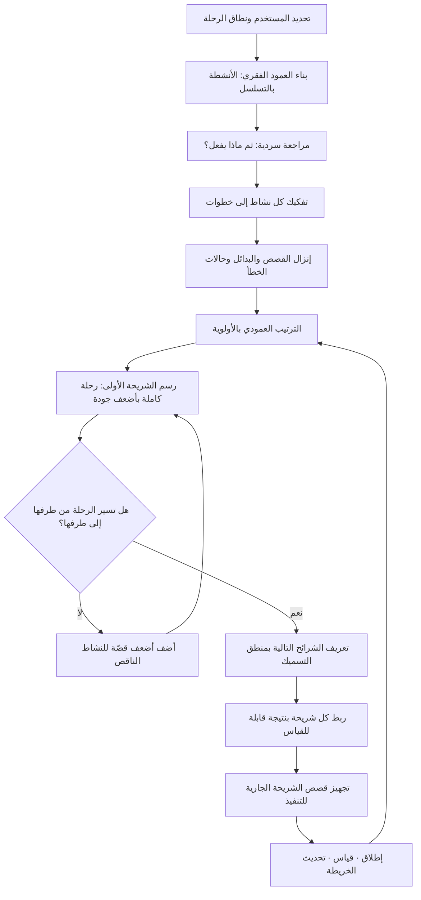

# خريطة القصص (Story Mapping)

> [!info] تعريف مختصر
> أسلوب لتنظيم متطلّبات المنتج في **مستويين متعامدين** بدل قائمة مسطّحة: **أفقيًّا** تُرتَّب الأنشطة والخطوات بحسب تسلسل رحلة المستخدم من أولها إلى آخرها فتُشكّل "العمود الفقري" للسرد، و**عموديًّا** تُنزَّل تحت كل خطوة تفاصيلها وبدائلها مرتّبة بالأولوية من الأهم إلى الأقل. ثم تُرسم **شرائح أفقية (Slices)** تقطع الخريطة عرضًا، وكل شريحة تمثّل إصدارًا يحتوي أقلّ ما يلزم لإكمال الرحلة **كاملة** من طرفها إلى طرفها. الفكرة المحورية: قائمة الـ Backlog المسطّحة تفقد السياق والتسلسل، فيُنتَج إصدار من أعلى البنود قيمةً منفردة لكنها لا تشكّل رحلة قابلة للاستعمال — والخريطة تعالج هذا العطب بنيويًّا.

## الشرح العلمي والاحترافي
- **الأصل والنسبة**: الأسلوب صاغه وطوّره **جيف باتون (Jeff Patton)** ونشره في كتابه المخصّص لخرائط قصص المستخدم. دافعه المعلَن كان مشكلة عملية رصدها في الفرق الرشيقة: تحويل المتطلّبات إلى قائمة مسطّحة من القصص يقتل **السرد** الذي يربطها، فيصبح لدى الفريق مئات البطاقات الصحيحة منفردةً والعاجزة مجتمعةً عن وصف ما يفعله المستخدم فعلًا. تعبيره الشهير عن المشكلة أن القوائم المسطّحة "تسطّح" فهمنا للمنتج.
- **البنية الثلاثية**:
  1. **العمود الفقري (Backbone)**: الأنشطة الكبرى بترتيبها الزمني — مثلًا: يتصفّح ← يختار ← يدفع ← يتابع الشحنة ← يُرجع. هذه الأنشطة نادرًا ما تتغيّر عبر السنوات لأنها تصف المهمّة لا الحل ([[Jobs to be Done]]).
  2. **الخطوات (Walking Skeleton / Tasks)**: تحت كل نشاط، الخطوات التفصيلية اللازمة لإتمامه.
  3. **التفاصيل والبدائل**: تحت كل خطوة، القصص المحدّدة مرتّبة عموديًّا من الضروري إلى التحسيني.
- **البُعد الثاني هو الابتكار الحقيقي**: القائمة المسطّحة أحادية البعد لا تستطيع التعبير إلا عن الأولوية. الخريطة ثنائية البعد تعبّر عن **الأولوية والتسلسل معًا**، وهذا يمكّن من سؤال لا يستطيع الـ Backlog طرحه: «ما أضعف نسخة من هذه الخطوة تُبقي الرحلة كاملة؟». والجواب عن هذا السؤال هو ما يُنتج إصدارًا صغيرًا وصالحًا للاستعمال في آن.
- **التشريح الأفقي مقابل الرأسي**: الخطأ الشائع بناء إصدار من "أعلى البنود قيمة" — فتُبنى شاشة الدفع بامتياز بينما لا توجد طريقة للوصول إليها. الخريطة تفرض **التقطيع الأفقي**: الشريحة الأولى تأخذ أضعف قصّة من كل نشاط في السلسلة، فينتج ما يسمّى غالبًا **الهيكل الماشي (Walking Skeleton)** — رحلة كاملة رديئة الجودة لكنها قابلة للسير من أولها إلى آخرها، وهي أصدق تجسيد عملي لمعنى [[MVP]]. ثم تُضيف الشرائح التالية سمكًا لا أعضاءً جديدة.
- **الخريطة أداة محادثة لا وثيقة**: بناؤها الجماعي هو نصف قيمتها. حين يقف المطوّرون والمصمّمون وأصحاب المصلحة أمام الجدار نفسه ويرتّبون البطاقات، تنكشف الفجوات فورًا: خطوة لم يفكّر فيها أحد، افتراض متضارب حول من يفعل ماذا، حالة استثنائية ([[Edge Cases]]) لم تُذكر. هذه الاكتشافات لا تنتج عن قراءة وثيقة، بل عن الترتيب المكاني الجماعي.
- **علاقتها بترتيب الأولويات**: الخريطة ليست منافسًا لطرائق التقييم مثل [[RICE Prioritization]] أو [[Weighted Scoring]] أو [[ICE Scoring]] بل **مكمّلة من نوع مختلف**. الطرائق العددية ترتّب البنود بمعزل عن بعضها، والخريطة تفرض عليها **قيد التماسك**: البند الأعلى درجة قد يكون بلا قيمة إن لم يُنفَّذ معه البند الأدنى الذي يسبقه في الرحلة. أي أن الخريطة تُدخل **الاعتماد التسلسلي** الذي تعجز الجداول العددية عن تمثيله.
- **علاقتها بالتقطيع والتفكيك**: توفّر الخريطة سياقًا طبيعيًّا لتقطيع البنود الكبيرة إلى قصص صالحة ([[Task and Story Slicing]])، لأن التفكيك يتمّ داخل خطوة معلومة من الرحلة لا في فراغ — فيقلّ إنتاج قصص تقنية لا يفهم أحد قيمتها للمستخدم.
- **حدودها**: لا تصلح جيّدًا للمنتجات التي لا تُوصف بتسلسل رحلة واضح (منصّات وواجهات برمجية وبنية تحتية)، ولا تعالج بذاتها مسألة **هل تستحقّ هذه الرحلة البناء أصلًا** — فهذا سؤال اكتشاف ([[Product Discovery]]) سابق عليها. كما أن حجمها قد يتضخّم إلى جدار غير قابل للصيانة إذا حاول الفريق تمثيل كل تفصيل فيها.

## أين ومتى يُستخدم
- **عند إطلاق منتج جديد أو وحدة كبيرة**: لتحويل رؤية عامة إلى إصدارات متتابعة كل منها قابل للاستعمال، بدل تسليم أجزاء متفرّقة لا تُشكّل تجربة.
- **في تحديد نطاق الإصدار الأول ([[MVP]])**: بالتقطيع الأفقي الذي يضمن اكتمال الرحلة، وهو ما يمنع تسليم "نصف منتج" لا يمكن استخدامه.
- **في بناء فهم مشترك بين الأعمال والتطوير**: كبديل عن تسليم [[PRD]] مكتوب من طرف واحد، إذ تُبنى الخريطة جماعيًّا فتُنتج الوثيقة والفهم معًا.
- **قبل [[Backlog Refinement]] وفي أثنائه**: كمرجع بصري يُظهر أين يقع البند من الرحلة الكاملة، فيُقلّل القصص اليتيمة بلا سياق.
- **في كشف الفجوات والحالات الاستثنائية مبكّرًا**: المرور على الرحلة خطوة خطوة يُظهر ما لم يُذكر في المتطلّبات — مسارات الخطأ، والإلغاء، والاسترداد، والحالات الحدّية.
- **في تخطيط الترحيل أو إعادة بناء نظام قائم**: لرسم ما يفعله النظام الحالي فعلًا خطوةً خطوة، وتحديد ما يجب نقله وما يُسقَط عمدًا بوصفه [[Non-Goals]].
- **مع [[User Journey Map]]**: الأولى تصف تجربة المستخدم ومشاعره وآلامه، والثانية تحوّل تلك الرحلة إلى بنود عمل قابلة للتسليم — وربطهما يجعل التسليم مشدودًا إلى تجربة موثّقة لا إلى تخمين.

## مثال وسيناريو تطبيقي
> [!example] شركة خليجية تبني منصّة لحجز الخدمات المنزلية. كان لديها Backlog من **٢١٤ قصّة** مرتّبة بدرجات تقييم عددية، وخطّة إصدار أول مدّتها ٥ أشهر تشمل أعلى ٦٠ قصّة. عند مراجعة الخطّة انتبه أحد المهندسين إلى أن الإصدار لا يتضمّن أي وسيلة لإلغاء الحجز — لأن قصص الإلغاء حصلت جميعها على درجات منخفضة، إذ لا يفكّر أحد في الإلغاء عند تقدير "قيمة الميزة".
> عقد الفريق ورشة خريطة قصص ليومين على جدار طوله ٦ أمتار. تشكّل العمود الفقري من ٧ أنشطة: **يكتشف الخدمة ← يقارن مزوّدًا ← يحجز موعدًا ← يدفع ← يتابع وصول الفنّي ← يستلم ويقيّم ← يطلب دعمًا أو إلغاءً**. ونُزِّلت تحتها ١٩ خطوة و٢٤٠ بطاقة تفصيل (ظهرت ٢٦ بطاقة جديدة لم تكن في الـ Backlog أصلًا، أغلبها مسارات خطأ وإلغاء واسترداد).
> **الشريحة الأولى** أخذت أضعف نسخة ممكنة من كل نشاط: بحث بقائمة ثابتة من ٣ خدمات فقط في مدينة واحدة، مزوّد واحد بلا مقارنة، حجز في فترات زمنية عريضة (صباح/مساء) لا مواعيد دقيقة، دفع عند الاستلام فقط ([[Cash on Delivery]])، متابعة عبر رسالة نصّية لا خريطة حيّة، تقييم بنجمة واحدة إلى خمس، وإلغاء عبر اتّصال بمركز الدعم يدويًّا. النتيجة: **٣٨ قصّة فقط** بدل ٦٠، وزمن تنفيذ تقديري ٩ أسابيع بدل ٢٠ — ومع ذلك تُمثّل **رحلة كاملة يمكن لعميل حقيقي أن يسير فيها من أولها إلى آخرها**.
> بالمقابل، كانت خطّة الستّين قصّة الأصلية تتضمّن محرّك بحث متقدّمًا بفلاتر، ونظام مقارنة مزوّدين بتقييمات مفصّلة، وتكاملًا مع ثلاث بوّابات دفع — لكن **بلا مسار إلغاء ولا دعم**، أي منتجًا يستحيل تشغيله تجاريًّا رغم تفوّق كل بند فيه على حدة في جدول التقييم.
> أُطلقت الشريحة الأولى في مدينة واحدة كإطلاق تجريبي ([[Pilot Launch]])، فكشفت بيانات الاستخدام أن ٧١٪ من العملاء يختارون الفترة الصباحية وأن المقارنة بين المزوّدين لم تكن حاجة مبكّرة أصلًا، بينما تصدّرت "متابعة وصول الفنّي" شكاوى الدعم. فأُعيد ترتيب الشريحة الثانية حول التتبّع الحيّ بدل محرّك البحث المتقدّم الذي كان في صدارة الخطّة الأصلية.

## خطوات أو مخطّط
1. حدّد **المستخدم ونطاق الرحلة** بدقّة. خريطة واحدة لثلاثة أنواع مستخدمين مختلفين تنتج فوضى؛ ارسم خريطة لكل نوع رئيس أو ميّزها بلون.
2. اكتب **العمود الفقري**: الأنشطة الكبرى بترتيبها الزمني من اليمين إلى اليسار (أو العكس بحسب اتّجاه اللغة)، بصيغة فعل + مفعول.
3. راجع التسلسل بالمرور عليه سرديًّا بصوت مرتفع: «ثم ماذا يفعل؟» — أي قفزة منطقية تعني نشاطًا ناقصًا.
4. فكّك كل نشاط إلى **خطوات** تفصيلية، ثم أنزل تحت كل خطوة القصص والبدائل وحالات الخطأ.
5. رتّب البطاقات **عموديًّا** بالأولوية: الأعلى ضروري لسير الرحلة، والأدنى تحسين أو رفاهية.
6. ارسم **الشريحة الأولى** أفقيًّا: أضعف قصّة من كل نشاط تُبقي الرحلة متّصلة. لا تسمح لأي نشاط في العمود الفقري بأن يكون فارغًا في هذه الشريحة إلا إذا أمكن الاستغناء عنه بحل يدوي معلَن.
7. ارسم الشرائح التالية بمنطق التسميك لا الإضافة: كل شريحة ترفع جودة خطوة قائمة أو تفتح بديلًا جديدًا.
8. اربط كل شريحة بـ**نتيجة قابلة للقياس** لا بقائمة ميزات ([[Outcome vs Output]])، وحدّد كيف ستعرف أنها نجحت.
9. حوّل بطاقات الشريحة الجارية إلى قصص مستوفية لمعايير [[INVEST Criteria]] و[[Definition of Ready]]، وأبقِ ما بعدها خشنًا عمدًا.
10. حدّث الخريطة بعد كل إطلاق: انقل ما نُفّذ، واحذف ما بطل، وأعد ترتيب ما تعلّمته البيانات — الخريطة كائن حيّ لا مخرَج ورشة تُصوَّر وتُؤرشَف.

## ⚠️ مفاهيم خاطئة شائعة
> [!warning]
> - **اعتبارها مجرّد طريقة عرض جميلة للـ Backlog**: الخريطة تغيّر **وحدة التخطيط** من البند إلى الشريحة، وتفرض قيد اكتمال الرحلة. من يستخدمها كواجهة عرض فقط لا يحصل على أي من فوائدها.
> - **الخلط بينها وبين [[User Journey Map]]**: خريطة الرحلة أداة تجربة تصف ما يشعر به المستخدم ونقاط ألمه ([[Pain Point]]) عبر قنوات متعدّدة؛ وخريطة القصص أداة تخطيط تسليم تصف ما سيُبنى ومتى. متكاملتان لا مترادفتان.
> - **الظنّ بأن العمود الفقري هو تسلسل شاشات الواجهة**: العمود الفقري يصف **ما يحاول المستخدم إنجازه**، وهو أثبت بكثير من التصميم؛ فقد تتغيّر كل الشاشات ويبقى العمود الفقري كما هو.
> - **افتراض أن الشريحة الأولى يجب أن تكون بجودة عالية**: الغرض منها أن تكون **كاملة لا متقنة**. رحلة كاملة برديئة الجودة تُنتج تعلّمًا حقيقيًّا؛ ونصف رحلة متقنة لا تُنتج شيئًا لأنها غير قابلة للاستعمال أصلًا.
> - **الاعتقاد بأنها ورشة تُعقد مرّة واحدة**: خريطة لا تُحدَّث بعد الإطلاق تتحوّل خلال شهرين إلى صورة تاريخية مضلّلة تُناقض الواقع.
> - **الظنّ بأنها تُغني عن ترتيب الأولويات العددي**: الخريطة تحسم التسلسل والتماسك، لكنها لا تُجيب عن أيّ من الرحلات المتنافسة نبني أولًا — وهذا يحتاج [[RICE Prioritization]] أو [[Weighted Scoring]] أو [[WSJF]].

## ❌ ممارسات خاطئة في المشاريع
> [!failure]
> - **الخطأ: بناء الخريطة بمعزل عن المطوّرين ثم عرضها عليهم.** لماذا يضرّ: يضيع الجزء الأثمن — المحادثة التي تكشف الفجوات — وتصير الخريطة وثيقة تُسلَّم فتُقاوَم. الحل: ورشة مشتركة تضمّ التطوير والتصميم والأعمال، وحضور من يبني القصص فعليًّا لا ممثّليهم.
> - **الخطأ: التقطيع الرأسي — بناء نشاط كامل بجودة عالية قبل الانتقال إلى التالي.** لماذا يضرّ: ينتج بعد أشهر أجزاءً ممتازة لا تُشكّل منتجًا قابلًا للاستعمال ولا تنتج أي تغذية راجعة. الحل: افرض قاعدة أن كل شريحة يجب أن تمرّ عبر كل أنشطة العمود الفقري ولو بأضعف نسخة.
> - **الخطأ: تضخيم الخريطة إلى مئات البطاقات المفصّلة في كل الأعماق.** لماذا يضرّ: تصير غير قابلة للقراءة ولا للصيانة، فيهجرها الفريق بعد أسابيع. الحل: فصّل بعمق فقط في الشريحة الجارية والتالية، وأبقِ ما بعدهما خشنًا عمدًا بمستوى نشاط أو خطوة.
> - **الخطأ: إسقاط مسارات الخطأ والإلغاء والاسترداد من الخريطة.** لماذا يضرّ: تُطلق رحلات "المسار السعيد" ([[Happy Path]]) فقط، فينهار التشغيل عند أول حالة استثناء ويتضخّم عبء الدعم اليدوي. الحل: اجعل المرور على مسارات الفشل خطوة إلزامية في الورشة لكل نشاط، وليس مراجعة لاحقة.
> - **الخطأ: تسمية الشرائح بتواريخ ثابتة والتعامل معها كالتزام تسليم.** لماذا يضرّ: يحوّل أداة تعلّم إلى خطة جامدة، فيُقاوَم أي تغيير تكشفه البيانات. الحل: عرّف الشرائح بالنتائج المرجوّة، وأبلغ أصحاب المصلحة بأفق ثقة متدرّج على نمط [[Now-Next-Later Roadmap]].
> - **الخطأ: تصوير الخريطة في نهاية الورشة وأرشفتها.** لماذا يضرّ: يعود الفريق إلى القائمة المسطّحة فورًا، وتضيع كلفة يومين من وقت الفريق كاملة. الحل: انقل الخريطة إلى وسيط حيّ يُحدَّث، واجعلها مرجع جلسات التخطيط والتهذيب لا زينة جدار.
> - **الخطأ: رسم الخريطة قبل التحقّق من أن المشكلة تستحقّ الحل.** لماذا يضرّ: تُخطَّط بدقّة عالية رحلةٌ لا يريدها أحد، فيُنفَّذ الخطأ بكفاءة. الحل: اسبقها بعمل اكتشاف ([[Product Discovery]]) وتحقّق من الطلب عبر [[Customer and Market Validation]] أو [[Opportunity Scoring]].

## 🔗 مصطلحات ومفاهيم ذات صلة
[[User Journey Map]] | [[MVP]] | [[Task and Story Slicing]] | [[INVEST Criteria]] | [[Backlog Refinement]] | [[MoSCoW Prioritization]] | [[RICE Prioritization]] | [[Now-Next-Later Roadmap]] | [[Buy-a-Feature]] | [[Epic]] | [[Jobs to be Done]] | [[Happy Path]] | [[Edge Cases]] | [[Outcome vs Output]]
