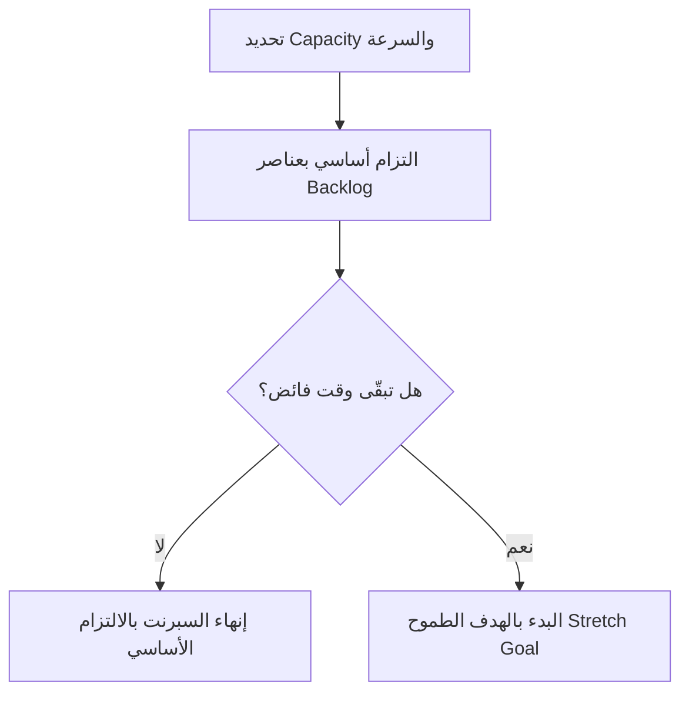

# هدف طموح (Stretch Goal)
> [!info] تعريف مختصر
> الهدف الطموح (Stretch Goal) هو عنصر عمل إضافي غير مؤكَّد الالتزام به، يضيفه الفريق إلى [[14 - Sprint]] كهدف "لو سمح الوقت"، بعد أن يكون قد التزم فعلياً بالعناصر الأساسية. لا يُعتبر إخفاقاً عدم إنجازه.

## الشرح العلمي والاحترافي
- في [[08 - Sprint Planning]]، يلتزم الفريق أولاً بمجموعة أساسية من عناصر [[13 - Backlog]] بناءً على [[Capacity]] الموثوقة. الهدف الطموح يُضاف فوق هذا الالتزام كعمل احتياطي يُنجز فقط إذا تقدّم الفريق أسرع من المتوقع.
- الفرق الجوهري بينه وبين [[Sprint Goal]]: هدف السبرنت هو الغرض الأساسي المُلتزَم به، بينما الهدف الطموح عمل إضافي اختياري لا يُبنى عليه أي التزام خارجي (لا يُعلن لأصحاب المصلحة كضمان).
- فائدته: يمنح الفريق مساحة لاستثمار أي وقت فائض دون المخاطرة بالسمعة أو الثقة، ويحفّز الأداء دون ضغط، لأن عدم إنجازه لا يُحسب فشلاً.
- يجب أن يكون الهدف الطموح منفصلاً تماماً عن نطاق الالتزام الأساسي؛ خلطه بالعناصر الملتزم بها يُفقد الفريق المصداقية عند التخطيط المستقبلي إذا فُهم على أنه وعد.

## أين ومتى يُستخدم
- يُستخدم في [[02 - Scrum]] أثناء [[08 - Sprint Planning]]، بعد أن يكتمل الالتزام الأساسي بناءً على [[Capacity]] وسرعة الفريق ([[18 - Velocity]]).
- يُلجأ إليه في فرق ناضجة تعرف سرعتها التاريخية بدقة، بحيث يمكنها تمييز "العمل المؤكد" عن "العمل الإضافي المحتمل" دون خداع نفسها.
- غير مناسب للفرق حديثة العهد بقياس سرعتها، لأن الخلط بين الالتزام والطموح قد يربك التخطيط.

## مثال وسيناريو تطبيقي
> [!example] سيناريو
> فريق تطوير موقع تجارة إلكترونية سرعته المعتادة ([[18 - Velocity]]) هي 30 نقطة قصة لكل سبرنت مدته أسبوعان. في التخطيط، يلتزم الفريق بـ 28 نقطة تغطي عناصر ضرورية (تحسين بوابة الدفع وإصلاح ثلاثة أخطاء حرجة).
> يضيف الفريق قصة "دعم الدفع بمحفظة Apple Pay" (5 نقاط) كهدف طموح، موضحاً لمالك المنتج أنها لن تُنجز إلا إذا سار العمل الأساسي بسلاسة.
> بحلول منتصف السبرنت، ينتهي الفريق من العمل الملتزم به مبكراً بسبب عدم وجود عوائق، فيبدأ بالفعل بقصة Apple Pay. في [[09 - Sprint Review]] يُعرض العمل الأساسي كمُنجز كاملاً، وتُعرض قصة Apple Pay كإنجاز إضافي دون أي انطباع بالفشل لو لم تكتمل.

## خطوات أو مخطّط
1. تحديد الالتزام الأساسي بناءً على [[Capacity]] الموثوقة وسرعة الفريق التاريخية.
2. اختيار عنصر أو عنصرين إضافيين من [[13 - Backlog]] كأهداف طموحة، بعد اكتمال الالتزام الأساسي فقط.
3. توضيح صراحة لأصحاب المصلحة أن هذه العناصر غير مضمونة.
4. العمل على الالتزام الأساسي أولاً دائماً.
5. الانتقال إلى الهدف الطموح فقط عند وجود وقت فائض حقيقي.
6. عرض النتيجة في [[09 - Sprint Review]] مع تمييز واضح بين المُلتزَم والطموح.

## ⚠️ مفاهيم خاطئة شائعة
> [!warning]
> - الاعتقاد بأن الهدف الطموح جزء من الالتزام الرسمي؛ في الحقيقة هو عمل إضافي غير مضمون تماماً.
> - استخدامه كوسيلة ضغط خفية على الفريق للعمل بشكل أسرع "لتحقيق الطموح"، مما يحوّله فعلياً إلى التزام مقنّع.
> - افتراض أن عدم إنجازه يعني فشل السبرنت؛ عدم إنجازه هو النتيجة الطبيعية المتوقعة في كثير من الحالات.

## ❌ ممارسات خاطئة في المشاريع
> [!failure]
> - إعلان الهدف الطموح لأصحاب المصلحة كأنه مضمون التسليم، مما يخلق توقعات كاذبة. التجنب: التوضيح الصريح أنه اختياري منذ البداية.
> - إضافة أهداف طموحة قبل التأكد من واقعية الالتزام الأساسي، فيتشتت تركيز الفريق. التجنب: تثبيت الالتزام الأساسي أولاً بناءً على بيانات السرعة الفعلية.
> - استخدامه كأداة لتبرير العمل الإضافي غير مدفوع الأجر أو تحت ضغط زمني. التجنب: ربطه فقط بوقت فائض حقيقي دون أي ضغط على الفريق.

## 🔗 مصطلحات ومفاهيم ذات صلة
[[Sprint Goal]] | [[08 - Sprint Planning]] | [[18 - Velocity]] | [[Capacity]] | [[13 - Backlog]] | [[02 - Scrum]] | [[09 - Sprint Review]] | [[Reserve Capacity]] | [[Sustainable Pace]]
