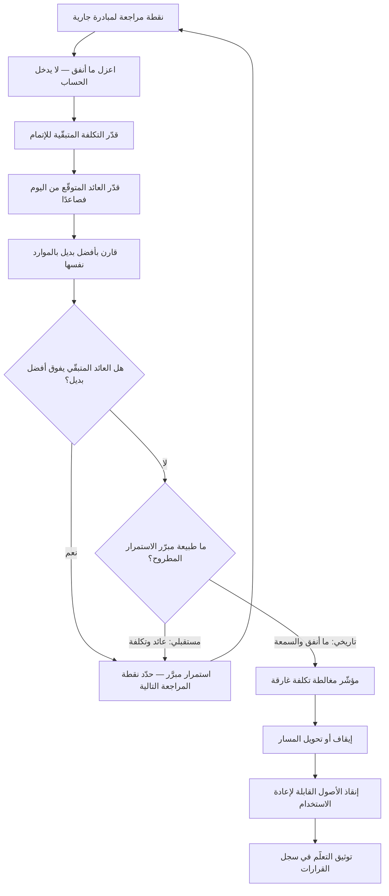

# مغالطة التكلفة الغارقة (Sunk Cost Fallacy)

> [!info] تعريف مختصر
> انحياز في اتّخاذ القرار يدفع الفرد أو المنظّمة إلى مواصلة الاستثمار في مسار **بسبب ما أُنفق عليه سابقًا** لا بسبب العائد المتوقّع منه مستقبلًا. التكلفة الغارقة هي كل ما دُفع ولا يمكن استرداده مهما كان القرار القادم — مال، أشهر عمل، سمعة، طاقة سياسية. ولأنها غير قابلة للاسترداد في الحالتين (الاستمرار أو الإيقاف)، فهي **معلومة غير ذات صلة منطقيًّا** بأي قرار مستقبلي. إدخالها في الحساب هو المغالطة، وثمنها أن تُنفق موارد جديدة لحماية موارد قديمة ذهبت أصلًا.

## الشرح العلمي والاحترافي
- **القاعدة الاقتصادية المخالَفة**: المنطق الاقتصادي يقول إن القرار الرشيد يُبنى على **التكاليف والعوائد الحدّية القادمة** (Marginal / Forward-looking) فقط. السؤال الصحيح دائمًا: «بالنظر إلى وضعنا اليوم، هل استثمار الوحدة التالية من الموارد في هذا المسار أفضل من استثمارها في أفضل بديل؟» — وهو سؤال [[Opportunity Cost]] بعينه. أما «كم أنفقنا؟» فسؤال محاسبي تاريخي لا قيمة قرارية له.
- **الأساس السلوكي: النفور من الخسارة**: يُفسَّر هذا الانحياز في أدبيات الاقتصاد السلوكي بأن الناس يشعرون بألم الخسارة أشدّ من متعة مكسب مكافئ، فيصير الاعتراف بأن ما أُنفق ضاع خسارةً محقّقة مؤلمة، بينما الاستمرار يُبقي احتمالًا وهميًّا بأن «الأمر قد يُنقَذ». الاستمرار هنا ليس رهانًا على النجاح بقدر ما هو **تأجيل للألم**.
- **تمييزه عن «التصعيد في الالتزام» (Escalation of Commitment)**: المغالطة انحياز فردي في الحساب؛ أما التصعيد فظاهرة تنظيمية أوسع تشمل أسبابًا اجتماعية وسياسية: من أقرّ المشروع لا يريد أن يظهر مخطئًا، والفريق يخشى تفكيكه، والراعي ربط سمعته بالإطلاق. عمليًّا في المنظّمات، الجزء التنظيمي أقوى بكثير من الجزء الحسابي — ولهذا لا تُعالَج المشكلة بشرح المنطق للأفراد، بل بتغيير آليات المراجعة والحوافز.
- **مضاعفاته الخفيّة**: أخطر ما في المغالطة أنها **تُخفي تكلفة الفرصة مرّتين**: مرة بإبقاء الموارد في مسار ضعيف، ومرّة بإفساد بيانات القرار نفسها، إذ يبدأ الفريق في تقديم تقارير متفائلة لتبرير الاستمرار، فتضعف جودة كل قرار لاحق. وحين يصل المشروع أخيرًا إلى الإيقاف تكون الخسارة أضعاف ما كانت عليه لحظة ظهور الإشارات الأولى.
- **التمييز الحاسم بين خسارة مالية وخسارة تعلّم**: ما أُنفق ليس بلا فائدة على الإطلاق؛ فالتجربة الفاشلة تنتج معرفة قابلة للاستخدام (فرضية سقطت، سوق لا يستجيب، قيد تقني مكتشَف). لكن هذه المعرفة **تُحصَّل بالإيقاف والتوثيق، لا بالاستمرار**. الخلط بين «الاستفادة ممّا تعلّمناه» و«الاستمرار حتى لا يضيع ما أنفقناه» هو المنزلق الأشيع.
- **متى لا يكون الاستمرار مغالطة**: ليس كل استمرار خطأً. الاستمرار مبرَّر إذا كان العائد المتبقّي مقارنةً بالتكلفة المتبقّية **يفوق أفضل بديل** — كأن يكون 80% من العمل مُنجَزًا فعلًا وتبقّت أسابيع قليلة، أو أن للإيقاف تكلفة تعاقدية تفوق كلفة الإتمام. المعيار الفاصل بسيط: هل المبرّر مصوغ بلغة المستقبل («سيعود علينا كذا مقابل كذا») أم بلغة الماضي («أنفقنا كذا»)؟ اللغة نفسها هي أداة التشخيص.
- **تُصيب الوحدات الصغيرة كما الكبيرة**: تظهر المغالطة في الاستمرار بمشروع ضخم، وفي التمسّك بمكتبة برمجية جرى تعلّمها بمشقّة، وفي رفض حذف ميزة استُثمر فيها شهران ولا يستخدمها أحد، وفي الإصرار على مواصلة تنقيح مستند تفصيلي فقد جدواه. حتى الشيفرة المكتوبة تُعامَل أحيانًا كأصل يجب حمايته، بينما هي التزام صيانة مستمر — وهو منطق [[Technical Debt]].
- **الترياق البنيوي هو نقاط القرار المُسبقة**: أفضل علاج معروف عمليًّا ليس زيادة الوعي، بل **تحديد شروط الإيقاف قبل البدء** — حدود زمنية ثابتة، معايير نجاح مكتوبة، ونقطة مراجعة إلزامية. هذا بالضبط ما يفعله [[Circuit Breaker]] في [[Shape Up]]، وما تفعله [[Timeboxing]] و[[Go or No-Go Decision]]: تحويل قرار الإيقاف من حدث مؤلم يبادر به شخص، إلى إجراء مجدول لا يحتاج بطلًا.

## أين ومتى يُستخدم
- **في مراجعات [[Steering Committee]] وبوابات [[Go or No-Go Decision]]**: بوصفه المعيار الذي يُفحص به مبرّر الاستمرار: هل هو مستقبلي أم تاريخي؟
- **في [[Prioritization]] الدوري للـ Backlog**: بتطبيق سؤال «هل نبدأ هذا البند اليوم من الصفر؟» على البنود الجارية لا الجديدة فقط.
- **في إدارة تجارب المنتج و[[Hypothesis]] و[[Cost of Experimentation]]**: حيث يجب أن تكون التجربة قابلة للسقوط، وأن يكون إسقاطها نجاحًا لا فشلًا.
- **في قرارات [[Vendor Lock-in]] وتجديد العقود**: حيث يُبرَّر البقاء مع مزوّد ضعيف بحجم ما استُثمر في التكامل معه.
- **في معالجة [[Technical Debt]] وقرار إعادة الكتابة مقابل الترميم**: كلا الطرفين قد يقع في المغالطة — من يتمسّك بالنظام القديم لأنه كلّف كثيرًا، ومن يواصل إعادة كتابة متعثّرة لأنه قطع نصف الطريق.
- **في [[Feature Freeze]] وحذف الميزات غير المستخدَمة**: إزالة ميزة استُثمر فيها قرار يواجه مقاومة نفسية شديدة رغم وضوح بيانات [[Product Analytics]].

## مثال وسيناريو تطبيقي
> [!example] جهة خدمية في الخليج بدأت في يناير مشروع بناء نظام موارد بشرية داخلي بدل شراء حل جاهز، بميزانية 2.4 مليون ريال ومدّة 9 أشهر، وفريق من 7 أشخاص.
> **الشهر الرابع**: أُنفق نحو 1.1 مليون، والمنجز الفعلي وحدتان من ثمان. ظهرت مشكلة تكامل مع نظام الرواتب القائم تحتاج وحدها إلى 3 أشهر إضافية غير مخطّطة. في الوقت نفسه قدّم مزوّد عرضًا لحل جاهز بكلفة 480 ألف ريال سنويًّا وتشغيل خلال 8 أسابيع، يغطّي 85% من المتطلّبات.
> **النقاش في اللجنة** دار كله حول الجملة: «أنفقنا 1.1 مليون، والانسحاب الآن يعني ضياعها كاملة». وهذا هو موضع المغالطة تمامًا: المبلغ ضائع في الحالتين — لا يعود إن استُكمل المشروع ولا يعود إن أُوقف.
> **التحليل المستقبلي الصحيح** الذي أعادته اللجنة لاحقًا: تكلفة **إتمام** المشروع من اليوم ≈ 1.9 مليون إضافية و10 أشهر (بعد التأخير المكتشَف)، مقابل تكلفة **التحوّل** ≈ 480 ألفًا سنويًّا و8 أسابيع، مع بقاء وحدتين مبنيّتين يمكن استخدام إحداهما كملحق. المقارنة الصحيحة إذًا: 1.9 مليون + 10 أشهر تعطيل، مقابل 480 ألفًا + شهرين. أما الـ 1.1 مليون فلا تدخل الطرفين إطلاقًا.
> **القرار**: أُوقف البناء الداخلي، واحتُفظ بوحدة واحدة، وكُتب تقرير تعلّم من ثلاث صفحات عن سبب سوء التقدير الأصلي (لم تُفحص تكلفة التكامل مع الرواتب قبل الالتزام).
> **الأثر التنظيمي الأهم**: أُضيف إلى حوكمة المشاريع بند «بوابة الشهر الثالث»: مراجعة إلزامية يُسأل فيها سؤال واحد — «لو كنّا نقرّر اليوم من الصفر، بهذه المعطيات، هل نبدأ هذا المشروع؟». وجُعل إيقاف مشروع في هذه البوابة **مخرَجًا مقبولًا يُسجَّل كقرار جيّد**، لا كفشل يُحاسَب عليه مديره — وهذا التغيير في الحوافز كان أثره أكبر من أي شرح للمغالطة.

## خطوات أو مخطّط
1. عند كل نقطة مراجعة، اكتب سؤال القرار بصيغة مستقبلية فقط: ما التكلفة المتبقّية؟ وما العائد المتوقّع من اليوم؟
2. احذف من ورقة القرار كل رقم يمثّل ما أُنفق — ضعه في قسم منفصل للتعلّم لا لاتّخاذ القرار.
3. قارن العائد المتبقّي بأفضل بديل متاح بالموارد نفسها، لا بالصفر.
4. طبّق اختبار الغريب: لو تسلّم المشروعَ اليوم مديرٌ جديد لا يعرف تاريخه، ماذا كان سيقرّر؟
5. افحص المبرّرات لغويًّا: كل مبرّر يبدأ بـ«بعد كل ما بذلناه» أو «حتى لا يضيع» هو إشارة إنذار.
6. حدّد سلفًا لكل مبادرة **شروط الإيقاف** ونقاط المراجعة، قبل صرف أول ريال.
7. افصل من يقرّر الاستمرار عمّن أقرّ البدء أصلًا كلّما أمكن، لتقليل ضغط الدفاع عن الذات.
8. عند الإيقاف، وثّق التعلّم علنًا وأنقذ ما يمكن إعادة استخدامه، واحتفِ بالقرار حتى لا يتعلّم الآخرون أن الإيقاف عقوبة.

## ⚠️ مفاهيم خاطئة شائعة
> [!warning]
> - **الظنّ أن المغالطة تعني «أوقف كل مشروع متأخّر»**: المغالطة تتعلّق بـ**سبب** الاستمرار لا بالاستمرار نفسه. التصحيح: الاستمرار صحيح إذا كان العائد المتبقّي يفوق أفضل بديل؛ فقط تأكّد أن هذا هو المبرّر المعلن فعلًا.
> - **الخلط بينها وبين تكلفة الفرصة**: التكلفة الغارقة تنظر إلى الخلف، وتكلفة الفرصة تنظر إلى الأمام. التصحيح: احذف الأولى من الحساب واستبدلها بالثانية؛ هما ليستا وجهين لعملة بل نقيضان في اتّجاه النظر.
> - **اعتبار ما أُنفق ضائعًا بالكامل دائمًا**: قد تكون هناك أصول قابلة لإعادة الاستخدام (مكوّن، بيانات، فهم للسوق، علاقة عميل). التصحيح: قيّم قيمتها **الحالية** لا كلفتها التاريخية، فقيمة الأصل ما يمكن أن يعطيه لا ما دُفع فيه.
> - **الظنّ أن الوعي بالانحياز كافٍ لتفاديه**: التجربة العملية تُظهر أن معرفة المغالطة لا تحصّن منها، خصوصًا حين تتداخل السمعة والحوافز. التصحيح: عالجها ببنية (بوابات، شروط إيقاف مسبقة، فصل الأدوار) لا بالوعي وحده.
> - **حصرها في المال**: أشدّ الغارقات أثرًا في المنظّمات هي **رأس المال السياسي والسمعة**، ولذلك يقاوم كبار المسؤولين الإيقاف أكثر من الفرق التنفيذية. التصحيح: صمّم مخرجًا يحفظ ماء الوجه — مثل «تحوّل استراتيجي» موثّق بمعطيات جديدة.
> - **افتراض أنها انحياز فردي فقط**: القرار الجماعي يضاعفها عبر المسايرة الاجتماعية وتوزيع المسؤولية. التصحيح: اطلب رأيًا مكتوبًا منفردًا قبل النقاش الجماعي، وكلّف شخصًا بدور «معارض رسمي» في كل مراجعة كبرى.

## ❌ ممارسات خاطئة في المشاريع
> [!failure]
> - **الخطأ: عرض «إجمالي المصروف حتى تاريخه» في صدر تقرير قرار الاستمرار.** لماذا يضرّ: يُثبّت الرقم في أذهان الحاضرين ويصير مرساةً يدور حولها النقاش كله. الحل: افصل تمامًا بين لوحة التعلّم التاريخي وورقة القرار، ولا تُدرج المصروف السابق ضمن معايير القرار.
> - **الخطأ: تكليف مالك المشروع نفسه بتقديم توصية الاستمرار أو الإيقاف.** لماذا يضرّ: تضارب مصالح مباشر — القرار يمسّ موقعه وسمعته وفريقه. الحل: أشرك مراجعًا مستقلًّا، أو اطلب من طرف ثالث كتابة الحجّة المضادّة قبل الاجتماع.
> - **الخطأ: عدم تعريف شروط الفشل قبل البدء.** لماذا يضرّ: بلا معيار مسبق يصبح كل نتيجة قابلة للتأويل إيجابيًّا، ويستحيل إثبات أن المشروع يجب أن يتوقّف. الحل: اكتب في وثيقة الانطلاق معايير النجاح **ومعايير الإيقاف** كليهما، مع مواعيد مراجعة ثابتة.
> - **الخطأ: معاقبة من يوقف مشروعًا أو يعلن تعثّره مبكّرًا.** لماذا يضرّ: يتعلّم الجميع أن الإخفاء أأمن من المصارحة، فتتضخّم الخسائر حتى تنفجر. الحل: اربط التقدير بجودة القرار لا بنتيجته، واحتفِ علنًا بحالات الإيقاف المبكّر الجيّدة، ضمن [[Psychological Safety]].
> - **الخطأ: تمديد المشروع بدل تقليص نطاقه عند التعثّر.** لماذا يضرّ: التمديد يزيد المبلغ الغارق ويشدّ الالتزام أكثر، فيصير الإيقاف لاحقًا أصعب. الحل: عند التعثّر اقتطع النطاق إلى أصغر مخرَج ذي قيمة قابل للتسليم في الوقت المتبقّي، بمنطق [[Circuit Breaker]].
> - **الخطأ: الاحتفاظ بميزات غير مستخدَمة لأن تطويرها كلّف كثيرًا.** لماذا يضرّ: كل ميزة باقية تضيف عبء صيانة واختبار وتعقيدًا في الواجهة يُبطئ ما بعدها. الحل: راجع الاستخدام سنويًّا عبر [[Product Analytics]] واحذف ما دون عتبة محدّدة سلفًا.
> - **الخطأ: الاستمرار في مسار تقني متعثّر لأن الفريق تدرّب عليه بمشقّة.** لماذا يضرّ: كلفة التعلّم غارقة، بينما كلفة الاستمرار على أداة غير مناسبة تتكرّر كل سبرنت. الحل: قيّم الأداة بمعيار الإنتاجية المستقبلية وكلفة التحوّل، واحسب التدريب السابق صفرًا.

## 🔗 مصطلحات ومفاهيم ذات صلة
[[Opportunity Cost]] | [[Prioritization]] | [[Circuit Breaker]] | [[HiPPO]] | [[Initiative]] | [[Eisenhower Matrix]] | [[Go or No-Go Decision]] | [[Confirmation Bias]] | [[Timeboxing]] | [[Technical Debt]] | [[Decision Log]] | [[Psychological Safety]] | [[Cost of Experimentation]]

> [!tip] 💡 إثراء عملي — كورس لعبة العقل
> الفرق بين **تأطير تكلفة الاستبدال القادمة** (حجّة صحيحة) و**استدعاء الإنفاق الماضي** (استغلال مغالطة): [[Loss Framing]] و[[09 - التفاوض على القيمة - التثبيت والخسارة والمقايضة]].
