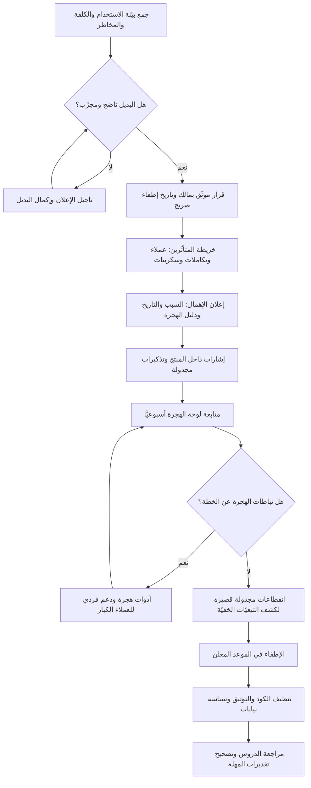

# الإيقاف التدريجي وإعلان عدم الدعم (Sunset and Deprecation)

> [!info] تعريف مختصر
> مرحلتان متتابعتان لإنهاء حياة ميزة أو واجهة برمجية أو نسخة أو منتج كامل. **الإعلان عن عدم الدعم (Deprecation)** إجراء **تواصلي**: تظلّ الوظيفة تعمل كما هي، لكن يُعلن رسميًّا أنها لم تعد الطريق الموصى به، وأنها لن تتلقّى تطويرًا، وأن لها تاريخ إطفاء. **الإطفاء (Sunset / End of Life)** هو الإجراء **التقني** الذي يزيلها فعليًّا فتتوقّف عن العمل. الفاصل بينهما هو **مهلة الهجرة**، وهي جوهر الممارسة كلها: بلا مهلة معلنة يتحوّل الإيقاف إلى عطل مفاجئ عند المستخدمين، وبلا تاريخ إطفاء ملزم تتحوّل المهلة إلى انتظار أبدي يبقي النظام يحمل نسختين إلى ما لا نهاية.

## الشرح العلمي والاحترافي
- **الحذف مشروع لا مهمّة**: تعامل كثير من الفرق مع الإزالة كأنها بند صغير في الـ Backlog، بينما هي في الحقيقة مشروع كامل له أصحاب مصلحة، وخطة تواصل، ومسار هجرة، ومخاطر، ومعايير قبول، و[[Go or No-Go Decision]] خاصّ به. تكلفة الحذف الحقيقية ليست في السطور المحذوفة بل في نقل الناس من المسار القديم إلى الجديد.
- **معايير قرار الإيقاف — متى تستحقّ الميزة الموت؟**: القرار يُتّخذ ببيّنة لا بذوق، وأشيع المعايير المستخدمة: **(١) الاستخدام** (عدد المستخدمين النشطين الحقيقيين للميزة ونصيبها من الإيرادات، لا عدد من فعّلوها مرة)، **(٢) كلفة الإبقاء** (ساعات الصيانة، الاختبار، البنية التحتية، وكلفة الفرصة البديلة — راجع [[TCO]] و[[Cost of Delay]])، **(٣) المخاطرة** (اعتماد على مكوّن غير مدعوم، أو ثغرة، أو عدم امتثال تنظيمي)، **(٤) وجود بديل أفضل ناضج فعلًا** لا وعدًا، **(٥) الاتّساق الاستراتيجي** مع اتّجاه المنتج، **(٦) الالتزامات التعاقدية** التي قد تجعل الإيقاف مستحيلًا قبل تاريخ معيّن. والقاعدة الحاسمة: **لا يُعلَن إيقاف قبل أن يكون البديل جاهزًا ومجرَّبًا**؛ إعلان الإيقاف مع بديل ناقص هو أسرع طريق لتدمير الثقة.
- **المهلة (Deprecation Period / Sunset Window) وكيف تُحسَب**: ليست رقمًا اعتباطيًّا، بل تُشتقّ من ثلاثة عوامل: كلفة الهجرة على أثقل عميل متأثّر، ودورة التخطيط لدى العملاء المؤسسيين (الميزانيات والدورات السنوية)، والالتزامات التعاقدية القائمة. المهل الشائعة في الممارسة تتراوح من أسابيع لواجهة داخلية قليلة الاستخدام، إلى ستّة أشهر أو اثني عشر شهرًا فأكثر لواجهة برمجية عامّة أو نسخة مؤسسية. القاعدة العملية: **المهلة يجب أن تسع دورتي تخطيط كاملتين لدى المتأثّر الأبطأ**.
- **التواصل ليس رسالة واحدة بل حملة متعدّدة القنوات ومتكرّرة**: العناصر الفعّالة المتّفق عليها في الممارسة: إعلان مبكّر يحمل **تاريخًا صريحًا** لا «قريبًا»، وذكر **السبب** لأن الناس تقاوم ما لا تفهمه، ودليل هجرة عملي بأمثلة قبل/بعد، وتحديد من يتأثّر بالضبط ومن لا يتأثّر، وقناة دعم مخصّصة، وتذكيرات مجدولة (مثلًا عند 90 و30 و7 أيام من الموعد)، وإشارات داخل المنتج نفسه (تنبيه في الواجهة، ترويسة استجابة تحمل تحذير الإهمال، تحذير في سجلّات النظام). المبدأ: **المستخدم الذي لا يقرأ البريد يجب أن يصطدم بالتحذير في مساره اليومي**. وكل ذلك يُدار عبر [[Communication Plan]] مكتوبة، ويُوثَّق القرار وأسبابه في [[Decision Log]].
- **الهجرة تُقاس ولا تُفترَض**: الممارسة الناضجة تبني **لوحة هجرة** تُظهر: عدد الحسابات المتبقّية على القديم، وحجم حركتها، وترتيبها بالأهمية، وميلها الزمني. ثم تتصرّف بالتفصيل: العملاء الكبار يُتواصَل معهم فرديًّا، والصغار يُدفعون بالتنبيهات والأدوات الآلية. وحيثما أمكن، تُوفَّر **أداة هجرة** أو مسار توافق مؤقّت يقلّل العمل اليدوي — لأن كل ساعة عمل تفرضها على العميل هي سبب إضافي للتأخير.
- **الإطفاء التدريجي بدل قاطع التيار**: الممارسة الأنضج لا تطفئ دفعة واحدة، بل تستخدم **انقطاعات مجدولة قصيرة (Brownouts)**: تُعطَّل الوظيفة القديمة لساعة أو ساعتين في مواعيد معلنة قبل الموعد النهائي بأسابيع. الغرض ليس العقاب بل **الاكتشاف**: من نام عن التحذيرات يكتشف تبعيّته وهو في وضع قابل للتعافي، لا يوم الإطفاء النهائي. وهذا في جوهره تطبيق لمنطق [[Progressive Delivery]] معكوسًا: تدرّج في السحب لا في الإتاحة، ويُنفَّذ عمليًّا عبر [[Feature Flags]].
- **ما يُكسَر إن أُهملت العملية**: **(أ) عند إهمال الإعلان** — يُطفَأ فجأة فتنكسر تكاملات العملاء وتُفقَد الثقة، وقد تنشأ تبعات تعاقدية إن خالف الإيقاف بنود [[SLA]]. **(ب) عند إهمال الإطفاء بعد الإعلان** — يفقد الإعلان مصداقيته («يعلنون ولا ينفّذون») فيتجاهله الجميع في المرة القادمة، ويظلّ النظام يحمل مسارين فيتضخّم [[Technical Debt]] وتتضاعف مصفوفة [[Regression Testing]]. **(ج) عند إهمال البيانات** — تبقى بيانات يتيمة بلا مالك ولا سياسة احتفاظ، وهو خطر امتثال مباشر في أنظمة حماية البيانات مثل [[PDPL]] و[[GDPR]] التي تفرض حدودًا على الاحتفاظ. **(د) عند إهمال التوثيق** — تظلّ صفحات ووصفات قديمة تظهر في نتائج البحث فيبني عليها مطوّرون جدد شيئًا محكومًا بالموت. **(هـ) عند إهمال الاعتمادات الخفيّة** — سكربتات ليلية أو تقارير أو أنظمة شريكة تعتمد على الوظيفة الملغاة، فتنكسر في صمت ولا يُكتشَف الأثر إلا بعد أسابيع في تقرير مالي خاطئ.
- **الفرق بين الإيقاف والإخفاء والتجميد**: الإخفاء يمنع مستخدمين جددًا مع بقاء الحاليين، والتجميد يوقف التطوير مع بقاء الدعم، والإيقاف يعلن نهاية محدّدة. الخلط بينها في التواصل يترك العملاء لا يعرفون هل يهاجرون الآن أم لاحقًا أم لا حاجة أصلًا.

## أين ومتى يُستخدم
- **في إدارة الواجهات البرمجية العامّة**: كل تغيير كاسر للتوافق يمرّ بدورة إعلان ومهلة وإطفاء، وإلا انكسرت تكاملات شركاء لا يملك المزوّد رؤية كاملة عليهم.
- **عند تقاعد نسخة أو نظام قديم بعد ترحيل ناجح**: نهاية طبيعية لمشروع الاستبدال، وتتقاطع مع [[Closure vs Handover]] لأن الإطفاء أحد شروط الإغلاق الحقيقي.
- **في تقليم المنتج بعد قياس التبنّي**: حين تُظهر [[Product Analytics]] أن ميزة لا تُستخدم فعليًّا، يصبح الإيقاف علاجًا مباشرًا لـ[[Feature Creep]] وتحرير قدرة للفريق.
- **عند سحب ميزة فشلت في مرحلة التجريب**: قرار مشروع ومتوقّع بعد [[Pilot Launch]] أو بيتا لم تبلغ معايير القيمة — بشرط أن يُسحَب بنفس انضباط الإطلاق.
- **في تلبية متطلّبات الامتثال وحماية البيانات**: إيقاف تخزين حقول لم تعد مبرّرة يقلّل مساحة المخاطر ويخدم متطلّبات [[GDPR]] و[[PDPL]].
- **عند إنهاء علاقة مع مزوّد خارجي**: الخروج من خدمة طرف ثالث عملية إيقاف كاملة، وهي الاختبار العملي لمدى وجود [[Vendor Lock-in]] وجزء أصيل من [[Vendor Management]].
- **في التنظيف الذي يلي التسليم المتدرّج**: إزالة النسخة القديمة والمفاتيح بعد اكتمال طرح النسخة الجديدة هي عملية إيقاف مصغّرة يجب أن تُجدوَل لا أن تُترك للنيّة الحسنة.

## مثال وسيناريو تطبيقي
> [!example] شركة سعودية تقدّم منصّة لوجستية عبر واجهة برمجية يستخدمها 340 عميلًا مؤسسيًّا. النسخة `v1` من واجهة التتبّع مبنيّة على تصميم قديم يكلّف الفريق نحو 3 أيام عمل شهريًّا في الصيانة والدعم، وقد صدرت `v2` قبل عام وأصبحت مستقرّة تخدم 62% من الحركة.
> **قرار الإيقاف بالمعايير**: الاستخدام المتبقّي 38% من الحركة لكن من 210 عملاء فقط، وأربعة منهم يمثّلون 71% من حركة `v1`. كلفة الإبقاء 36 يوم عمل سنويًّا. المخاطرة: `v1` تعتمد على مكتبة انتهى دعمها الأمني. البديل ناضج ومجرَّب. صدر القرار ووُثّق في [[Decision Log]] مع تحديد المالك.
> **الإعلان (اليوم 0)**: إعلان رسمي بتاريخ إطفاء بعد **9 أشهر** (سعةً لدورتي تخطيط لدى العملاء المؤسسيين)، مع: دليل هجرة يحوي جدول تقابل بين حقول `v1` و`v2`، وأمثلة قبل/بعد، وقناة دعم مخصّصة، وترويسة `Deprecation` في كل استجابة من `v1`، وتحذير في لوحة تحكّم العميل.
> **التواصل المتدرّج**: تذكيرات عند 180 و90 و30 و7 أيام. تواصل فردي مباشر مع العملاء الأربعة الكبار وتخصيص مهندس مرافق لكلٍّ منهم.
> **الشهر الرابع — الواقع**: هاجر 40% فقط من العملاء. تبيّن من المقابلات أن العائق ليس التقنية بل أن الهجرة تتطلّب اعتماد ميزانية لدى العميل. فبُنيت **أداة هجرة تلقائية** تحوّل الإعدادات، فارتفعت النسبة إلى 78% خلال ستة أسابيع.
> **الشهر السابع — الانقطاعات المجدولة**: أُعلن عن إطفاء `v1` لمدّة ساعتين في ثلاثة مواعيد محدّدة (خارج أوقات الذروة). النتيجة الكاشفة: في الانقطاع الأول تلقّى الدعم بلاغين من عميلين **لم يكونا في قائمة المتأثّرين إطلاقًا** — كانا يستدعيان الواجهة عبر سكربت ليلي مسجَّل باسم حساب موظف سابق. لولا الانقطاع التجريبي لانكشف هذا يوم الإطفاء النهائي بصفته حادثة.
> **الشهر التاسع — الإطفاء**: بقي 6 عملاء صغار فقط بحركة أقل من 0.3%. أُطفئت `v1` في الموعد المعلن دون تمديد. النتيجة بعد الإطفاء: 3 بلاغات في اليوم الأول، وتحرير 36 يوم عمل سنويًّا، وإغلاق ثغرة أمنية موروثة. والدرس الذي سجّله الفريق في [[Post-Launch Review]]: التمسّك بالتاريخ المعلن هو ما جعل الإعلان التالي يؤخذ على محمل الجدّ من الشهر الأول.

## خطوات أو مخطّط
1. اجمع البيّنة: من يستخدم الوظيفة فعلًا، بأي حجم، وبأي قيمة، وما كلفة إبقائها.
2. تحقّق من جاهزية البديل ونضجه ووجود مسار تكافؤ وظيفي كامل قبل أي إعلان.
3. راجع الالتزامات التعاقدية والتنظيمية التي قد تحدّ من حرّية الإيقاف أو تفرض مهلة دنيا.
4. اتّخذ القرار رسميًّا بمالك محدّد وتاريخ إطفاء صريح، ووثّقه في [[Decision Log]].
5. ارسم خريطة المتأثّرين — بمن فيهم التكاملات الداخلية والسكربتات والتقارير، لا العملاء الظاهرون فقط.
6. أعلن الإهمال رسميًّا مع السبب والتاريخ ودليل الهجرة وقناة الدعم، عبر [[Communication Plan]] متعدّد القنوات.
7. أضف إشارات داخل المنتج: تنبيه في الواجهة، ترويسة إهمال في الاستجابات، تحذير في السجلّات.
8. تابع لوحة الهجرة أسبوعيًّا، وتصرّف بالتفصيل: تواصل فردي للكبار، وأدوات آلية للصغار.
9. نفّذ انقطاعات مجدولة قصيرة قبل الموعد لكشف الاعتمادات الخفيّة وهي قابلة للعلاج.
10. أطفئ في الموعد المعلن، مع خطة [[Rollback]] مؤقّتة لأول 24–48 ساعة تحسّبًا لأثر غير متوقّع.
11. نظّف بعد الإطفاء: احذف الكود والاختبارات والمفاتيح والتوثيق القديم، وطبّق سياسة الاحتفاظ أو الحذف على البيانات.
12. أغلق الدورة بمراجعة: هل صحّت تقديرات الهجرة؟ وما الذي يجب تغييره في الإيقاف القادم؟

## ⚠️ مفاهيم خاطئة شائعة
> [!warning]
> - **«الإعلان عن عدم الدعم يعني أن الوظيفة توقّفت»**: لا؛ هي تعمل بكامل طاقتها طوال المهلة. الإعلان يغيّر **الوعد المستقبلي** (لا تطوير، ولا ضمان بقاء بعد التاريخ) لا السلوك الحالي — والخلط يسبّب ذعرًا لدى العملاء أو، عكسًا، تجاهلًا لأن «كل شيء يعمل».
> - **«يكفي بريد إلكتروني واحد لإبلاغ المتأثّرين»**: البريد الوحيد يصل غالبًا إلى شخص غادر، أو إلى صندوق لا يُقرأ. الإبلاغ الفعّال يتطلّب التقاء المستخدم بالتحذير **في مساره اليومي**: الواجهة، والاستجابة البرمجية، والسجلّات.
> - **«التمديد لطف بالعملاء»**: التمديد المتكرّر بلا معيار يعلّم الجميع أن التواريخ غير جادّة، فيؤجّل الكلّ الهجرة إلى ما بعد التمديد القادم، وينتهي الأمر بأن يكون التمديد **ضدّ** من هاجروا في وقتهم. إن اقتضى الأمر تمديدًا فليكن مرّة واحدة، بمعيار معلن، وبتاريخ نهائي لا يتكرّر.
> - **«الميزة قليلة الاستخدام سهلة الإزالة»**: قلّة الاستخدام لا تعني قلّة الأهمية؛ فقد تكون الوظيفة النادرة هي الإغلاق الشهري لعميل يمثّل ربع الإيرادات، أو متطلّبًا تنظيميًّا يُستخدم مرّة في السنة. القياس يجب أن يشمل **الأثر** لا التكرار وحده.
> - **«الإيقاف عمل تقني بحت»**: هو في جوهره عمل تواصل وإدارة تغيير وعلاقات عملاء؛ الجزء التقني عادةً أصغر أجزائه وأقلّها استهلاكًا للوقت.
> - **«حذف الكود ينهي المسألة»**: تبقى البيانات، والتوثيق المنشور، وروابط محفوظة، وعقود تشير إلى الخدمة. الإغلاق الحقيقي يشمل هذه كلها، وإلا بقيت آثار تُنتج ارتباكًا وأسئلة دعم لسنوات.
> - **«الميزة الملغاة توفّر وقتًا فورًا»**: خلال المهلة تكون التكلفة **أعلى** لا أقلّ، لأنك تشغّل المسارين وتدير حملة تواصل وهجرة. الوفر يبدأ بعد الإطفاء والتنظيف الكامل، وهذا ما يجب أن تعكسه خطة الموارد.

## ❌ ممارسات خاطئة في المشاريع
> [!failure]
> - **الإعلان عن الإيقاف قبل نضج البديل** → يجد العملاء أنفسهم مطالَبين بالهجرة إلى شيء ناقص، فيقاومون ويتراكم الاستياء، وغالبًا يُضطرّ الفريق للتراجع فيفقد الإعلان مصداقيته → **الحل**: اجعل «تكافؤ وظيفي مثبت + عميل واحد هاجر بنجاح» شرطًا مسبقًا لأي إعلان.
> - **تحديد مهلة قصيرة تناسب جدول الفريق لا جداول العملاء** → لا يستطيع العميل المؤسسي إدراج الهجرة في ميزانيته ودورته، فيصل التاريخ ولم يهاجر أحد، فيُمدَّد اضطرارًا → **الحل**: اشتقّ المهلة من دورة تخطيط أثقل عميل متأثّر، لا من رغبة الفريق في التنظيف.
> - **الاكتفاء بقائمة العملاء الظاهرين وإهمال التكاملات الداخلية والسكربتات** → تنكسر تقارير وأتمتة داخلية بصمت، ويظهر الأثر متأخّرًا في أرقام خاطئة يصعب تتبّع سببها → **الحل**: اجمع خريطة التبعيّات من سجلّات الاستدعاء الفعلية لا من الوثائق، ونفّذ انقطاعات مجدولة لكشف ما لم تلتقطه السجلّات.
> - **إطفاء دفعة واحدة بلا انقطاعات تجريبية سابقة** → يتحوّل الموعد إلى حادثة جماعية تستهلك فريق الدعم كاملًا في يوم واحد وتضرب سمعة المنتج → **الحل**: جدول انقطاعين أو ثلاثة قصيرة ومعلنة قبل الموعد، وعالج ما يظهر فيها.
> - **غياب مالك واحد للعملية** → تتوزّع المسؤولية بين المنتج والهندسة والدعم فلا يتابع أحد لوحة الهجرة، ويصل الموعد والنسبة المتبقّية مجهولة → **الحل**: عيّن مالكًا مسمّى وفق منطق [[SPOC]]، واجعل نسبة الهجرة مؤشّرًا يُراجَع أسبوعيًّا.
> - **إهمال البيانات المرتبطة بعد الإطفاء** → تبقى سجلّات شخصية بلا مبرّر معالجة ولا سياسة احتفاظ، وهو خطر امتثال مباشر ومكلف → **الحل**: أدرج في خطة الإيقاف قرارًا صريحًا لكل مجموعة بيانات (ترحيل، أرشفة، إتلاف) مع تاريخ ومسؤول.
> - **ترك التوثيق القديم منشورًا** → يجده مطوّرون جدد عبر البحث فيبنون تكاملات على واجهة ميّتة، فتتولّد بلاغات وإحباط بعد شهور من الإطفاء → **الحل**: ضع وسمًا واضحًا للإهمال على كل صفحة، ووجّه إلى البديل، واحذف الوصفات القديمة بعد الإطفاء.
> - **قياس نجاح الإيقاف بعدد الأسطر المحذوفة** → يُحتفل بالتنظيف بينما تسرّب عملاء أو انكسرت علاقات، فتتكرّر الطريقة نفسها لأنها بدت ناجحة → **الحل**: قِس النجاح بثلاثيّة: نسبة الهجرة قبل الموعد، وعدد الحوادث في أسبوع الإطفاء، ونسبة الاحتفاظ بالعملاء المتأثّرين بعد ثلاثة أشهر.

## 🔗 مصطلحات ومفاهيم ذات صلة
[[Feature Flags]] | [[Progressive Delivery]] | [[Post-Launch Review]] | [[Rollback]] | [[Pilot Launch]] | [[Go or No-Go Decision]] | [[Feature Freeze]] | [[Technical Debt]] | [[Communication Plan]] | [[Decision Log]] | [[Closure vs Handover]] | [[Vendor Lock-in]] | [[Vendor Management]] | [[Feature Creep]] | [[Product Analytics]] | [[SLA]] | [[GDPR]] | [[PDPL]] | [[TCO]] | [[SPOC]]
