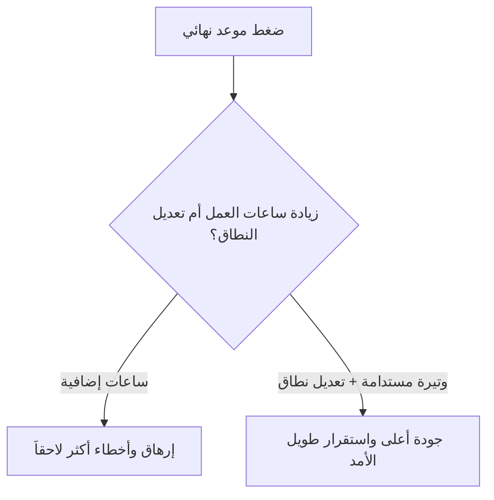

# الوتيرة المستدامة (Sustainable Pace)
> [!info] تعريف مختصر
> الوتيرة المستدامة (Sustainable Pace) هي مبدأ يقضي بأن يعمل الفريق بسرعة يمكنه الحفاظ عليها إلى أجل غير محدد، دون ساعات عمل إضافية مفرطة أو إرهاق، لأن ذلك يحافظ على الجودة والإنتاجية على المدى الطويل.

## الشرح العلمي والاحترافي
- المبدأ مذكور صراحةً في [[Agile Manifesto]]: "على الرعاة والمطورين والمستخدمين أن يكونوا قادرين على الحفاظ على وتيرة ثابتة إلى أجل غير محدد".
- فكرته الأساسية: الإنتاجية ليست دالة خطية لعدد ساعات العمل. العمل لساعات إضافية طويلة يرفع الإنتاج مؤقتاً لكنه يزيد الأخطاء، يُنهك الفريق، ويخفض الجودة والإبداع على المدى المتوسط والبعيد، مما يجعل المشروع أبطأ إجمالاً.
- ترتبط الوتيرة المستدامة مباشرة بمنع [[Micromanagement]] وضغط "التسليم بأي ثمن"، وتشجّع بدلاً من ذلك على تخطيط واقعي يعتمد على [[Capacity]] الحقيقية للفريق لا على أمنيات الإدارة.
- تطبيقها العملي يظهر في تجنّب الوعد بـ [[Stretch Goal]] كأنه التزام، وفي تحديد سعة السبرنت بناءً على [[18 - Velocity]] التاريخية الفعلية بدل الضغط لزيادتها بشكل مصطنع.
- من الناحية الإدارية، هي مسؤولية مشتركة بين [[06 - Scrum Master]] الذي يحمي الفريق من الضغط الخارجي، ومالك المنتج الذي يوازن بين الطموح والواقعية عند تحديد الأولويات.

## أين ومتى يُستخدم
- مبدأ أساسي في [[01 - Agile]] و[[02 - Scrum]]، يُراعى عند [[08 - Sprint Planning]] وتحديد [[Capacity]].
- يُستحضر خصوصاً عند اقتراب المواعيد النهائية، حيث يميل البعض لفرض ساعات عمل إضافية بدل إعادة تقييم النطاق ([[Scope Statement]]) أو الجدول الزمني بشكل واقعي.
- مهم أيضاً في [[10 - Sprint Retrospective]] عند مناقشة مؤشرات الإرهاق أو تكرار العمل الإضافي.

## مثال وسيناريو تطبيقي
> [!example] سيناريو
> فريق تطوير تطبيق مصرفي يقترب من موعد إطلاق تنظيمي صارم. يطلب المدير من الفريق العمل حتى منتصف الليل لمدة ثلاثة أسابيع متتالية لتسليم كل الميزات المخطط لها.
> في الأسبوع الثاني، يلاحظ [[06 - Scrum Master]] ارتفاعاً ملحوظاً في [[Escaped Defect Rate]] وزيادة في [[Reopen]] للمهام المُغلقة سابقاً، لأن الفريق منهك ويرتكب أخطاء لم يكن يرتكبها من قبل.
> بدل الاستمرار بنفس الوتيرة، يجتمع الفريق مع مالك المنتج لإعادة تقييم النطاق: تُؤجَّل ميزتان غير حرجتين لتنظيم صادر لاحق، ويعود الفريق لساعات عمل طبيعية. رغم تقليص النطاق، يسلَّم الإصدار في الموعد بجودة أعلى وأخطاء أقل من لو استمر العمل الإضافي.

## خطوات أو مخطّط
1. قياس [[Capacity]] و[[18 - Velocity]] الحقيقية للفريق بناءً على بيانات فعلية لا افتراضات.
2. تخطيط [[14 - Sprint]] بما يتناسب مع هذه السعة دون ضغط اصطناعي.
3. عند اقتراب موعد نهائي صعب، مناقشة خيارات تعديل النطاق أو الجدول أولاً بدل زيادة ساعات العمل.
4. مراقبة مؤشرات الإرهاق (زيادة الأخطاء، تراجع الروح المعنوية) في [[10 - Sprint Retrospective]].
5. حماية الفريق من الضغط الخارجي عبر [[06 - Scrum Master]] و[[Servant Leadership]].

## ⚠️ مفاهيم خاطئة شائعة
> [!warning]
> - الاعتقاد بأن العمل لساعات أطول يعني إنتاجاً أكبر بالتناسب؛ الأبحاث والممارسة تُظهر أن الإنتاجية تتراجع بعد فترة قصيرة من الإرهاق.
> - الظن أن الوتيرة المستدامة تعني "عمل بطيء أو غير جاد"؛ في الواقع هي وسيلة لتحقيق أعلى إنتاجية مستقرة على المدى الطويل.
> - اعتبارها ترفاً يمكن التضحية به وقت الأزمات فقط، بينما هي بالضبط الوقت الذي تكون فيه أكثر أهمية لتفادي انهيار الجودة.

## ❌ ممارسات خاطئة في المشاريع
> [!failure]
> - فرض ساعات عمل إضافية متكررة كحل دائم لضغط المواعيد بدل معالجة جذر المشكلة في التخطيط. التجنب: مراجعة النطاق والجدول قبل اللجوء للساعات الإضافية.
> - تطبيع "أسبوع حرج" متكرر كل سبرنت حتى يصبح هو الوضع الطبيعي. التجنب: معالجة السبب الجذري عبر [[Root Cause Analysis]] بدل تكرار الحل المؤقت.
> - تجاهل مؤشرات الإرهاق مثل ارتفاع [[Rework Percentage]] أو تراجع الجودة، والاستمرار بنفس الضغط. التجنب: متابعة هذه المؤشرات دورياً في [[10 - Sprint Retrospective]] والتصرف عند ظهورها.

## 🔗 مصطلحات ومفاهيم ذات صلة
[[01 - Agile]] | [[Agile Manifesto]] | [[Capacity]] | [[18 - Velocity]] | [[Servant Leadership]] | [[06 - Scrum Master]] | [[Stretch Goal]] | [[10 - Sprint Retrospective]] | [[100 Percent Utilization Fallacy]] | [[Psychological Safety]]
