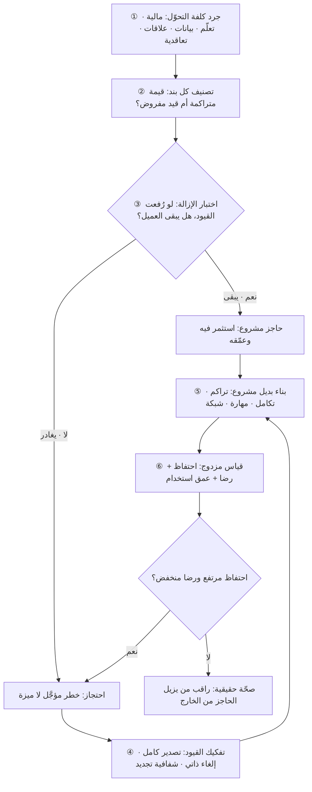

# كلفة التحوّل (Switching Cost)

> [!info] تعريف مختصر
> مجموع ما يتحمّله العميل — مالًا ووقتًا وجهدًا ومخاطرةً — إذا قرّر الانتقال من منتج أو مزوّد إلى بديل. وهي ليست بندًا في فاتورة بل **حصيلة مركّبة** من رسوم خروج، وإعادة تعلّم، وترحيل بيانات، وإعادة بناء تكاملات، وفقدان تاريخ وسمعة، وقطع علاقات، والتزامات تعاقدية، وقلق من الفشل. كلّما ارتفعت كلفة التحوّل ضعفت المنافسة الفعلية على العميل القائم، فارتفع الاحتفاظ وطالت [[Customer Lifetime Value]]. ولهذا تُبنى كلفة التحوّل عمدًا في تصميم كثير من المنتجات. لكنها **سلاح ذو حدّين**: إذا صارت الحاجز الوحيد الذي يُبقي العميل — بدل القيمة — فقد تحوّلت من ميزة تنافسية إلى سجن يخلق استياءً مكتومًا ينفجر دفعة واحدة عند أول بديل يزيلها، أو عند أول تدخّل تنظيمي يفرض قابلية النقل.

## الشرح العلمي والاحترافي
- **الأصل الاقتصادي للمفهوم**: تنتمي كلفة التحوّل إلى أدبيات الاقتصاد الصناعي التي درست لماذا لا تتصرّف الأسواق كما تفترض المنافسة الكاملة. فإذا كان الانتقال بين مورّدين مكلفًا، تنقسم دورة حياة العميل إلى مرحلتين مختلفتين اقتصاديًّا: مرحلة **ما قبل الالتزام** حيث المنافسة شرسة على السعر، ومرحلة **ما بعد الالتزام** حيث يصبح للمورّد قدرة على رفع السعر أو خفض جودة الخدمة ضمن حدود لا تتجاوز كلفة التحوّل. وهذا يفسّر ظواهر مألوفة: عروض دخول سخيّة، ثم تجديدات أغلى؛ ومنتجات مجّانية في البداية ثم مدفوعة حين يصعب الخروج.
- **الأنواع الخمسة الرئيسة**:
  1. **مالية**: رسوم إنهاء مبكر، فقدان مبالغ مدفوعة مسبقًا، كلفة شراء ترخيص جديد، كلفة مشروع الترحيل نفسه (استشاريون، ساعات فريق، تشغيل موازٍ لنظامين).
  2. **تعلّم**: الوقت الضائع حتى يستعيد الفريق كفاءته على الأداة الجديدة، وانخفاض الإنتاجية خلال الانتقال، وإعادة تدريب المستخدمين وكتابة الإجراءات ([[SOP]]) من جديد.
  3. **بيانات**: تراكم سنوات من السجلّات والإعدادات والتقارير والأتمتة داخل النظام الحالي. وتشتدّ هذه الكلفة كلما كانت البيانات مخزّنة بصيغ خاصّة، أو كان التصدير جزئيًّا (يخرج الجدول دون المرفقات، أو السجلّ دون تاريخ التغييرات)، أو كانت التكاملات المبنية حول النظام كثيرة.
  4. **علاقات وسمعة**: فقدان علاقة مع فريق حساب يعرف سياقك، أو ضياع رصيد تقييمات وسمعة بُني على منصّة، أو انقطاع عن شبكة زملاء أو عملاء موجودين على المنصّة نفسها — وهنا تتشابك كلفة التحوّل مع [[Network Effects]].
  5. **تعاقدية وتنظيمية**: مدد ارتباط طويلة، شروط تجديد تلقائي، بنود حصرية، وارتباطات امتثال (اعتمادات أمنية، تدقيق، متطلّبات فوترة أو حفظ سجلّات) يجب استيفاؤها من جديد مع أي مورّد بديل.
- **إضافة مهمّة: الكلفة النفسية والمخاطرة المتصوَّرة.** جزء كبير من كلفة التحوّل ليس ماديًّا بل إدراكيًّا: الخوف من انقطاع الخدمة، والمسؤولية الشخصية لمن يوصي بالتغيير إن فشل، والانحياز إلى الوضع الراهن. ولهذا كثير من قرارات البقاء ليست حسابًا بل تجنّبًا للمخاطرة — وهي أيضًا مادّة يعمل عليها المنافس الذكي حين يقدّم ترحيلًا مجّانيًّا وتشغيلًا موازيًا وضمان استرداد.
- **كيف تُبنى كلفة التحوّل مشروعةً؟** الفارق بين البناء المشروع والاحتجاز هو أن المشروعة **تنشأ من قيمة متراكمة يملكها العميل**، لا من قيود مصطنعة تمنعه:
  - **تراكم قيمة داخل المنتج**: سجلّ تاريخي، تخصيص، أتمتة بناها العميل بنفسه، لوحات وتقارير مصمّمة على مقاسه.
  - **عمق الاندماج في سير العمل**: صيرورة المنتج مكانًا يبدأ منه يوم الفريق، مع تكاملات مع أنظمته الأخرى.
  - **مهارة مكتسبة وشهادات**: تدريب واعتماد يجعل الفريق أسرع على أداتك تحديدًا.
  - **علاقات وشبكة**: زملاء وعملاء وموردون موجودون داخل المنتج.
  - **برامج ولاء واشتراك متعدّد المنتجات**: قيمة تُفقَد بالخروج ولكنها تُكتسب بالبقاء.
  والاختبار الأخلاقي والعملي في آن: **لو أزلت غدًا كل قيود الخروج، هل يبقى العميل؟** إن كان الجواب نعم فكلفة تحوّلك مبنية على قيمة؛ وإن كان لا فأنت تحتجز عميلًا سيغادر لحظة أول فرصة.
- **متى تنقلب سُمًّا؟** حين تُستعمل بديلًا عن التحسين. الأعراض المبكرة: توقّف الاستثمار في المنتج لأن العملاء «لن يذهبوا»، ورفع الأسعار عند التجديد بلا قيمة مضافة، وتعقيد مسار الإلغاء عمدًا ([[Dark Patterns]])، ورفض تصدير البيانات بصيغة قابلة للاستخدام، وتحويل التجديد إلى مفاوضة قسرية. والنتيجة نمط معروف: مؤشّرات الاحتفاظ تبقى ممتازة لسنوات بينما [[NPS]] ينهار وتتراكم استياءات لا تظهر في الأرقام، ثم يحدث خروج جماعي مفاجئ عند ظهور بديل يزيل الكلفة (أداة ترحيل، تغيير تنظيمي، منافس يدفع كلفة الانتقال). أي أن **الاحتفاظ المصطنع يخفي المخاطر بدل أن يزيلها**.
- **العلاقة بالاحتجاز لدى المورّد ([[Vendor Lock-in]])**: المصطلحان قريبان ومتداخلان لكنهما ليسا مترادفين. كلفة التحوّل مفهوم عامّ يصف **مقدار** ما يدفعه المنتقل، وينطبق على المستهلك الفرد كما ينطبق على المنشأة. أمّا الاحتجاز لدى المورّد فهو **الحالة القصوى** من كلفة التحوّل في السياق المؤسّسي والتقني: حين تصير الكلفة مرتفعة إلى حدّ يجعل الخروج غير عملي فعليًّا بسبب صيغ ملكية مغلقة أو واجهات خاصّة أو اعتماد عميق على خدمات مزوّد بعينه. باختصار: كلفة التحوّل مقياس متدرّج، والاحتجاز طرف من أطرافه.
- **كلفة التحوّل من موقع المشتري**: الطرف الآخر من المعادلة أن تكون أنت العميل. عندها تصبح كلفة التحوّل بندًا يُقاس ويُدار في [[Vendor Management]] و[[TCO]]: تُقدَّر كلفة الخروج **قبل** التوقيع لا بعده، وتُفاوَض بنود تصدير البيانات وقابلية النقل، وتُصمَّم البنية بطبقات عزل تُبقي البدائل ممكنة.

## أين ومتى يُستخدم
- **في صياغة استراتيجية المنتج والميزة الدفاعية**: تحديد أي كلفة تحوّل نبنيها ولماذا، وهل هي مشروعة ([[Product Strategy]]).
- **في تحليل الاحتفاظ والتسرّب**: تفسير سبب بقاء العملاء — أهو الرضا أم صعوبة الخروج؟ ([[Retention]] و[[Churn]] و[[NPS]]).
- **في التسعير وسياسة التجديد**: تحديد حدود رفع السعر دون تحفيز البحث عن بديل، والفرق بين التسعير القائم على القيمة والتسعير القائم على الأسر.
- **في تقييم منافس أو تهديد جديد**: خطره الحقيقي يُقاس بقدرته على **إزالة** كلفة التحوّل (أداة ترحيل، عرض يغطّي كلفة الانتقال) لا بجودة ميزاته.
- **في شراء الأنظمة والتعاقد مع الموردين**: تقدير كلفة الخروج ضمن [[TCO]] وتضمين بنود قابلية النقل في العقد ([[SOW]] و[[Vendor Management]]).
- **في تصميم المنصّات متعدّدة الأطراف**: بناء كلفة تحوّل مشروعة لمواجهة تعدّد الانتماء ([[Two-sided Marketplace]]).

## مثال وسيناريو تطبيقي
> [!example] **الافتراض معلن: سيناريو تعليمي مُركَّب لجهتين افتراضيتين؛ الأرقام للتوضيح ولا تُنسب إلى منتج حقيقي.**
> **الجزء الأول — من موقع المشتري.** شركة مقاولات افتراضية في الدمّام تستخدم نظام تخطيط موارد منذ ستّ سنوات بكلفة 340,000 ريال سنويًّا. عرض منافس بديلًا بـ190,000 ريال سنويًّا، فبدا التوفير 150,000 ريال في السنة قرارًا بديهيًّا.
> عند حساب كلفة التحوّل الفعلية:
> - **مالية**: بند إنهاء مبكر يعادل 40% من قيمة السنة المتبقّية = 96,000 ريال · تشغيل موازٍ للنظامين أربعة أشهر = 113,000 ريال · مشروع ترحيل واستشاريين = 260,000 ريال.
> - **بيانات**: ستّ سنوات من أوامر الشراء والمستخلَصات وسجلّات المشاريع؛ التصدير المتاح يخرج الجداول لكن **لا يخرج المرفقات ولا سجلّ التعديلات**، والأخير مطلوب للتدقيق — تقدير 480 ساعة عمل يدوي.
> - **تعلّم**: 140 مستخدمًا، تدريب وانخفاض إنتاجية مقدَّر بثلاثة أشهر ≈ 220,000 ريال ضمنيًّا.
> - **تكاملات**: سبعة تكاملات مبنية (الحضور، البنك، الجمارك، نظام الفوترة) تحتاج إعادة بناء واختبار ≈ 175,000 ريال.
> - **تعاقدية/امتثال**: إعادة اعتماد النظام الجديد ضمن متطلّبات الفوترة والتدقيق قبل التشغيل.
> **الإجمالي التقريبي لكلفة التحوّل ≈ 900,000 ريال**، أي أن التوفير السنوي 150,000 ريال يحتاج نحو **ستّ سنوات** لاسترداده — وهي مدّة تتجاوز عمر أي افتراض تقني معقول. القرار: البقاء، مع إجراءين: التفاوض على السعر مستندًا إلى عرض المنافس (فحُصّل خصم 12%)، و**اشتراط بند تصدير كامل قابل للاستخدام** في التجديد التالي لخفض كلفة التحوّل المستقبلية. الدرس: كلفة التحوّل يجب أن تُقدَّر **قبل** التوقيع الأول لا عند التفكير في الخروج ([[TCO]]).
> **الجزء الثاني — من موقع البائع، وكيف تنقلب سُمًّا.** شركة برمجيات افتراضية تبيع نظام نقاط بيع لمتاجر التجزئة الصغيرة في الخليج، ولديها 4,300 عميل. الاحتفاظ السنوي 94% — رقم ممتاز طمأن الإدارة سنوات.
> لكن التقطيع كشف أن الاحتفاظ لم يكن رضا: [[NPS]] عند سالب 11، و63% من العملاء لم يستخدموا أي ميزة أُضيفت خلال عامين، وأكثر شكوى متكرّرة: «لا نستطيع الخروج، بياناتنا محتجزة». وكانت الشركة قد بنت حواجزها على: تصدير بصيغة خاصّة غير قابلة للاستيراد في أي نظام آخر، وعقود سنوية بتجديد تلقائي وإشعار إلغاء قبل 90 يومًا، ومسار إلغاء يتطلّب مكالمة هاتفية في ساعات عمل محدودة.
> ما حدث: صدر تحديث في متطلّبات الفوترة الإلكترونية استدعى من كل المتاجر تعديل أنظمتها ([[E-invoicing]]) — أي أن **كل السوق صار في لحظة تغيير على أي حال**، فتلاشت كلفة التعلّم النسبية ووُجد سبب مشروع لمراجعة النظام. وفي الوقت نفسه أطلق منافس أداة استيراد آلي من صيغة الشركة نفسها وتحمّل كلفة الترحيل. خلال ثلاثة أرباع انخفض الاحتفاظ من 94% إلى 71%.
> **إعادة البناء**: تصدير كامل بصيغ مفتوحة بضغطة زرّ، وإلغاء ذاتي من داخل المنتج خلال دقيقة، وإنهاء التجديد التلقائي الصامت واستبداله بتنبيه قبل 30 يومًا وخيار واضح. ثم بناء كلفة تحوّل **مشروعة** بدلًا منها: لوحات تحليلية تتحسّن بتراكم تاريخ المتجر، وأتمتة يبنيها التاجر بنفسه، وشهادة تدريب مجّانية للكاشيرين، وشبكة موردين داخل المنتج تتيح الطلب المباشر من الموزّعين. بعد سنة: استقرّ الاحتفاظ عند 88% لكن [[NPS]] ارتفع إلى 34، وارتفع الإيراد للعميل 19% لأن العملاء صاروا يتوسّعون طوعًا. الفارق: الرقم انخفض قليلًا، لكن **المخاطر الكامنة خلفه اختفت**.

## خطوات أو مخطّط
1. **اجرد كلفة التحوّل الحالية** لعميلك بأنواعها الخمسة صراحةً، وقدّرها بالمال والوقت لا بالوصف.
2. **صنّف كل بند**: أهو ناتج عن **قيمة تراكمت للعميل** أم عن **قيد فرضناه عليه**؟ واجعل الجدول هذا مادّة نقاش تنفيذي لا وثيقة تسويق.
3. **طبّق اختبار الإزالة**: لو ألغينا كل القيود غدًا، ما نسبة العملاء الذين يبقون؟ قدّرها ببحث واستطلاع لا بالحدس.
4. **افصل الاحتفاظ الطوعي عن القسري** في القياس: قارن الاحتفاظ بـ[[NPS]] وبعمق الاستخدام؛ فاحتفاظ عالٍ مع استخدام ضحل وتقييم منخفض هو **إنذار لا إنجاز**.
5. **فكّك القيود المصطنعة عمدًا**: تصدير كامل، إلغاء ذاتي، شفافية التجديد. وتحمّل الانخفاض المؤقّت في الرقم.
6. **استثمر في كلفة تحوّل مشروعة**: تراكم بيانات مفيدة، تخصيص، تكاملات، مهارة، شبكة، برامج ولاء.
7. **راقب من يزيل حاجزك**: أدوات الترحيل من منافسيك، والتغيّرات التنظيمية التي تفرض قابلية النقل، والتحوّلات التي تُجبر السوق كلّه على التغيير أصلًا.
8. **من موقع المشتري**: قدّر كلفة الخروج قبل التوقيع، وفاوض بنود قابلية النقل، واحتفظ بنسخ دورية من بياناتك بصيغ مفتوحة.

## ⚠️ مفاهيم خاطئة شائعة
> [!warning]
> - **اعتبار كلفة التحوّل رسومًا مالية فقط**: البنود غير المالية (الوقت، البيانات، إعادة التعلّم، المخاطرة المتصوَّرة) غالبًا أكبر من الرسوم بكثير، وإغفالها يُنتج قرارات ترحيل تنفجر ميزانياتها.
> - **الخلط بينها وبين الولاء**: الولاء رغبة في البقاء، وكلفة التحوّل عجز عن المغادرة. الرقمان قد يتشابهان في لوحة الاحتفاظ ويختلفان تمامًا في المخاطر التي يحملانها.
> - **الظنّ بأنها مرادف تامّ لـ[[Vendor Lock-in]]**: الاحتجاز هو الطرف الأقصى من طيف كلفة التحوّل في السياق التقني والمؤسّسي؛ أمّا كلفة التحوّل فمفهوم متدرّج ينطبق حتى على مستهلك يغيّر تطبيق توصيل.
> - **افتراض أنها ثابتة**: كلفة التحوّل تتآكل مع الزمن — معايير مفتوحة، أدوات ترحيل، تنظيمات تفرض قابلية نقل البيانات، وموجات تغيير تشمل السوق كلّه فتُذيب ميزة «الاعتياد».
> - **الاعتقاد بأن ارتفاعها مصلحة صافية للبائع**: هي تحمي القاعدة الحالية لكنها تعمل ضدّك في **الاكتساب**، لأن عميل منافسك يواجه الكلفة نفسها للانتقال إليك. في سوق ناضج قد تكون سياسة إزالة كلفة التحوّل (ترحيل مجّاني، استيراد آلي) أقوى سلاح نموّ متاح.
> - **الظنّ بأن العميل يحسبها بدقّة**: غالبًا يبالغ في تقديرها بسبب تجنّب المخاطرة والانحياز للوضع القائم — وهذا يعني أن **تطمين المخاطرة** (تشغيل موازٍ، ضمان استرداد، ترحيل مُدار) قد يكون أرخص وأقوى من خفض السعر.

## ❌ ممارسات خاطئة في المشاريع
> [!failure]
> - **الخطأ: الاحتفال بمعدّل احتفاظ مرتفع دون فحص مصدره.** → **لماذا يضرّ**: يخفي استياءً متراكمًا لا يظهر في الأرقام، ويؤجّل الاستثمار في المنتج حتى ينفجر خروج جماعي عند أول بديل يزيل الحاجز. → **الحل**: اعرض الاحتفاظ دائمًا مقترنًا بمؤشّر رضا وعمق استخدام، واحسب «احتفاظًا طوعيًّا» تقديريًّا يستبعد الأسر التعاقدي.
> - **الخطأ: تعقيد الإلغاء وتصدير البيانات عمدًا لخفض التسرّب.** → **لماذا يضرّ**: يشتري أشهرًا قليلة بثمن سمعة طويلة الأمد وكلمة سلبية متداولة، وقد يصطدم بمتطلّبات تنظيمية لحماية البيانات وحقوق أصحابها ([[Dark Patterns]] و[[PDPL]]). → **الحل**: اجعل الخروج سهلًا ومعلنًا، واستثمر الفارق في أسباب البقاء الحقيقية؛ وقِس ماذا يقول المغادرون عند خروجهم.
> - **الخطأ: توقيع عقد نظام أساسي دون تقدير كلفة الخروج مسبقًا.** → **لماذا يضرّ**: تفقد المنشأة قدرتها التفاوضية عند كل تجديد، وتُجبر على قبول زيادات لا تقابلها قيمة لأن البديل صار أغلى من الابتزاز. → **الحل**: أدرِج كلفة الخروج بندًا إلزاميًّا في [[TCO]] وفي قرار الشراء، واشترط تصديرًا كاملًا بصيغ مفتوحة ضمن العقد ([[Vendor Management]]).
> - **الخطأ: بناء المنتج على واجهات وصيغ خاصّة بمزوّد واحد دون طبقة عزل.** → **لماذا يضرّ**: يورّث المنتج كلفة تحوّل داخلية ضخمة تقيّد قراراته التقنية والمالية لسنوات، وتظهر فجأة عند تغيّر تسعير المزوّد. → **الحل**: اعزل الاعتماديات خلف واجهات داخلية، واحتفظ ببيانات قابلة للتصدير، وقيّم البدائل دوريًّا حتى لو لم تنوِ التغيير.
> - **الخطأ: رفع السعر عند التجديد لأن العميل «لن يستطيع المغادرة».** → **لماذا يضرّ**: يحوّل العلاقة إلى خصومة، ويحفّز العميل على تمويل مشروع خروج كان يتجنّبه، ويصنع مرجعًا سلبيًّا يضرّ الاكتساب. → **الحل**: اربط كل زيادة سعرية بقيمة معروضة ومقيسة، واجعل التجديد محادثة عن العائد لا عن السقف الذي يحتمله الأسر.
> - **الخطأ: إهمال بناء أي كلفة تحوّل مشروعة اعتمادًا على تفوّق الميزات.** → **لماذا يضرّ**: الميزات تُنسخ خلال أشهر، ومنتج بلا تراكم ولا اندماج ولا شبكة يصبح سلعة تُقارَن بالسعر وحده. → **الحل**: صمّم مسارات تراكم قيمة للعميل داخل منتجك (تاريخ، أتمتة، تخصيص، تكاملات، شبكة) منذ خارطة الطريق الأولى.
> - **الخطأ: تجاهل كلفة التحوّل عند دخول سوق فيها لاعب راسخ.** → **لماذا يضرّ**: تُبنى خطة نموّ على افتراض أن المنتج الأفضل يفوز، بينما العميل يقارن بين قيمتك الإضافية وكلفة انتقاله كاملةً. → **الحل**: صمّم عرضك حول **إزالة** كلفة التحوّل: استيراد آلي، تشغيل موازٍ، تحمّل كلفة الترحيل، وضمان عودة.

## 🔗 مصطلحات ومفاهيم ذات صلة
[[Vendor Lock-in]] | [[Customer Lifetime Value]] | [[Retention]] | [[Churn]] | [[Network Effects]] | [[Two-sided Marketplace]] | [[Unit Economics]] | [[TCO]] | [[Vendor Management]] | [[Dark Patterns]] | [[NPS]] | [[Adoption]] | [[Product Strategy]]
