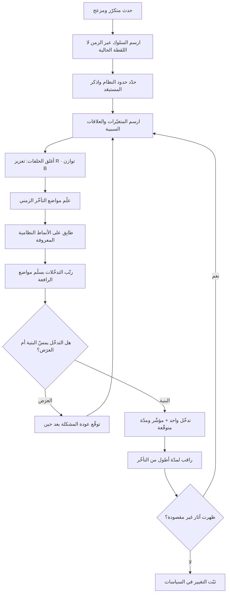

# التفكير النُّظُمي (Systems Thinking)

> [!info] تعريف مختصر
> منهج في التحليل يفترض أن سلوك أي نظام — فريق، منتج، سوق، مؤسّسة — ينشأ في المقام الأول من **بنيته الداخلية**: عناصره، والعلاقات بينها، وحلقات التغذية الراجعة، وتأخّرات الاستجابة، والغرض الفعلي الذي يخدمه النظام. ومن ثمّ فإن المشكلة المتكرّرة ليست حادثًا ولا سوء أداء فردي، بل **عرَض** لبنية تنتجه بانتظام. علاج العرَض يخفيه مؤقتًا ثم يعود، وربما بشدّة أكبر؛ أمّا تغيير البنية فيغيّر السلوك من جذره. الشعار المكثّف للمنهج: البنية تُولّد السلوك.

## الشرح العلمي والاحترافي
- **المنشأ الأكاديمي — ديناميكا الأنظمة**: تعود الصياغة المنهجية الحديثة إلى **جاي فورستر (Jay Forrester)**، أستاذ في معهد ماساتشوستس للتقنية (MIT)، الذي أسّس في أواخر خمسينيات القرن العشرين حقل **ديناميكا الأنظمة (System Dynamics)**. جاء فورستر من هندسة التحكّم والحواسيب، ونقل أدواتها — حلقات التغذية الراجعة، والمخزونات والتدفّقات، والتأخّر الزمني — إلى تحليل المشكلات الإدارية والاجتماعية. وأشهر إسهاماته المبكّرة كتابه في ديناميكا الصناعة، الذي بيّن فيه كيف تنشأ التذبذبات في سلاسل التوريد من بنية النظام نفسه لا من تقلّب الطلب الخارجي.
- **الجسر إلى الممارسة — دونيلا ميدوز**: أسهمت **دونيلا ميدوز (Donella Meadows)**، وهي عالمة أنظمة عملت ضمن مدرسة فورستر، في نقل الحقل من النمذجة الرياضية إلى لغة يفهمها صانع القرار. كتابها **"Thinking in Systems: A Primer"** (نُشر بعد وفاتها) صار المرجع التمهيدي الأوسع انتشارًا للحقل، وهي أيضًا صاحبة تصنيف **[[Leverage Points]]** الشهير لمواضع التدخّل في الأنظمة مرتّبة بقوّة أثرها.
- **المكوّنات الثلاثة لأي نظام**: يُعرَّف النظام بثلاثة أشياء: **عناصر** (الأفراد، الفرق، الأدوات)، و**علاقات ترابط** بينها (السياسات، مسارات المعلومات، الحوافز)، و**غرض** يخدمه فعلًا. والملاحظة المنهجية الأهم أن تغيير العناصر — استبدال مدير، تبديل أداة — هو أضعف أنواع التغيير أثرًا، لأن العلاقات والغرض تعيد إنتاج السلوك نفسه بالعناصر الجديدة. أمّا الغرض الفعلي فيُستدلّ عليه من السلوك لا من الوثائق: نظام يعلن أن غرضه الجودة بينما يكافئ السرعة وحدها، غرضه الفعلي هو السرعة.
- **حلقتا التغذية الراجعة**: كل سلوك ديناميكي في نظام يُردّ إلى نوعين من الحلقات وتفاعلهما.
  1. **حلقة التعزيز (Reinforcing Loop / R)**: تضخّم التغيير في اتجاهه — النجاح يولّد نجاحًا، والتدهور يسرّع التدهور. مثالها في المشاريع: الضغط على الفريق يدفعه لتخطّي الاختبار، فيزيد الخلل، فيزيد الضغط.
  2. **حلقة التوازن (Balancing Loop / B)**: تقاوم التغيير وتشدّ النظام نحو حالة مستهدفة — كمنظّم الحرارة. مثالها: ارتفاع العيوب يستدعي تشديد المراجعة، فينخفض العيب. وحلقات التوازن هي مصدر «المقاومة السياسية» التي تجعل تدخّلات كثيرة تبدو بلا أثر: النظام يمتصّ التدخّل ويعود إلى حالته لأن حلقة توازن خفيّة تعاكسه.
- **التأخّر الزمني (Delay) وأثره الحاسم**: قلّما ينتج السبب أثره فورًا. بين قرار التوظيف وإنتاجية الموظّف أشهر؛ وبين تراكم [[Technical Debt]] وانهيار سرعة التسليم فصول؛ وبين خفض جودة الخدمة وهجرة العملاء أرباع كاملة. وثلاثة أعراض تنشأ عن التأخّر تحديدًا: **التذبذب** (الإفراط في التصحيح ثم الإفراط في التصحيح المعاكس)، و**نسبة السبب إلى المتغيّر الخاطئ** (لأن المتغيّر الحقيقي تغيّر قبل فترة طويلة)، و**إغراء الحلول السريعة** (لأن أثرها يظهر فورًا بينما أثر الحل الجذري متأخّر). ومن هنا التحذير النُّظُمي الشهير: كثير من الحلول تُحسّن الوضع على المدى القصير وتسوّئه على المدى الطويل.
- **الأنماط النظامية المتكرّرة (Archetypes)**: رصد الحقل بنى متكرّرة تظهر في سياقات مختلفة تمامًا؛ منها **الإصلاحات التي تفشل** (حل سريع يعالج العرَض ويزيد المشكلة الأصلية)، و**تحويل العبء** (الاعتماد على حل مسكّن يُضعف القدرة على الحل الجذري تدريجيًّا)، و**حدود النمو** (نمو معزَّز يصطدم بقيد لم يُلحَظ فيتوقّف فجأة)، و**تصاعد التنافس** (طرفان يردّ كلٌّ منهما على الآخر فيتصاعد الاستنزاف). معرفة هذه الأنماط تختصر التشخيص كثيرًا لأنها توجّه النظر إلى البنية مباشرة.
- **الظهور والخصائص الناشئة (Emergence)**: سلوك النظام ليس مجموع سلوك أجزائه. فريق مكوّن من أفضل الأفراد قد يُنتج أداءً رديئًا إن كانت روابطه وحوافزه فاسدة، والعكس صحيح. وهذا يفسّر لماذا يفشل التحسين الموضعي: تحسين كفاءة قسم على حدة قد يخفض أداء النظام ككل — وهي الملاحظة نفسها التي يقوم عليها [[Theory of Constraints]] وأدبيات التدفّق في [[Toyota Production System]].
- **حدود النظام (Boundary) قرار تحليلي لا حقيقة**: أين ينتهي «النظام» الذي تدرسه؟ إن رسمت الحدود حول فريقك وحده، بدت المشكلة في فريقك. وإن وسّعتها لتشمل المبيعات والتمويل، تغيّر التشخيص كليًّا. رسم الحدود ضيّقًا هو السبب الأكثر شيوعًا لتشخيص خاطئ يبدو محكمًا.

## أين ومتى يُستخدم
- **حين تتكرّر المشكلة نفسها رغم حلّها مرارًا**: التكرار مؤشّر بنيوي بامتياز، ويستدعي تحليلًا نُظُميًّا لا جولة جديدة من [[Root Cause Analysis]] الخطّي الذي يبحث عن سبب واحد.
- **عند تشخيص اختناقات التدفّق**: لفهم لماذا لا يرفع تسريع خطوة واحدة [[Throughput]] الكلّي، ولماذا يزيد رفع [[WIP Limit]] زمن الدورة بدل خفضه — وهي علاقة تصفها [[Little's Law]] كمّيًّا ويفسّرها التفكير النُّظُمي بنيويًّا.
- **في تصميم الحوافز والمقاييس**: لأن كل مقياس يُكافأ عليه يخلق حلقة تعزيز حول نفسه. هذا هو المدخل الصحيح لنقاش [[Outcome vs Output]] ولتشخيص كيف تتحوّل الفرق إلى [[Feature Factory]].
- **في تحليل أصحاب المصلحة والسياسات التنظيمية**: عند بناء [[Stakeholder Map]]، يكشف المنهج أن مقاومة طرف ما ليست عنادًا بل استجابة عقلانية لحوافز تخصّه لم تُدرَج في التصميم.
- **في إدارة الدين التقني والجودة**: لأن العلاقة بين خفض الجودة اليوم وانهيار السرعة بعد أشهر هي حلقة تعزيز بتأخّر طويل، لا تُدرَك إلا نُظُميًّا ([[Cost-of-Change Curve]]).
- **في تصميم الأنظمة الأصيلة ذكاءً**: عند بناء نظام [[AI-Native]]، يمنع المنهج مغالطة تسريع خطوة واحدة داخل بنية تنتج البطء أصلًا، ويوجّه إلى تعديل البنية نفسها.

## مثال وسيناريو تطبيقي
> [!example] شركة برمجيات في جدة تخدم عملاء مؤسّسيين. المشكلة المعلَنة: «فريق التطوير بطيء». الأرقام: زمن الدورة ارتفع من 12 يومًا إلى 34 يومًا خلال ثلاثة أرباع، ونسبة العمل غير المخطّط له في كل سبرنت بلغت 61%، ورضا العملاء انخفض من 8.1 إلى 5.9 على عشرة.
> **التدخّل الأول (خطّي)**: افترضت الإدارة أن السبب نقص الطاقة، فوظّفت 4 مطوّرين. بعد ربع كامل: زمن الدورة 38 يومًا — أسوأ. السبب أن المطوّرين الجدد استهلكوا وقت الأقدمين في التأهيل، وهم أصلًا الاختناق.
> **التحليل النُّظُمي**: رسم الفريق الحلقات فوجد حلقة تعزيز واضحة. وعد المبيعات بموعد تسليم ضيّق ← ضغط على الفريق ← تخطّي الاختبار وتأجيل التنظيف ← ارتفاع العيوب في الإنتاج (من 7 إلى 29 بلاغًا شهريًّا) ← اضطرار المطوّرين الأقدم للانقطاع لمعالجة البلاغات العاجلة ← تراجع سعة التطوير المخطّط ← تأخّر التسليم ← غضب العميل ← وعد المبيعات بموعد أضيق تعويضًا. الحلقة تدور ذاتيًّا وتتسارع، ولا تحتاج إلى أي سبب خارجي لتستمرّ.
> وتبيّن **التأخّر** الحاسم: الفجوة بين تخطّي الاختبار وظهور البلاغ في الإنتاج نحو 6 إلى 8 أسابيع. لذلك بدا للجميع أن الفريق «كان جيّدًا الشهر الماضي وساء اليوم»، بينما السبب قرار يعود إلى ربع سابق.
> وتبيّن أيضًا **حلقة تحويل عبء**: كلّما اشتدّ الضغط، لجأت الإدارة إلى العمل الإضافي — مسكّن سريع الأثر — وهو ما أخّر باستمرار أي معالجة جذرية وأنهك الفريق، فارتفع الدوران الوظيفي، فقلّت المعرفة المؤسّسية، فزاد زمن كل مهمّة.
> **التدخّل البنيوي**: لم يكن توظيفًا ولا أداة. ثلاثة تغييرات: ① ربط حافز فريق المبيعات بجودة التسليم بعد 90 يومًا لا بتوقيع العقد وحده — أي كسر مصدر الحلقة. ② حدّ صريح للعمل الجارٍ يمنع بدء عمل جديد قبل إغلاق القائم. ③ حجز 20% ثابتة من سعة كل سبرنت لسداد الدين التقني، غير قابلة للتفاوض تحت الضغط. النتيجة بعد ربعين: زمن الدورة 15 يومًا، البلاغات الشهرية 9، والعمل غير المخطّط 22%. ولم يُضَف فرد واحد إلى الفريق.

## خطوات أو مخطّط
1. اكتب المشكلة كسلوك يتغيّر عبر الزمن لا كحدث: ارسم منحنى المقياس المهم على 12 إلى 24 شهرًا بدل النظر إلى قيمة هذا الأسبوع.
2. حدّد حدود النظام صراحةً، واذكر ما استبعدته ولماذا — ثم اختبر ما يتغيّر في التشخيص لو وسّعت الحدود خطوة.
3. اجمع المتغيّرات الحقيقية المؤثّرة من الميدان لا من غرفة الاجتماعات ([[Gemba Walk]]).
4. ارسم العلاقات السببية بأسهم، وحدّد اتجاه كل علاقة: هل زيادة أ تزيد ب أم تنقصها؟
5. اقفل الحلقات، وصنّف كلًّا منها: تعزيز أم توازن؟ ثم حدّد الحلقة المسيطرة على السلوك الحالي.
6. علّم مواضع التأخّر الزمني ومقدارها التقريبي، فهي مفتاح تفسير التذبذب وسوء نسبة الأسباب.
7. طابِق البنية على الأنماط المعروفة (إصلاحات تفشل، تحويل عبء، حدود نمو) لتسريع التشخيص.
8. رتّب التدخّلات الممكنة بحسب قوّة أثرها وفق سلّم [[Leverage Points]]، وقاوم الانجذاب إلى المعايير الرقمية وحدها.
9. تدخّل في موضع واحد عالي الأثر، وحدّد سلفًا المؤشّر الذي سيتغيّر ومتى يُتوقّع أن يتغيّر — وسجّل ذلك في [[Decision Log]].
10. راقب الأثر عبر مدّة أطول من التأخّر المرصود، وانتبه للنتائج غير المقصودة في أطراف النظام الأخرى.

## ⚠️ مفاهيم خاطئة شائعة
> [!warning]
> - **الخلط بينه وبين تحليل السبب الجذري الخطّي**: أدوات مثل «لماذا خمس مرات» تفترض سلسلة سببية أحادية الاتجاه تنتهي عند سبب واحد. التفكير النُّظُمي يفترض أسبابًا متعدّدة **تتغذّى على نتائجها**، فلا يوجد فيها «سبب جذري» واحد بل حلقة مسيطرة. الأداتان متكاملتان، لكن الخلط بينهما يُنتج تشخيصًا مبتورًا.
> - **افتراض أن الحل النُّظُمي دائمًا كبير ومكلف**: العكس أقرب للصواب. التدخّل البنيوي الفعّال غالبًا صغير وحادّ — تعديل سياسة، أو مقياس، أو من يملك قرارًا. الكبير والمكلف هو ما نفعله عادة حين لا نفهم البنية.
> - **الظنّ بأن المنهج يُعفي الأفراد من المسؤولية**: التفكير النُّظُمي لا يقول إن الأداء الفردي لا يهم؛ يقول إن **النمط المتكرّر عبر أفراد مختلفين** لا يُفسَّر بالأفراد. المسؤولية الفردية تبقى قائمة في الحدث المفرد، وتصبح تفسيرًا ضعيفًا في النمط المستمرّ.
> - **اعتبار الرسم البياني للحلقات هو الغاية**: المخطّط أداة تفكير مشتركة لا مخرَج نهائي. مخطّط جميل لا يُترجم إلى تغيير في سياسة أو حافز أو حدّ عمل هو تمرين ذهني.
> - **توقّع أثر فوري للتدخّل البنيوي**: بحكم التأخّر الزمني، قد يسوء المؤشّر قبل أن يتحسّن — خصوصًا حين يُسحب مسكّن كان يخفي المشكلة. الحكم المبكر على التدخّل يقتله قبل أن يعمل.
> - **الاعتقاد بأن النظام له غرض واحد معلن**: النظام الواحد يخدم عادة أغراضًا متعدّدة ومتناقضة لأطراف مختلفة، والغرض الفعلي يُستدلّ من السلوك والحوافز لا من بيان الرؤية.
> - **الخلط بين تعقيد النظام وصعوبة فهمه**: كثير من الأنظمة المعقّدة ظاهريًّا يحكمها عدد قليل جدًّا من الحلقات المسيطرة. التعقيد الظاهر ليس مبرّرًا لليأس من التشخيص.

## ❌ ممارسات خاطئة في المشاريع
> [!failure]
> - **تحسين كفاءة كل قسم على حدة**: يُطلب من كل إدارة رفع استغلال طاقتها إلى أقصاها. لماذا يضرّ: تعظيم الأجزاء يخفض أداء الكل، ويرفع الطوابير وزمن الانتظار بدل خفضه ([[100 Percent Utilization Fallacy]]). الحل: اجعل مقياس التحسين على مستوى التدفّق من الطلب إلى القيمة، لا داخل الأقسام.
> - **الاستجابة لكل انحراف أسبوعي بتصحيح إداري**: تُعدَّل الخطة كلّما تحرّك المؤشّر. لماذا يضرّ: مع وجود التأخّر، ينتج عن ذلك تذبذب متزايد يُدخل النظام في اهتزاز مستمرّ ويربك الفريق. الحل: فرّق بين التباين الطبيعي والانحراف الحقيقي عبر [[Control Chart]]، ولا تتدخّل إلا عند إشارة معتبرة.
> - **الاعتماد الدائم على المسكّنات التنظيمية**: العمل الإضافي، والاستعانة بمقاول خارجي عند كل أزمة، وتشكيل «فريق نمر» لكل حريق. لماذا يضرّ: هذا نمط تحويل العبء — يخفّ الألم فتقلّ الدافعية لبناء القدرة الجذرية، فيزداد الاعتماد على المسكّن حتى يصير هو النظام. الحل: اربط كل استخدام للمسكّن بالتزام مكتوب ومجدوَل ببناء القدرة الدائمة.
> - **رسم حدود النظام حول فريق واحد**: يُحلَّل تأخّر التسليم داخل فريق الهندسة فقط. لماذا يضرّ: يُخفي أن مصدر الاضطراب قد يكون في وعود المبيعات أو دورة اعتماد الميزانية، فيُلام من لا يملك المتغيّر. الحل: ابدأ بحدود واسعة عمدًا ثم ضيّقها بدليل، لا العكس.
> - **إدخال مقياس جديد دون تتبّع حلقته**: يُضاف مقياس سرعة أو إنتاجية لتحفيز التحسّن. لماذا يضرّ: كل مقياس يُكافأ عليه يُنشئ حلقة تعزيز حول نفسه ويُحسَّن على حساب ما لا يُقاس — فتُحسَّن السرعة على حساب الجودة. الحل: لا تُدخل مقياسًا بلا مقياس مضادّ يحرس ما قد يُضحّى به.
> - **الحكم على التدخّل البنيوي قبل انقضاء زمن التأخّر**: تُلغى سياسة جديدة بعد شهر لأن «النتائج لم تظهر». لماذا يضرّ: يُهدر التدخّل الصحيح ويُرسّخ اعتقادًا بأن الحلول الجذرية لا تنفع. الحل: أعلن مسبقًا الأفق الزمني المتوقّع للأثر وما هي المؤشّرات المبكّرة المقبولة.
> - **استخدام لغة الأنظمة للتهرّب من المساءلة**: يُقال «المشكلة في النظام» لتجنّب مواجهة أداء أو قرار بعينه. لماذا يضرّ: يفرغ المنهج من قيمته ويحوّله إلى غطاء بلاغي. الحل: كل تحليل نُظُمي يجب أن ينتهي بمالك محدّد لتغيير محدّد بتاريخ محدّد.

## 🔗 مصطلحات ومفاهيم ذات صلة
[[Leverage Points]] | [[Workflow]] | [[AI-Native]] | [[Knowledge Management]] | [[Theory of Constraints]] | [[Feedback Loop]] | [[Root Cause Analysis]] | [[Little's Law]] | [[Value Stream Mapping]] | [[Toyota Production System]] | [[100 Percent Utilization Fallacy]] | [[Technical Debt]] | [[Control Chart]]
