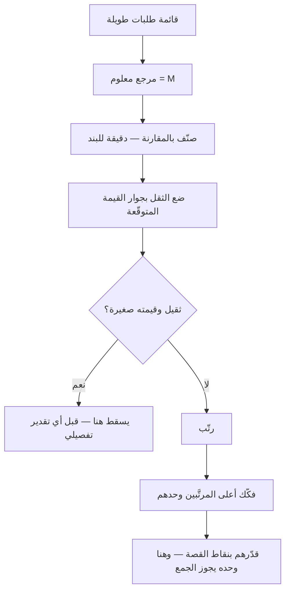

# تقدير حجم القميص (T-Shirt Sizing)

> [!info] تعريف مختصر
> **تقدير حجم القميص** أن يُصنَّف العمل في أحجام مرتّبة خشنة — `XS · S · M · L · XL` — بدل أن يُعطى رقمًا. وهو صورة من [[Relative Estimation|التقدير النسبي]]، ويفترق عن [[Planning Poker|نقاط القصة]] في خاصّة واحدة تحكم كل ما بعدها: **أن الأحجام لا تُجمع**.
> **وامتناع الجمع ميزةٌ لا نقص.** فهو يُستعمل حيث يكون الجمع نفسه سابقًا لأوانه: على الملاحم، وخارطة الطريق، ومحفظة المبادرات قبل أن تُفكَّك. **فما لا يُجمع لا يصير التزامًا** — وهذا بعينه ما يُراد في تلك المرحلة.

## الشرح العلمي والاحترافي

**والمقياس ترتيبيّ (Ordinal) لا عدديّ:** يقول إن `L` أكبر من `M`، ولا يقول بكم. **ونقاط القصة عدديّة نسبية**، فيجوز جمعها والتنبّؤ بها عبر [[18 - Velocity|السرعة]]. فالفرق بين الأداتين ليس في الدقّة بل في **ما تسمح به كلٌّ منهما بعد التقدير**.

| ما يفعله الفريق | **حجم القميص** | **نقاط القصة (فيبوناتشي)** |
|---|---|---|
| يقدّر… | ملحمة · مبادرة · بندًا في خارطة الطريق | قصّة تدخل السبرنت |
| متى؟ | قبل التفكيك، والمعلومة قليلة | بعد التنقيح، والمتطلب مفهوم |
| كم يستغرق البند؟ | ثوانٍ | دقائق ونقاش |
| أيُجمع الناتج؟ | **لا** | نعم — وعليه يقوم التنبّؤ |
| ماذا يُفعل به؟ | ترتيبٌ ومفاضلة وتصفية | تخطيط سبرنت وتوقّع مدى |
| ومن يشارك؟ | يشمل غير التقنيين بلا حرج | الفريق الذي سينفّذ |

> **السؤال الفارق:** حجم القميص يسأل: **أيّ هذه المبادرات أثقل من أيّ؟** ونقاط القصة تسأل: **كم يسع سبرنتنا القادم؟** — **فمن جمع القمصان أراد جواب الثاني بأداة الأوّل**، ومن قدّر خمسين ملحمة بالنقاط أنفق أيامًا في دقّةٍ ستتغيّر كلّها.

**ولماذا ينجح؟** لثلاثة أسباب عملية:

1. **سرعته.** يمرّ الفريق على أربعين بندًا في نصف ساعة — وهذا وحده يجعل المفاضلة على مستوى المحفظة ممكنة، وهي متعذّرة بالتقدير التفصيلي.
2. **خشونته المعلنة.** فحين يكون عدم اليقين كبيرًا، **الرقم الدقيق كذبٌ مهذّب**: يُقرأ التزامًا ويُبنى عليه وعد. والحرف لا يُقرأ كذلك.
3. **لغته المشتركة.** يشارك فيه من ليس مطوّرًا — مالك المنتج، والتسويق، والعمليات — فيُبنى فهم مشترك للثقل قبل أن يُبنى جدول.

**وله صورتان في الاستعمال**، والفرق بينهما مهمّ:

- **حجمًا مجرّدًا** يُستعمل للترتيب والتصفية، ولا يُترجم إلى شيء آخر. **وهذه صورته السليمة.**
- **حجمًا يُترجَم إلى مدًى زمنيّ** («`M` تعني بين ثلاثة أسابيع وستّة») — وهذه جائزة **بشرطين**: أن يُذكر المدى لا الرقم، وأن يُعلَن أنه معايرة من تاريخ الفريق نفسه لا قاعدة. **فإن صار `M = 4 أسابيع`، فقد عاد التقدير بالساعات في ثوب حرف** — وضاعت الخاصّة التي اختير من أجلها.

## أين ومتى يُستخدم

- **في تقدير الملاحم وبنود خارطة الطريق** قبل التفكيك.
- **في تصفية قائمة طويلة**: أربعون طلبًا يُصنَّف في نصف ساعة، فيسقط ما هو `XL` بلا قيمة مقابلة.
- **في المفاضلة على مستوى المحفظة**، حيث لا يُقارَن الأثر بالكلفة إلا إذا كان للكلفة تقديرٌ ما — ولو خشنًا.
- **في الاستقبال المبكّر للطلبات** ([[Project Intake|استقبال المشروع]])، لفرز ما يستحقّ دراسةً أعمق.
- **مع أصحاب المصلحة غير التقنيين**، فالحروف تُفهم والنقاط تُساء فهمها.

> [!warning] متى لا يُستخدَم؟
> - **في تخطيط السبرنت.** فما يدخل السبرنت يحتاج تفكيكًا وتقديرًا يقبل الجمع.
> - **في التزام تعاقديّ أو موعد معلن.** الحرف لا يحمل تعهّدًا، ومن حمّله إيّاه أساء إلى الطرفين.
> - **حين تكون المعلومة كافية للتفكيك.** فالخشونة تُختار عند نقص المعلومة لا رغبةً في الاختصار.
> - **مقياسًا يُقارَن بين فريقين.** فمعايرة الأحجام محلّية بفريقها كما نقاط القصة تمامًا؛ و`L` عند فريق ليست `L` عند غيره.

## مثال وسيناريو تطبيقي

> [!example] «منصّة رِفد» — واحد وثلاثون طلبًا، وربعٌ كامل ضاع في التقدير
> **الوضع:** واحد وثلاثون طلبًا من الأقسام لخارطة الربع القادم. والعادة أن يُقدَّر كلٌّ بنقاط القصة تفصيلًا: **ست جلسات، وأربعة عشر ساعة عمل فريق.**
> **وما وقع بعدها:** اعتُمدت تسعة طلبات فقط، فذهب تقدير اثنين وعشرين هدرًا — وتغيّرت متطلبات ثلاثة من التسعة قبل أن تُنفَّذ، فأُعيد تقديرها.
> **ما فُعل في الربع التالي:** جلسة واحدة، خمسون دقيقة، حجم قميص لكل طلب بلا نقاش تفصيلي.
> - سقط **أحد عشر** طلبًا في الجلسة نفسها: كانت `XL` وقيمتها المعلنة صغيرة، **وظهر التفاوت لأوّل مرّة حين وُضع الثقل بجوار القيمة**.
> - وبقي عشرون رُتّبت، وفُكِّك أعلى ثمانية منها وقُدِّرت بالنقاط تفصيلًا.
> **النتيجة:** التقدير التفصيلي أُنفق على ما دخل فعلًا، ومن أربعة عشر ساعة إلى أقلّ من خمس.
> **وما كاد يُفسد الأمر:** طلبٌ في الجلسة الثانية بأن يُكتب أمام كل حرف عددُ الأسابيع «حتى يفهم الجميع». ولو فُعل لعادت الجلسة تقديرًا بالساعات بأسماء جديدة، **ولصارت الحروف وعودًا تُحاسَب عليها**.

## خطوات أو مخطّط

1. **اختر مرجعًا واحدًا معلومًا** — بندًا سبق تنفيذه يتّفق الفريق أنه `M`.
2. **صنّف بالمقارنة به**، بلا نقاش يتجاوز دقيقة للبند الواحد.
3. **لا تجمع ولا تحوّل.** الناتج ترتيبٌ لا مجموع.
4. **ضع الثقل بجوار القيمة** — فالحجم وحده لا يقرّر شيئًا، وإنّما نسبته إلى الأثر المتوقّع.
5. **فكّك أعلى المرتَّبين وحدهم**، وقدّرهم تفصيلًا بالنقاط.
6. **راجع المعايرة كل ربع:** انظر ما نُفِّذ فعلًا — أكان ما سُمّي `L` أقرب إلى `M`؟ فالمعايرة تُصحَّح بالواقع لا بالنقاش.

## ⚠️ مفاهيم خاطئة شائعة

> [!warning]
> - **الظنّ بأنه تقدير أقلّ دقّة فحسب.** بل هو **مقياس من نوع آخر**: ترتيبيّ لا عدديّ، ولهذا لا يُجمع.
> - **جمع الأحجام** («عندنا ثلاثة `L` وخمسة `M`، فالربع يكفي») — وهذا نقضٌ للأداة، لأن `L` لا تحمل مقدارًا.
> - **حسبانه بديلًا عن نقاط القصة.** الأداتان لطبقتين مختلفتين، والفريق الناضج يستعملهما معًا.
> - **الظنّ بأن الأحجام قياسية بين الفرق.** معايرتها محلّية، وتُبنى من تاريخ الفريق نفسه.
> - **إضافة `XXL`.** فما تجاوز `XL` ليس بندًا يُقدَّر بل **بندًا يُفكَّك**؛ وإضافة حجم أكبر تؤجّل التفكيك وتُخفي الحاجة إليه.
> - **حسبانه أسرع لأنه أقلّ جدّية.** بل هو أسرع لأنه **يطابق ما تعرفه فعلًا** في تلك اللحظة.

## ❌ ممارسات خاطئة في المشاريع

> [!failure]
> - **تثبيت جدول تحويل** (`M = 4 أسابيع`) — فيعود التقدير بالساعات في ثوب حرف، ويُقرأ التزامًا. **الحلّ:** إن لزم المدى فليكن **مدًى** معلنًا أنه معايرة، لا رقمًا واحدًا.
> - **استعماله في تخطيط السبرنت** — فتدخل بنود لا يعرف الفريق حجمها فعلًا. **الحلّ:** لا يدخل السبرنت ما لم يُفكَّك ويُقدَّر.
> - **تقديره بلا وضع القيمة بجواره** — فيصير ترتيبًا بالكلفة وحدها. **الحلّ:** الثقل والقيمة في جدول واحد.
> - **إعلانه لأصحاب المصلحة بوصفه موعدًا** — فيُبنى وعدٌ على مقياس ترتيبيّ. **الحلّ:** يُعلن بوصفه ترتيبًا، ويُعلن الموعد بعد التفكيك.
> - **إهمال إعادة المعايرة** — فتتضخّم الأحجام مع الوقت ويصير كل شيء `L`. **الحلّ:** مراجعة ربعية على ما نُفِّذ فعلًا.

## 🔗 مصطلحات ومفاهيم ذات صلة

[[Relative Estimation]] | [[Planning Poker]] | [[Estimation]] | [[Estimation Variance]] | [[Epic]] | [[Project Intake]] | [[WSJF]] | [[MoSCoW Prioritization]] | [[18 - Velocity]] | [[Backlog Refinement]] | [[Now-Next-Later Roadmap]]
