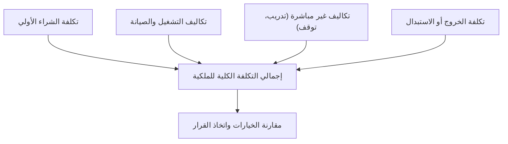

# التكلفة الكلية للملكية (TCO)
> [!info] تعريف مختصر
> التكلفة الكلية للملكية (Total Cost of Ownership، اختصارًا TCO) هي مجموع كل التكاليف المرتبطة بحل أو منتج أو نظام طوال دورة حياته، وليس فقط تكلفة الشراء الأولي. تشمل تكاليف الشراء والتشغيل والصيانة والدعم والتوقف والاستبدال.

## الشرح العلمي والاحترافي
- عند اختيار أداة أو منصة تقنية أو مورّد، يميل الكثيرون للنظر فقط إلى **سعر الشراء الأولي (Upfront Cost)**، بينما TCO يفرض النظر إلى التكلفة الكاملة عبر السنوات: تراخيص التجديد، الصيانة، تدريب الفريق، الدعم الفني، الترقيات، وتكلفة الانتقال لاحقًا إلى حل آخر.
- يُحسب TCO عادة بجمع:
  1. **تكاليف مباشرة (Direct Costs)**: الشراء، التركيب، التراخيص السنوية.
  2. **تكاليف تشغيل (Operating Costs)**: الاستضافة، الكهرباء، الدعم الفني، الصيانة الدورية.
  3. **تكاليف غير مباشرة (Indirect Costs)**: وقت تدريب الموظفين، فقدان الإنتاجية أثناء الانتقال، تكلفة التوقف (Downtime).
  4. **تكلفة نهاية العمر (End-of-Life Cost)**: ترحيل البيانات، فسخ العقد، تكلفة الخروج من مورّد معين.
- يرتبط TCO ارتباطًا وثيقًا بمفهوم [[Vendor Lock-in]]: فكلما زاد الاحتجاز لدى مورّد معين، ارتفعت تكلفة الخروج مستقبلًا، وهذا بند يجب تضمينه في حساب TCO منذ البداية.
- يُستخدم أيضًا في مقارنته بتحليل [[CapEx vs OpEx]] لأن TCO يجمع النوعين معًا في صورة واحدة شاملة تُسهّل اتخاذ قرار الاستثمار.

## أين ومتى يُستخدم
- يُحسب في مرحلة **إعداد الحالة التجارية (Business Case)** أو عند مقارنة عدة حلول تقنية (مثل مقارنة استضافة سحابية مقابل خادم داخلي).
- يستخدمه مدراء المشاريع والمديرون الماليون عند اتخاذ قرارات شراء برمجيات أو بنية تحتية طويلة الأمد.
- مهم بشكل خاص في مشاريع الترحيل التقني (Migration) واختيار الموردين الاستراتيجيين.

## مثال وسيناريو تطبيقي
> [!example]
> شركة ناشئة تقارن بين خيارين لاستضافة تطبيقها: منصة سحابية "أ" بسعر اشتراك شهري 500 دولار، ومنصة "ب" بسعر اشتراك شهري 300 دولار فقط.
> عند النظر السطحي، تبدو "ب" أرخص بـ 200 دولار شهريًا. لكن عند حساب TCO على مدى 3 سنوات:
> - منصة "أ": 500 × 36 = 18,000 دولار، وتشمل دعمًا فنيًا مجانيًا وأدوات مراقبة مدمجة.
> - منصة "ب": 300 × 36 = 10,800 دولار، لكنها تتطلب توظيف مهندس دعم إضافي (بتكلفة 800 دولار شهريًا)، وتضيف تكلفة ترحيل بيانات مقدّرة بـ 5,000 دولار عند الحاجة للتبديل لاحقًا بسبب [[Vendor Lock-in]] في تنسيقها الخاص بالبيانات.
> إجمالي TCO لمنصة "ب" يصبح: 10,800 + (800×36) + 5,000 = 44,600 دولار، وهو أعلى بكثير من "أ". هذا التحليل غيّر قرار الشركة رغم فارق السعر الظاهري الأولي.

## خطوات أو مخطّط
1. تحديد الأفق الزمني للمقارنة (مثلًا 3 أو 5 سنوات).
2. حصر التكاليف المباشرة (شراء، تراخيص).
3. حصر تكاليف التشغيل والصيانة والدعم.
4. تقدير التكاليف غير المباشرة (تدريب، توقف، فقدان إنتاجية).
5. تقدير تكلفة الخروج أو الاستبدال في نهاية العمر الافتراضي.
6. جمع كل البنود ومقارنتها بين الخيارات المتاحة.

## ⚠️ مفاهيم خاطئة شائعة
> [!warning]
> - الاعتقاد أن الخيار الأرخص سعرًا عند الشراء هو الأرخص فعليًا، متجاهلين تكاليف التشغيل طويلة الأمد.
> - نسيان تضمين تكلفة "الخروج" من الحل عند انتهاء العقد أو الحاجة للتبديل، وهي غالبًا أعلى تكلفة مخفية في TCO.
> - الظن أن TCO حساب مالي بحت لا يحتاج فريق المشروع، بينما فريق المشروع هو من يقدّر بدقة التكاليف غير المباشرة مثل التدريب والتوقف.

## ❌ ممارسات خاطئة في المشاريع
> [!failure]
> - مقارنة الموردين بناءً على السعر الشهري فقط دون حساب TCO الكامل، ما يؤدي لاختيار خيار يبدو موفّرًا لكنه أعلى تكلفة على المدى الطويل.
> - إغفال حساب تكلفة تدريب الفريق على أداة جديدة ضمن TCO، فتظهر مفاجأة في الميزانية بعد التوقيع.
> - عدم تحديث حساب TCO دوريًا مع تغيّر أسعار التراخيص أو ظهور بنود دعم إضافية، ما يجعل القرار الأصلي غير دقيق بعد سنة أو سنتين.

## 🔗 مصطلحات ومفاهيم ذات صلة
[[CapEx vs OpEx]], [[Vendor Lock-in]], [[Business Case]], [[Cost of Delay]]
