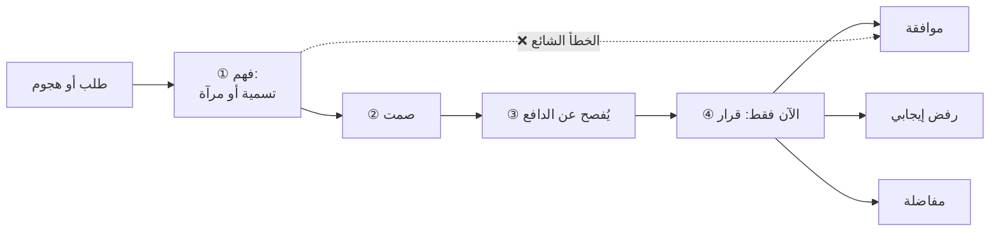

# التعاطف التكتيكي (Tactical Empathy)
> [!info] تعريف مختصر
> التعاطف التكتيكي هو أن تفهم منطق الطرف الآخر ودوافعه، وتُظهر له أنّك فهمتَها — **بلا أن يتغيّر النطاق أو العملية أو الالتزام بحرف**. وهو فهمٌ بلا موافقة، والحدّ الثالث هو ما يجعله «تكتيكيًّا» لا مجاملة.

## الشرح العلمي والاحترافي
المصطلح لـ**كريس فوس** في *Never Split the Difference* (2016). ومعادلته **ثلاثة حدود** كلّها ضرورية:

| الحدّ | صياغته | إن غاب |
|---|---|---|
| ① الفهم الداخلي | أفهم منطقه ودافعه | تُنتج جملة جوفاء تُقرأ روتينًا وتتآكل |
| ② الإظهار الخارجي | أُظهر له أنّي أفهم | فهم لا يعلم به لا يُغيّر حالته |
| ③ **ثبات الحدّ** | ولم يتغيّر النطاق ولا العملية | **يسقط إلى استرضاء** — وهنا يُقرأ اللطف ضعفًا |

**وهو تعاطف معرفي لا وجداني.** يُميّز **بول بلوم (Paul Bloom)** في *Against Empathy* (2016) بين ثلاثة أشياء تُسمّى تعاطفًا: **الوجداني** (أن تشعر بما يشعر به — يُغرقك في حالته فيُنتج التنازل ويُنهكك)؛ و**المعرفي** (أن تفهم ما يشعر به من دون أن تشعر به — **وهذا هو المطلوب**)؛ و**الرحيم** (أن تهتمّ بمصلحته — يُوجّه الغرض لا التقنية). وهذا التمييز يُفسّر لماذا يُنهك التعاطف بعض الناس ولا يُنهك غيرهم: **من يقرأ الحالة لا يحملها.**

**ويتقاطع مع «المواقف مقابل المصالح»** في *Getting to Yes* لفيشر ويوري، ويختلف عنه في طريقة الاستخراج: هارفارد تسأل مباشرةً «لماذا هذا مهمّ لك؟»؛ والتعاطف التكتيكي يستخرج **بشكل غير مباشر** ([[Labeling|تسمية]] · [[Mirroring|مرآة]] · صمت) لأنّه يفترض أنّ الطرف الآخر **لا يستطيع** الإفصاح — إمّا لأنّه لا يعي دافعه، وإمّا لأنّ الإفصاح يُضعف موقفه.

## أين ومتى يُستخدم
- كلّ مواجهة يسبق فيها الانفعالُ المنطقَ — وهي أغلب اجتماعات الأزمات.
- التعامل مع [[Stakeholder Map|أصحاب المصلحة]] الذين يطلبون ما لا يُمكن تسليمه.
- قبل أيّ قرار مفاضلة: لا تُقرّر قبل أن تعرف الدافع.
- إدارة الصراع بين طرفين داخل الفريق — انظر [[Displacement Strategy]].

## مثال وسيناريو تطبيقي
> [!example] يدخل مالك المنتج وسط السبرنت: «أعلم أنّنا في المنتصف، لكنّ العميل اتّصل ويحتاج هذه الميزة هذا الأسبوع.» فتردّ مديرة سكرم بحلّ ممتاز تقنيًّا: تقسيم الميزة، وترتيب التبعيّات، ومنع الحجب. **والخطأ ليس في جودة الحلّ بل في موضعه**: قُدِّم في الثانية الخامسة قبل معرفة الدافع، فتُرجِم في ذهن مالك المنتج إلى «الخطّة التي نضعها بلا قيمة». أمّا التعاطف التكتيكي فهو: **«يبدو أنّ العميل يضغط عليك.»** ← صمت ← *(يُفصّل أنّ همّه أن يظهر مُستجيبًا لا الميزة نفسها)* ← **«مُدوَّن. وحتى نُخرج له شيئًا هذا الأسبوع، أيّ بند من الملتزم به نُؤجّل؟»** — فهمٌ كامل، ونطاق لم يتغيّر، وقرار المفاضلة عاد إليه.

## خطوات أو مخطّط
1. افصل بين **الطلب** (ما يقوله) و**الحاجة** (ما جاء لأجله) — الطلب قابل للرفض، والحاجة غالبًا لها أكثر من طريق.
2. استخرج الحالة بـ[[Labeling|تسمية]] أو [[Mirroring|مرآة]].
3. **اصمت** — بين الفهم والحدّ يقع صمت، **لا حرف عطف**؛ و«لكن» تمحو ما قبلها.
4. بعد أن يُفصح، قرّر: موافقة · رفض إيجابي · أو **مفاضلة**.
5. لبِّ **الحاجة** بطريق آخر إن تعذّر تلبية الطلب.

## ⚠️ مفاهيم خاطئة شائعة
> [!warning]
> - **ليس لطفًا ولا مجاملة.** التنازل بلا دراسة إرضاءً للآخرين ليس تعاطفًا؛ إنّه **استجابة تهديد** من نوع الاسترضاء — انظر [[Fight Flight Freeze]] و[[Ruinous Empathy]].
> - **ليس اتّفاقًا ضمنيًّا.** أن تصف ضغط الطرف الآخر لا يعني أنّك التزمتَ بشيء؛ والالتزام من أوّل جملة كارثة.
> - **ليس تعاطفًا شعوريًّا.** من يستخدم النوع الوجداني يمتصّ حالات الجميع فيُستنزَف خلال أشهر ثم يستنتج أنّ «هذه الأمور لا تُطبَّق في الواقع».

## ❌ ممارسات خاطئة في المشاريع
> [!failure]
> - **«أفهمك، لكن…»** — «لكن» تمحو كلّ ما قبلها فيُقرأ الفهم مقدّمةً للرفض. الحل: صمت بين الفهم والحدّ، ثم مفاضلة بصيغة سؤال.
> - **«أفهمك، إذن سنُدخلها»** — الانزلاق من الفهم إلى الموافقة بلا مرور بالدافع ولا بالقرار.
> - **إنفاق الأداة على كلّ شيء** — بعض الطلبات تُحَلّ بـ«حسنًا، لا مشكلة»؛ والفرز نفسه مهارة: عاديّ ← موافقة فورية · متوسّط ← هدنة قصيرة · جوهريّ ← الجهاز الكامل.
> - **أحاديّة الاتّجاه المزمنة** — كلّ استخدام يُنتج معلومة عنه ولا يُنتج شيئًا عنك؛ وتراكم ذلك يُنشئ ثقة سطحية وبُعدًا عميقًا. الحل: إفصاح محسوب عن ضغطك أنت في موضعه.

## 🔗 مصطلحات ومفاهيم ذات صلة
[[Labeling]] | [[Mirroring]] | [[Positions vs Interests]] | [[Ruinous Empathy]] | [[Positive Refusal]] | [[Emotional Intelligence]] | [[Active Listening]] | [[Transparency Test]] | [[Fight Flight Freeze]]

> [!tip] 💡 إثراء عملي — كورس لعبة العقل
> المعادلة الثلاثية، وجدول الدوافع الشائعة خلف الجُمَل التي تسمعها فعلًا: [[03 - التعاطف التكتيكي - الفهم غير الموافقة]].
