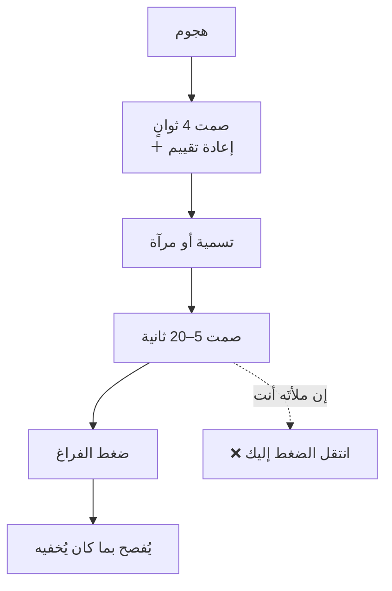

# الصمت التكتيكي وضغط الفراغ (Tactical Silence)
> [!info] تعريف مختصر
> الصمت التكتيكي هو وقفة مقصودة تُوظَّف لغرضين متمايزين: **قبل ردّك** لتهدئة استثارتك أنت ومنع الردّ الانعكاسي؛ و**بعد جملتك** لتوليد **ضغط الفراغ** الذي يدفع الطرف الآخر إلى ملئه بمعلومة لم يكن سيقولها.

## الشرح العلمي والاحترافي
الصمت في الحوار **مورد يُوزَّع**: في كلّ نقاش يتحمّل أحد الطرفين عبء ملء الفراغ — ومن يتحمّله يُفصح أكثر ويُقدّم أكثر ويتنازل أكثر. وثلاثة عوامل تُحدّد من سيملؤه: من فتح الموضوع · من هو أشدّ استثارة · **ومن هو أكثر ارتياحًا بالصمت** — والأخير وحده قابل للتدرّب.

**وثلاثة معالم زمنية لثلاثة مواضع مختلفة:**

| الموضع | المدّة | الوظيفة |
|---|---|---|
| بعد أن يُهاجمك | **أربع ثوانٍ** | تهدئة استثارتك **أنت** قبل الردّ |
| قبل أن تُمرئ | **ثلاث ثوانٍ** من صمته | ألّا يشعر أنّك قاطعته |
| بعد [[Labeling\|تسمية]] أو [[Mirroring\|مرآة]] | **5–20 ثانية** | ضغط الفراغ ليتكلّم هو |

**ولماذا تعمل الأربع ثوانٍ؟** ليست لخاصّية في الرقم، بل لأنّها **مهمّة إدراكية بديلة**: العدّ أو التسبيح يشغل الذاكرة العاملة فيمنع الردّ الانعكاسي. **وأفضل استخدام لها إعادة تقييم لا عدّ** — أن تسأل نفسك: *«ما الموقف الذي جعله يقول هذا؟»* — فتُؤدّي الوظيفتين معًا: تخفض استثارتك، وتُنتج لك مادّة التسمية جاهزة. انظر [[Cognitive Reappraisal]].

**والثلاث ثوانٍ** أطول من فجوة التناوب الطبيعية في الحوار (نحو 200 مللي ثانية في معظم اللغات)، فتجاوزها **إشارة مقصودة**: أنا لا أنتظر دوري بل أستمع.

## أين ومتى يُستخدم
- بعد كلّ تسمية ومرآة وسؤال معايَر — بلا استثناء.
- في اللحظة التي يُهاجمك فيها أحدهم علنًا.
- في التفاوض بعد عرض الطرف الآخر — الوقفة تُفسَّر تلقائيًّا عدم رضًا فتدفع إلى تحسين العرض.
- في اجتماع تريد أن تُذكَر فيه الكلمة الأخيرة لك — فمن أنفق رصيده في الكلام كشف أوراقه.

## مثال وسيناريو تطبيقي
> [!example] في اجتماع استعادي، يتّهم مطوّر المختبِر: «أنت دائمًا تفتح بلاغات تافهة وتُخرّب مقاييسنا أمام الإدارة.» فيصمت مدير سكرم **أربع ثوانٍ** — ينظر إليه بثبات ويسأل نفسه ما الذي جعله يقول هذا — ثم يُلقي تسمية: «يبدو أنّ هناك قلقًا من شكل التقارير أمام الإدارة.» ثم **يصمت ثانيةً**. مرّت ثماني ثوانٍ ثقيلة، ثم بدأ المطوّر يتكلّم: «الحقيقة أنّ قائد الفريق سألني الأسبوع الماضي عن عدد العيوب في وحدتي…» — **وهذه المعلومة هي أصل المشكلة كلّها**، ولم تكن ستظهر لو مُلِئ الفراغ.

## خطوات أو مخطّط
1. **بعد الهجوم:** أربع ثوانٍ · نظر ثابت بين الحاجبين · وضعية مفتوحة · اسأل نفسك عن الموقف.
2. **قبل المرآة:** انتظر أن يصمت ثلاث ثوانٍ — قد يكون يبتلع ريقه أو يجمع بقيّة أفكاره.
3. **بعد التسمية:** عُدّ في نفسك إلى عشرة قبل أن تسمح لنفسك بالكلام. غالبًا لن تصل إلى خمسة.
4. حافظ على **الوضعية** طوال الصمت — فالصمت مع ذراعين مطويتين أو نظر إلى الأرض يُقرأ انسحابًا فيرفع استثارته.

## ⚠️ مفاهيم خاطئة شائعة
> [!warning]
> - **الصمت ليس غياب كلام بل وضعية.** صمت + وضعية مفتوحة + نظر ثابت = ضغط فراغ. صمت + وضعية منغلقة = انسحاب.
> - **ليس مسكوتًا عنه في الجميع بالتساوي.** قدرة المرء على الصمت المريح مرتبطة بموقعه في التراتبية: من يشعر أنّ عليه إثبات قيمته — الأحدث سنًّا أو الأقلّ خبرةً — يجد الصمت أعلى كلفة لأنّه قد يُقرأ منه عجزًا.
> - **طول الوقفة المريحة يختلف ثقافيًّا.** فما يُقرأ في سياق تفكيرًا واحترامًا يُقرأ في آخر انسحابًا أو عدوانًا سلبيًّا. عايِر على مجموعتك لا على رقم من كتاب.

## ❌ ممارسات خاطئة في المشاريع
> [!failure]
> - **ملء الفراغ بنصيحة** — أشيع خطأ في أدوات هذا الباب كلّها؛ والسبب أنّ الصمت غير مريح لك أنت لا له.
> - **الكبح بدل إعادة التقييم** — أن تقضي الأربع ثوانٍ في تكرار «لا تنفجر» أو في تحضير ردّ مُفحِم. الأوّل يرفع الضغط الداخلي، والثاني يظهر في وجهك. الحل: سؤال الموقف.
> - **إطالة الصمت الأوّل بلا جملة بعده** — الأربع ثوانٍ للاستعداد ثم **تُتبَع بتسمية أو مرآة**؛ والصمت الممتدّ بلا ردّ يُقرأ تجاهلًا فيُصعّد («ما بك؟ لماذا لا تردّ؟»).
> - **استخدامه مع من هو أدنى منك سلطةً** كأداة ضغط — الفارق التراتبي يجعله قسريًّا لا تفاوضيًّا.

## 🔗 مصطلحات ومفاهيم ذات صلة
[[Labeling]] | [[Mirroring]] | [[Calibrated Questions]] | [[Cognitive Reappraisal]] | [[Amygdala Hijack]] | [[Silent Leadership]] | [[Active Listening]] | [[Anchoring]]

> [!tip] 💡 إثراء عملي — كورس لعبة العقل
> الأرقام الثلاثة وأسبابها، وكيف يفشل الصمت: [[02 - بيولوجيا اللحظة - اللوزة والقشرة الجبهية]] و[[05 - المرآة وضغط الفراغ]].
