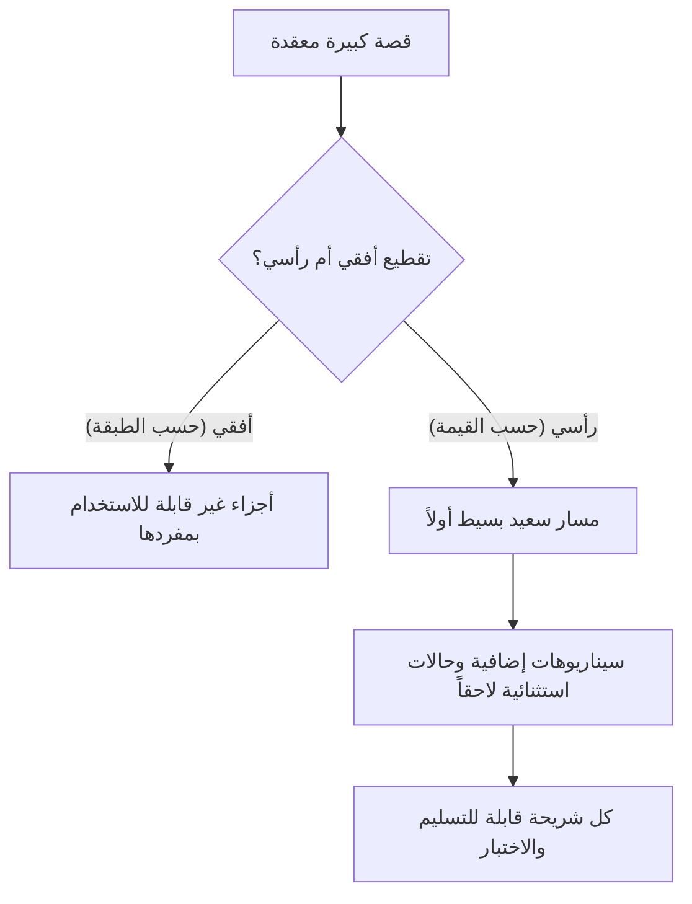

# تقطيع المهام (Task and Story Slicing)
> [!info] تعريف مختصر
> تقطيع المهام (Task and Story Slicing) هو تقسيم قصة مستخدم كبيرة أو ميزة معقدة إلى أجزاء أصغر، كل جزء منها قابل للتسليم بشكل مستقل ويحمل قيمة قابلة للاختبار، بدل تقسيمها إلى مراحل تقنية غير مكتملة الفائدة.

## الشرح العلمي والاحترافي
- الفرق الجوهري هنا بين نوعين من التقطيع: التقطيع الأفقي (حسب الطبقة التقنية: واجهة، خادم، قاعدة بيانات) الذي ينتج أجزاء غير قابلة للاستخدام بمفردها، والتقطيع الرأسي (حسب القيمة الوظيفية) الذي ينتج كل مرة شريحة رفيعة لكن كاملة الوظيفة من أول الطبقة إلى آخرها.
- الهدف من تقطيع المهام هو تحويل [[Epic]] أو قصة كبيرة إلى قصص أصغر تحترم معايير [[INVEST Criteria]]، وتحديداً معيار "Small" (صغيرة بما يكفي لإنجازها ضمن سبرنت واحد) دون الإخلال بمعيار "Valuable" (تحمل قيمة قابلة للتجربة).
- تقنيات شائعة للتقطيع: التقطيع حسب قواعد العمل (Business Rules)، حسب أنواع البيانات المدعومة، حسب سيناريوهات النجاح مقابل الاستثناءات، حسب واجهات المستخدم المختلفة (ويب مقابل جوال)، أو حسب "المسار السعيد" أولاً ثم [[Edge Cases]] لاحقاً.
- التقطيع الجيد يقلل مخاطر المشروع لأنه يتيح تسليم قيمة مبكرة ومتكررة، ويسهّل [[Estimation Variance]] لأن المهام الصغيرة أسهل تقديراً من الكبيرة، ويرتبط مباشرة بمفهوم [[MVP]] عند تطبيقه على مستوى الميزة الكاملة.

## أين ومتى يُستخدم
- يُستخدم بشكل أساسي في [[01 - Agile]] و[[02 - Scrum]] وكانبان أثناء [[Backlog Refinement]] وقبل [[08 - Sprint Planning]]، لتحويل [[Epic]] كبير إلى قصص قابلة للتنفيذ ضمن سبرنت واحد.
- يُلجأ إليه عندما تكون قصة مستخدم أكبر من أن تُنجز خلال سبرنت واحد، أو عندما تُظهر [[Planning Poker]] تقديرات متباعدة جداً بسبب حجم القصة وتعقيدها.
- مفيد أيضاً عند بناء [[MVP]] لتحديد أصغر شريحة وظيفية قابلة للإطلاق أولاً.

## مثال وسيناريو تطبيقي
> [!example] سيناريو
> فريق يعمل على ميزة "الدفع بالتقسيط" في تطبيق تجارة إلكترونية. القصة الأصلية "كمستخدم أريد الدفع بالتقسيط" ضخمة جداً وتقديرها في [[Planning Poker]] متذبذب بين 20 و80 نقطة.
> بدل تقطيعها أفقياً (قصة "بناء واجهة التقسيط" ثم قصة "بناء الخادم" ثم قصة "ربط قاعدة البيانات")، وهو ما ينتج مكونات غير قابلة للتجربة بمفردها، يقطّعها الفريق رأسياً حسب سيناريوهات العمل:
> 1) الدفع بالتقسيط لبطاقة ائتمان واحدة فقط بثلاث دفعات ثابتة (المسار السعيد الأبسط).
> 2) دعم خطط تقسيط بعدد دفعات مختلف (3، 6، 12 شهراً).
> 3) دعم بطاقات متعددة وحالات فشل الدفع ([[Edge Cases]]).
> كل شريحة قابلة للتسليم والاختبار من طرف المستخدم إلى طرفه، فيُطلق الفريق الشريحة الأولى كـ [[MVP]] خلال سبرنت واحد ويحصل على تغذية راجعة حقيقية قبل بناء الباقي.

## خطوات أو مخطّط
1. تحديد القصة أو [[Epic]] الكبير الذي يحتاج تقطيعاً.
2. تحديد "المسار السعيد" الأبسط الذي يحمل قيمة كاملة من أول الطبقة لآخرها.
3. فصل السيناريوهات الإضافية ([[Edge Cases]]، قواعد عمل بديلة، أنواع بيانات إضافية) إلى قصص منفصلة لاحقة.
4. التحقق أن كل شريحة ناتجة تحقق معايير [[INVEST Criteria]] وخاصة أنها قابلة للاختبار والقيمة بمفردها.
5. إعادة التقدير بـ [[Planning Poker]] للتأكد أن كل شريحة صغيرة بما يكفي لسبرنت واحد.
6. تسليم الشرائح تباعاً، بادئاً بالأعلى قيمة أو الأكثر خطورة تقنياً.

## ⚠️ مفاهيم خاطئة شائعة
> [!warning]
> - الخلط بين تقطيع المهام حسب الطبقة التقنية (واجهة/خادم) وتقطيعها حسب القيمة الوظيفية؛ الأول لا ينتج شيئاً قابلاً للتجربة بمفرده.
> - الاعتقاد بأن التقطيع يعني تبسيط الميزة أو حذف جزء منها نهائياً؛ في الحقيقة كل الأجزاء ستُنجز، لكن بترتيب تدريجي يسلّم قيمة أبكر.
> - الظن أن كل قصة يجب أن تكون صغيرة منذ البداية دون داع؛ التقطيع يُطبَّق فقط عندما تكون القصة كبيرة أو معقدة بما يمنع إنجازها ضمن سبرنت واحد.

## ❌ ممارسات خاطئة في المشاريع
> [!failure]
> - تقطيع القصة حسب الطبقات التقنية فينتج مهام مثل "بناء الواجهة" و"بناء API" بشكل منفصل دون قيمة قابلة للعرض بعد كل مهمة. التجنب: التقطيع رأسياً بحيث تحمل كل شريحة قيمة كاملة من الواجهة إلى قاعدة البيانات.
> - تقطيع مفرط ينتج قصصاً صغيرة جداً بلا قيمة مستقلة، مما يزيد العبء الإداري دون فائدة حقيقية. التجنب: التأكد أن كل شريحة تحقق معيار "Valuable" في [[INVEST Criteria]] قبل تقطيعها أكثر.
> - تأجيل [[Edge Cases]] الحرجة (كحالات فشل الدفع) إلى ما لا نهاية بحجة "سنعالجها لاحقاً"، فتصل الميزة للإنتاج بثغرات. التجنب: جدولة صريحة لحالات الاستثناء ضمن خارطة الطريق بعد المسار السعيد مباشرة.

## 🔗 مصطلحات ومفاهيم ذات صلة
[[INVEST Criteria]] | [[Epic]] | [[11 - User Stories]] | [[MVP]] | [[Backlog Refinement]] | [[Edge Cases]] | [[Planning Poker]] | [[Estimation Variance]] | [[13 - Backlog]] | [[08 - Sprint Planning]]
