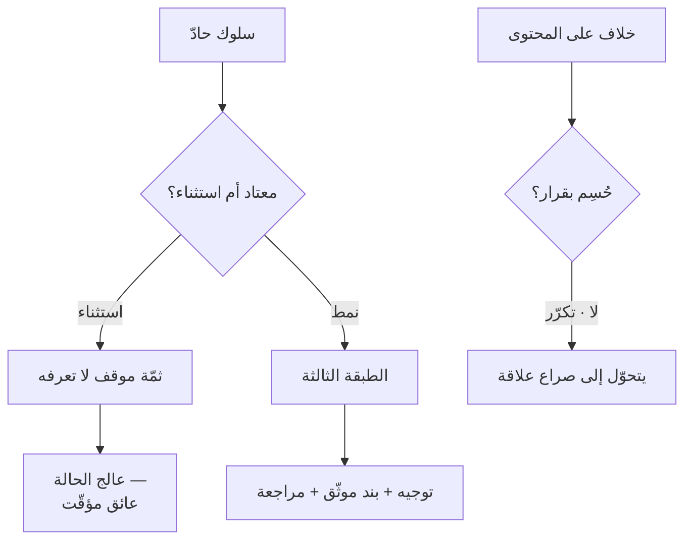

# صراع المهمّة مقابل صراع العلاقة (Task vs Relationship Conflict)
> [!info] تعريف مختصر
> **صراع المهمّة** خلاف على المحتوى والقرارات — **مفيد بقدر معتدل**. و**صراع العلاقة** توتّر شخصي بين الأفراد — **ضارّ دائمًا**. و**صراع العملية** خلاف على من يفعل ماذا وكيف — ضارّ إن استمرّ. والنتيجة الحاسمة أنّ **صراع المهمّة يتحوّل إلى صراع علاقة إن لم يُدَر**.

## الشرح العلمي والاحترافي
التصنيف لـ**كارن جِن (Karen Jehn)** في *A Multimethod Examination of the Benefits and Detriments of Intragroup Conflict* (1995) وما تلاه من أدبيات.

| النوع | موضوعه | أثره | مثاله |
|---|---|---|---|
| **المهمّة** | المحتوى والقرار | **مفيد بقدر معتدل** — يُحسّن جودة القرار | «هذا التصميم لن يتحمّل الحمل المتوقّع» |
| **العلاقة** | الأشخاص | **ضارّ دائمًا** | «هو لا يفهم ولا يستمع لأحد» |
| **العملية** | من يفعل ماذا وكيف | ضارّ إن استمرّ | «لماذا يُقرّر هو النطاق ونحن ننفّذ؟» |

**وآلية التحوّل** هي أهمّ ما في النموذج عمليًّا: خلاف تقني يبدأ على المحتوى، وحين يتكرّر بلا حسم أو يُدار بالإسناد الشخصي، **يُعيد الطرفان تفسير سلوك بعضهما بالسمات لا بالظرف** — فيتحوّل «هو يرى المشكلة من زاوية أخرى» إلى «هو شخص عنيد». وهذا هو **خطأ الإسناد الأساسي** ([[Fundamental Attribution Error]]) عاملًا داخل الفريق.

**وأداة عملية لمنع التحوّل — تشريح الصراع إلى أربع طبقات:**

| الطبقة | مداها | هل تُرى؟ |
|---|---|---|
| ① **الحالة** — ما تراه الآن | دقائق إلى ساعات | ✅ |
| ② **الموقف** — حدث مرّ به | ساعات إلى أيّام | ❌ غالبًا |
| ③ **الشخصية** — سماته المعتادة | شهور إلى سنوات | 🟡 بالمعاشرة |
| ④ **الشخص** — الإنسان | ثابت | ✅ |

**والطبقة الثالثة هي المرجع:** قبل أن تحكم على سلوك، اسأل: **أهذا معتاد منه أم استثناء؟** فالاستثناء يعني أنّ ثمّة موقفًا لا تعرفه — وهذا صراع مهمّة وحالة، **عائق مؤقّت**. والمعتاد يعني نمطًا، وعلاجه مختلف تمامًا.

## أين ومتى يُستخدم
- تشخيص صراع متكرّر: أهو خلاف على المحتوى أم توتّر شخصي؟
- بعد اجتماع محتدم — لتحديد ما إذا كان يستحقّ تدخّلًا.
- في الاجتماع الاستعادي: هل خلافاتنا تتحوّل من محتوى إلى أشخاص؟

## مثال وسيناريو تطبيقي
> [!example] مطوّرة هادئة عادةً ترد بحدّة على ملاحظة في مراجعة كود أمام الفريق. **التشريح:** الطبقة الأولى = حدّة الردّ؛ والطبقة الثالثة = **هادئة عادةً** — إذن **استثناء**، ودليلك على وجود موقف في الطبقة الثانية هو الانحراف نفسه. والطبقة الثانية **مجهولة، ولا تخترعها**. فالتصرّف: لا تُعالج الحدّة أمام الفريق — الملاحظة العلنية تُحوّل الحادثة إلى سابقة؛ وبعدها اجتماع فردي بصياغة **تفتح بابًا ولا تسأل عن الموقف**: «أردتُ أن أطمئنّ — هل هناك ما يُعطّلك أو ما أستطيع مساعدتك فيه هذه الفترة؟» — إن أرادت الإفصاح فعلت، وإن لم تُرد لم تُحرَج. **وأنت لا تحتاج الموقف أصلًا؛ يكفي أن تعرف أنّه موجود.**

## خطوات أو مخطّط
1. صنّف: أهو خلاف على **محتوى** أم على **شخص** أم على **من يفعل ماذا**؟
2. إن كان محتوى: **شجّعه** بحدود — واحسمه بقرار موثّق كي لا يتكرّر فيتحوّل.
3. إن كان علاقة: **اسأل عن الطبقة الثالثة** — معتاد أم استثناء؟
4. **استثناء** ← عائق مؤقّت؛ عالج الحالة بلا استقصاء عن الموقف.
5. **نمط** ← ليس حادثة؛ توجيه واجتماع فردي وبند موثّق ومراجعة بموعد.
6. وثّق الحوادث بسطر وتاريخ — فالذاكرة متحيّزة ولا تصلح مرجعًا لسؤال «معتاد أم استثناء؟».

## ⚠️ مفاهيم خاطئة شائعة
> [!warning]
> - **صراع المهمّة ليس خللًا.** الفريق الذي لا يختلف على المحتوى إمّا لا يُفكّر وإمّا لا يشعر بالأمان لقول ما يراه — انظر [[Psychological Safety]].
> - **«معتاد أم استثناء؟» سؤال يعتمد على ذاكرة متحيّزة.** نتذكّر السلبيّ أكثر، ونتذكّر ما يُؤكّد انطباعنا القائم؛ فمن كوّنتَ عنه انطباعًا سلبيًّا يبدو «معتادًا» بعد حادثتين، ومن تُحبّه يبقى «استثناءً» بعد خمس. **والعلاج التوثيق البسيط.**
> - **الطبقة الرابعة حدّ أخلاقي لا تصنيف تحليلي** — تحت كلّ تحليل إنسان لا يُختزَل في سلوك.

## ❌ ممارسات خاطئة في المشاريع
> [!failure]
> - **معالجة الاستثناء بوصفه نمطًا** — تُدمّر علاقة بسبب يوم سيّئ.
> - **معالجة النمط بوصفه استثناءً** — تُبرّر سلوكًا متكرّرًا سنةً، ويدفع بقيّة الفريق الثمن، وتصل إليهم رسالة أخطر: أنّ السلوك مقبول ما دام صاحبه مُنتجًا.
> - **مطاردة الطبقة الثانية** — «هل حدث شيء اليوم؟» سؤال حسن النيّة يُقرأ اقتحامًا، ويضع الشخص بين الإفصاح والكذب.
> - **الخلط بين صراع الحمل وصراع العلاقة** — قسمان يتقاذفان الاتّهامات أسبوعيًّا ليس صراع تواصل بل **عَرَض حِمل**؛ ويُشخَّص بـ[[Capacity|السعة]] و[[Flow Load|حِمل التدفّق]] لا بجلسات الحوار.

## 🔗 مصطلحات ومفاهيم ذات صلة
[[Displacement Strategy]] | [[Thomas-Kilmann Conflict Modes]] | [[Fundamental Attribution Error]] | [[Psychological Safety]] | [[Tuckman's Stages of Group Development]] | [[Blameless Postmortem]] | [[Capacity]] | [[Flow Load]] | [[Team Working Agreement]]

> [!tip] 💡 إثراء عملي — كورس لعبة العقل
> الطبقات الأربع بالتفصيل، والصراعات الخمسة في بيئة العمل وعلاج كلٍّ منها: [[07 - إدارة الصراع - الطبقات الأربع والصراعات الخمسة]].
