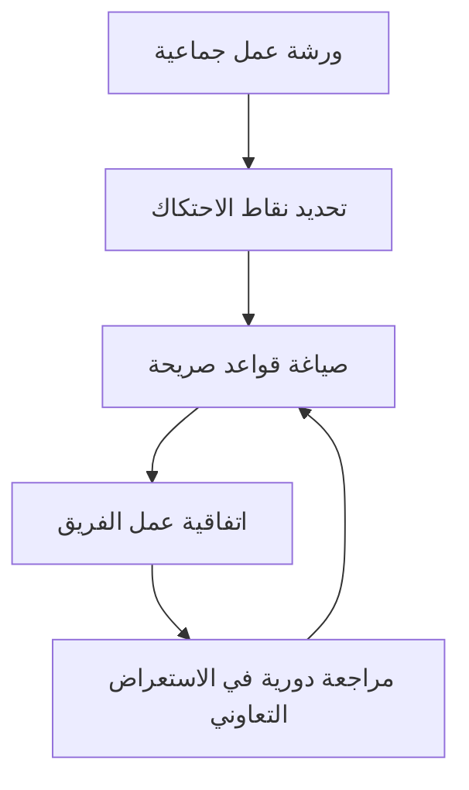

# اتفاقية عمل الفريق (Team Working Agreement)
> [!info] تعريف مختصر
> اتفاقية عمل الفريق هي وثيقة قصيرة يضعها أعضاء الفريق أنفسهم، تحدد القواعد والسلوكيات المشتركة التي يلتزمون بها في العمل اليومي، مثل مواعيد الاجتماعات وطريقة التواصل والتعامل مع الخلافات.

## الشرح العلمي والاحترافي
تُبنى اتفاقية عمل الفريق على مبدأ أن الفريق ذاتي التنظيم (Self-Organizing Team) هو الأقدر على تحديد أفضل طريقة للتعاون فيما بينه، بدل فرض قواعد من الإدارة العليا. هي وثيقة حيّة (Living Document) تُراجَع وتُحدَّث دورياً، غالباً في استعراض تعاوني (Sprint Retrospective).

ماذا تتضمن عادة:
- ساعات العمل الأساسية المشتركة (Core Hours) لفرق العمل عن بُعد.
- قنوات وأوقات التواصل المتوقعة (مثلاً: الرد على الرسائل خلال 4 ساعات عمل).
- تعريف الجاهزية (Definition of Ready) وتعريف الانتهاء (Definition of Done).
- سياسات صريحة (Explicit Policies) حول حدود العمل الجاري (WIP Limit) وقواعد المراجعة البرمجية.
- كيفية التعامل مع الخلافات وطلب المساعدة.

لماذا يهم: بدون اتفاقية مكتوبة، تختلف توقعات أعضاء الفريق ضمنياً، مما يولّد احتكاكاً غير ضروري. الاتفاقية تجعل التوقعات صريحة ومكتوبة، فتقلل سوء الفهم وتُسرّع اندماج الأعضاء الجدد.

## أين ومتى يُستخدم
- عند تشكيل فريق سكرَم (Scrum) أو كانبان (Kanban) جديد، كجزء من مراحل تطوّر الفريق (Tuckman's Stages of Group Development).
- عند انضمام أعضاء جدد يحتاجون فهم قواعد العمل بسرعة.
- عند الانتقال إلى العمل عن بُعد أو الهجين حيث تصبح التوقعات الضمنية غير كافية.
- تُراجَع وتُحدَّث في كل استعراض تعاوني (Sprint Retrospective) دوري.

## مثال وسيناريو تطبيقي
> [!example] انضم فريق تطوير جديد من ست دول زمنية مختلفة إلى شركة ناشئة. حدثت خلافات متكررة: البعض يتوقع رداً فورياً على "سلاك"، بينما آخرون يعملون بتوقيتات مختلفة تماماً. عقد قائد الفريق (Scrum Master) اجتماعاً خُصص بالكامل لصياغة اتفاقية عمل الفريق: اتُّفق على "نافذة تعاون مشتركة" من الساعة 2 إلى 4 مساءً بتوقيت غرينتش لكل الاجتماعات المتزامنة، ورد غير متزامن خلال 24 ساعة على أي رسالة أخرى. بعد أسبوعين، انخفضت شكاوى "لم أحصل على رد" إلى الصفر تقريباً.

## خطوات أو مخطّط
1. جمع الفريق بالكامل في جلسة مخصصة (لا يُفرض من الإدارة).
2. طرح أسئلة مفتوحة: "ما الذي يزعجك في طريقة عملنا الحالية؟"
3. تدوين القواعد المتفق عليها بصياغة واضحة وقابلة للقياس.
4. نشر الاتفاقية في مكان يراه الجميع (لوحة المهام Task Boards مثلاً).
5. مراجعتها دورياً في كل استعراض تعاوني وتعديلها عند الحاجة.

## ⚠️ مفاهيم خاطئة شائعة
> [!warning]
> - ليست وثيقة تُكتب مرة واحدة وتُنسى؛ بل تتطور مع نضج الفريق.
> - ليست قواعد يفرضها مدير المشروع من أعلى؛ فقدانها لملكية الفريق يُفقدها فاعليتها.
> - ليست بديلاً عن تعريف الانتهاء (Definition of Done) التقني، بل مكمّلة له بقواعد سلوكية وتنظيمية.

## ❌ ممارسات خاطئة في المشاريع
> [!failure]
> - نسخ اتفاقية فريق آخر حرفياً دون نقاش داخلي — الحل: كل فريق يصوغ اتفاقيته الخاصة بناءً على واقعه.
> - كتابة الاتفاقية ثم تركها في مجلد منسي دون تفعيل — الحل: عرضها بشكل مرئي دائم ومراجعتها بانتظام.
> - جعل الاتفاقية طويلة ومعقدة بعشرات البنود — الحل: التركيز على 5 إلى 8 قواعد جوهرية قابلة للتذكر.

## 🔗 مصطلحات ومفاهيم ذات صلة
[[Self-Organizing Team]] | [[Psychological Safety]] | [[Definition of Done]] | [[Definition of Ready]] | [[Explicit Policies]] | [[WIP Limit]] | [[Tuckman's Stages of Group Development]] | [[10 - Sprint Retrospective]] | [[Liftoff]]

> [!tip] 💡 إثراء عملي — كورس الإنتاجية
> نموذج اتفاق عمل كامل يحسم متى يكون الشيء ميزة ومتى يكون عيبًا، وقواعد السعة والتصعيد: [[05 - عناصر التدفّق الأربعة وسعة الفريق]].

> [!tip] 💡 إثراء عملي — كورس لعبة العقل
> الاتّفاقية بوصفها الأداة التي **تُخرج المُيسّر من الصراع** — فلا يُصحّح هو السلوك بل ما اتّفق عليه الفريق: [[07 - إدارة الصراع - الطبقات الأربع والصراعات الخمسة]] و[[Displacement Strategy]].
