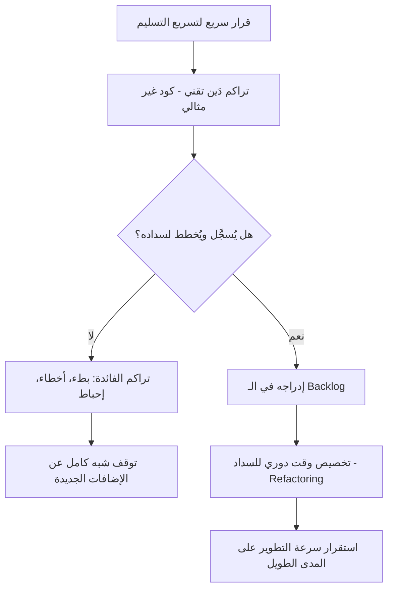

# الدَّين التقني (Technical Debt)
> [!info] تعريف مختصر
> الدَّين التقني هو التكلفة الإضافية المستقبلية الناتجة عن اختيار حل سريع أو غير مثالي الآن بدلًا من حل أفضل يستغرق وقتًا أطول. تمامًا كالدَّين المالي، يتراكم عليه "فائدة" تتمثل في بطء التطوير وزيادة الأخطاء مع الوقت إن لم يُسدَّد.

## الشرح العلمي والاحترافي
صاغ المصطلح المبرمج Ward Cunningham عام 1992، مستعيرًا استعارة الدَّين المالي: عندما يختار فريق تطوير حلًا سريعًا (Quick and Dirty) لتسليم ميزة في الموعد، فإنه "يقترض" وقتًا من المستقبل. هذا القرض قد يكون مبررًا تمامًا في لحظته (مثل إطلاق [[MVP]] لاختبار السوق بسرعة)، لكنه يجب أن يُسجَّل ويُخطط لسداده.

أنواع الدَّين التقني الشائعة:
- **دَين متعمَّد (Deliberate)**: قرار واعٍ، مثل تأجيل إعادة الهيكلة (refactoring) لإطلاق ميزة بموعد ضيق.
- **دَين غير متعمَّد (Inadvertent)**: ناتج عن نقص خبرة الفريق أو تغيّر متطلبات لم تكن متوقعة.
- **دَين بسبب الإهمال (Reckless)**: تجاهل معايير الجودة المعروفة دون مبرر.

آثار عدم سداد الدَّين التقني:
1. تباطؤ سرعة التطوير (تنخفض [[Throughput]] و[[Velocity]] الفريق بمرور الوقت).
2. زيادة معدل الأخطاء وارتفاع [[Rework Percentage]].
3. صعوبة إضافة ميزات جديدة لأن الشيفرة أصبحت معقدة ومترابطة بشكل هش.
4. إحباط الفريق التقني وزيادة دوران الموظفين.

يرتبط الدَّين التقني مباشرة بمنحنى [[Cost-of-Change Curve]]: كلما تأخر إصلاح المشكلة، ارتفعت تكلفة إصلاحها لاحقًا بشكل أسي تقريبًا. لهذا ينصح خبراء مثل Martin Fowler بمعاملته كبند دائم في [[Backlog Refinement]] وليس كـ"مهمة تنظيف" تُؤجَّل إلى الأبد.

## أين ومتى يُستخدم
- في كل مشروع برمجي، خصوصًا في منهجيات Agile حيث السرعة في التسليم قد تُغري الفريق باتخاذ قرارات سريعة.
- يُناقَش عادة في [[10 - Sprint Retrospective]] عند تحليل أسباب البطء المتراكم.
- يُدرَج كبند في [[13 - Backlog]] ليُعطى أولوية إلى جانب الميزات الجديدة عبر [[MoSCoW Prioritization]] أو [[Cost of Delay]].
- يُذكَر عند تقييم [[TCO]] (التكلفة الإجمالية للملكية) لأي نظام برمجي.

## مثال وسيناريو تطبيقي
> [!example] شركة ناشئة "سوقي" تطلق تطبيق تسوّق إلكتروني.
> لإطلاق [[MVP]] خلال 6 أسابيع فقط، يقرر الفريق كتابة منطق حساب الضرائب والشحن مباشرة داخل واجهة الدفع (بدل بناء وحدة منفصلة قابلة لإعادة الاستخدام)، ولا يكتبون اختبارات آلية لهذا الجزء. يُطلَق التطبيق بنجاح وتبدأ المبيعات.
> بعد 4 أشهر، يريد الفريق إضافة دعم لثلاث دول جديدة بأنظمة ضريبية مختلفة. يكتشفون أن منطق الضرائب متشابك مع 5 أماكن مختلفة في الكود، وكل تعديل يسبب كسر ميزات أخرى (زيادة [[Escaped Defect Rate]]). يقدّر الفريق أن إضافة الميزة تستغرق الآن 3 أسابيع بدلًا من أسبوع واحد كان يمكن أن يستغرقه لو كُتب الكود بشكل نظيف من البداية - هذا هو "الفائدة" التي تراكمت على الدَّين التقني.
> يقرر الفريق تخصيص 20% من كل [[14 - Sprint]] القادم لإعادة هيكلة (refactor) وحدة الضرائب قبل متابعة الميزات الجديدة.

## خطوات أو مخطّط

1. تحديد القرار الذي يُنشئ دَينًا تقنيًا وتوثيقه فور اتخاذه.
2. تسجيله كبند صريح في الـ Backlog (وليس فقط في ذهن المطوّر).
3. تقدير أثره وأولويته مقارنة بالميزات الجديدة.
4. تخصيص نسبة ثابتة من كل سبرنت لسداد الدَّين (ممارسة شائعة: 10-20%).
5. مراجعة الدَّين المتبقي دوريًا في الـ Retrospective.

## ⚠️ مفاهيم خاطئة شائعة
> [!warning]
> - الاعتقاد أن الدَّين التقني دائمًا "خطأ" أو "كسل"؛ في الواقع قد يكون قرارًا استراتيجيًا صحيحًا إن اتُّخذ بوعي وسُجِّل.
> - الظن أنه مجرد "كود قديم" أو "كود سيئ"؛ فهو مفهوم أوسع يشمل أيضًا نقص التوثيق، غياب الاختبارات الآلية، وقرارات معمارية غير قابلة للتوسع.
> - الاعتقاد أن حل الدَّين التقني مهمة تقنية بحتة لا تحتاج قرار إداري؛ في الحقيقة يحتاج دعم صاحب المنتج ([[05 - Product Owner]]) لتخصيص وقت له ضمن الأولويات.

## ❌ ممارسات خاطئة في المشاريع
> [!failure]
> - **عدم تسجيل الدَّين التقني في أي مكان**، فيبقى معرفة ضمنية عند المطوّرين فقط، ويُنسى مع دوران الفريق.
> - **تأجيل السداد إلى الأبد** بحجة أولوية الميزات الجديدة دائمًا، حتى تصل الشيفرة إلى نقطة يصعب فيها أي تعديل دون كسر شيء آخر.
> - **معاملة كل الديون بنفس الأهمية**؛ الأصح تصنيفها حسب الأثر والمخاطرة (شبيه بـ[[Probability and Impact Matrix]]) والتعامل أولًا مع الديون الأكثر خطورة على الاستقرار أو الأمان.

## 🔗 مصطلحات ومفاهيم ذات صلة
[[Cost-of-Change Curve]] | [[Backlog Refinement]] | [[MVP]] | [[Rework Percentage]] | [[TCO]] | [[Escaped Defect Rate]] | [[Cost of Delay]] | [[MoSCoW Prioritization]] | [[Velocity]] | [[10 - Sprint Retrospective]]

> [!tip] 💡 إثراء عملي — كورس الإنتاجية
> الدَّين التقني بأنواعه وكيف تُقاس **فائدته** لا حجمه، ولماذا لا يكتبه المطوّر، وقالب بند يفهمه غير التقنيّين: [[04 - دوّامة الموت والدَّين التقني]].
