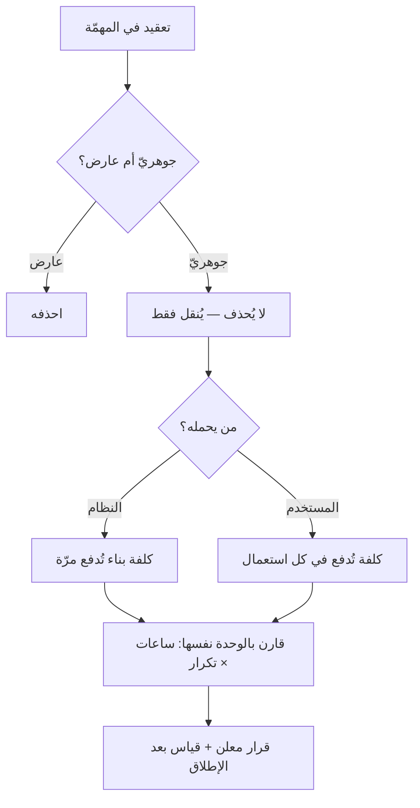

# قانون تسلر — حفظ التعقيد (Tesler's Law)

> [!info] تعريف مختصر
> **قانون تسلر**، ويُسمّى **قانون حفظ التعقيد**، يقول: *لكل نظام قدرٌ من التعقيد لا يمكن إزالته؛ وإنّما يُنقَل — فإمّا أن يحمله بانيه، وإمّا أن يحمله مستعمله.* صاغه لاري تسلر من مختبر زيروكس بارك ثم شركة آبل، وحجّته العملية صريحة: **من العدل أن يقضي المهندس أسبوعًا إضافيًّا ليوفّر على كل مستخدم دقيقة في كل مرّة** — فالأسبوع يُدفع مرّة، والدقيقة تُدفع ملايين المرّات. وأثره في إدارة المشاريع أن كل «تبسيط» في الواجهة أو العملية يجب أن يُسأل عنه سؤال واحد: **إلى أين نُقل التعقيد؟**

## الشرح العلمي والاحترافي

### 1. أصل الفكرة وجوهرها

- التعقيد نوعان يُخلط بينهما دائمًا:
  - **تعقيد جوهري (Essential)**: نابع من طبيعة المشكلة نفسها. حجزُ تذكرة سفر يحتاج تاريخًا ووجهةً وعدد ركّاب — ولا سبيل إلى إلغاء ذلك.
  - **تعقيد عارض (Accidental)**: نشأ من طريقة البناء لا من المشكلة، وهو الذي يُحذف فعلًا.
- **وقانون تسلر يتكلّم عن الجوهري وحده:** فهذا لا يُحذف بل يُوزَّع. وكل ما تفعله الواجهة الجميلة أنها **تحوّل التعقيد من المستخدم إلى النظام**، بأن يتحمّل المطوّر منطقًا أعقد كي يقلّ ما يُسأل عنه المستخدم.
- **والسؤال العملي دائمًا: من يحمله؟** والجواب الافتراضي — إن لم يُتّخذ قرار — هو **المستخدم**، لأن نقله إليه لا يكلّف الفريق شيئًا اليوم.

### 2. لماذا يختلّ الميزان دائمًا في اتّجاه واحد؟

- **لأن كلفة الطرفين تُقاس بمقياسين مختلفين.** كلفة المهندس تظهر في الجدول والميزانية بالساعات؛ وكلفة المستخدم تتوزّع على آلاف الناس بلا أن يظهر لها بند. **فالمقارنة ليست بين كلفتين بل بين كلفة مرئية وأخرى لا يراها أحد** — وهذا موضع التقاء القانون بـ[[McNamara Fallacy|المغالطة الكمّية]].
- **ولأن التعقيد المنقول إلى المستخدم لا يعود بشكوى واضحة**: لا يشتكي المستخدم من «حقل زائد»، بل يهجر الخدمة أو يتّصل بالدعم أو يتعلّم حيلة التفافية — وثلاثتها كلفة حقيقية لا تُنسب إلى مصدرها.
- ويصدق هذا على **العمليات الداخلية** كما يصدق على الواجهات: فالنموذج الذي يُطلب من الموظّف ملؤه بعشرين حقلًا لأن النظام لا يستنتجها هو التعقيد نفسه مُلقًى على من لا يملك ردّه.

### 3. ما يترتّب عليه في المشاريع

1. **«اجعله بسيطًا» ليست متطلَّبًا**، بل قرارُ **إسناد** ينبغي أن يُصرَّح به: من يحمل هذا التعقيد؟ وبكم؟
2. **الميزات التي تُلغى لا يُلغى تعقيدها بالضرورة.** فحذف خيار من الواجهة قد ينقل الحاجة إلى خطوة يدوية عند الدعم أو إلى ملفّ جانبي عند المستخدم.
3. **التبسيط الحقيقي يُقاس بأثره لا بمظهره**: انخفاض تذاكر الدعم، وارتفاع إتمام المسار، وقصر زمن أداء المهمّة. والواجهة الأنظف التي رفعت مكالمات الدعم لم تُبسِّط شيئًا، بل نقلت التعقيد إلى قناة أخرى.
4. **حدّ القانون**: لا يعني أن يحمل النظام كل شيء دائمًا. فالمستخدم الخبير في أداة احترافية قد يريد التعقيد ظاهرًا ليتحكّم فيه؛ وإخفاؤه عنه يُنتج «بساطة» مُعجزة عن إنجاز العمل. **فالقاعدة أن يُوضع التعقيد حيث يقدر عليه صاحبه ويريده، لا أن يُدفَن دائمًا.**

## أين ومتى يُستخدم

- عند مراجعة أي طلب «تبسيط»، بوصفه سؤالًا عن وجهة التعقيد لا عن حذفه.
- في المفاضلة بين حلٍّ سريع في الواجهة وحلٍّ أعمق في النظام: أيّهما ينقل الكلفة إلى الجهة الأقدر على حملها؟
- عند تصميم النماذج والإجراءات الداخلية، فهي أكثر مواضع تسرّب التعقيد إلى الموظّفين بلا أن يُحسب.
- في تقدير كلفة الميزة: أن يُضاف إلى تقدير البناء ما ستوفّره أو تكلّفه من وقت المستخدمين والدعم.
- عند قراءة ارتفاع في تذاكر الدعم بعد إطلاق «تبسيط»، فهو من أوضح علاماته.

## مثال وسيناريو تطبيقي

> [!example] سيناريو ملموس
> منصّة خدمات فيها نموذج تقديم طلب من **أربع عشرة خانة**، منها خمس يستطيع النظام استنتاجها من سجلّات موجودة عنده أصلًا (المدينة من الرمز البريدي، ونوع النشاط من السجلّ التجاري، وثلاث خانات أخرى).
> عُرض الاستنتاج الآلي فقُدِّر بـ**ثلاثة أسابيع** عمل، فأُجِّل مرّتين لصالح ميزات لها طلب معلن. فبقيت الخمس على المستخدم.
> وبعد سنة، قِيست الأرقام: **متوسّط دقيقتين إضافيتين** لكل مقدّم طلب، ونحو **أربعين ألف طلب سنويًّا** — أي ما يقارب 1330 ساعة من وقت المستخدمين. ومعها **تسعة في المئة** من الطلبات تُرفض لخطأ في إحدى الخانات الخمس فتُعاد، وكل إعادة تستهلك وقت موظّف مراجعة أيضًا.
> **فالثلاثة أسابيع التي بدت غالية كانت أرخص ما في المسألة**، ولم يظهر ذلك لأن كلفتها في جدول الفريق وكلفة البديل في وقت لا يملك أحدٌ بندًا له.
> **والدرس ليس أن كل استنتاج آلي مجدٍ**، بل أن المفاضلة لم تكن قد جرت أصلًا: قُدّرت كلفة البناء ولم تُقدَّر كلفة تركه.

## خطوات أو مخطّط

1. **سمِّ التعقيد الجوهري صراحةً**: ما المعلومات والقرارات التي لا غنى عنها لإنجاز هذه المهمّة؟
2. **افصل عنه العارض** الناشئ عن طريقة البناء أو عن إجراء قديم، **واحذفه** — فهذا وحده ما يُحذف.
3. **قرّر أين يقع الجوهري**: عند النظام، أم عند المستخدم، أم يُقسَّم بينهما؟ واكتب القرار.
4. **قدّر كلفة الطرفين بالوحدة نفسها**: ساعات بناء مرّة واحدة، مقابل ساعات مستخدمين مضروبة في التكرار السنوي.
5. **قِس بعد الإطلاق**: زمن إنجاز المهمّة، ونسبة الإتمام، وتذاكر الدعم. **فارتفاع الدعم بعد تبسيط علامةُ نقلٍ لا تبسيط.**
6. **راجع الأدوات الداخلية بالمقياس نفسه**، فالموظّف مستخدم أيضًا، وتعقيده أقلّ ظهورًا لأنه لا يستطيع الرحيل.

## ⚠️ مفاهيم خاطئة شائعة

> [!warning]
> - **الظنّ أنه يمنع التبسيط**: بالعكس؛ هو يعرّف التبسيط تعريفًا دقيقًا — **نقلُ التعقيد إلى الأقدر على حمله**، لا إخفاؤه. والمنكَر عنده هو التبسيط الذي يُخفي ولا ينقل.
> - **الخلط بين الجوهري والعارض**: كثير مما يُسمّى «تعقيدًا لازمًا» هو أثرٌ لقرار قديم لم يُراجَع. **والفحص: هل يبقى هذا التعقيد لو بُني النظام اليوم من الصفر؟**
> - **الظنّ أن الأقلّ خانات هو الأبسط دائمًا**: حذف خانة قد يوجب على المستخدم أن يبحث عن المعلومة في مكان آخر، فيزيد التعقيد وينقص الظاهر منه.
> - **الظنّ أنه يخصّ الواجهات وحدها**: ينطبق على العمليات والإجراءات والعقود وسير العمل الداخلي انطباقه على الشاشات.
> - **الظنّ أن الحمل ينبغي أن يقع على النظام دائمًا**: في الأدوات الاحترافية قد يكون كشف التعقيد للمستخدم الخبير هو الصواب، لأنه يريد التحكّم لا العصمة منه.

## ❌ ممارسات خاطئة في المشاريع

> [!failure]
> - **تقدير كلفة البناء وحدها في قرارات التبسيط**: تُقارَن كلفة مرئية بكلفة لا يملك أحد بندًا لها، فيسقط الحلّ الأنفع دائمًا. **التجنّب:** أدرج في التقدير ساعات المستخدمين المتوقّعة مضروبة في التكرار السنوي.
> - **إعلان التبسيط بمجرّد نقص عدد الخطوات**: قد ترتفع الخطوات الخفيّة خارج النظام. **التجنّب:** قِس زمن إنجاز المهمّة كاملًا من منظور المستخدم، لا عدد الشاشات.
> - **نقل التعقيد إلى الدعم بلا أن يُحسَب**: يصير فريق الدعم واجهةً بشرية لخلل تصميمي دائم، ثم تُقاس كفاءته بسرعة إغلاق التذاكر لا بمنع سببها. **التجنّب:** اربط تصنيف تذاكر الدعم بمواضع المنتج، واجعل أعلاها بندًا في قائمة الأعمال.
> - **إهمال الأدوات الداخلية لأن مستعمليها موظّفون**: التعقيد المنقول إليهم يظهر أخطاءً وبطئًا وإحباطًا، ولا يظهر شكوى. **التجنّب:** طبّق المقياس نفسه على الأنظمة الداخلية.
> - **إخفاء التعقيد عن المستخدم الخبير باسم البساطة**: فيفقد التحكّم الذي يحتاجه ويلجأ إلى حيل خارج النظام. **التجنّب:** بساطة في المسار الافتراضي، وعمق متاح لمن طلبه.

## 🔗 مصطلحات ومفاهيم ذات صلة

[[Conway's Law]] | [[McNamara Fallacy]] | [[Technical Debt]] | [[Gold Plating]] | [[Dark Patterns]] | [[Adoption]] | [[Time to Value]] | [[Chesterton's Fence]] | [[TCO]] | [[22 - Outputs and Outcomes]]
