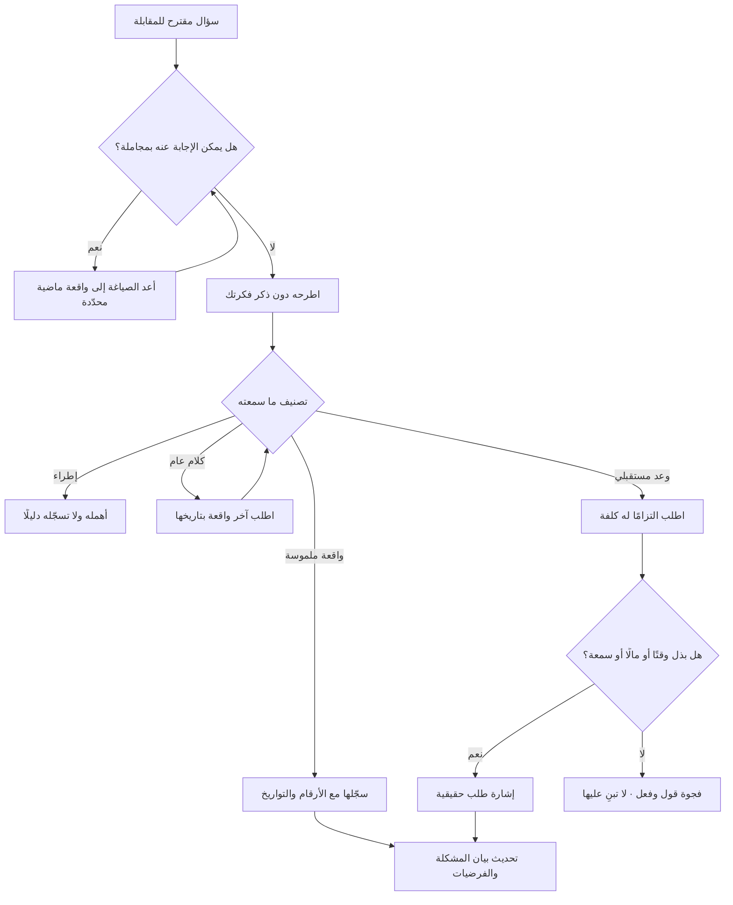

# اختبار الأم (The Mom Test)

> [!info] تعريف مختصر
> قاعدة عملية لصياغة أسئلة البحث، صاغها **روب فيتزباتريك (Rob Fitzpatrick)** في كتابه الصادر عام 2013 بالعنوان نفسه. فكرتها في جملة: **صُغ أسئلتك بحيث لا يستطيع أحد أن يجاملك فيها — حتى أمّك**. الاسم ليس تندّرًا بالأمّهات بل توضيح للمبدأ: أمّك ستقول لك إن فكرتك رائعة لأنها تحبّك، ولذلك فالمشكلة ليست فيها بل في **سؤالك أنت**. أي سؤال يمكن الإجابة عنه بمجاملة هو سؤال معطوب. والحل أن تسأل عن حياة الشخص وسلوكه الماضي وما دفعه فعلًا، لا عن رأيه في فكرتك ولا عن نيّته المستقبلية.

## الشرح العلمي والاحترافي
- **القواعد الثلاث الأساسية للكتاب**: ① **تكلّم عن حياتهم لا عن فكرتك** — الفكرة لا يجوز أن تُذكر أصلًا في مرحلة الاستكشاف، لأن ذكرها يحوّل المحادثة إلى تقييم مجاملة. ② **اسأل عن وقائع محدّدة في الماضي لا عن آراء في المستقبل** — «كم مرة حدث هذا الشهر الماضي؟» بدل «هل تظن أن هذا سيحدث؟». ③ **تكلّم أقل واستمع أكثر** — نسبة الكلام مؤشّر مباشر على جودة الجلسة.
- **فجوة القول والفعل (Say-Do Gap)**: هي المسافة بين ما يقوله الناس إنهم سيفعلونه وما يفعلونه فعلًا حين يحين وقت الدفع أو الالتزام. ليست كذبًا في الأغلب، بل نتيجة طبيعية لثلاثة عوامل مجتمعة: **المجاملة الاجتماعية** (اللطف مع من يعرض عليك مشروعه)، و**ضعف التنبّؤ الذاتي** (الإنسان سيّئ في توقّع سلوكه في ظرف لم يعشه بعد)، و**انعدام الكلفة** (الموافقة في مقابلة مجانية تمامًا، بينما القرار الحقيقي يتطلّب مالًا أو وقتًا أو مخاطرة سمعة). أثرها العملي: التزامات لفظية كثيرة لا تتحوّل إلى سلوك، ومقياس النيّة يبالغ دائمًا في تقدير الطلب. وأمثلتها في العمل يومية: «سنشتري بمجرد أن تُطلقوا» ثم لا شيء، و«سنخصّص فريقًا للتكامل» ثم لا أحد. علاجها ليس بسؤال أفضل عن النيّة بل باستبدال النيّة بـ**الالتزام**: اطلب شيئًا له كلفة حقيقية على المجيب — دفعة مقدّمة، أو مقدّمة إلى صاحب القرار، أو موعد مثبت في تقويمه، أو بيانات فعلية. من يمنحك أحد هذه الثلاثة (وقت، مال، سمعة) قد أعطاك إشارة حقيقية؛ ومن يمنحك ثناءً فقط لم يعطك شيئًا.
- **الإشارات الزائفة التي يحذّر منها الكتاب**: **الإطراء** («فكرة رائعة!»)، و**الكلام العام** («أنا عادةً…» و«دائمًا…» — صيغ تُخفي أن الشيء لم يحدث فعلًا)، و**أحاديث المستقبل** («سأفعل بالتأكيد حين…»). القاعدة العملية: عند سماع أي منها، أعد المسار إلى الواقعة الملموسة بسؤال: «متى آخر مرة حدث ذلك؟ خذني في تفاصيل ما جرى».
- **الفرق بين الإطراء والمعلومة**: المعلومة الجيّدة تحمل دائمًا حقائق قابلة للتحقّق — رقمًا، أو تاريخًا، أو خطوة نُفّذت، أو مبلغًا دُفع. أما الإطراء فبلا محتوى قابل للتحقّق. اختبار سريع: هل أستطيع كتابة ما سمعته على شكل واقعة مؤرّخة؟ إن لم أستطع، فلم أسمع معلومة.
- **العلاقة بالسؤال الموجِّه**: اختبار الأم في جوهره وقاية من صنفين متلازمين من الفساد المنهجي: سؤال يقود المجيب إلى الجواب المرغوب، ومجيب يميل أصلًا إلى إرضاء السائل. ولذلك يُقرأ الكتاب عادةً بوصفه دليل الصياغة المصاحب لممارسة [[User Interview]].
- **الأسئلة الثلاثة التي يوصي بها للتحقّق من جدّية المشكلة**: ما مدى خطورة المشكلة عليك؟ (هل هي مؤلمة أم مزعجة فقط) — ماذا فعلت لحلّها حتى الآن؟ (السلوك الماضي هو الدليل: من لم يجرّب شيئًا فمشكلته ليست ملحّة) — ولماذا لم ينجح ما جرّبته؟ (يكشف القيود الحقيقية). من لم يبذل جهدًا أو مالًا في حل المشكلة سابقًا، غالبًا لن يبذله في حلّك.
- **التطبيق خارج الشركات الناشئة**: القاعدة لا تخصّ مؤسّسي الشركات فقط. تنطبق حرفيًّا على جمع المتطلّبات الداخلية، حيث يقول أصحاب المصلحة «نعم نحتاج هذا» لأن الرفض في اجتماع مكلف اجتماعيًّا؛ وعلى تقييم الموردين؛ وعلى قياس التبنّي الداخلي لأنظمة جديدة ([[Adoption]]) حيث تتضخّم الوعود بالاستخدام قبل الإطلاق وتنهار بعده.
- **حدود الأداة**: اختبار الأم قاعدة صياغة وتقييم إشارات، وليس منهج بحث كامل: لا يحدّد لك من تقابل، ولا حجم العيّنة، ولا كيفية التحليل والتشفير. يُستخدم مع أدوات أخرى: [[Assumption Mapping]] لتحديد ما يستحق السؤال، و[[Jobs to be Done]] لبناء السرد السببي، وأدوات البحث الكمّي لتقدير الحجم.

## أين ومتى يُستخدم
- **في كل مقابلة استكشافية**: بوصفه معيار مراجعة دليل الأسئلة قبل الجلسة، ضمن ممارسة [[User Interview]].
- **في التحقّق من السوق قبل الالتزام بالبناء**: للتمييز بين اهتمام معلن وطلب حقيقي في [[Customer and Market Validation]]، وقبل تحديد نطاق [[MVP]].
- **في جمع المتطلّبات الداخلية**: عند بناء [[BRD]] أو [[PRD]]، حيث تكون موافقة أصحاب المصلحة في الاجتماعات مجاملة مؤسّسية أكثر منها التزامًا — والاختبار يحوّل «نعم» إلى طلب التزام قابل للتحقّق.
- **في تقييم صفقات خطّ المبيعات**: للتمييز بين عميل محتمل «متحمّس» وعميل قدّم التزامًا فعليًّا، بما يمنع بناء خارطة طريق على وعود لفظية.
- **قبل قرارات المضيّ**: مدخلًا لـ[[Go or No-Go Decision]]، بحيث لا يُقبل الحماس دليلًا وتُشترط الالتزامات المسجّلة.
- **في قياس التبنّي بعد الإطلاق**: لتفسير فجوة ما قبل الإطلاق وما بعده في [[Adoption]]، وربطها بسلوك مرصود لا باستطلاعات رضا.

## مثال وسيناريو تطبيقي
> [!example] مؤسّس شركة ناشئة في جدّة يبني منصّة لإدارة مخزون البقالات الصغيرة. أجرى 20 محادثة مع أصحاب محلات، وكان يعرض في كل مرة شاشة تجريبية ويسأل: «لو وفّرنا لك نظامًا يمنع نفاد الأصناف، هل تشترك بـ200 ريال شهريًّا؟». حصل على 17 موافقة، منها 11 بعبارة «أكيد، جهّزه وكلّمني». بعد ستة أشهر من البناء: اشترك اثنان، وأحدهما توقّف في الشهر الثاني.
> هذه هي فجوة القول والفعل في صورتها الصريحة. أعاد المؤسّس الجولة بقواعد اختبار الأم: لا شاشة، ولا ذكر للمنتج، ولا سؤال عن السعر أو النيّة. صار يسأل: «خذني في آخر مرة نفد فيها صنف مطلوب — ماذا حدث؟ ومتى اكتشفت؟ وماذا فعلت؟».
> ما ظهر مختلف تمامًا. من 14 محادثة جديدة: ستّة أصحاب محلات لم يستطيعوا تذكّر واقعة محدّدة أصلًا (إشارة على أن المشكلة ليست مؤلمة عندهم)، وخمسة رووا وقائع دقيقة، وثلاثة تبيّن أنهم يدفعون **بالفعل** مالًا لحل جزئي: اثنان يشغّلان موظّفًا إضافيًّا لجرد ليلي، وواحد اشترك في نظام محاسبي بـ4,300 ريال سنويًّا ولم يستخدم وحدة المخزون فيه لأنها تتطلّب إدخالًا يدويًّا لكل فاتورة مورّد.
> السؤال «ماذا فعلت لحلّها حتى الآن؟» فرز الشريحة فرزًا حادًّا: من دفع سابقًا هو السوق، ومن لم يدفع ولم يجرّب ليس سوقًا مهما أثنى. ثم طبّق المؤسّس اختبار الالتزام بدل النيّة: طلب من الخمسة الجادّين موعدًا مدّته ساعة لمراجعة فواتير مورّديهم معه، ودفعة تجريبية مقدّمة قدرها 500 ريال قابلة للاسترداد. وافق ثلاثة على الموعد، ودفع اثنان. هؤلاء الاثنان — لا الـ17 الذين قالوا «أكيد» — كانوا الإشارة الوحيدة الحقيقية في البحث كلّه.

## خطوات أو مخطّط
1. حدّد ما تحتاج معرفته فعلًا: أي افتراض من [[Assumption Mapping]] تحاول حسمه؟
2. اكتب أسئلتك، ثم مرّر كل سؤال على المحكّ: هل يمكن الإجابة عنه بمجاملة؟ إن نعم، فاحذفه أو أعد صياغته.
3. احذف من الدليل كل سؤال يبدأ بـ«هل تظن…» أو «هل ستستخدم…» أو «كم ستدفع مقابل…».
4. استبدلها بأسئلة وقائع: «متى آخر مرة…؟»، «ماذا فعلت حينها؟»، «كم كلّفك ذلك؟»، «ماذا جرّبت؟ ولماذا لم ينجح؟».
5. لا تذكر فكرتك ولا منتجك في المحادثة الاستكشافية إطلاقًا.
6. أثناء الجلسة، صنّف ما تسمعه لحظيًّا إلى: واقعة (قيّمة) · إطراء (مُهمَل) · كلام عام (يستدعي تعمّقًا) · وعد مستقبلي (يستدعي طلب التزام).
7. عند كل كلام عام، أعد المسار إلى واقعة محدّدة مؤرّخة.
8. اختم بطلب التزام حقيقي له كلفة: مال، أو وقت مثبت في تقويم، أو مقدّمة إلى صاحب قرار.
9. سجّل نتيجة طلب الالتزام — قَبِل أم اعتذر — فهذه هي البيانات الحقيقية للجلسة، لا الانطباع العام.
10. حلّل النتائج بفصل من «قال» عمّن «فعل»، واحسب نسبة من تجاوز فجوة القول والفعل.
11. حدّث [[Problem Statement]] و[[Hypothesis]] بناءً على الوقائع والالتزامات فقط.

## ⚠️ مفاهيم خاطئة شائعة
> [!warning]
> - **«اختبار الأم يعني اختبار فكرتك على أمّك»**: عكس المقصود تمامًا. المعنى أن تصوغ أسئلتك بحيث تكون إجابة أمّك عليها ذات قيمة رغم انحيازها لك — أي أن يكون السؤال محصّنًا ضد المجاملة، لا أن يكون المُجيب محصّنًا.
> - **«الناس يكذبون في المقابلات»**: خطأ في التشخيص. الأغلب لا يكذب، بل يجامل ويتوقّع سلوكه المستقبلي بشكل رديء وهو صادق تمامًا في اللحظة. تصحيح التشخيص مهم لأنه ينقل اللوم من المُجيب إلى تصميم السؤال — حيث يمكن إصلاحه فعلًا.
> - **«فجوة القول والفعل تُحلّ بسؤال الناس عن نيّتهم بدقّة أكبر»**: خطأ. تحسين صياغة سؤال النيّة لا يُغلق الفجوة، لأن العلّة في انعدام الكلفة لا في الصياغة. الغلق الوحيد هو استبدال النيّة بالتزام له ثمن.
> - **«الكتاب موجّه لمؤسّسي الشركات الناشئة فقط»**: خطأ. الديناميكية نفسها تعمل داخل المؤسّسات: الموافقة المهذّبة في اجتماع المتطلّبات هي نفسها مجاملة الأم، وكلفتها أكبر لأنها تُترجم مباشرة إلى ميزانيات.
> - **«الاهتمام الشديد أثناء المقابلة مؤشّر جيّد»**: خطأ. الحماس مجاني وسريع الزوال. المؤشّر الوحيد هو ما بُذل: وقت، أو مال، أو سمعة (كأن يقدّمك إلى مديره).
> - **«اختبار الأم منهج بحث متكامل»**: خطأ. هو قاعدة صياغة وتقييم إشارات، ويحتاج إلى منهج تجنيد وعيّنة وتحليل بجانبه، وإلى بيانات كمّية لتقدير الحجم.

## ❌ ممارسات خاطئة في المشاريع
> [!failure]
> - **بناء خارطة الطريق على وعود شفهية من العملاء**: الخطأ أن تُدرج ميزات لأن عميلًا كبيرًا قال «سنشتري إن وُجدت». لماذا يضرّ: تُستهلك أرباع كاملة في بناء ما لا يُشترى، لأن الوعد لم يكلّف قائله شيئًا. الحل: لا تُدرج بندًا مبنيًّا على طلب عميل قبل الحصول على التزام موثّق — خطاب نيّة، أو دفعة، أو موعد تكامل مثبت.
> - **سؤال أصحاب المصلحة الداخليين عن رأيهم في الحل بدل مشكلتهم**: الخطأ أن تُجمع المتطلّبات بسؤال «ما رأيك في هذا النظام؟». لماذا يضرّ: الرفض في اجتماع مكلف اجتماعيًّا، فتُعتمد المتطلّبات بموافقة صامتة ثم يُقاوَم النظام بعد الإطلاق فينخفض التبنّي. الحل: اسألهم عن يوم عملهم الفعلي وعمّا فعلوه آخر مرة تعطّل فيها الإجراء، واطلب منهم بيانات فعلية لا آراء.
> - **قياس نجاح البحث بعدد الردود الإيجابية**: الخطأ أن يُرفع للإدارة «85% أبدوا اهتمامًا». لماذا يضرّ: يُحوّل الإطراء إلى رقم يبدو موضوعيًّا، ويُبنى عليه قرار استثماري. الحل: أبلغ فقط عن الالتزامات والوقائع: كم شخصًا دفع؟ كم خصّص وقتًا؟ كم يدفع اليوم لحل بديل؟
> - **عرض المنتج في بداية المقابلة**: الخطأ أن يبدأ الباحث بشرح الفكرة ليضع «السياق». لماذا يضرّ: يفسد بقية الجلسة كلها لأن المُجيب يعرف من اللحظة الأولى ما تريد سماعه. الحل: أجّل عرض الفكرة إلى آخر خمس دقائق، بعد تسجيل كل الوقائع.
> - **إهمال سؤال «ماذا فعلت لحلّها حتى الآن؟»**: الخطأ أن يُكتفى بتأكيد وجود المشكلة. لماذا يضرّ: يُخلط بين المشكلة المزعجة والمشكلة المؤلمة، فتُموَّل مشكلة لا أحد مستعد للدفع مقابل حلّها. الحل: اجعل هذا السؤال إلزاميًّا في كل مقابلة، واعتبر غياب أي محاولة سابقة مؤشّرًا سلبيًّا قويًّا يُوثَّق.
> - **الاكتفاء بالحديث مع المتحمّسين والمعارف**: الخطأ أن تُجرى المحادثات مع من يجاملك بحكم العلاقة. لماذا يضرّ: يضاعف المجاملة إلى حدّ يُلغي قيمة البحث تمامًا. الحل: أدخل في كل جولة شريحة من غرباء لا تربطهم بك علاقة، وقارن الفارق بين المجموعتين — الفارق نفسه معلومة مفيدة.
> - **تفسير الاعتذار عن الالتزام على أنه رفض للمنتج**: الخطأ أن يُهمَل من رفض دفعة تجريبية بوصفه غير مهتم. لماذا يضرّ: يضيع أثمن سؤال في البحث. الحل: عند الاعتذار اسأل مباشرة: «ما الذي كان يجب أن يكون مختلفًا لتقول نعم؟» — الإجابة هنا غالبًا أصدق من كل ما قيل قبلها.

## 🔗 مصطلحات ومفاهيم ذات صلة
[[User Interview]] | [[Problem Statement]] | [[Hypothesis]] | [[Assumption Mapping]] | [[Confirmation Bias]] | [[Customer and Market Validation]] | [[Jobs to be Done]] | [[Pain Point]] | [[MVP]] | [[Adoption]] | [[Go or No-Go Decision]] | [[Product Discovery]]
