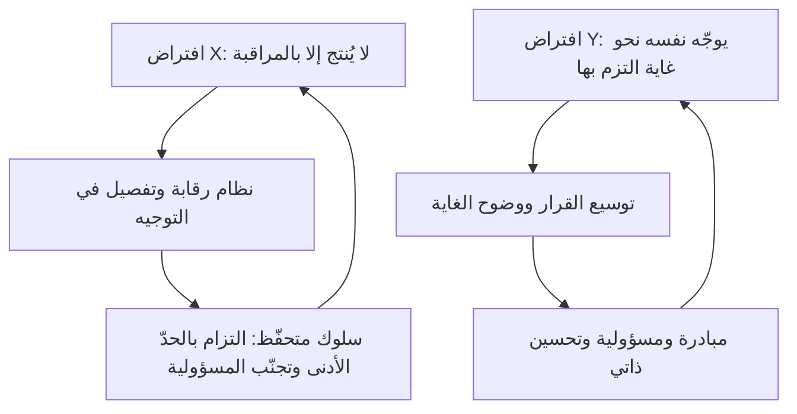

# نظريتا X وY (Theory X and Y)

> [!info] تعريف مختصر
> **نظريتا X وY** وصفٌ وضعه **دوغلاس ماكجريجور** في كتابه *The Human Side of Enterprise* (1960) لافتراضين متقابلين يحملهما **المدير** عن طبيعة الإنسان في العمل: فـ**نظرية X** تفترض أن الإنسان يكره العمل بطبعه فلا يُنتج إلا بالمراقبة والدفع، و**نظرية Y** تفترض أن بذل الجهد طبيعيّ كاللعب والراحة، وأن الإنسان يوجّه نفسه نحو أهدافٍ التزم بها ويطلب المسؤولية حين تُتاح له. **وأهمّ ما في الفكرة أن هذين الافتراضين يحقّقان نفسيهما**: فالمدير الذي يفترض X يبني نظام مراقبة يُنتج سلوك X فعلًا، فيرى في النتيجة تصديقًا لافتراضه.

## الشرح العلمي والاحترافي

**موضع النظريتين من تاريخ الإدارة.** جاء ماكجريجور — وكان أستاذًا في معهد ماساتشوستس — بعد نصف قرن من هيمنة [[Scientific Management|الإدارة العلمية]]، وسؤاله مختلف عن سؤال تايلور: لم يسأل «ما الطريقة المثلى للعمل؟» بل **«على أيّ تصوّر للإنسان بنينا نظمنا الإدارية؟»**. فنقل النقاش من تصميم العمل إلى الافتراض المستتر خلف تصميمه.

**افتراضات نظرية X:** أن الإنسان الوسط يكره العمل ويتجنّبه ما استطاع، فلا بدّ من إكراهه وضبطه وتوجيهه والتهديد بالعقاب ليبذل الجهد؛ وأنه يفضّل أن يُوجَّه، ويتجنّب المسؤولية، ويطلب الأمان قبل كل شيء.

**وافتراضات نظرية Y ستّة:** أن بذل الجهد البدني والذهني في العمل طبيعيّ كاللعب والراحة؛ وأن الرقابة الخارجية ليست الوسيلة الوحيدة لبذل الجهد، فالإنسان يمارس **التوجيه الذاتي** نحو غاية التزم بها؛ وأن الالتزام دالّة في العائد المرتبط بتحقيق الغاية — وأهمّه عائد داخليّ كتحقّق الذات؛ وأن الإنسان يتعلّم في الظروف المناسبة أن **يطلب** المسؤولية لا أن يقبلها فحسب؛ وأن القدرة على التخيّل والابتكار موزّعة في الناس على سعة لا على ندرة؛ وأن طاقات الإنسان الذهنية **مستغَلّة جزئيًّا فقط** في العمل الصناعي الحديث.

**وأكثر ما يُشوَّه في عرض هذه الفكرة** أن تُقدَّم حكمًا أخلاقيًّا: X شرّ وY خير. وليس هذا ما قاله ماكجريجور. فمقصوده أن **X استراتيجية تقوم على تصوّر ناقص عن الدوافع الإنسانية**، وأنها تنجح ظاهريًّا لأنها تصنع الواقع الذي تصفه؛ وأن Y ليست وصفة إدارية جاهزة ولا دعوةً إلى التسيّب، بل **افتراض يفتح خيارات تصميمية** — كالإدارة بالأهداف، وتوسيع مدى القرار، والمشاركة في وضع المعايير. وقد نبّه على أن كثيرًا من الناس لم يُتَح لهم قطّ ما يُظهر سلوك Y منهم، فيُحكم عليهم بما صنعه بهم النظام.

### ونظرية Z: محاولة ثالثة بعد عشرين سنة

طرح **وليام أوتشي** سنة 1981 في كتابه *Theory Z* اقتراحًا مختلف المستوى: فهو لا يصف افتراض المدير عن الإنسان، بل يصف **بنية المنظّمة** التي رآها في الشركات اليابانية ثم اقترح تهجينها مع الأمريكية. وأركانه: التوظيف طويل الأمد، والقرار الجماعي مع مسؤولية فردية، والتقييم والترقية البطيئان، والرقابة الضمنية غير الرسمية مع مقاييس صريحة، والمسارات المهنية متوسّطة التخصّص، والعناية الشاملة بالموظّف إنسانًا لا موردًا.

**وقيمته اليوم أنه يفسّر ما لا تفسّره Y وحدها:** أن الثقة ليست خُلقًا يُطلب من المدير، بل **ناتج ترتيبات مؤسّسية** — فمن يعلم أنه باقٍ عشر سنين يستثمر في زميله ومنتجه، ومن يُقيَّم كل ثلاثة أشهر يحسّن ما يُقاس فيها.

### جدول التمييز: X · Y · Z · وأجايل

هذه أربعة مستويات مختلفة تُخلط كثيرًا، **فتُقارن هنا على ما يفعله كلٌّ منها في التنظيم لا على أوصافه**:

| ما يقرّره | نظرية X | نظرية Y | نظرية Z | [[01 - Agile\|أجايل]] |
|---|---|---|---|---|
| **ما تصفه أصلًا** | افتراض المدير عن الإنسان | افتراض المدير عن الإنسان | بنية المنظّمة وعقدها مع الموظّف | طريقة تنظيم العمل وتسليمه |
| **من يقرّر كيفيّة العمل** | الإدارة، ويُنفَّذ | يُفوَّض بحسب النضج | الجماعة بالتشاور ثم مسؤولية فردية | الفريق نفسه ([[Self-Organizing Team\|منظّم ذاتيًّا]]) |
| **مصدر الدافع المفترَض** | العائد والعقاب | تحقّق الذات والالتزام بالغاية | الانتماء والأمن الوظيفي طويل الأمد | القيمة المسلَّمة و[[Feedback Loop\|إشارة الأثر]] السريعة |
| **وظيفة الرقابة** | ضبط الأداء | تصحيح المسار عند الحاجة | ضمنية عبر الثقافة والزمالة | شفافية الحالة لا مراقبة الأشخاص |
| **ما يقيسه** | الإنجاز والانضباط | بلوغ الأهداف المتّفق عليها | الولاء والمساهمة على المدى الطويل | [[22 - Outputs and Outcomes\|الأثر لا المخرَج وحده]] |
| **أين ينجح** | عمل متكرّر معروف الطريقة، وظروف الطوارئ | عمل معرفيّ متغيّر | ثقافات مستقرّة منخفضة الدوران الوظيفي | عمل غير مؤكّد سريع التغيّر |

> **السؤال الفارق:** X وY يسألان: **ما ظنّك بالناس؟** وZ يسأل: **ما الترتيب المؤسّسي الذي يجعل الثقة ممكنة؟** وأجايل تسأل: **كيف نصمّم العمل حتى يظهر أثر القرار سريعًا فيصحّح نفسه؟** — فالثلاثة الأخيرة لا تتنافس، وأكثر ما تسمّيه المنظّمات «تحوّلًا رشيقًا» هو في حقيقته محاولة انتقالٍ من X إلى Y بأدوات أجايل.

**وهنا موضع أشيع أعطال التحوّل:** أن تُستورَد مناسبات أجايل وأدواتها كاملةً ويبقى افتراض X قائمًا. فتصير الوقفة اليومية تقرير حالة، ومخطّط الإنجاز أداة محاسبة، والسرعة مقياسَ أفراد. **والشكل رشيق والافتراض تايلوريّ**، فلا يُنتج الشكل شيئًا.

## أين ومتى يُستخدم

- **في تشخيص التحوّلات المتعثّرة**: حين تُطبَّق الممارسات ولا تتغيّر النتائج، فالسؤال عن الافتراض لا عن الممارسة.
- **في تصميم نظم القياس**: فكل مقياس يحمل افتراضًا عمّن يُقاس؛ ومقياس بُني على X يُنتج سلوك X ولو حَسُنت نيّة واضعه.
- **في تدريب المديرين الجدد**: إذ أكثر ما يقع فيه المدير حديث العهد هو الإدارة التفصيلية ([[Micromanagement]])، وهي X مطبَّقة بلا وعي بها.
- **وفي حدودها:** نظرية X ليست باطلة في كل موضع؛ ففي الطوارئ وفي العمل عالي الخطورة يكون التوجيه الحازم صوابًا. **والخطأ أن تصير الحالة الاستثنائية أسلوبًا دائمًا.**

## مثال وسيناريو تطبيقي

> [!example] سيناريو ملموس
> شركة اسمها **«ركائز»** تعلن تحوّلًا رشيقًا: سبرنتات، ووقفة يومية، ومراجعة، واسترجاع. وبعد أربعة أشهر تُقاس النتيجة: **لا تغيّر يُذكر** في زمن التسليم ولا في رضا العملاء ولا في معنويات الفرق.
>
> **وعند الفحص يظهر أن الافتراض لم يتحرّك:**
>
> - الوقفة اليومية يحضرها مدير الإدارة ويسأل كل فرد عمّا أنجزه أمس — فهي **تقرير حالة** لا تنسيقًا بين المطوّرين.
> - سرعة الفريق تُعرض في تقييم الأفراد نصف السنوي.
> - وكل تقدير يضعه الفريق يُراجَع ويُخفَّض «لأن الفرق تبالغ عادةً».
>
> **والنتيجة سلوك X كاملًا**: يرفع الفريق تقديراته احتياطًا، فتُخفَّض، فيرفعها أكثر — وتنشأ حلقة انعدام ثقة **يصنعها النظام لا الأشخاص**، ثم تُقرأ تأكيدًا لأن «الفرق لا يُوثق بتقديرها».
>
> **والتغيير الذي نفع** لم يكن في المناسبات بل في ثلاثة قرارات: خروج المدير من الوقفة اليومية، وسحب السرعة من تقييم الأفراد، والتزام قبول تقدير الفريق مع قياس الفارق بين المقدَّر والفعليّ **بلا محاسبة عليه ثلاثة أشهر**. فعادت التقديرات إلى صدقها في شهرين — لأن الكذب فيها لم يعد يشتري شيئًا.

## خطوات أو مخطّط

1. **استخرج الافتراض من النظام لا من الأقوال**: انظر إلى ما يُقاس، ومن يوقّع على ماذا، ومن يحضر أي اجتماع.
2. **اسأل عن كل ضابط**: أهو موجود لتنسيق العمل أم للتحقّق من الناس؟
3. **وسّع مدى القرار تدريجًا** بحدود مكتوبة ([[Guard Rails|حواجز الحماية]])، لا دفعةً واحدة.
4. **افصل مقاييس التحسين عن تقييم الأفراد** فصلًا معلنًا، وإلا فسدت المقاييس ([[Goodhart's Law]]).
5. **راقب الحلقة**: كلّما اتّسع القرار وظهر أثره الصحيح، ضاق مبرّر الرقابة تلقائيًّا.

## ⚠️ مفاهيم خاطئة شائعة

> [!warning]
> - **أنهما نوعان من الموظّفين.** بل هما **افتراضان في ذهن المدير**، ووصفٌ لنظامٍ يُنتج السلوك الذي يتوقّعه. والشخص الواحد يسلك السلوكين في نظامين مختلفين.
> - **أن Y تعني غياب المعايير والمساءلة.** بل تعني أن الالتزام يأتي من وضوح الغاية والمشاركة فيها؛ والمساءلة عن **النتيجة** تبقى، وإنما يتغيّر من يملك تقرير الطريقة.
> - **أن ماكجريجور دعا إلى إلغاء X.** بل بيّن أن X تصف الدوافع وصفًا ناقصًا، وأن Y **تفتح** خيارات لا تفرض وصفة. وهو نفسه حذّر من قراءتها ثنائية أخلاقية.
> - **أن نظرية Z طبقة ثالثة على المحور نفسه.** هي في مستوى آخر: تصف **بنية المنظّمة** لا افتراض الفرد — كما في جدول التمييز أعلاه.

## ❌ ممارسات خاطئة في المشاريع

> [!failure]
> - **تبنّي ممارسات أجايل مع إبقاء نظام الحوافز على X**: فتُقاس السرعة على الأفراد وتُراجَع التقديرات كل مرّة، فتموت الممارسات من داخلها. **التجنّب:** غيّر مقياسًا واحدًا قبل أن تضيف مناسبةً واحدة.
> - **إعلان الثقة بلا نقل صلاحية**: «أنتم أصحاب القرار» ثم يُنقض كل قرار عند أوّل خلاف. **والنقض المتكرّر أسوأ من عدم التفويض ابتداءً**، لأنه يُعلّم الفريق أن المبادرة كلفة بلا عائد. **التجنّب:** حدّد كتابةً ما لا يحتاج إذنًا، والتزم به حتى حين تختلف.
> - **قراءة نتيجة نظامٍ رقابيّ حكمًا على الناس**: «جرّبنا التفويض ففشلوا» — بعد أسابيع من نظام علّمهم عكسه. **التجنّب:** أمهل التغيير دورتين على الأقلّ قبل الحكم، وقِس السلوك لا الانطباع.
> - **استعمال «هذا فريق X» عذرًا**: فتصير النظرية أداة تصنيف للناس بدل أن تكون مرآةً للنظام — وهو عكس مقصود صاحبها تمامًا.

## 🔗 مصطلحات ومفاهيم ذات صلة

[[Scientific Management]] | [[Command and Control]] | [[Self-Organizing Team]] | [[Empowerment]] | [[Micromanagement]] | [[Psychological Safety]] | [[Servant Leadership]] | [[Goodhart's Law]] | [[Guard Rails]] | [[Alignment]] | [[01 - Agile]] | [[Leadership at Every Level]]
