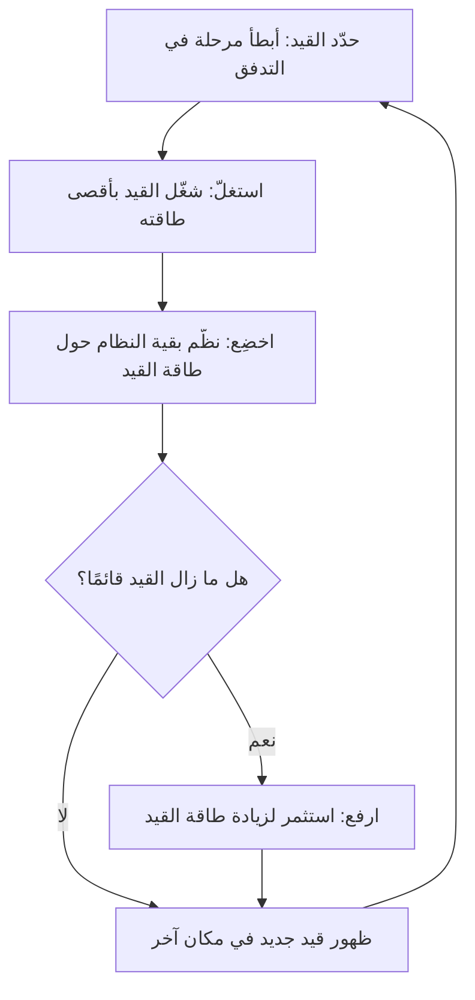

# نظرية القيود (Theory of Constraints)
> [!info] تعريف مختصر
> **نظرية القيود (Theory of Constraints - TOC)** منهجية إدارية طوّرها إلياهو غولدرات تقول: إن أداء أي نظام (مشروع، خط إنتاج، فريق) محدود دائمًا بـ "قيد" واحد (Constraint) هو أضعف حلقة فيه. لتحسين أداء النظام كله، يجب التركيز على معالجة هذا القيد تحديدًا، لا تحسين أجزاء عشوائية أخرى.

## الشرح العلمي والاحترافي
الفكرة المحورية: **سلسلة أقوى ما تكون بقوة أضعف حلقة فيها**. مهما حسّنت أجزاء النظام غير المقيَّدة، فإن الإنتاجية الكلية للنظام ([[Throughput]]) لن تتحسن إلا بمقدار ما يسمح به القيد (يُعرف أيضًا بـ[[Bottleneck]]).

طوّر غولدرات منهجية من خمس خطوات لإدارة القيود، تُعرف بـ"خطوات التركيز الخمس":
1. **حدّد** القيد (أضعف حلقة/أبطأ مرحلة في النظام).
2. **استغلّ** القيد إلى أقصى طاقته الممكنة دون استثمار إضافي (مثلًا: امنع القيد من التوقف لأي سبب ثانوي).
3. **اخضِع** بقية النظام لخدمة القيد — لا تُنتج المراحل الأخرى أسرع من طاقة القيد لأن ذلك يُراكم عملًا معلّقًا فقط.
4. **ارفع** طاقة القيد (استثمار: موارد إضافية، أتمتة، تدريب) إذا استمر القيد بعد الخطوتين السابقتين.
5. **كرّر** العملية — فور حل قيد، يظهر قيد جديد في مكان آخر من النظام، فتبدأ الدورة من جديد.

هذه النظرية أصل مباشر لمبدأ [[Pull System]] و[[WIP Limit]] في [[03 - Kanban]]: بدل ضخ عمل جديد بمعدل ثابت، يُنظَّم تدفق العمل بحيث لا يتجاوز طاقة أضعف حلقة، مما يمنع تراكم العمل قيد التنفيذ ويُقلّل [[Cycle Time]]. كما ترتبط بمفهوم [[Little's Law]] الذي يفسر رياضيًا لماذا يُخفّض تحديد القيد زمن الدورة.

## أين ومتى يُستخدم
- عند تحليل لماذا يتأخر تسليم المشروع رغم أن معظم الفريق "مشغول" ومنتج.
- في [[03 - Kanban]] وLean لتحديد أين يجب وضع [[WIP Limit]] فعليًا.
- في اتخاذ قرار التوظيف أو الاستثمار: يجب توجيه الموارد الجديدة إلى القيد الفعلي، لا إلى أي قسم عشوائي.
- في تحليل خط الأنابيب (Pipeline) للمشاريع المتعددة لمعرفة أي مرحلة تُبطئ كل المشاريع.

## مثال وسيناريو تطبيقي
> [!example]
> في شركة برمجيات "كودكس"، يشتكي المدير من أن ميزات المنتج تستغرق أسابيع طويلة للوصول للعملاء رغم أن فريق التطوير (12 مطورًا) يعمل بجد.
> 
> - **حدّد القيد**: عند رسم [[Value Stream Mapping]]، يتضح أن التطوير يستغرق يومين فقط لكل ميزة، لكن مرحلة "الاختبار والموافقة الأمنية" (يُنفّذها شخص واحد فقط) تستغرق 10 أيام لأن نفس الشخص يراجع كل الميزات من كل الفرق. القيد هو مراجع الأمان الوحيد.
> - **استغلّ**: يُعفى المراجع من الاجتماعات غير الضرورية ومن المهام الإدارية كي يقضي وقته كاملًا في المراجعة فقط.
> - **اخضِع**: يتفق فريق التطوير على عدم إرسال أكثر من 3 ميزات في وقت واحد للمراجعة (وضع [[WIP Limit]]) بدل إغراق المراجع بالعمل المتراكم.
> - **ارفع**: بعد شهر، لا يزال القيد قائمًا، فتقرر الشركة تدريب مطوّر ثانٍ على المراجعة الأمنية ليعمل بالتوازي.
> - **كرّر**: بعد حل هذا القيد، يظهر أن مرحلة "الموافقة على النشر من طرف العميل" أصبحت الآن أبطأ مرحلة — قيد جديد يبدأ الفريق بمعالجته.

## خطوات أو مخطّط

## ⚠️ مفاهيم خاطئة شائعة
> [!warning]
> - **الاعتقاد أن تحسين كل جزء من النظام يحسّن الكل**: تحسين مراحل غير القيد لا يزيد الإنتاجية الكلية، بل قد يزيد فقط تراكم العمل المعلّق أمام القيد.
> - **الخلط بين "الشخص الأكثر انشغالًا" و"القيد الفعلي"**: القيد هو المرحلة التي تحدّ من تدفق النظام بأكمله، وليس بالضرورة أكثر شخص يبدو مرهقًا.
> - **معالجة القيد مرة واحدة واعتبار المشكلة محلولة نهائيًا**: القيد ينتقل دائمًا؛ إدارة القيود عملية مستمرة لا حدث لمرة واحدة.

## ❌ ممارسات خاطئة في المشاريع
> [!failure]
> - **توظيف موارد إضافية في أقسام غير مقيَّدة**: إضافة مطورين حين يكون القيد في المراجعة أو الاختبار لا يحل شيئًا ويزيد التكلفة فقط ([[100 Percent Utilization Fallacy]]).
> - **إغراق القيد بعمل زائد**: إرسال كل العمل الممكن للقيد دفعة واحدة يزيد [[Cycle Time]] بدل تحسينه؛ يجب تنظيم التدفق إليه.
> - **تجاهل القيد والاستمرار في "العمل الجاد" في كل مكان**: بدون تحديد القيد بوضوح، تُهدر الجهود في تحسينات لا تُغيّر الإنتاجية الكلية للنظام.

## 🔗 مصطلحات ومفاهيم ذات صلة
[[Bottleneck]] | [[Throughput]] | [[WIP Limit]] | [[Pull System]] | [[Little's Law]] | [[Cycle Time]] | [[Value Stream Mapping]] | [[100 Percent Utilization Fallacy]] | [[03 - Kanban]] | [[Toyota Production System]]

> [!tip] 💡 إثراء عملي — كورس الإنتاجية
> تطبيق القيد عمليًّا على تشخيص التدفّق: متى يكون الفريق ليس القيد إطلاقًا، ولماذا يكون تحسينه هدرًا: [[09 - التشخيص العملي - قراءة الأرقام]].

> [!tip] 💡 إثراء عملي — كورس الإنتاجية
> الخطوات الخمس المسمّاة عند غولدرات، ولماذا الثالثة والخامسة هما المهملتان، وحدّ دعوى «اختناق واحد» في العمل المعرفي: [[14 - مصفوفة التدفّق ونظرية القيود]].
