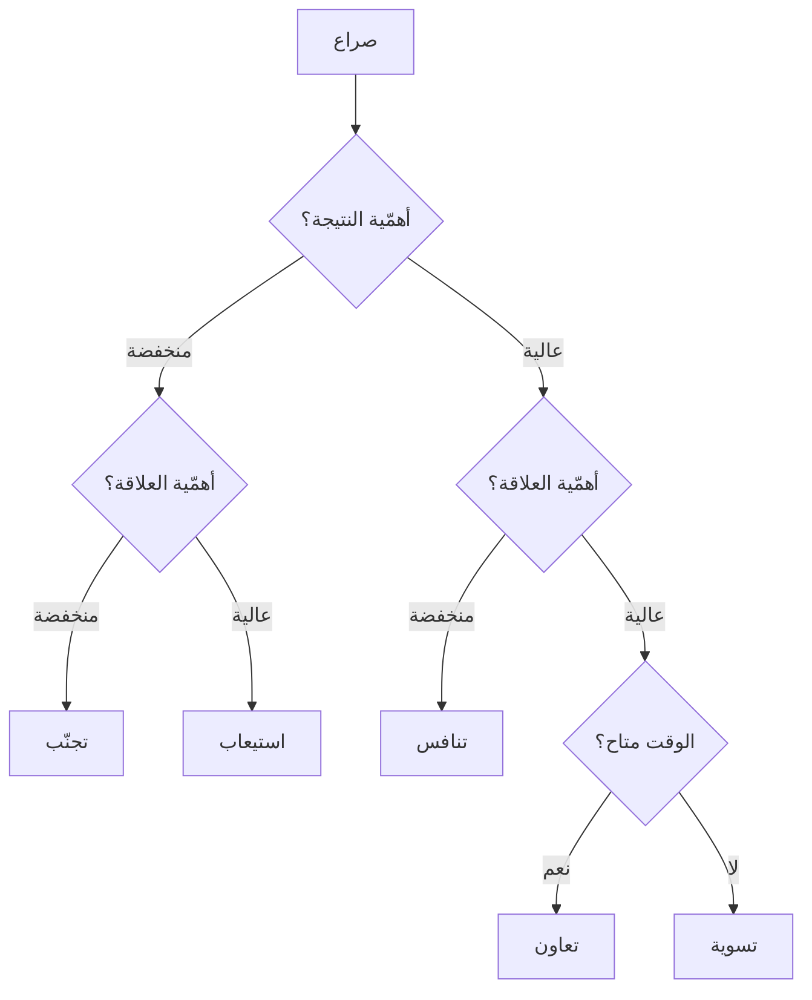

# أنماط توماس-كيلمان للصراع (Thomas-Kilmann Conflict Modes)
> [!info] تعريف مختصر
> نموذج يُصنّف استجابات البشر للصراع في **خمسة أنماط** على محورَي **الحزم** (السعي إلى مصلحتك) و**التعاون** (مراعاة مصلحة الآخر): التنافس · التجنّب · التسوية · الاستيعاب · التعاون. وأطروحته أنّ **لكلّ نمط موضعًا صحيحًا** — والخطأ هو استخدام نمط واحد في كلّ موقف.

## الشرح العلمي والاحترافي
طوّره **كينيث توماس ورالف كيلمان** عام 1974 في أداة `TKI`، بناءً على شبكة بليك–موتون الإدارية.

| النمط | حزم | تعاون | يصلح حين | خطره |
|---|---|---|---|---|
| **التنافس** | عالٍ | منخفض | سلامة · أخلاق · قرار عاجل لا يحتمل نقاشًا | يُدمّر العلاقة ويُنتج مقاومة مؤجّلة |
| **التجنّب** | منخفض | منخفض | الموضوع تافه · التوقيت سيّئ · الاستثارة عالية جدًّا | مشكلات تتراكم بلا معالجة |
| **التسوية** | متوسّط | متوسّط | وقت ضيّق · طرفان متكافئان · حلّ مؤقّت | «أنصاف الحلول» — لا أحد راضٍ تمامًا |
| **الاستيعاب** | منخفض | عالٍ | الموضوع أهمّ له منه لك · بناء رصيد | يُقرأ ضعفًا إن تكرّر |
| **التعاون** | **عالٍ** | **عالٍ** | القرار مهمّ والعلاقة مستمرّة | **الأغلى زمنيًّا** — لا يُنفَق على كلّ شيء |

**وموقع أدوات التأثير من النموذج واضح:** [[Displacement Strategy|الإزاحة]] هي نمط **التعاون**؛ و«التنازل إرضاءً للآخرين» المرفوض هو **الاستيعاب**؛ وإخراج العقد سلاحًا أوّلًا هو **التنافس**؛ و«أنصاف الحلول» المرفوضة هي **التسوية**.

**وهنا حدّ نقدي مهمّ:** كثير من أدبيات التفاوض المعاصرة تُقدّم **التعاون بوصفه النمط الصحيح دائمًا** — وهذه مبالغة. فالتجنّب صحيح مع خلاف تافه أو توقيت رديء؛ والتنافس ضروري في مسائل السلامة والأخلاق؛ والاستيعاب صحيح حين يكون الموضوع أهمّ لغيرك وتريد بناء رصيد. **والتعاون هو الأغلى ثمنًا — فلا يُنفَق على كلّ شيء.**

## أين ومتى يُستخدم
- تشخيص نمطك الافتراضي وأنماط فريقك — أوّل خطوة في تحسين إدارة الصراع.
- اختيار الاستجابة قبل الدخول في موقف صعب بدل الانجرار إلى النمط الاعتيادي.
- تدريب مديري المشاريع على أنّ «الحلّ الودّي» ليس دائمًا الصحيح.

## مثال وسيناريو تطبيقي
> [!example] مديرة تسليم نمطها الافتراضي **التعاون** — تُدير كلّ خلاف بجلسة إزاحة كاملة بمتوسّط ساعة. والنتيجة بعد ربع سنة: خلافات كبيرة حُلَّت جيّدًا، **وسبع عشرة ساعة أُنفقت على خلافات تافهة** كان التجنّب كافيًا معها («هذه نُقرّرها لاحقًا، لنُكمل»). وفي المقابل، حين اكتشفت أنّ مطوّرًا يتجاوز بوّابة الأمن لتسريع النشر، أدارت الموقف بجلسة تعاونية أيضًا — **وكان الصحيح تنافسًا صريحًا**: «هذا لا يتكرّر، وهذه ليست نقطة قابلة للنقاش.» **فالخطأ لم يكن في إتقان النمط بل في عدم الفرز.**

## خطوات أو مخطّط
1. صنّف الموقف: **ما أهمّية النتيجة؟ وما أهمّية العلاقة؟**
2. اختر النمط بناءً على الإجابتين لا على عادتك.
3. إن اخترتَ التعاون، خصّص له الوقت الكافي — وإلّا انزلق إلى تسوية.
4. إن اخترتَ التنافس، **صرّح به وبسببه**: «هذه ليست نقطة قابلة للنقاش، والسبب كذا.»
5. راجع بعد شهر: **كم موقفًا أدرتَه بنمط لم يكن مناسبًا؟**

## ⚠️ مفاهيم خاطئة شائعة
> [!warning]
> - **التعاون ليس النمط الصحيح دائمًا** — إنّه الأغلى، ويستحقّ حين تكون النتيجة والعلاقة مهمّتين معًا.
> - **التجنّب ليس جبنًا.** تأجيل خلاف في لحظة استثارة عالية قرار سليم — **بشرط أن يُستأنَف بموعد** لا أن يُدفَن.
> - **الأداة تصف تفضيلات لا تُحدّد قدرات.** من نمطه الافتراضي التجنّب يستطيع التنافس عند الضرورة؛ والغرض توسيع الخيارات لا تصنيف الناس.

## ❌ ممارسات خاطئة في المشاريع
> [!failure]
> - **استخدام نمط واحد في كلّ موقف** — وهو الخطأ الأصلي الذي وُضع النموذج لعلاجه.
> - **التسوية بوصفها حلًّا افتراضيًّا** — «نلتقي في المنتصف» يُنتج حلولًا لا تُرضي أحدًا ولا تُعالج السبب؛ وهي «أنصاف الحلول» التي تُحذّر منها أدبيات التفاوض.
> - **التنافس بلا تصريح بسببه** — الفرض بلا تفسير يُنتج امتثالًا ظاهريًّا و[[Fake Yes|«نعم» زائفة]].
> - **تصنيف الأشخاص بالأداة** («فلان تجنّبيّ») بدل تصنيف المواقف — يُنتج تنميطًا يمنع التغيير.

## 🔗 مصطلحات ومفاهيم ذات صلة
[[Displacement Strategy]] | [[Task vs Relationship Conflict]] | [[Positive Refusal]] | [[Tactical Empathy]] | [[Psychological Safety]] | [[Facilitator]] | [[Emotional Intelligence]] | [[Tuckman's Stages of Group Development]]

> [!tip] 💡 إثراء عملي — كورس لعبة العقل
> موقع «الإزاحة» من الأنماط الخمسة، والصراعات الخمسة في بيئة العمل وعلاج كلٍّ منها: [[07 - إدارة الصراع - الطبقات الأربع والصراعات الخمسة]].
