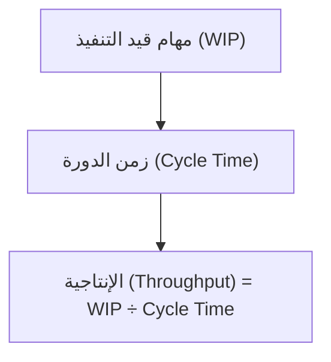

# الإنتاجية (Throughput)
> [!info] تعريف مختصر
> الإنتاجية (Throughput) هي عدد المهام أو عناصر العمل التي يُكمِلها الفريق فعلياً خلال فترة زمنية محددة (مثل أسبوع أو شهر). تقيس "كمية القيمة المُنجَزة" لا مجرد النشاط.

## الشرح العلمي والاحترافي
- تُحسب الإنتاجية عادة بعدد المهام المكتملة (Done) خلال فترة زمنية ثابتة، مثل "8 مهام في الأسبوع" أو "35 قصة مستخدم في الشهر".
- ترتبط الإنتاجية بـ [[Cycle Time]] و[[WIP Limit]] عبر قانون ليتل ([[Little's Law]]): الإنتاجية = متوسط عدد المهام قيد التنفيذ ÷ متوسط زمن الدورة. أي أن تقليل عدد المهام المتزامنة مع تقصير زمن الدورة يرفع الإنتاجية.
- الإنتاجية العالية لا تعني بالضرورة أن الفريق "يعمل بجهد أكبر"، بل غالباً تعني أن النظام أقل ازدحاماً وأكثر تدفقاً (تطبيق مفاهيم مثل [[WIP Limit]] وحل [[Bottleneck]]).
- تختلف عن [[Velocity]] المستخدمة في سكرَم (التي تقيس نقاط القصة Story Points المُنجزة في السبرنت)؛ الإنتاجية تعتمد على عدد العناصر المكتملة بغض النظر عن حجمها أو تعقيدها، مما يجعلها مقياساً أبسط وأكثر استقراراً على المدى الطويل في بيئات كانبان.
- تُستخدم الإنتاجية التاريخية للتنبؤ بعدد المهام التي يمكن إنجازها مستقبلاً عبر أساليب احتمالية مثل [[Monte Carlo Simulation]].

## أين ومتى يُستخدم
- أساسي في كانبان ([[03 - Kanban]]) و[[Scrum-ban]] كمؤشر رئيسي على أداء التدفق بدلاً من [[18 - Velocity]] التقليدية في سكرَم.
- يُستخدم عند التخطيط للتنبؤ بعدد الميزات القابلة للتسليم في ربع سنوي أو إصدار قادم.
- يُراجع في اجتماعات المراجعة الدورية (Retrospective) لمعرفة إن كانت التحسينات المطبقة (مثل تقليل حد العمل الجاري) قد رفعت أو خفضت معدل الإنجاز.
- يُستعان به عند مقارنة أداء فريقين أو مقارنة أداء نفس الفريق عبر فترات مختلفة (بحذر شديد وبدون استخدامه كأداة عقاب).

## مثال وسيناريو تطبيقي
> [!example] سيناريو
> فريق تطوير موقع تجارة إلكترونية يقيس إنتاجيته أسبوعياً. في الأسبوع الأول أنجز 6 مهام، والثاني 7، والثالث 5، والرابع 9، فمتوسط الإنتاجية الأسبوعية ≈ 6.75 مهمة.
> يستخدم مدير المنتج هذا الرقم للتنبؤ: إذا تبقّى 54 مهمة في الـ [[Backlog]] لإصدار قادم، فبمعدل 6.75 مهمة أسبوعياً يحتاج الفريق تقريباً 8 أسابيع لإنجازها، بدلاً من التخمين العشوائي.
> بعد أن طبّق الفريق حد عمل قيد التنفيذ (WIP Limit = 4)، انخفض [[Cycle Time]] بشكل ملحوظ وارتفعت الإنتاجية إلى معدل 9 مهام أسبوعياً، مما قصّر الوقت المتوقع للإصدار إلى 6 أسابيع فقط.

## خطوات أو مخطّط
1. تحديد وحدة القياس (مهمة، قصة مستخدم، تذكرة دعم) وفترة القياس (أسبوعياً غالباً).
2. تسجيل عدد العناصر التي تصل فعلياً إلى عمود "منجز" (Done) خلال كل فترة.
3. رسم البيانات عبر عدة فترات في [[Control Chart]] أو Run Chart لملاحظة الاتجاه والاستقرار.
4. استخدام متوسط الإنتاجية التاريخي للتنبؤ بالمستقبل عبر عدد المهام المتبقية.
5. تحليل أي انخفاض مفاجئ في الإنتاجية للبحث عن اختناقات ([[Bottleneck]]) جديدة أو عوائق ([[Blocker]]).

## ⚠️ مفاهيم خاطئة شائعة
> [!warning]
> - الاعتقاد أن رفع الإنتاجية يعني الضغط على الفريق للعمل أسرع؛ في الواقع رفعها الحقيقي يأتي من تقليل الازدحام (WIP) وحل الاختناقات، لا من زيادة الجهد الفردي.
> - الخلط بين الإنتاجية و[[18 - Velocity]]؛ الإنتاجية تُعنى بعدد العناصر المكتملة بصرف النظر عن الحجم، بينما السرعة في سكرَم تقيس نقاط القصة.
> - استخدام رقم إنتاجية أسبوع واحد للحكم على الأداء؛ التذبذب الطبيعي بين الأسابيع يستلزم النظر إلى المتوسط عبر عدة فترات وليس رقماً واحداً منعزلاً.

## ❌ ممارسات خاطئة في المشاريع
> [!failure]
> - مقارنة إنتاجية فريقين مختلفين لتقييم "من أفضل"، رغم اختلاف طبيعة عملهما وحجم مهامهما. التجنب: استخدام الإنتاجية لمقارنة الفريق بنفسه عبر الزمن فقط.
> - تقسيم المهام إلى أجزاء صغيرة مصطنعة فقط لرفع الرقم المعروض للإنتاجية. التجنب: التركيز على القيمة الفعلية المُسلَّمة للعميل لا على تضخيم العدد.
> - تجاهل جودة العمل مقابل ملاحقة رقم الإنتاجية، مما يرفع [[Rework Percentage]] لاحقاً. التجنب: مراقبة الإنتاجية جنباً إلى جنب مع مؤشرات الجودة مثل [[Escaped Defect Rate]].

## 🔗 مصطلحات ومفاهيم ذات صلة
[[Cycle Time]] | [[Lead Time]] | [[Little's Law]] | [[WIP Limit]] | [[Bottleneck]] | [[03 - Kanban]] | [[18 - Velocity]] | [[Control Chart]] | [[Monte Carlo Simulation]] | [[Backlog]]

> [!tip] 💡 إثراء عملي — كورس الإنتاجية
> سرعة التدفّق بوصفها عدّ عناصر لا نقاطًا، ولماذا لا تُستخدَم هدفًا أبدًا: [[06 - مقاييس التدفّق الستة]].
