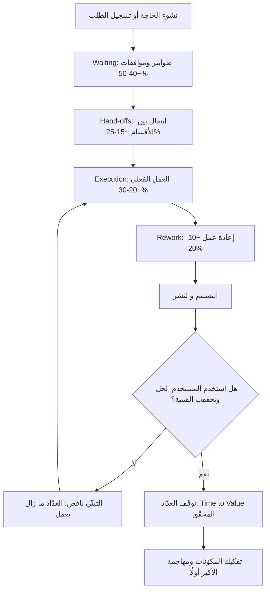

# زمن الوصول للقيمة (Time to Value)

> [!info] تعريف مختصر
> زمن الوصول للقيمة (Time to Value، اختصارًا TTV) هو الزمن الممتد من لحظة بداية الطلب أو الفكرة حتى اللحظة التي يتحقّق فيها **نفع فعلي ملموس للمستخدم** — لا لحظة التسليم ولا لحظة الإطلاق. الفارق حاسم: التسليم حدثٌ يخصّ الفريق، أما القيمة فحدثٌ يخصّ المستخدم. ومقياس TTV هو المقياس الوحيد الذي لا يمكن للفريق تجميله، لأنه يقاس عند الطرف الآخر.

## الشرح العلمي والاحترافي
- **نقطة البداية ونقطة النهاية**: يبدأ العدّ من لحظة نشوء الحاجة أو تسجيل الطلب (لا من لحظة بدء العمل عليه)، وينتهي عند أول استخدام فعلي يحقّق النتيجة المرجوّة للمستخدم — تسجيل أول عملية ناجحة، إنجاز أول تقرير، توفير أول ساعة عمل. تسليم ميزة لا يستخدمها أحد لا يوقف العدّاد.
- **لماذا هو أخطر من الموعد النهائي** ([[Deadline]]):
  - الموعد النهائي **قابل للتمديد**: يُعاد التفاوض عليه، ويُنقل إلى الربع التالي بقرار إداري، ويُعاد تعريف "الإنجاز" ليتناسب معه. أما TTV فحقيقة واقعة لا تُزيَّف: المستخدم إما حصل على القيمة أو لم يحصل.
  - الموعد النهائي **يقبل التلاعب في التعريف**: يمكن إعلان النجاح بتسليم نسخة منقوصة "في الموعد"، بينما TTV يواصل العدّ حتى تصل القيمة فعلًا.
  - **أي توسّع في النطاق يضخّم TTV بصمت**: إضافة متطلب صغير هنا وموافقة إضافية هناك لا تغيّر الموعد المعلن فورًا، لكنها تُطيل سلسلة الانتظار والتسليمات. لذلك يُكتشف تضخّم TTV **متأخرًا جدًا** — عادةً بعد أن يكون المستخدم قد فقد الحاجة أو ذهب إلى بديل.
  - الموعد النهائي يقيس **التزام الفريق**، أما TTV فيقيس **صحة النظام كله** بما فيه الإدارة والموافقات والأقسام المساندة.
- **التفكيك العملي**: `TTV = Waiting + Hand-offs + Rework + Execution`.
  - **الانتظار (Waiting)** — الطوابير والموافقات ونوافذ الإصدار: عادةً **40–50%** من الزمن الكلي، وهو **المضخّم الأخطر** لأنه ينمو أسّيًا مع ازدحام العمل الجاري ([[Little's Law]]) ولا يظهر في أي خطة.
  - **التسليمات بين الجهات (Hand-offs)** — انتقال العمل بين الأقسام مع ما يرافقه من إعادة شرح وفقدان سياق: **15–25%**، وكل تسليم إضافي يخلق طابورًا جديدًا.
  - **إعادة العمل (Rework)** — ما يُعاد بسبب سوء الفهم أو الجودة أو تغيّر المتطلب: **10–20%** ([[Rework Percentage]]).
  - **التنفيذ (Execution)** — العمل الفعلي المُضيف للقيمة: **20–30% فقط**.
  - **النتيجة الإدارية الحاسمة**: بما أن التنفيذ لا يتجاوز ربع الزمن تقريبًا، فإن **مضاعفة حجم الفريق لا تحسّن TTV إلا بنحو 10–15%** في أفضل الأحوال — وقد تسوئه، لأن الأفراد الجدد يزيدون التسليمات والتواصل والانتظار. هذه هي الترجمة العملية لقانون بروكس في لغة التدفّق.
- **الفرق عنه وعن المقاييس القريبة**:
  - [[Cycle Time]] يقيس من **بدء العمل** إلى انتهائه — أضيق نطاق، ويخصّ الفريق وحده.
  - [[Lead Time]] يقيس من **دخول الطلب** إلى **التسليم** — أوسع، لكنه يتوقف عند باب الفريق.
  - **TTV** يقيس من **نشوء الحاجة** إلى **تحقّق النفع** — الأوسع، ويشمل ما بعد التسليم: النشر، التبنّي، التدريب، والاستخدام الأول الناجح.
  - العلاقة: `Cycle Time ⊂ Lead Time ⊂ Time to Value`.
- **علاقته بمعادلة القيمة**: `القيمة المُحقَّقة = (Impact × Adoption) ÷ Time to Value`. أي أن الأثر مهما عظُم، إن قُسم على زمن طويل، تضاءل عائده الفعلي؛ وميزة عظيمة لا يتبنّاها أحد (Adoption منخفض) قيمتها صفر مهما قصر زمنها. هذه المعادلة تفسّر لماذا يفوز منتج أبسط يصل خلال أسبوعين على منتج أفضل يصل بعد تسعة أشهر.
- **علاقته بكفاءة التدفّق** ([[Flow Efficiency]]): كفاءة تدفّق منخفضة تعني حتمًا TTV مرتفعًا، لأن كليهما يقيس الظاهرة نفسها من زاويتين: الأولى بالنسبة المئوية للعمل الفعلي، والثاني بالزمن المطلق حتى القيمة.

## أين ومتى يُستخدم
- في **منتجات SaaS والاشتراكات** كمقياس أساسي لرحلة الإعداد (Onboarding): كم يمرّ من التسجيل حتى "لحظة الإدراك" (Aha Moment) الأولى؟ ارتفاعه مؤشر مبكر على الانسحاب (Churn).
- عند **تقييم البدائل** في القرارات: بناء داخلي مقابل شراء جاهز، أو حل كامل مقابل [[MVP]] — TTV غالبًا العامل الحاسم لا التكلفة.
- في **تبرير تقسيم المشاريع الكبيرة**: مشروع بـ TTV يبلغ 9 أشهر يمكن تحويله إلى ثلاث دفعات بـ TTV يبلغ 6 أسابيع للدفعة الأولى، فتبدأ القيمة بالتدفّق مبكرًا وتقلّ [[Cost of Delay]].
- في **تقارير الإدارة العليا** كبديل عن تقارير "نسبة الإنجاز": نسبة إنجاز 80% لا تعني شيئًا للمستخدم، أما "أول قيمة تصل بعد 5 أسابيع" فتعني كل شيء.
- عند **تشخيص التأخّر المزمن**: تفكيك TTV إلى مكوّناته الأربعة يكشف بسرعة أين تضيع الشهور، وغالبًا لا يكون ذلك في التنفيذ.

## مثال وسيناريو تطبيقي
> [!example] شركة برمجيات B2B تلقّت طلبًا من عميل رئيسي: "نحتاج تقرير امتثال شهري تلقائي". أقرّت الإدارة موعدًا نهائيًا بعد 12 أسبوعًا، وسُلّم المشروع "في موعده" وأُعلن النجاح.
> **لكن قياس TTV الحقيقي** — من تاريخ طلب العميل (1 مارس) حتى إصدار أول تقرير امتثال استخدمه فريق العميل فعليًا (12 يوليو) — أعطى **19 أسبوعًا**، أي 58% أطول من الموعد المُعلن.
> **التفكيك**:
> | المكوّن | الزمن | النسبة |
> |---|---|---|
> | Waiting (انتظار موافقة الأمن 3 أسابيع، انتظار بيانات من المالية أسبوعان، انتظار نافذة نشر ربعية 3 أسابيع) | 8 أسابيع | 42% |
> | Hand-offs (المبيعات ← المنتج ← التطوير ← العمليات ← دعم العميل) | 4 أسابيع | 21% |
> | Rework (تقرير أُنجز بصيغة خاطئة لسوء فهم متطلب) | 2.5 أسبوع | 13% |
> | Execution (تحليل + بناء + اختبار) | 4.5 أسبوع | 24% |
> **الدرس**: التنفيذ 24% فقط. لو ضاعفت الشركة الفريق من 4 إلى 8 مطوّرين، لاختصرت التنفيذ من 4.5 إلى نحو 3 أسابيع — أي تحسّن 8% فقط في TTV، مقابل تكلفة مضاعفة. بينما إلغاء نافذة النشر الربعية وتفويض موافقة الأمن مسبقًا وفّرا 5 أسابيع (26%) بتكلفة قريبة من الصفر.
> **الأخطر**: خلال المشروع أُضيفت ثلاثة متطلبات صغيرة ("أضف عمودًا"، "أضف تصديرًا إلى Excel"، "أضف لغة ثانية") لم يُعدَّل لأيٍّ منها الموعد النهائي، لكنها أضافت دورة موافقة ومراجعة جديدة كل مرة، فتضخّم TTV **بصمت** بأربعة أسابيع لم يلاحظها أحد إلا عند القياس اللاحق.

## خطوات أو مخطّط
1. عرّف "القيمة" تعريفًا قابلًا للرصد قبل البدء: ما الحدث الذي إن وقع نقول "وصلت القيمة"؟ (أول استخدام ناجح، أول تقرير مُصدَّر، أول ساعة موفّرة).
2. ثبّت نقطة البداية عند **تاريخ نشوء الطلب**، لا تاريخ بدء العمل — هذا الفارق وحده يكشف أسابيع مخفية.
3. سجّل الطوابع الزمنية لكل انتقال في الرحلة، بما فيها ما يقع بعد التسليم (النشر، التدريب، التبنّي).
4. احسب TTV الفعلي وقارنه بالموعد المُعلن؛ الفجوة بينهما هي حجم الوهم في نظام الإبلاغ لديك.
5. فكّك الزمن إلى `Waiting + Hand-offs + Rework + Execution` واحسب نسبة كل مكوّن.
6. هاجم المكوّن الأكبر أولًا — وهو الانتظار في الغالبية الساحقة من الحالات: قلّل الموافقات المتسلسلة، ألغِ نوافذ النشر الدورية، اخفض العمل الجاري.
7. قلّل التسليمات بتشكيل فرق متعدّدة التخصصات تملك الرحلة من طرفها إلى طرفها.
8. قسّم النطاق: اسأل دائمًا "ما أصغر شيء يمكن أن يوصل قيمة حقيقية؟" ([[MVP]]) بدل انتظار الحل الكامل.
9. راقب توسّع النطاق كمخاطرة على TTV تحديدًا: كل إضافة يجب أن تُعلن أثرها على زمن وصول القيمة، لا على الموعد النهائي فقط.
10. أعد القياس بعد كل تسليم، وتتبّع اتجاه TTV عبر الزمن بوصفه المؤشر الأهم لصحة النظام.

## ⚠️ مفاهيم خاطئة شائعة
> [!warning]
> - **اعتبار تاريخ الإطلاق هو نهاية TTV**: الإطلاق ليس قيمة. إن لم يستخدم أحد الحل أو احتاج ستة أسابيع تدريب، فالعدّاد ما زال يعمل.
> - **الخلط بينه وبين [[Lead Time]]**: زمن التسليم يتوقف عند باب الفريق، أما TTV فيستمر حتى التبنّي الفعلي عند المستخدم.
> - **الظن بأن تسريع TTV يعني خفض الجودة**: العكس غالبًا صحيح — الجودة المنخفضة تولّد إعادة عمل (Rework) وهي مكوّن مباشر يُطيل TTV.
> - **الاعتقاد بأن زيادة عدد الأفراد هي الحل**: التنفيذ 20–30% فقط من الزمن، فالمكاسب محدودة بـ 10–15% نظريًا، وقد تُلتهم بالكامل بزيادة التواصل والتسليمات.
> - **الاطمئنان لأن الموعد النهائي لم يتغيّر**: ثبات الموعد المعلن لا يعني ثبات TTV؛ توسّع النطاق يضخّمه بصمت دون أن يمسّ التاريخ المُعلن.
> - **قياسه على مستوى المشروع الكامل فقط**: التقسيم إلى دفعات يجعل TTV لأول دفعة هو الرقم المهم فعلًا، لا زمن المشروع كله.

## ❌ ممارسات خاطئة في المشاريع
> [!failure]
> - **الاكتفاء بتتبّع المواعيد النهائية دون قياس زمن وصول القيمة**: تحتفل المؤسسة بالتسليم في الموعد بينما العميل ينتظر أشهرًا إضافية. الحل: أضف TTV كمقياس رسمي في تقارير الحالة، مع تفكيكه إلى مكوّناته الأربعة.
> - **قبول توسّع النطاق دون إعلان أثره الزمني على القيمة**: كل "إضافة صغيرة" تمرّ بصمت حتى ينفجر التأخّر متأخرًا. الحل: اجعل قاعدة صريحة — أي تغيير نطاق يُرفق بتقدير أثره على TTV، لا على الموعد فقط.
> - **معالجة بطء التسليم بالتوظيف**: استثمار مكلف يهاجم 25% من المشكلة ويزيد التسليمات والانتظار. الحل: فكّك TTV أولًا واستثمر في تقليل الانتظار والتسليمات قبل التفكير في زيادة الطاقة.
> - **بناء الحل الكامل قبل إيصال أي قيمة**: يجعل TTV يساوي مدة المشروع كلها، وتظهر أول تغذية راجعة بعد فوات الأوان. الحل: قسّم إلى دفعات قابلة للاستخدام، واستهدف أقصر زمن ممكن لأول قيمة حقيقية.
> - **تجاهل مرحلة ما بعد التسليم (التبنّي والتدريب)**: يُعلَن النجاح والمنتج جامد بلا مستخدمين. الحل: اعتبر التبنّي جزءًا من نطاق المشروع، وقس أول استخدام ناجح لا أول نشر ناجح.
> - **قياس TTV دون تفكيكه إلى مكوّنات**: رقم كبير بلا تشخيص يقود إلى لوم الفريق بدل إصلاح النظام. الحل: انشر توزيع `Waiting / Hand-offs / Rework / Execution` كل ربع، ووجّه التحسين إلى أكبر شريحة.

## 🔗 مصطلحات ومفاهيم ذات صلة
[[Lead Time]] | [[Cycle Time]] | [[Flow Efficiency]] | [[Rework Percentage]] | [[Bottleneck]] | [[MVP]] | [[Outcome vs Output]] | [[Cost of Delay]]
