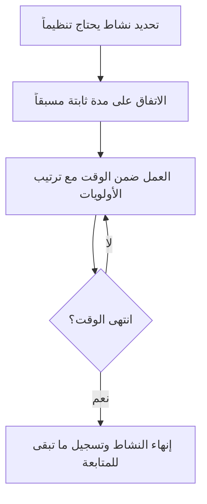

# التحديد الزمني (Timeboxing)
> [!info] تعريف مختصر
> التحديد الزمني (Timeboxing) هو تخصيص مدة زمنية ثابتة ومسبقة لنشاط أو اجتماع معيّن، بحيث ينتهي النشاط عند انتهاء الوقت بغض النظر عن اكتمال العمل بالكامل أم لا. الهدف هو ضبط الإيقاع والتركيز، لا مطاردة الكمال.

## الشرح العلمي والاحترافي
- بدل أن يُحدَّد وقت انتهاء نشاط بناءً على "متى ننتهي من كل التفاصيل"، يُحدَّد الوقت مسبقاً، ويُكيَّف نطاق العمل أو عمقه ليناسب هذا الوقت. هذا يعكس منطق الأولويات: العمل الأهم يُنجز أولاً ضمن الصندوق الزمني المتاح.
- [[14 - Sprint]] نفسه في سكرم هو أشهر مثال على تحديد زمني: مدة ثابتة (أسبوعان مثلاً) لا تتغير مهما تغيّر حجم العمل.
- تُطبَّق الفكرة أيضاً على مستوى الاجتماعات: [[07 - Daily Standup]] محدد بـ 15 دقيقة، و[[08 - Sprint Planning]] و[[09 - Sprint Review]] و[[10 - Sprint Retrospective]] لها جميعاً حدود زمنية موصى بها في دليل سكرم (عادة تتناسب طردياً مع طول السبرنت).
- الفائدة الأساسية: تحديد الزمن يمنع "تضخم النطاق" (Scope Inflation) داخل الاجتماع أو النشاط نفسه، ويجبر المشاركين على إعطاء الأولوية لأهم النقاط، ويخلق إيقاعاً يمكن التنبؤ به يسهّل التخطيط.
- يختلف عن [[Timeboxing]] كمفهوم إداري بحت عن [[WIP Limit]]: التحديد الزمني يقيّد الوقت المتاح للنشاط، بينما حد العمل الجاري يقيّد عدد المهام المتزامنة؛ كلاهما أداة لضبط التدفق لكن من زاوية مختلفة.

## أين ومتى يُستخدم
- يُستخدم على نطاق واسع في [[02 - Scrum]]: طول السبرنت نفسه، ومدد اجتماعاته الأربعة (التخطيط، الوقوف اليومي، المراجعة، الاستعادة).
- يُستخدم أيضاً خارج سكرم في أي تقنية إدارة وقت تعتمد فترات عمل مركّزة قصيرة (مثل تقنية بومودورو)، أو في ورشات العمل والاجتماعات عموماً لمنع تمددها.
- مفيد بشكل خاص عند مواجهة مشكلة معقدة يمكن أن تستغرق وقتاً غير محدود من البحث؛ يضع الفريق سقفاً زمنياً (ساعتين مثلاً) لاستكشاف الحل قبل اتخاذ قرار بالمتاح.

## مثال وسيناريو تطبيقي
> [!example] سيناريو
> فريق يواجه مشكلة أداء غامضة في قاعدة البيانات تُبطئ التطبيق أحياناً. بدل ترك المطورين يبحثون بلا حدود زمنية، يقرر [[06 - Scrum Master]] تحديد صندوق زمني مدته 4 ساعات لتشخيص السبب الجذري ([[Root Cause Analysis]]).
> خلال هذه المدة يستخدم الفريق أدوات المراقبة ويجرّب فرضيات محددة. عند انتهاء الساعات الأربع، سواء وُجد السبب أم لا، يتوقف الفريق ويعقد اجتماعاً سريعاً: إذا وُجد السبب يخطَّط لإصلاحه، وإذا لم يُوجد بعد، يُقرَّر تخصيص صندوق زمني آخر لاحقاً بدل الاستمرار بلا نهاية واستنزاف وقت السبرنت بأكمله على مشكلة واحدة.
> هذا يحمي بقية التزامات السبرنت من التأخر بسبب مشكلة واحدة قد تكون بلا قاع زمني واضح.

## خطوات أو مخطّط
1. تحديد النشاط المطلوب تنظيمه زمنياً (اجتماع، بحث تقني، سبرنت كامل).
2. الاتفاق مسبقاً على مدة ثابتة مناسبة لحجم النشاط وأهميته.
3. إعلان الوقت للمشاركين قبل البدء، مع تعيين مسؤول لمتابعة الوقت (غالباً [[06 - Scrum Master]] أو [[Facilitator]]).
4. العمل ضمن الوقت المحدد مع إعطاء الأولوية لأهم النقاط أولاً.
5. إنهاء النشاط عند انتهاء الوقت، حتى لو لم يكتمل كل شيء، مع تسجيل ما تبقى للمتابعة لاحقاً.
6. مراجعة فعالية المدة المختارة لاحقاً وتعديلها إذا لزم.

## ⚠️ مفاهيم خاطئة شائعة
> [!warning]
> - الاعتقاد بأن التحديد الزمني يعني التسرع أو التضحية بالجودة؛ في الحقيقة هدفه ترتيب الأولويات ضمن وقت واقعي، لا إنتاج عمل ناقص عمداً.
> - الظن بأن تمديد الوقت "قليلاً فقط" عند اقتراب الانتهاء لا يضر؛ التمديد المتكرر يُفقد الصندوق الزمني قيمته ويعيد المشكلة التي جاء لحلها.
> - الخلط بين التحديد الزمني وتحديد الموعد النهائي (Deadline)؛ الصندوق الزمني يحدد مدة نشاط متكرر أو محصور، بينما الموعد النهائي غالباً مرتبط بتسليم خارجي واحد.

## ❌ ممارسات خاطئة في المشاريع
> [!failure]
> - تمديد اجتماعات سكرم بشكل متكرر متجاوزاً وقتها المحدد بحجة "لم ننته بعد". التجنب: الالتزام الصارم بالوقت المعلن مع نقل النقاط الناقصة لجلسة أو قناة منفصلة.
> - استخدام التحديد الزمني كضغط لإنهاء عمل بجودة رديئة دون معالجة النطاق الحقيقي. التجنب: تقليص نطاق العمل عند نفاد الوقت بدل تقليص الجودة.
> - عدم تعيين مسؤول واضح لمتابعة الوقت في الاجتماعات، فيتمدد النقاش دون رقيب. التجنب: تكليف [[Facilitator]] أو [[06 - Scrum Master]] صراحة بمهمة ضبط الوقت.

## 🔗 مصطلحات ومفاهيم ذات صلة
[[14 - Sprint]] | [[08 - Sprint Planning]] | [[07 - Daily Standup]] | [[09 - Sprint Review]] | [[10 - Sprint Retrospective]] | [[WIP Limit]] | [[Facilitator]] | [[06 - Scrum Master]] | [[02 - Scrum]] | [[Root Cause Analysis]]
