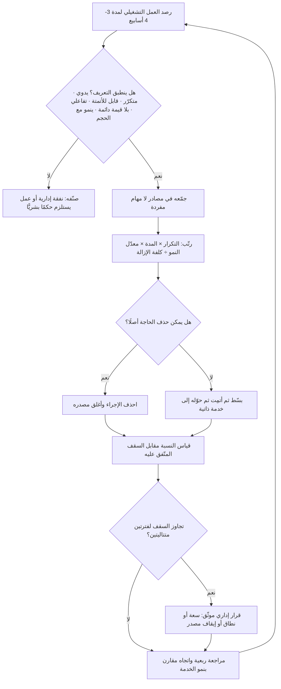

# الكدح التشغيلي (Toil)

> [!info] تعريف مختصر
> مصطلح تقني دقيق — لا مجرّد وصف عام لـ«العمل الممل» — نشأ في ممارسة هندسة موثوقية الأنظمة ([[SRE]]) ليصف نوعًا محدّدًا من العمل التشغيلي تتوفّر فيه خصائص مجتمعة: أنه **يدوي، ومتكرّر، وقابل للأتمتة، وتفاعليّ (ردّ فعل لا مبادرة)، وخالٍ من قيمة دائمة، وينمو خطّيًّا مع حجم الخدمة**. المعيار الحاسم فيه هو الأخير: العمل الذي يتضاعف كلما تضاعف عدد المستخدمين أو الخوادم أو الطلبات هو كدح، لأنه يحوّل النمو إلى عبء بدل أن يحوّله إلى رافعة. وقيمة المصطلح العملية أنه يمنح الفريق **لغة قابلة للقياس والتسقيف**: بدل الشكوى من الضغط، يصبح الكدح نسبة مئوية من وقت الفريق، لها حدّ أعلى متّفق عليه، وتجاوزها يستدعي إجراءً تنظيميًّا لا مجرّد صبر.

## الشرح العلمي والاحترافي
- **المنشأ والصياغة**: المصطلح بهذا المعنى الاصطلاحي الدقيق اشتُهر عبر أدبيات ممارسة [[SRE]] التي نشرتها Google في كتاب *Site Reliability Engineering*، حيث أُفرد له فصل كامل عنوانه «Eliminating Toil». الكلمة نفسها إنجليزية عادية تعني الكدّ والمشقّة، لكن الإسهام المميّز كان في **تعريفها تعريفًا إجرائيًّا بخصائص قابلة للفحص**، وربطها بسقف زمني صريح، وجعل تقليصها هدفًا هندسيًّا معلنًا لا نتيجة جانبية.
- **الخصائص الستّ التي تميّزه**: (١) **يدوي** — يتطلّب إنسانًا يضغط ويكتب. (٢) **متكرّر** — لا يُفعل مرة واحدة بل عشرات المرات. (٣) **قابل للأتمتة** — لو أُتيح وقت هندسي لأمكن حذفه، وهذا ما يميّزه عن العمل الذي يستلزم حكمًا بشريًّا. (٤) **تفاعلي** — استجابة لتنبيه أو طلب، لا عمل مبادر مخطَّط. (٥) **بلا قيمة دائمة** — بعد إنجازه تعود الخدمة إلى حالتها السابقة تمامًا، ولم يتحسّن شيء بنيويًّا. (٦) **ينمو خطّيًّا مع الحجم (O(n))** — وهذه هي العلامة الاقتصادية الأخطر.
- **ما ليس كدحًا**: التمييز مهمّ لأن التوسّع في التسمية يفرغها من معناها. العمل الإداري العام (اجتماعات، تقييمات، تقارير دورية) ليس كدحًا بل «نفقة تشغيل عامة» (Overhead). والعمل الذي يتطلّب تحليلًا وحكمًا بشريًّا — تصميم، تحقيق في حادث معقّد، مفاوضة مورّد — ليس كدحًا مهما كان مرهقًا. والعمل المتكرّر الذي **ينتج قيمة دائمة** (كتابة اختبار، توثيق [[SOP]] جديد) ليس كدحًا. القاعدة: الكدح هو ما لو أُتمت اليوم لما اشتقت إليه غدًا.
- **العلاقة بمفهوم الهدر في الفكر الرشيق**: الكدح صيغة حديثة ومحدّدة تقنيًّا لفكرة أقدم بكثير هي الهدر (Muda) في [[Toyota Production System]]، وتحديدًا فئات مثل الحركة الزائدة والمعالجة الزائدة والانتظار ضمن تصنيف [[DOWNTIME]] و[[Muda, Mura, Muri]]. الفارق أن أدبيات الرشاقة تنظر إلى الهدر من زاوية تدفّق القيمة ([[Value Stream]])، بينما ينظر الكدح إليه من زاوية **قابلية التوسّع**: كم إنسانًا سنحتاج إذا تضاعف الحجم عشر مرات؟
- **السقف كأداة حوكمة لا كأمنية**: الممارسة المعروفة في أدبيات [[SRE]] هي وضع حدّ أعلى صريح لنسبة الكدح من وقت الفريق (الرقم المتداول في تلك الأدبيات هو 50%)، على أن يُخصَّص الباقي لعمل هندسي يقلّل الكدح مستقبلًا. الأهم من الرقم نفسه هو **الآلية**: النسبة تُقاس، وتُعرض دوريًّا، وتجاوزها المستمر يُلزم الإدارة باتخاذ قرار (تعيين، تخفيض نطاق الخدمة، إيقاف مصدر الكدح، تحويل عبء إلى فريق التطوير) بدل أن يُمتصّ بصمت في وقت الأفراد.
- **آلية القياس**: لا يُقاس الكدح بالإحساس. الأساليب العملية: تصنيف بنود العمل عند إنشائها بوسم «كدح/هندسة/مشروع»، أو أخذ عيّنات دورية (Time sampling) بسؤال الفريق أسبوعيًّا عن توزيع ساعاته، أو استخراجه من نظام التذاكر بحساب نسبة التذاكر التفاعلية المتكرّرة. المؤشّر الأهم ليس النسبة اللحظية بل **اتجاهها عبر الزمن** مقارنة بنمو الخدمة.
- **لماذا يتراكم الكدح تحديدًا؟** لأنه دائمًا الخيار الأرخص في اللحظة: إنجازه يدويًّا يستغرق 10 دقائق، وأتمتته تستغرق يومين. الحساب اللحظي يفضّل اليد دائمًا، لكن الحساب التراكمي عبر سنة يقلبه رأسًا على عقب. وهذا نمط كلاسيكي من [[Technical Debt]] لكن في طبقة التشغيل لا في الشيفرة، وله أثر إضافي خطير: **استنزاف الطاقة البشرية** وتآكل [[Sustainable Pace]]، لأن الكدح يُستهلك من الوقت نفسه الذي كان سيُستثمَر في إزالته.
- **الكدح لا يختفي بالذكاء الاصطناعي بل يتبدّل شكله**: أتمتة مهمة يدوية بوكيل قد تُنشئ كدحًا جديدًا من نوع آخر — مراجعة مخرجات الوكيل، وتصحيح حالاته الشاذّة، وتحديث الموجّهات، وقراءة سجلّات التشغيل ([[Audit Trail]]). هذا الكدح الجديد يظلّ مكسبًا إذا كان ينمو أبطأ من الحجم، ويصير خسارة إذا كان ينمو معه خطّيًّا. المعيار واحد لم يتغيّر: **معدّل النمو لا نوع الأداة**.

## أين ومتى يُستخدم
- **في تشغيل الخدمات وإدارة الحوادث**: لتصنيف عمل المناوبة (On-call) وفصل التنبيهات التي تستلزم تحقيقًا عن تلك التي تُغلق بخطوة متكرّرة قابلة للأتمتة، بما يقلّل [[MTTR]] ويحمي [[SLO]].
- **في التخطيط للسعة وتوزيع الطاقة**: عند حساب [[Capacity]] الحقيقية للفريق، لأن الكدح غير المحسوب يلتهم الطاقة المخصّصة للمشاريع ويجعل [[Estimation Variance]] مرتفعًا بلا تفسير.
- **في تحسين التدفّق**: الكدح غالبًا مصدر خفيّ لتدنّي [[Flow Efficiency]] وتطاول [[Cycle Time]]، لأنه يقاطع العمل المخطَّط ويولّد انتظارًا في مواضع لا يراها لوح المهام.
- **في مبادرات التحسين المستمر**: كمُدخل مباشر لدورات [[Kaizen]] و[[PDCA]] و[[Value Stream Mapping]]، حيث يُصطاد الكدح بجولة ميدانية ([[Gemba Walk]]) لا بتقرير.
- **في تقييم الأتمتة والاستثمار التقني**: لتبرير الإنفاق الهندسي بحساب الساعات المتكرّرة المُوفَّرة سنويًّا مقابل كلفة البناء والصيانة ضمن [[TCO]].
- **في اتفاقيات عمل الفريق**: تضمين سقف الكدح ضمن [[Team Working Agreement]] و[[Explicit Policies]]، ليصبح قابلًا للنقاش في اجتماع دوري بدل أن يُترك للاحتمال الفردي.

## مثال وسيناريو تطبيقي
> [!example] شركة سعودية تقدّم منصّة اشتراكات لمتاجر التجزئة، فريق التشغيل فيها 5 أشخاص. مع نمو العملاء من 120 إلى 480 متجرًا خلال عام، بدأ الفريق يتأخّر عن كل خارطة طريق أعلنها، رغم أنه لم يفقد أحدًا ولم يزد نطاق عمله المعلن.
> قرّر المدير قياس الكدح بدل تخمينه. لمدة 4 أسابيع، وُسم كل بند عمل بأحد ثلاثة أوسمة: «كدح» أو «هندسة تقليل كدح» أو «مشروع». النتيجة كانت صادمة للفريق نفسه: 68% من الساعات كدح. وتوزّع على ثلاثة مصادر فقط: تهيئة حساب متجر جديد يدويًّا (35 خطوة، ~45 دقيقة، 22 متجرًا شهريًّا)، وإعادة تشغيل مزامنة المخزون بعد فشلها (~6 مرات أسبوعيًّا، 20 دقيقة لكل مرة)، وإخراج تقرير تسوية مالية شهري بالنسخ من ثلاثة أنظمة (يومان كاملان لشخصين).
> الملاحظة الحاسمة لم تكن الحجم بل **معدّل النمو**: الثلاثة تنمو خطّيًّا مع عدد المتاجر. بإسقاط بسيط، عند 1,000 متجر سيحتاج الفريق نحو 9 أشخاص لأداء العمل نفسه دون أي ميزة جديدة.
> وضع الفريق سقفًا في اتفاقية عمله: لا يتجاوز الكدح 40% من ساعات الربع، وأي تجاوز لأسبوعين متتاليين يُرفع إلى [[Steering Committee]]. ثم رتّب الأتمتة بمعيار (ساعات سنوية موفَّرة ÷ كلفة البناء): التسوية المالية أولًا (نحو 384 ساعة سنويًّا مقابل 3 أسابيع بناء)، ثم إعادة تشغيل المزامنة عبر إعادة محاولة تلقائية مع تنبيه عند تكرار الفشل، ثم التهيئة الذاتية للمتجر الجديد.
> بعد ربعين: عدد المتاجر 640، ونسبة الكدح 31%، وعدد أفراد الفريق 5 كما هو. الأهم أن الفريق سلّم أول ميزة في خارطة الطريق منذ عام. ولم تختفِ كل الأعمال اليدوية — بقيت مراجعة الحالات الشاذّة في التسوية — لكنها صارت تنمو بمعدّل أبطأ كثيرًا من نمو العملاء، وهذا هو المكسب الحقيقي.

## خطوات أو مخطّط
1. عرّف الكدح تعريفًا مكتوبًا متّفقًا عليه داخل الفريق، وميّزه صراحةً عن العمل الإداري وعن العمل الذي يستلزم حكمًا بشريًّا.
2. قِس قبل أن تعالج: وسم بنود العمل، أو عيّنة زمنية أسبوعية، لمدة لا تقلّ عن 3–4 أسابيع حتى تُلتقط الدورات الشهرية.
3. اجمع الكدح في **مصادر** لا في مهام مفردة؛ فالمعالجة الفعّالة تستهدف المصدر (نوع التنبيه، نوع الطلب) لا الحالة الواحدة.
4. رتّب المصادر بمعيار (التكرار × مدة المرة × معدّل النمو) ÷ كلفة الإزالة، وابدأ بالأعلى عائدًا لا بالأسهل.
5. اختر أسلوب المعالجة الصحيح لكل مصدر: **الحذف** (لماذا نفعل هذا أصلًا؟) قبل **التبسيط** قبل **الأتمتة** قبل **الخدمة الذاتية** (نقل الفعل للمستخدم) — والأتمتة آخر الخيارات لا أوّلها.
6. ضع سقفًا صريحًا لنسبة الكدح، واجعل تجاوزه مُلزِمًا بقرار إداري موثّق في [[Decision Log]].
7. احمِ الوقت الهندسي المخصّص للتقليص بحاجز واضح ([[WIP Limit]] أو تخصيص سعة ثابتة)، وإلا ابتلعه التشغيل.
8. أعد القياس كل ربع، وقارن اتجاه نسبة الكدح **بمنحنى نمو الخدمة** لا بالربع السابق وحده.
9. راقب الكدح المستحدَث من الحلول نفسها (صيانة الأتمتة، مراجعة مخرجات الوكلاء) واحسبه ضمن الميزانية.

## ⚠️ مفاهيم خاطئة شائعة
> [!warning]
> - **اعتبار كل عمل ممل كدحًا**: التعريف اصطلاحي وله ستّ خصائص مجتمعة. مراجعة عقد مورّد عمل ممل لكنه يستلزم حكمًا بشريًّا وينتج قيمة دائمة، فليس كدحًا. توسيع المعنى يُفقد المصطلح فائدته التحليلية ويحوّله إلى شكوى.
> - **الظنّ أن الهدف صفر كدح**: تصفير الكدح غير واقعي ومكلف بذاته؛ فأتمتة حالة تتكرّر مرتين سنويًّا خسارة صافية. الهدف هو **إبقاؤه تحت سقف** ومنع نموّه الخطّي مع الحجم.
> - **الخلط بينه وبين [[Technical Debt]]**: الدين التقني قرار تصميمي مؤجَّل داخل المنتج، والكدح عبء عمل متكرّر في التشغيل. يتغذّيان على بعضهما — الدين يولّد كدحًا — لكن معالجتهما وقياسهما مختلفان.
> - **افتراض أن الأتمتة تُنهي الكدح**: كل أتمتة تُنشئ عبء صيانة ومراقبة واستثناءات. المكسب الحقيقي هو تحويل نمو العبء من خطّي إلى شبه ثابت، لا إلغاؤه.
> - **قياس الكدح بالإحساس أو بالشكوى**: أكثر الناس شكوى ليس بالضرورة أكثرهم كدحًا، والعكس صحيح؛ فبعض الفرق تعتاد الكدح حتى لا تراه. القياس المنهجي هو ما يكشف التوزيع الحقيقي.
> - **اعتباره مشكلة الفريق التقني وحده**: كثير من الكدح مصدره قرارات خارج الفريق — عملية موافقة معقّدة، أو تقرير يطلبه طرف لا يقرأه، أو التزام تعاقدي بخطوة يدوية. علاجه إداري لا هندسي.
> - **الظنّ أن السقف المتداول (50%) رقم مقدّس**: الرقم ورد في أدبيات [[SRE]] كممارسة، والمناسب لفريقك يعتمد على طبيعة الخدمة ونضجها. الجوهر هو وجود سقف مُعلن وآلية تُفعَّل عند تجاوزه.

## ❌ ممارسات خاطئة في المشاريع
> [!failure]
> - **امتصاص الكدح في الوقت الشخصي بدل إظهاره في الخطة**: الخطأ أن يُنجز الفريق العمل التشغيلي بعد الدوام فتبدو الخطة سليمة. لماذا يضرّ؟ لأن الإدارة تفقد الإشارة تمامًا وتستمرّ في تحميل الفريق، ثم يظهر الأثر فجأة كاستقالة أو انهيار جودة. الحل: أظهر الكدح كبنود مرئية على اللوح واحسبه ضمن [[Capacity]].
> - **أتمتة أسهل المصادر بدل أكثرها كلفة**: الخطأ اختيار ما يمكن إنجازه في يوم لإظهار تقدّم سريع. لماذا يضرّ؟ لأن مصدر الكدح الأكبر يبقى ينمو، فتتحسّن الأرقام دون تحسّن الواقع. الحل: رتّب بمعيار الساعات السنوية الموفَّرة × معدّل النمو مقابل كلفة الإزالة.
> - **الأتمتة قبل التبسيط**: الخطأ أتمتة إجراء من 35 خطوة كما هو. لماذا يضرّ؟ لأنك تُثبّت التعقيد في شيفرة يصعب تغييرها لاحقًا، وتحوّل عملية سيئة إلى عملية سيئة سريعة. الحل: راجع الإجراء أولًا واحذف الخطوات غير المضيفة للقيمة ([[Value-Added vs Non-Value-Added vs Pure Waste]]) ثم أتمِت الباقي.
> - **ترك وقت التقليص بلا حماية**: الخطأ تخصيص 20% من الوقت للهندسة دون آلية حماية. لماذا يضرّ؟ لأن التشغيل تفاعلي وعاجل بطبيعته، وسيلتهم أي وقت غير محميّ ([[Expedite Class]] يفرض نفسه دائمًا). الحل: خصّص أيامًا أو أفرادًا مخصّصين خارج المناوبة، وثبّت ذلك في [[Explicit Policies]].
> - **تحميل شخص واحد كل الكدح لأنه «الأسرع فيه»**: الخطأ توجيه كل الطلبات المتكرّرة إلى الخبير. لماذا يضرّ؟ لأنه يخلق نقطة فشل واحدة، ويحرم الشخص من العمل التطويري، ويُخفي حجم المشكلة لأن الجميع مرتاح. الحل: دوّر المناوبة، واجعل من يعاني الكدح هذا الأسبوع هو من يقترح إزالته.
> - **قياس إنتاجية الفريق بعدد التذاكر المغلقة**: الخطأ مكافأة سرعة إغلاق الكدح. لماذا يضرّ؟ لأنه يحفّز على استدامة المصدر بدل إزالته — من يزيل مصدر 200 تذكرة سنويًّا يبدو أقلّ إنتاجًا ممّن يغلقها. الحل: قِس **انخفاض معدّل ورود التذاكر من كل مصدر** لا عدد المغلق منها ([[Outcome vs Output]]).
> - **إهمال الكدح الجديد الناتج عن الوكلاء والأتمتة**: الخطأ افتراض أن ما بعد الأتمتة صفر. لماذا يضرّ؟ لأن مراجعة المخرجات وتصحيح الشواذ قد تنمو خطّيًّا أيضًا فيعود الفريق إلى نقطة البداية بمظهر حديث. الحل: صنّف عمل الإشراف على الأتمتة ضمن قياس الكدح وراقب معدّل نموّه صراحةً.

## 🔗 مصطلحات ومفاهيم ذات صلة
[[SRE]] | [[SLO]] | [[MTTR]] | [[Muda, Mura, Muri]] | [[DOWNTIME]] | [[Value-Added vs Non-Value-Added vs Pure Waste]] | [[Flow Efficiency]] | [[Cycle Time]] | [[Capacity]] | [[Kaizen]] | [[Value Stream Mapping]] | [[Technical Debt]] | [[Sustainable Pace]] | [[Gemba Walk]] | [[Audit Trail]] | [[Context Switching Cost]] | [[Jevons Paradox]]
