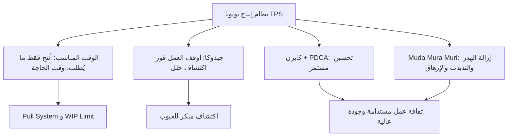

# نظام إنتاج تويوتا (Toyota Production System)
> [!info] تعريف مختصر
> **نظام إنتاج تويوتا (Toyota Production System - TPS)** فلسفة إدارية وإنتاجية طوّرتها شركة تويوتا اليابانية بعد الحرب العالمية الثانية، تقوم على إزالة الهدر وتحقيق تدفق عمل سلس يُنتج فقط ما يحتاجه العميل، بالكمية والوقت الصحيحين. هو الأصل التاريخي المباشر لفلسفة Lean وKanban الحديثتين المستخدمتين اليوم في إدارة المشاريع البرمجية.

## الشرح العلمي والاحترافي
نشأ TPS في مصانع تويوتا في اليابان بقيادة تايتشي أونو، كردّ فعل على ندرة الموارد بعد الحرب — لم تستطع تويوتا تحمّل إنتاج كميات ضخمة كما فعلت مصانع فورد الأمريكية، فطوّرت نظامًا يُنتج بكفاءة أعلى وهدر أقل. يقوم على ركيزتين أساسيتين:

1. **الوقت المناسب (Just-In-Time)**: إنتاج ما يحتاجه العميل فقط، بالكمية والوقت المطلوبين، لا أكثر ولا أقل. هذا يقلّل المخزون الزائد وينفّذ عبر [[Pull System]] — العمل "يُسحب" حين تظهر الحاجة إليه، لا "يُدفع" مسبقًا.
2. **جيدوكا (Jidoka) — الأتمتة الذكية**: تصميم الأنظمة والآلات بحيث تتوقف تلقائيًا عند اكتشاف خلل، بدل الاستمرار في إنتاج عيوب. يترجم هذا في العمل البرمجي إلى مبدأ "توقف الخط فورًا عند اكتشاف مشكلة" بدل تمرير عيب للمرحلة التالية (قارن مع [[Shift-Left and Shift-Right]]).

يبني TPS على استمرار البحث عن الهدر ومعالجته عبر مفهوم [[Muda, Mura, Muri]] (الهدر، عدم الانتظام، الإرهاق)، وثقافة التحسين المستمر [[Kaizen]] المدعومة بدورة [[PDCA]]. كما يعتمد على أدوات مثل [[5S]] لتنظيم مكان العمل، و[[Gemba Walk]] لملاحظة العمل الفعلي مباشرة بدل الاعتماد على التقارير فقط، و[[Obeya|غرفة أوبيا]] لتوحيد رؤية الفريق.

أهمية TPS لصناعة البرمجيات: نظام Kanban الحديث المستخدم في تطوير البرمجيات ([[03 - Kanban]]) مُستوحى مباشرة من TPS — بطاقات كانبان الفعلية كانت إشارات مرئية تُنظّم تدفق الأجزاء بين محطات التصنيع في تويوتا، وتُطبَّق اليوم بنفس المنطق على تدفق المهام البرمجية عبر [[WIP Limit]] و[[Pull System]].

## أين ومتى يُستخدم
- كإطار فلسفي مرجعي يُستشهد به عند تطبيق [[03 - Kanban]] أو أي ممارسة Lean في تطوير البرمجيات.
- عند تصميم عملية عمل جديدة يُراد لها التدفق السلس بدل الدفعات الكبيرة.
- في تدريب الفرق على مبادئ التحسين المستمر وثقافة "توقف عند اكتشاف خلل" بدل تمرير العيوب.
- كمرجع تاريخي يُشرح للفرق الجديدة أصل مفاهيم مثل [[Muda, Mura, Muri]] و[[Theory of Constraints]] و[[Value Stream Mapping]].

## مثال وسيناريو تطبيقي
> [!example]
> فريق منصة "سوق مرن" التقني يعيد تصميم عملية نشر التحديثات البرمجية مستلهمًا مبادئ TPS:
> 
> - **الوقت المناسب**: بدل تجميع 20 ميزة في إصدار ضخم كل ثلاثة أشهر (دفعات كبيرة تُخفي العيوب وتُصعّب تتبع السبب عند الفشل)، ينتقل الفريق لنشر ميزة واحدة أو اثنتين فور جاهزيتها، مدعومًا بخط [[CI and CD]] آلي.
> - **جيدوكا**: يُضاف اختبار آلي يوقف عملية النشر تلقائيًا فور فشل أي اختبار حرج، بدل السماح للكود المعطوب بالوصول للإنتاج ثم إصلاحه لاحقًا بـ[[Hotfix]] مكلف.
> - **كايزن**: في كل [[10 - Sprint Retrospective]]، يختار الفريق تحسينًا واحدًا صغيرًا في عملية النشر ويختبره عبر دورة [[PDCA]].
> - **النتيجة**: خلال ستة أشهر، ينخفض [[Escaped Defect Rate]] بشكل ملحوظ لأن الأخطاء تُكتشف وتُوقَف مبكرًا بدل الوصول للعميل، وينخفض [[Cycle Time]] لأن الدفعات أصغر وأسرع تدفقًا.

## خطوات أو مخطّط

## ⚠️ مفاهيم خاطئة شائعة
> [!warning]
> - **اعتبار TPS مجرد "تسريع الإنتاج"**: الهدف الحقيقي هو تدفق سلس وجودة عالية بأقل هدر، لا مجرد السرعة على حساب الجودة.
> - **الخلط بينه وبين Lean بشكل كامل**: Lean مصطلح أوسع استُخلص من TPS ومن ممارسات أخرى، أما TPS فهو النظام الأصلي المحدد الذي طبّقته تويوتا تحديدًا.
> - **الظن أنه خاص بالتصنيع فقط**: مبادئه (التدفق، السحب، التحسين المستمر) قابلة للتطبيق الكامل في تطوير البرمجيات والخدمات، كما يثبت انتشار [[03 - Kanban]] في هذا المجال.

## ❌ ممارسات خاطئة في المشاريع
> [!failure]
> - **تبنّي أدوات TPS (مثل اللوحات البصرية) دون تبنّي ثقافته**: استخدام بطاقات Kanban بصريًا دون التزام حقيقي بـ[[WIP Limit]] أو[[Pull System]] يُفرغ النظام من قيمته الفعلية.
> - **تجاهل مبدأ "التوقف عند الخلل" خوفًا من تأخير الجدول**: الاستمرار في تمرير كود معطوب للحفاظ على الموعد النهائي يزيد التكلفة لاحقًا بسبب تراكم [[Technical Debt]].
> - **معاملة التحسين المستمر كمشروع لمرة واحدة**: تطبيق كايزن في ورشة عمل واحدة ثم التوقف، بدل جعله جزءًا دائمًا من كل [[10 - Sprint Retrospective]].

## 🔗 مصطلحات ومفاهيم ذات صلة
[[Muda, Mura, Muri]] | [[Kaizen]] | [[PDCA]] | [[5S]] | [[Gemba Walk]] | [[Obeya]] | [[Theory of Constraints]] | [[Pull System]] | [[WIP Limit]] | [[Value Stream Mapping]] | [[03 - Kanban]]
