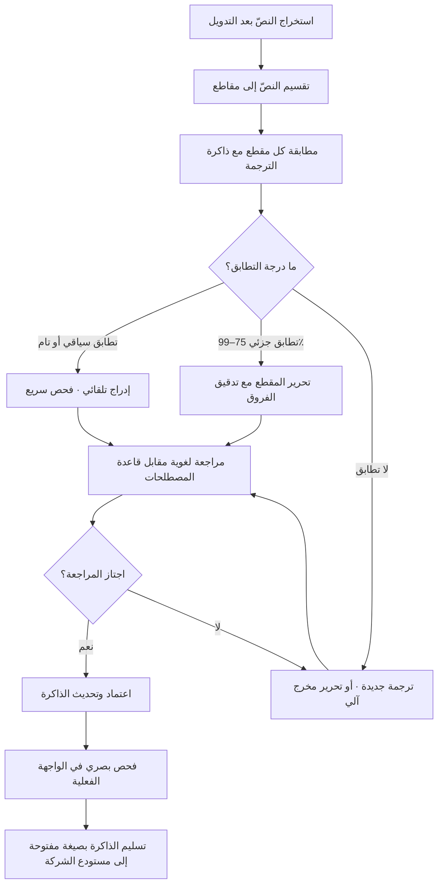

# ذاكرة الترجمة (Translation Memory)

> [!info] تعريف مختصر
> قاعدة بيانات تخزّن كل جملة (أو «مقطع» Segment) سبقت ترجمتها مقرونةً بترجمتها المعتمدة، بحيث تُعرض تلقائيًّا على المترجم حين يعود المقطع نفسه أو ما يشبهه في نصّ جديد. الذاكرة ليست أداة ترجمة آلية ولا محرّك ذكاء اصطناعي يولّد نصًّا؛ هي **أرشيف قرارات لغوية بشرية سابقة** يُعاد استخدامه. أثرها المزدوج هو أنها تخفض الكلفة والزمن على المحتوى المتكرّر، وتفرض اتّساقًا لغويًّا صارمًا عبر آلاف الشاشات والوثائق التي قد يعمل عليها عشرات المترجمين على مدى سنوات. وفي مشاريع التوطين (Localization) تتحوّل الذاكرة من «أداة مساعدة» إلى **أصل من أصول المشروع** له قيمة تعاقدية ومالية مستقلّة.

## الشرح العلمي والاحترافي
- **وحدة العمل هي المقطع لا الملف**: تقسّم أدوات الترجمة بمعاونة الحاسوب (CAT Tools) النصّ إلى مقاطع بحسب قواعد ترقيم (غالبًا الجملة أو خلية الجدول أو سلسلة الواجهة). كل مقطع يُخزَّن كزوج: النصّ المصدر + النصّ الهدف + بيانات وصفية (من ترجمه، متى، في أي مشروع، ما حالته). هذا التقسيم هو ما يجعل إعادة الاستخدام ممكنة على مستوى دقيق، لكنه أيضًا مصدر أخطاء حين يكون المعنى موزّعًا على أكثر من جملة أو حين تُقسَّم سلسلة واجهة تقسيمًا اعتباطيًّا.
- **درجات التطابق (Match Rates)** هي جوهر الاقتصاد في التسعير: **التطابق التام (100% Match)** حيث المقطع مطابق حرفيًّا لمقطع مخزَّن؛ **التطابق السياقي (Context Match / ICE)** وهو تطابق تام يسبقه ويليه المقطعان نفساهما في المستند الأصلي، وهو أقوى وأأمن؛ **التطابق الجزئي (Fuzzy Match)** بنِسَب متدرّجة (عادةً 75%–99%) حيث يتشابه المقطعان مع اختلاف كلمة أو رقم؛ **التكرارات (Repetitions)** وهي مقاطع تتكرّر داخل الدفعة نفسها ولم تكن في الذاكرة أصلًا؛ و**المقاطع الجديدة (No Match)**. تُبنى عروض أسعار التوطين على شبكة خصومات مرتبطة بهذه الدرجات، فتُحتسب المقاطع الجديدة بالسعر الكامل والتطابقات التامة بجزء صغير منه.
- **الفرق الجوهري عن الترجمة الآلية (Machine Translation)**: الذاكرة **تسترجع** ترجمة بشرية سبق اعتمادها، بينما الترجمة الآلية **تولّد** نصًّا جديدًا احتماليًّا. الخلط بينهما شائع ومكلف: مخرج الذاكرة عند التطابق التام قابل للثقة به بدرجة عالية لأنه مرّ بمراجعة بشرية سابقة، أما مخرج المحرّك الآلي فيحتاج تحريرًا لاحقًا (Post-Editing) وسياسة جودة مستقلّة. في التدفّقات الحديثة تعمل الأداتان معًا: الذاكرة أولًا، ثم المحرّك الآلي للمقاطع التي لم تجد تطابقًا، ثم المراجعة البشرية.
- **الذاكرة ليست وحدها**: تعمل ضمن ثلاثية متكاملة — **ذاكرة الترجمة** (جمل)، و**قاعدة المصطلحات / Termbase** (مفردات معتمدة وممنوعة مع تعريفاتها)، و**دليل الأسلوب / Style Guide** (نبرة، مخاطبة، تعامل مع الأرقام والتواريخ والتشكيل). الذاكرة تضمن الاتّساق على مستوى الجملة، وقاعدة المصطلحات على مستوى الكلمة، ودليل الأسلوب على مستوى الصوت العام. إهمال أيٍّ منها يجعل الاثنين الآخرين أقل نفعًا.
- **الملكية والقابلية للنقل**: الصيغة القياسية المفتوحة لتبادل الذاكرات هي **TMX** (Translation Memory eXchange)، ولقواعد المصطلحات **TBX**، ولملفات العمل ثنائية اللغة **XLIFF**. وجود هذه الصيغ يعني أن الذاكرة **يمكن نقلها بين المزوّدين**، وهو ما يجعل بند ملكية الذاكرة في العقد مسألة حاسمة: إن ظلّت الذاكرة عند وكالة الترجمة، فأنت مرتبط بها ارتباطًا يصعب فكّه ([[Vendor Lock-in]])؛ وإن ملكتَها أنت وطلبت تسليمها دوريًّا بصيغة TMX، فبإمكانك تغيير المزوّد دون خسارة الأصل المتراكم.
- **جودة الذاكرة تتدهور ما لم تُصَن**: الذاكرة تكبر مع الوقت، وتتراكم فيها ترجمات قديمة لمصطلحات تغيّرت، وتكرارات متضاربة للمقطع نفسه، ومقاطع دخلت من مشاريع بجودة أدنى. لذلك تُمارَس عليها صيانة دورية: تنظيف التكرارات المتضاربة، وتحديث المصطلحات بعد تغيّر العلامة أو المنتج، وفصل ذاكرات المنتجات المختلفة أو المجالات المختلفة، وتقييد الكتابة فيها بالمراجَع المعتمد لا بالمسودّة. الذاكرة غير المصانة تنقل الخطأ بكفاءة وسرعة أكبر مما تنقل الصواب.
- **الأثر على تسلسل العمل الهندسي**: نجاح الذاكرة يعتمد على أن يكون النصّ قابلًا للاستخراج أصلًا. النصوص المغروسة داخل الصور، أو المجمّعة برمجيًّا من أجزاء (String Concatenation)، أو التي لا تحمل معرّفًا ثابتًا، تكسر إعادة الاستخدام وتنتج مقاطع مشوّهة. لهذا يسبق التوطينَ عملُ تدويل (Internationalization) يفصل النصّ عن الشيفرة ويمنح كل سلسلة مفتاحًا ثابتًا وسياقًا وصفيًّا.
- **قيمة تراكمية غير خطّية**: القيمة الاقتصادية للذاكرة تظهر في **الإصدار الثاني وما بعده**، لا في الأول. في المشروع الأول يكون معدّل التطابق قريبًا من الصفر والكلفة كاملة؛ ومع نضج المنتج وتكرار التحديثات ترتفع نسبة التطابقات حتى تصبح النسبة الأكبر من كل دفعة تحديث. هذا يجعل الحكم على جدوى الذاكرة من دورة واحدة حكمًا مضلّلًا، ويجعلها بندًا في حساب [[TCO]] لا في ميزانية إطلاق واحد.

## أين ومتى يُستخدم
- **في توطين المنتجات الرقمية متعدّدة اللغات**: حيث تتكرّر سلاسل الواجهة عبر الشاشات والإصدارات، فتصبح الذاكرة شرطًا لثبات المصطلح الظاهر للمستخدم عبر التطبيق كلّه وامتدادًا عمليًّا لمبدأ [[Single Source of Truth]].
- **في توثيق المنتج والمساعدة**: أدلّة الاستخدام وقواعد المعرفة تُحدَّث جزئيًّا كل إصدار، فتُترجم الفقرات الجديدة فقط ويُعاد استخدام الباقي، وهو تدفّق ينسجم طبيعيًّا مع نهج [[Docs as Code]] لأن النصّ يعيش في ملفات نصّية قابلة للفروقات (Diff).
- **في المحتوى التعاقدي والتنظيمي**: العقود والسياسات وإشعارات الخصوصية مليئة بفقرات نمطية متكرّرة، ودقّة اتّساق صياغتها ليست تحسينًا لغويًّا بل مسألة امتثال ترتبط بوثائق مثل [[Standard Contractual Clauses]] و[[PDPL]].
- **في مشاريع دخول سوق جديدة**: حين يكون التعريب أو الترجمة جزءًا من [[Go-to-Market]]، تُقدَّر كلفة التوطين وزمنه انطلاقًا من حجم المحتوى ونسب التطابق المتوقّعة، فتدخل الذاكرة مباشرة في جدولة الإطلاق و[[Time to Value]].
- **في إدارة مزوّدي الترجمة**: تصبح الذاكرة أداة قياس وتفاوض ضمن [[Vendor Management]]، إذ تُسعَّر الدفعات بحسب تقرير التحليل (Analysis Report) الذي تُصدره الأداة قبل بدء العمل، فيُعرَف حجم العمل الحقيقي قبل التعاقد لا بعده.
- **في مراجعة الجودة اللغوية**: تُستخدم الذاكرة مرجعًا لفحص الانحرافات — كل مقطع خرج عن الترجمة المعتمدة سابقًا يُصبح استثناءً يستحقّ تبريرًا، وهو ما يحوّل مراجعة اللغة من ذوق شخصي إلى فحص قابل للتكرار أشبه بمنطق [[Regression Testing]].

## مثال وسيناريو تطبيقي
> [!example] شركة سعودية تطوّر منصّة لإدارة الطلبات، وقرّرت التوسّع إقليميًّا بواجهة عربية وإنجليزية، ثم لاحقًا تركية.
> **الحالة قبل الذاكرة:** كان الفريق يرسل ملفات إكسل بها سلاسل الواجهة إلى مترجمين مستقلّين مع كل إصدار. في الإصدارات الخمسة الأولى ظهر المصطلح الإنجليزي `Order` مترجمًا بأربع صيغ مختلفة داخل التطبيق نفسه: «طلب»، «أوردر»، «طلبية»، «أمر شراء». وسجّل فريق الدعم شكاوى متكرّرة من عملاء ظنّوا أن «الطلبية» و«الطلب» شاشتان لكيانين مختلفين. كما كان كل إصدار يُعاد فيه ترجمة السلاسل غير المتغيّرة لأن لا أحد يعرف أيّها تغيّر فعلًا.
> **ما فُعل:** أُنشئت ذاكرة ترجمة واحدة لكل زوج لغوي، مع قاعدة مصطلحات صغيرة تضم 180 مصطلحًا معتمدًا للمنتج (منها قرار صريح: `Order` = «طلب» دائمًا، و`Purchase Order` = «أمر شراء» دائمًا، ويُمنع استعمال «طلبية»). ونُقلت سلاسل الواجهة من إكسل إلى ملفات موارد لكل سلسلة فيها مفتاح ثابت وتعليق يصف مكان ظهورها ومساحتها.
> **ما ظهر في الدفعة التالية:** أظهر تقرير تحليل الدفعة أن إجمالي الكلمات 42,000 كلمة، منها 26,500 تطابق تام، و7,300 تطابق جزئي، و8,200 كلمة جديدة. فبدل تسعير 42,000 كلمة بالسعر الكامل، سُعّرت الدفعة بشبكة الخصومات، وانخفضت فاتورة الدفعة إلى ما يقارب ثلث ما كانت عليه في الدورة السابقة بحجم محتوى مماثل. والأهم من الكلفة أن زمن دورة التوطين انكمش من أسبوعين إلى أربعة أيام، لأن المترجم لم يعد يفتح إلا المقاطع الجديدة والجزئية.
> **الفائدة المضاعفة عند اللغة الثالثة:** حين بدأ العمل على التركية، لم تكن هناك ذاكرة تركية بعد، لكن قاعدة المصطلحات ووصف السياق لكل مفتاح كانا جاهزين، فبدأ المترجم التركي من أساس منضبط بدل أن يخمّن معنى `Draft` هل هي «مسودّة» أم «سحب». وفي الإصدار التركي الثاني ارتفعت نسبة التطابق إلى ما يقارب النصف.
> **درس تعاقدي:** في مراجعة العقد مع وكالة الترجمة، أُضيف بند صريح: الذاكرة وقاعدة المصطلحات ملك للشركة، وتُسلَّم بصيغة TMX وTBX مع كل تسليم شهري. بعد عام، وحين قرّرت الشركة تغيير المزوّد لأسباب سعرية، تمّ الانتقال دون خسارة سنة من القرارات اللغوية المتراكمة — وهو بالضبط ما كان سيتحوّل، لولا البند، إلى ارتهان مكلف للمزوّد.

## خطوات أو مخطّط
1. تنفيذ التدويل أولًا: فصل كل نصّ ظاهر عن الشيفرة، ومنح كل سلسلة مفتاحًا ثابتًا، ومنع تركيب الجمل برمجيًّا من أجزاء.
2. إضافة سياق وصفي لكل سلسلة: أين تظهر؟ ما الحدّ الأقصى لطولها؟ هل هي زر أم عنوان أم رسالة خطأ؟
3. بناء قاعدة المصطلحات ودليل الأسلوب قبل ترجمة أول دفعة، واعتمادهما من صاحب المنتج لا من المترجم وحده.
4. إنشاء ذاكرة منفصلة لكل زوج لغوي، وتقسيمها بحسب المجال أو المنتج إن اختلفت النبرة اختلافًا جوهريًّا.
5. تشغيل تقرير التحليل قبل كل دفعة لمعرفة توزيع التطابقات، واستخدامه أساسًا للتسعير وتقدير الزمن.
6. ترجمة المقاطع الجديدة والجزئية فقط، مع مراجعة إلزامية للتطابقات الجزئية العالية لأنها أخطر من الجديدة (تُقرأ سريعًا فيمرّ اختلاف رقم أو نفي).
7. تقييد الكتابة في الذاكرة بالمحتوى الذي اجتاز المراجعة النهائية، لا بمسودّة المترجم.
8. إجراء صيانة دورية: حذف التكرارات المتضاربة، وتحديث المقاطع المتأثّرة بتغيّر مصطلح، وأرشفة ما يخصّ منتجات أُوقفت.
9. طلب تسليم الذاكرة وقاعدة المصطلحات دوريًّا بصيغ مفتوحة وحفظها في مستودع الشركة كأصل من [[Organizational Process Assets]].

## ⚠️ مفاهيم خاطئة شائعة
> [!warning]
> - **«ذاكرة الترجمة = ترجمة آلية»**: خلط أساسي. الذاكرة تسترجع نصًّا بشريًّا معتمدًا سابقًا، والمحرّك الآلي يولّد نصًّا جديدًا احتماليًّا. التصحيح: عامِلهما كطبقتين مختلفتين في التدفّق، ولكلٍّ منهما سياسة جودة ومستوى ثقة مختلف؛ التطابق التام قد يمرّ بفحص خفيف، أما المخرج الآلي فيحتاج تحريرًا لاحقًا معلنًا ومسعّرًا.
> - **«التطابق التام لا يحتاج مراجعة»**: التطابق تامّ نصًّا لا سياقًا. الجملة نفسها قد تعني شيئًا مختلفًا في شاشة أخرى، والكلمة المفردة مثل `Open` قد تكون فعلًا أو صفة حالة. التصحيح: افصل بين التطابق التام والتطابق السياقي، واجعل المراجعة البصرية في الواجهة خطوة إلزامية.
> - **«التطابق الجزئي العالي أرخص وأأمن»**: أرخص نعم، وأأمن لا. التطابق بنسبة 98% هو غالبًا اختلاف في رقم أو أداة نفي أو وحدة قياس — وهي بالضبط الفروق التي يقفز فوقها النظر. التصحيح: خصّص للتطابقات الجزئية العالية تدقيقًا موجّهًا للفروق تحديدًا.
> - **«الذاكرة تحسّن الجودة بذاتها»**: هي تحسّن **الاتّساق**، وهو ليس الجودة. ذاكرة مليئة بترجمات رديئة ستعمّم الرداءة على كامل المنتج باتّساق مثالي. التصحيح: اضبط ما يدخل الذاكرة، ولا تسمح بالكتابة فيها إلا بعد المراجعة المعتمدة.
> - **«حجم الذاكرة الأكبر أفضل دائمًا»**: دمج ذاكرات مجالات متباعدة (تسويقية + قانونية + واجهة تقنية) يرفع نسب التطابق ظاهريًّا وينتج اقتراحات مضلّلة بنبرة خاطئة. التصحيح: افصل الذاكرات بحسب المجال والنبرة، واقبل نسبة تطابق أقل مقابل ملاءمة أعلى.
> - **«الذاكرة تخصّ فريق الترجمة وحده»**: هي في الحقيقة ناتج مشترك بين الهندسة (استخراج النصّ وسياقه) والمنتج (اعتماد المصطلح) والتسويق (النبرة). التصحيح: عيّن مالكًا صريحًا للمصطلحات من جهة المنتج، لا من جهة المزوّد.
> - **«الذاكرة تُبنى مرّة وتُنسى»**: هي أصل حيّ يتقادم؛ تغيير اسم ميزة واحدة قد يُبطل مئات المقاطع. التصحيح: اجعل صيانة الذاكرة بندًا دوريًّا مجدولًا، وربطها بأي تغيير في تسمية المنتج أو العلامة.

## ❌ ممارسات خاطئة في المشاريع
> [!failure]
> - **الخطأ: ترك ملكية الذاكرة لدى وكالة الترجمة دون بند تعاقدي.** لماذا يضرّ: يتحوّل أصل متراكم عبر سنوات إلى رهينة عند المزوّد، فيرتفع سعر التجديد ويصبح تغيير المزوّد مكلفًا إلى حدّ الاستحالة العملية. الحل: بند صريح بملكية الذاكرة وقاعدة المصطلحات، وتسليمها دوريًّا بصيغتَي TMX وTBX، مع اختبار فعلي للاستيراد لا مجرّد استلام ملف.
> - **الخطأ: البدء بالترجمة قبل التدويل.** لماذا يضرّ: نصوص داخل صور، وسلاسل مركّبة برمجيًّا، وجُمَل مقطوعة بلا سياق — كلها تنتج ذاكرة ملوّثة بمقاطع غير قابلة لإعادة الاستخدام، وتُعاد الأعمال من الصفر لاحقًا. الحل: اجعل التدويل شرط جاهزية ([[Definition of Ready]]) قبل فتح أي دفعة توطين.
> - **الخطأ: كتابة المسودّات مباشرة في الذاكرة الرئيسة.** لماذا يضرّ: تتسرّب أخطاء غير مراجَعة إلى مقاطع ستُقترح تلقائيًّا آلاف المرات لاحقًا، فينتشر الخطأ بكفاءة النظام نفسه. الحل: ذاكرة عمل مؤقّتة للمسودّات، وترقية المقاطع إلى الذاكرة الرئيسة بعد الاعتماد فقط.
> - **الخطأ: تسعير التوطين بعدد الكلمات الخام دون تقرير تحليل.** لماذا يضرّ: تدفع ثمن محتوى مترجم أصلًا، ويفقد الفريق أي أساس موضوعي للتفاوض أو لتقدير الزمن. الحل: اشترط تقرير التحليل قبل أمر العمل، واعتمد شبكة خصومات متّفقًا عليها مسبقًا في العقد.
> - **الخطأ: إسقاط المراجعة البصرية في الواجهة الحقيقية.** لماذا يضرّ: نصّ صحيح لغويًّا قد ينكسر بصريًّا (تجاوز طول الزر، انعكاس اتّجاه الواجهة في العربية، أرقام أو تواريخ بصيغة خاطئة)، والعميل يرى النتيجة لا الملف. الحل: مرحلة فحص لغوي بصري (LQA) على بيئة قريبة من الإنتاج ضمن معايير [[Definition of Done]].
> - **الخطأ: اعتبار مقاييس الجودة اللغوية أمرًا ذوقيًّا بلا تعريف.** لماذا يضرّ: تتحوّل المراجعة إلى جدال لا ينتهي بين مراجعَين، وتتأخّر الإصدارات بلا سبب قابل للقياس. الحل: عرّف تصنيفًا للأخطاء (مصطلح، دقّة، أسلوب، شكل) بأوزان متّفق عليها، وطبّق منطق [[Severity vs Priority]] عليها.
> - **الخطأ: تجاهل صيانة الذاكرة بعد إعادة تسمية منتج أو تغيير هوية العلامة.** لماذا يضرّ: تستمرّ الأداة في اقتراح الاسم القديم بثقة عالية، فتنتشر التسمية المهجورة في كل إصدار جديد. الحل: اربط تغييرات التسمية بمهمّة تحديث دفعي للذاكرة وقاعدة المصطلحات وفق [[Brand Guidelines]]، وتحقّق منها كجزء من [[Change Request]].

## 🔗 مصطلحات ومفاهيم ذات صلة
[[Go-to-Market]] | [[Market Entry Modes]] | [[Vendor Lock-in]] | [[Vendor Management]] | [[Single Source of Truth]] | [[Docs as Code]] | [[Organizational Process Assets]] | [[TCO]] | [[Time to Value]] | [[Definition of Done]]
