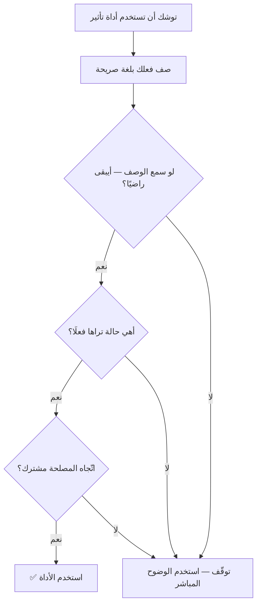

# اختبار الشفافية (Transparency Test)
> [!info] تعريف مختصر
> اختبار الشفافية معيار عملي يفصل بين التأثير المشروع والتلاعب، بسؤال واحد: **لو عَلِم الطرف الآخر بالضبط ما تفعله وسمّاه باسمه — أيبقى راضيًا؟** وقوّته أنّه لا يعتمد على تقييمك لنيّتك — وهو تقييم متحيّز بطبعه — بل على **قابلية الفعل للإعلان**.

## الشرح العلمي والاحترافي
المعيار صيغة عملية لمبدأ العلانية عند **كانط**، ويُستخدَم في أدبيات أخلاقيات الأعمال والصحافة. وأهمّيته في إدارة المشاريع أنّ **أدوات التأثير حيادية تقنيًّا**: [[Labeling|التسمية]] التي تُهدّئ مديرًا مضغوطًا هي بنيويًّا التسمية نفسها التي يستخدمها بائع لانتزاع توقيع. **فالفرق ليس في الصياغة** — ولا بدّ من معيار خارجها.

**ويُستخدَم ضمن ثلاثة معايير مجتمعة:**

| المعيار | السؤال | يفصل ماذا |
|---|---|---|
| ① **صدق الوصف** | أهذه حالة أراها فعلًا؟ | تسمية صادقة ↔ مُصطنَعة |
| ② **اتّجاه المصلحة** | أُخرجه من حالة تُعطّله هو، أم أستغلّ حالته؟ | تهدئة ↔ استغلال |
| ③ **اختبار الشفافية** | لو عَلِم وسمّاه باسمه، أيبقى راضيًا؟ | مهنيّة ↔ تلاعب |

**وتطبيقه على أدوات التأثير:**

| الأداة | يجتاز حين | يسقط حين |
|---|---|---|
| [[Labeling\|التسمية]] | تصف ضغطًا تراه فعلًا | تُلقى لإيهامه بتعاطف غير موجود |
| [[Accusation Audit\|تدقيق الاتّهام]] | يُتبَع بالحقيقة كاملة | يُستخدَم **بدلًا** من الحقيقة |
| [[Calibrated Questions\|الأسئلة المعايرة]] | تُوصله إلى حدّ حقيقي بنفسه | تُوصله إلى استنتاج تعرف أنّه خاطئ |
| [[Anchoring\|المرساة]] | رقم مدروس بهامش تفاوض معلن عرفًا | رقم مُضخَّم لاستغلال جهله بالسوق |
| [[Loss Framing\|تأطير الخسارة]] | خسارة موثّقة | خسارة مُتخيَّلة أو مبالغ فيها |

## أين ومتى يُستخدم
- قبل استخدام أيّ أداة تأثير في موقف تشعر فيه بتردّد.
- عند مراجعة سلوك تفاوضي لك أو لغيرك بأثر رجعي.
- عند وضع قواعد سلوك للفريق في التعامل مع العملاء والمورّدين.
- في تدريب مديري المشاريع الجدد على أدوات التواصل — بوصفه الحدّ لا الملحق.

## مثال وسيناريو تطبيقي
> [!example] مديران يستخدمان الأداة نفسها. الأوّل يقول لعميل غاضب: «يبدو أنّك تشعر أنّنا لم نُعطِ مشروعك أولويّته» ← صمت ← ثم: «الحقيقة أنّنا تأخّرنا أحد عشر يومًا بسبب كذا، وهذه خطّة التعويض.» والثاني يقول الجملة نفسها حرفيًّا ← صمت ← ثم ينتقل إلى موضوع آخر ويخرج من الاجتماع بلا ذكر التأخير. **الصياغة واحدة والفعل مختلف.** ولو عَلِم العميل بما فعله كلٌّ منهما وسمّاه باسمه: لبقي راضيًا عن الأوّل — بل ربّما قدّر أنّه هيّأه لسماع خبر صعب؛ **ولانقلب على الثاني**، لأنّ الأداة استُخدمت لتأجيل حقيقة كان من حقّه معرفتها.

## خطوات أو مخطّط
1. صف لنفسك ما تفعله **بلغة صريحة**: «سأصف شعوره لأهدّئه قبل أن أخبره بالتأخير.»
2. تخيّل أنّه سمع هذا الوصف حرفيًّا.
3. **أيبقى راضيًا؟** — إن كان الجواب لا، فتوقّف.
4. طبّق المعيارين الآخرين: أهي حالة تراها فعلًا؟ وهل اتّجاه المصلحة مشترك؟
5. إن سقط أيّ معيار، فالبديل ليس أداة أخرى بل **الوضوح المباشر**.

## ⚠️ مفاهيم خاطئة شائعة
> [!warning]
> - **ليس اشتراطًا للإفصاح عن التقنية.** لا يُطلَب منك أن تقول «سأُلقي الآن تسمية»؛ المطلوب أن يكون فعلك **قابلًا للإعلان** لو أُعلِن.
> - **ليس مساويًا لـ«الشفافية المطلقة».** حجب معلومة لا يقابلها فعل ممكن قد يجتاز الاختبار؛ وحجب ما **يُغيّر قرارًا شخصيًّا** (بقاء · عرض آخر · التزام مالي) يسقط فيه.
> - **إعلان النيّة الحسنة ليس بديلًا عن المعيار.** تكرار «هذه ليست تلاعبًا» يُنتج طمأنة لا ضبطًا؛ بل قد يُصبح إعلان النيّة بديلًا عن فحصها.

## ❌ ممارسات خاطئة في المشاريع
> [!failure]
> - **وصف شعور لا تراه** — وهي الحالة الوحيدة التي تسقط بلا لبس، لأنّها تُنشئ اعتقادًا كاذبًا عن **حالتك الداخلية أنت**، ولا يستطيع الطرف الآخر التحقّق منه أبدًا. وباقي الأدوات يُتحقَّق من صدقها بالنتائج.
> - **الاكتفاء بأنّ التقنية «معروفة ومشروعة»** — التقنية لا تُبرّر مضمونًا كاذبًا: مرساة مبنيّة على رقم موهوم تبقى تضليلًا وإن كان التثبيت أداة مشروعة.
> - **استخدامه للحكم على الآخرين من تفاعل واحد** — الفرق بين استخدام مشروع وسوء استخدام يظهر في **الحصيلة عبر أشهر**، لا في جلسة واحدة. ونمط «الجميع يشعرون بالرضا والنتيجة دائمًا لصالحه» مؤشّر أقوى من أيّ انطباع لحظي.
> - **الخلط بين إدراك التقنية وسوء استخدامها** — حين تتعلّم الأدوات تبدأ في رؤيتها تُستخدَم عليك، ورؤية البنية خلف الجملة تُنتج شعورًا بالاصطناع حتى حين تكون صادقة.

## 🔗 مصطلحات ومفاهيم ذات صلة
[[Labeling]] | [[Accusation Audit]] | [[Loss Framing]] | [[Anchoring]] | [[Tactical Empathy]] | [[Radical Transparency]] | [[Dark Patterns]] | [[Intellectual Humility]] | [[Psychological Safety]]

> [!tip] 💡 إثراء عملي — كورس لعبة العقل
> المعايير الثلاثة، وتطبيقها على كلّ أداة، وحدود الشفافية في الأزمات المالية: [[03 - التعاطف التكتيكي - الفهم غير الموافقة]] و[[10 - كاريزما القائد الصامت والقيادة البيولوجية]].
