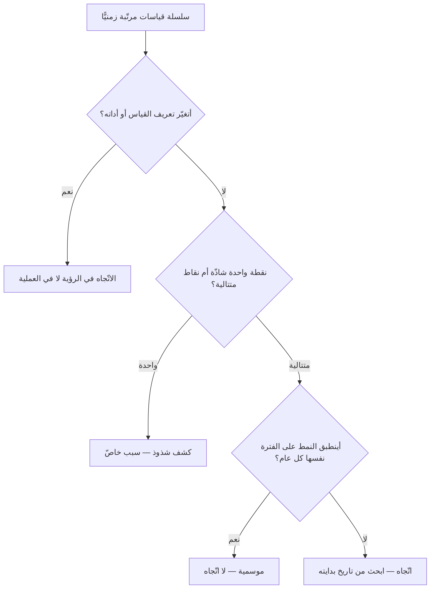

# تحليل الاتجاه (Trend Analysis)

> [!info] تعريف مختصر
> **تحليل الاتجاه** قراءة سلسلة من القياسات **مرتّبة في الزمن** للإجابة عن سؤال لا تجيب عنه أي نقطة مفردة: **إلى أين يسير هذا؟** فالرقم الواحد يقول أين أنت الآن، والسلسلة تقول أتقترب أم تبتعد، وبأي سرعة، ومنذ متى. وشرطه الذي يفصله عن الانطباع أن يكون له **قاعدة تقول متى تصير النقاط اتّجاهًا** — فنقطتان لا تصنعان اتّجاهًا، وثلاث نقاط صاعدة قد تكون تذبذبًا معتادًا، والفرق بينهما ليس ذوقًا بل قاعدةً معلَنة.

## الشرح العلمي والاحترافي

### 1. ثلاثة أشياء تحملها السلسلة ولا تحملها النقطة

كل سلسلة زمنية فيها ثلاث معلومات مستقلّة، والخلط بينها أصل أكثر القراءات الخاطئة:

1. **الاتّجاه (Trend)** — ميلٌ مستمرّ في جهة واحدة. وهو ما يُبحث عنه غالبًا.
2. **التذبذب (Variation)** — سعة التأرجح حول المسار. وهي قد تكون **أهمّ من الاتّجاه نفسه**: فريقٌ زمن دورته ينخفض ببطء وتذبذبه يتّسع صار أسوأ في التنبّؤ لا أفضل، وإن تحسّن متوسّطه.
3. **الموسمية (Seasonality)** — نمط يتكرّر بدورة معلومة: نهايات الأرباع، ورمضان، وموسم العودة إلى المدارس، وحتى أيّام الأسبوع في بيانات الدعم الفنّي. وقراءة الموسمية اتّجاهًا هي أشيع خطأ في لوحات الإدارة.

### 2. متى تصير النقاط اتّجاهًا؟ قواعد لا انطباعات

تُستعمل في ضبط الجودة الإحصائي مجموعة قواعد معروفة بقواعد **نيلسون** (1984)، وهي عُرف مضبوط على توزيع متماثل، ومنها ثلاث تكفي أكثر فرق المشاريع:

| العلامة | ما تعنيه |
|---|---|
| **ستّ نقاط متتالية** كلّها صاعدة أو كلّها هابطة | تغيّرٌ مستمرّ، لا تأرجح |
| **تسع نقاط متتالية** في جهة واحدة من الخطّ المركزي | انتقل مستوى العملية نفسه |
| **نقطة خارج حدود التحكّم** | حدثٌ له **سبب خاصّ** يُحقَّق فيه فردًا |

**والعلامتان الأوليان هما تحليل الاتجاه، والثالثة كشف شذوذ** — وهذا هو الفرق العملي بين البابين. وهذه الأرقام أعرافٌ لضبط معدّل الإنذار الكاذب، لا حدودًا طبيعية؛ من شدّدها قلّت إنذاراته الكاذبة وبطؤ اكتشافه، ومن خفّفها وقع في العكس.

### 3. جدول التمييز: ثلاث أدوات تقرأ السلسلة نفسها

تُقرأ السلسلة الواحدة بثلاث أدوات تُخلط كثيرًا، وأوجه فرقها **الفعل الذي تطلبه منك**:

| وجه المقارنة | [[Control Chart\|مخطط التحكّم]] | **تحليل الاتجاه** | [[Anomaly Detection\|كشف الشذوذ]] |
|---|---|---|---|
| **عن أي شيء يسأل؟** | أعمليتنا مستقرّة يُتنبَّأ بها؟ | إلى أين تسير؟ | أهذه النقطة بعينها غريبة؟ |
| **ماذا يقرأ؟** | التشتّت حول خطّ مركزيّ | الميل والاتّجاه عبر المدّة | الانحراف اللحظي عن المتوقَّع |
| **متى يُنبّه؟** | عند خروج نقطة عن الحدود | بعد تراكم نقاط في جهة | فور وقوع القيمة |
| **ما الفعل الذي يطلبه؟** | تحقيقٌ في سبب خاصّ | مراجعة قرار أو خطّة | استجابة تشغيلية الآن |
| **أفقه الزمني** | العملية كما هي | أسابيع وأشهر | لحظة أو دقائق |

> **السؤال الفارق:** مخطّط التحكّم يسأل **«أهي منضبطة؟»**، وتحليل الاتجاه يسأل **«إلى أين؟»**، وكشف الشذوذ يسأل **«وما هذه؟»**. وهي متكاملة لا بدائل: العملية قد تكون منضبطة تمامًا وهي تنحدر ببطء داخل حدودها — فينام مخطّط التحكّم ويستيقظ تحليل الاتجاه.

### 4. الفخّ الذي لا يراه أحد: أتغيّرت العملية أم تغيّر القياس؟

قبل تفسير أي اتّجاه، يُسأل سؤال واحد يوفّر تحقيقات كاملة: **أتغيّر شيء في طريقة جمع الرقم؟** فارتفاع عدد العيوب بعد إدخال أداة فحص جديدة ليس تدهورًا في الجودة، بل **تحسّنًا في الرؤية**. وانخفاض زمن الدورة بعد تغيير لحظة بدء العدّاد ليس تسريعًا. والاتّجاه الذي يبدأ بالضبط عند تاريخ تغيير في الأداة أو التعريف **مشكوك فيه حتى يُثبت العكس**.

## أين ومتى يُستخدم

- في مراجعة المشروع الدورية، بعرض السلاسل بدل النقاط: زمن الدورة، والإنتاجية، ونسبة إعادة العمل، والعيوب المفتوحة.
- في التنبّؤ بموعد الإنجاز عبر [[Burnup Chart|مخطط الإنجاز الصاعد]]، إذ يُمدّ خطّ الاتّجاه لا خطّ الخطّة.
- في متابعة [[KRI|مؤشّرات الخطر]]، فأكثرها لا يُقرأ عند عتبة بل باتّجاهه نحوها.
- في مرحلة «حلّل» من [[DMAIC]]، لفصل التذبذب المعتاد عن التحوّل الحقيقي قبل البحث عن سبب.
- في مراجعة الأداء التشغيلي مع مورّد ([[Vendor Management]])، حيث الاتّجاه أعدل من لقطة شهر بعينه.

## مثال وسيناريو تطبيقي

> [!example] سيناريو ملموس
> لوحة دعم فنّي، وزمن الاستجابة الوسيط بالساعات عبر عشرة أسابيع:
> **4.1 · 3.9 · 4.3 · 4.0 · 4.2 · 4.4 · 4.6 · 4.9 · 5.1 · 5.4**
>
> **القراءة الأولى في الاجتماع:** «الأسبوع الأخير 5.4 — ارتفاع كبير، لنبحث عمّا حدث الأسبوع الماضي.» وهي قراءة **نقطة**، وستقود إلى تحقيق في حدث لم يقع.
>
> **قراءة الاتجاه:** الأسابيع الستّة الأخيرة صاعدة **متتالية بلا انقطاع** — وهذه علامة نيلسون الأولى. فالمسألة ليست في الأسبوع الأخير، بل في شيء بدأ قبل ستّة أسابيع واستمرّ. ولا نقطة من العشر خارج حدود التحكّم، فمخطّط التحكّم وحده كان سيبقى صامتًا طوال المدّة.
>
> **وما وُجد:** موظّفان من الفريق انتقلا إلى مشروع آخر قبل ستّة أسابيع بالضبط، ولم يتغيّر حجم الوارد. فالعلاج قرار موارد لا تحسين إجراء.
>
> **ولو كانت السلسلة:** `4.1 · 3.9 · 9.8 · 4.0 · 4.2` لكانت مسألة كشف شذوذ لا اتّجاه — نقطة واحدة لها سبب خاصّ، وما قبلها وما بعدها سليم.

## خطوات أو مخطّط

1. اختر مقياسًا واحدًا وعرّف مصدره بدقّة، وثبّت المدّة التي تُجمَّع عليها كل نقطة (أسبوع · سبرنت · شهر).
2. ارسم السلسلة كاملةً — لا الأشهر الثلاثة الأخيرة وحدها، فقصر النافذة يصنع اتّجاهات لا وجود لها.
3. علّم على المحور تواريخ التغييرات المعروفة: تغيّر الفريق، أو الأداة، أو تعريف القياس.
4. طبّق قاعدة معلَنة (ستّ صاعدة · تسع في جهة) بدل الحكم بالنظر.
5. افحص الموسمية بمقارنة الفترة بنظيرتها من العام الماضي لا بسابقتها مباشرةً.
6. اسأل عن سبب الاتّجاه من تاريخ **بدايته** لا من تاريخ ملاحظتك له.

## ⚠️ مفاهيم خاطئة شائعة

> [!warning]
> - **حسبان نقطتين اتّجاهًا.** «ارتفع عن الشهر الماضي» ليست جملة اتّجاه بل مقارنة، وأكثر المقارنات الشهرية تذبذبٌ يُعاد اكتشافه كل شهر.
> - **الخلط بين تحسّن المتوسّط وتحسّن الأداء.** فاتّساع التذبذب مع انخفاض المتوسّط يُضعف قدرتك على الوعد، وهو ما يهمّ صاحب المصلحة أكثر.
> - **قراءة الموسمية اتّجاهًا** — ثم بناء خطّة على انحدارٍ ينعكس وحده بعد أسبوعين.
> - **الظنّ أن مخطّط التحكّم يغني عنه.** العملية قد تنحدر عشرين أسبوعًا داخل حدودها بلا أن تُطلق إنذارًا واحدًا، وهذا بالضبط ما يلتقطه تحليل الاتجاه.
> - **مدّ الاتّجاه إلى المستقبل بلا مدًى.** فمدّ الخطّ استدلالٌ إحصائي له شروطه ([[Descriptive and Inferential Statistics]])، لا امتدادٌ هندسيّ للمسطرة.

## ❌ ممارسات خاطئة في المشاريع

> [!failure]
> - **قصّ النافذة الزمنية حتى تظهر الصورة المطلوبة** — وهي أكثر صور التضليل بالبيانات شيوعًا في العروض، وأصعبها اكتشافًا لأن كل رقم فيها صحيح.
> - **بدء المحور الرأسي من قيمة غير الصفر بلا تنبيه**، فيبدو فارق نصف نقطة انهيارًا. والتقنية مشروعة أحيانًا، وإخفاؤها ليس كذلك.
> - **مراجعة الاتجاهات بلا سجلّ للأحداث** — فبلا تعليم تواريخ التغييرات على المحور، يُنسب كل تحوّل إلى آخر ما يتذكّره الحاضرون.
> - **إسناد الاتّجاه إلى الشهر الذي لوحظ فيه** بدل الشهر الذي بدأ فيه، فيقع التحقيق في المكان الخطأ ويُغلق بلا نتيجة.
> - **تتبّع عشرة اتجاهات معًا** حتى لا يُتابَع شيء. والفريق الذي يقرأ ثلاث سلاسل كل أسبوع أنفع من الذي يعرض ثلاثين كل ربع.

## 🔗 مصطلحات ومفاهيم ذات صلة

[[Control Chart]] | [[Anomaly Detection]] | [[Descriptive and Inferential Statistics]] | [[Statistical Significance]] | [[Percentiles and Median vs Average]] | [[Burnup Chart]] | [[Cycle Time]] | [[Throughput]] | [[KRI]] | [[Early Warning Dashboard]] | [[DMAIC]] | [[Monte Carlo Simulation]] | [[Vanity Metrics]] | [[Correlation vs Causation]]
