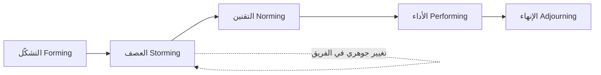

# دورة تاكمان لتطوّر الفريق (Tuckman's Stages of Group Development)
> [!info] تعريف مختصر
> دورة تاكمان (Tuckman's Stages of Group Development) نموذج نفسي-إداري وضعه بروس تاكمان عام 1965، يصف خمس مراحل يمرّ بها أي فريق جديد حتى يصل إلى أداء ناضج: التشكّل (Forming)، العصف (Storming)، التقنين (Norming)، الأداء (Performing)، والإنهاء (Adjourning).

## الشرح العلمي والاحترافي
- **التشكّل (Forming):** بداية تشكيل الفريق. الأعضاء مهذبون، حذرون، يعتمدون كثيرًا على القائد لتوضيح الاتجاه، والصراعات نادرة لأن الجميع لا يزال يتحسس الآخرين.
- **العصف (Storming):** المرحلة الأصعب. تظهر الخلافات حول الأدوار، أساليب العمل، وأولويات القرار. قد ينخفض الأداء مؤقتًا. هذه مرحلة طبيعية وضرورية، لا عيبًا في الفريق.
- **التقنين (Norming):** يبدأ الفريق بالاتفاق على قواعد عمل مشتركة (Team Working Agreement)، تتضح الأدوار، وتزداد الثقة والتعاون.
- **الأداء (Performing):** الفريق ناضج، ذاتي التنظيم إلى حد كبير (Self-Organizing Team)، وينجز العمل بكفاءة عالية دون حاجة لإشراف دقيق مستمر.
- **الإنهاء (Adjourning):** أُضيفت لاحقًا عام 1977، وتصف مرحلة تفكك الفريق بعد انتهاء المشروع أو إعادة توزيع أعضائه، وتتضمن غالبًا شعورًا بالفقد أو الحاجة لتوثيق الدروس المستفادة.
- المرور بهذه المراحل ليس خطيًا دائمًا؛ فأي تغيير جوهري (عضو جديد، تغيير القائد، تغيير المنهجية) قد يعيد الفريق مؤقتًا إلى مرحلة العصف حتى لو كان قد وصل سابقًا لمرحلة الأداء.
- يفيد هذا النموذج مدير المشروع أو الـ Scrum Master في تفسير سلوك الفريق دون قلق مبالغ فيه، ومعرفة متى يتدخل ومتى يترك الفريق يحل خلافاته بنفسه.

## أين ومتى يُستخدم
- عند تشكيل فريق مشروع جديد من أفراد لم يعملوا معًا سابقًا (فرق متعددة التخصصات - Cross-functional Team).
- عند حدوث تغيير كبير في تركيبة فريق قائم (انضمام/مغادرة أعضاء، تغيير Scrum Master).
- في تدريب القيادة (Servant Leadership) لفهم أن انخفاض الأداء المؤقت في بداية الفريق ظاهرة متوقعة لا أزمة.
- عند إغلاق مشروع طويل وتفكيك الفريق (Closure vs Handover)، لإدارة مرحلة الإنهاء بشكل صحي بدل تركها فوضوية.

## مثال وسيناريو تطبيقي
> [!example] شكّلت شركة "بايت وركس" فريق سكرم جديدًا من ستة أعضاء لمشروع تطبيق مصرفي، بينهم ثلاثة انضموا حديثًا للشركة. في الأسابيع الأولى (Forming) كان الجميع مهذبين لكن غير منتجين فعليًا، ينتظرون توجيهات الـ Scrum Master في كل تفصيل. في الأسبوع الثالث دخل الفريق مرحلة العصف (Storming): اختلف مطوّران حول معيار جاهزية العمل (Definition of Done)، وتذمّر عضو من طريقة توزيع المهام. بدل تجاهل الخلاف أو معاقبة أي طرف، سهّلت الـ Scrum Master جلسة نقاش مفتوحة، فخرج الفريق باتفاق عمل مكتوب (Team Working Agreement) يحدد معايير مشتركة. خلال الأسبوعين التاليين (Norming) استقرت الأدوار، وبحلول السبرنت الرابع (Performing) أصبح الفريق ينجز أهداف السبرنت (Sprint Goal) بثبات دون حاجة لتدخل يومي مكثف.

## خطوات أو مخطّط
1. تعرّف على المرحلة الحالية للفريق من خلال ملاحظة التفاعل والأداء.
2. في التشكّل: قدّم توجيهًا واضحًا وحدّد الأهداف والأدوار.
3. في العصف: سهّل النقاش ولا تقمع الخلاف؛ ساعد الفريق على صياغة اتفاق عمل مشترك.
4. في التقنين: عزّز القواعد المتفق عليها وامنح الفريق مساحة أكبر للاستقلالية.
5. في الأداء: قلّل التدخل التفصيلي وركّز على إزالة العوائق (Blocker) فقط.
6. في الإنهاء: وثّق الدروس المستفادة واحتفِ بإنجازات الفريق قبل تفككه.

## ⚠️ مفاهيم خاطئة شائعة
> [!warning]
> - الاعتقاد أن مرحلة العصف (Storming) علامة فشل يجب تجنبها؛ هي في الحقيقة مرحلة طبيعية وضرورية لنضج الفريق.
> - افتراض أن الفريق يمر بالمراحل مرة واحدة فقط بشكل خطي، بينما أي تغيير جوهري قد يعيده مؤقتًا لمرحلة سابقة.
> - الظن أن الوصول لمرحلة الأداء (Performing) يعني عدم الحاجة لأي قيادة بعد الآن؛ القيادة تتغير من توجيهية إلى داعمة (Servant Leadership) لا أن تختفي.

## ❌ ممارسات خاطئة في المشاريع
> [!failure]
> - قمع أي خلاف في مرحلة العصف واعتباره "سلوكًا سيئًا" يجب إيقافه فورًا — يمنع الفريق من الوصول لاتفاق حقيقي ويدفع التوتر تحت السطح. الحل: سهّل النقاش بدل قمعه، ووجّهه نحو اتفاق عمل مكتوب.
> - ضم أو استبدال أعضاء الفريق بشكل متكرر دون إدراك أن كل تغيير يعيد الفريق لمرحلة مبكرة من الدورة — يبقي الفريق عالقًا دائمًا في التشكّل. الحل: قلّل التغييرات غير الضرورية في تركيبة الفريق، وامنح وقتًا كافيًا لكل مرحلة.
> - تجاهل مرحلة الإنهاء (Adjourning) عند إغلاق المشروع والانتقال المباشر لمشروع آخر دون توثيق دروس مستفادة أو تقدير جهد الفريق — يفقد فرصة تعلم قيّمة ويترك شعورًا سلبيًا لدى الأعضاء.

## 🔗 مصطلحات ومفاهيم ذات صلة
[[Team Working Agreement]] | [[Self-Organizing Team]] | [[Psychological Safety]] | [[Servant Leadership]] | [[Cross-functional Team]] | [[Blocker]] | [[Closure vs Handover]] | [[06 - Scrum Master]]

> [!tip] 💡 إثراء عملي — كورس لعبة العقل
> «العصف» مرحلة ضرورية لا خلل، والدورة **دائرية لا خطّية**؛ ومسألة من يتحمّل بناء نضج الفريق: [[07 - إدارة الصراع - الطبقات الأربع والصراعات الخمسة]] و[[Belbin Team Roles]].

> [!tip] 💡 إثراء عملي — كورس الإنتاجية
> لماذا تنخفض الإنتاجية في مرحلة العصف — بثلاث كلف مقيسة — وما يُنسَب إلى تاكمان وما لا يُنسَب إليه نصًّا: [[12 - نضج الفريق والأمان النفسي]].
