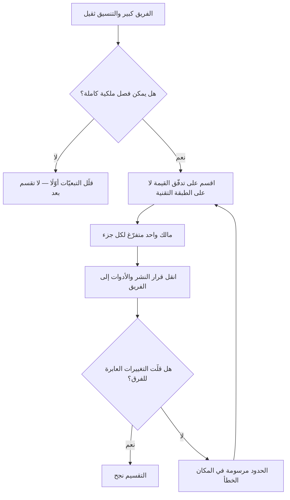

# فريق البيتزتين (Two-Pizza Team)

> [!info] تعريف مختصر
> **فريق البيتزتين** قاعدةٌ عملية نُسبت إلى **جيف بيزوس** في أمازون مطلع الألفية: **ألّا يكبر الفريق عن أن تُشبعه بيتزتان** — أي ستّة إلى عشرة أشخاص تقريبًا. وغايتها المعلنة ليست توفير الطعام ولا خفض التكلفة، بل **خفض كلفة التواصل والتنسيق** حتى يستطيع الفريق أن يقرّر ويشحن بلا استئذان.
> **وقد صحّحت أمازون نفسها فهم القاعدة لاحقًا:** إذ بيّن **كولن برايار وبِل كار** — وقد عملا فيها سنين — في كتاب *Working Backwards* (2021) أن الحجم لم يكن هو المتغيّر الحاسم، وأن ما نفع فعلًا هو **مالك واحد متفرّغ لمشكلة واحدة** (`Single-Threaded Owner`). فالفريق الصغير الذي يحتاج ثلاث موافقات ليس فريق بيتزتين، بل لجنةٌ صغيرة.

## الشرح العلمي والاحترافي

**والأساس الحسابي للقاعدة** أن عبء التنسيق لا ينمو بعدد الأفراد بل **بعدد قنوات التواصل بينهم**، وهي `ن(ن−1)/2`:

| حجم الفريق | قنوات التواصل |
|---|---|
| 5 | 10 |
| 8 | 28 |
| 12 | 66 |
| 20 | 190 |

فمضاعفة الفريق من ثمانية إلى ستّة عشر لا تضاعف قدرته، وإنما تضاعف قنواته أربع مرّات تقريبًا. وهذه هي الآلية نفسها التي يصفها [[Brooks's Law|قانون بروكس]]: أن إضافة أفراد إلى مشروع متأخّر تزيده تأخيرًا. **وقاعدة البيتزتين ليست إلا هذا القانون مقلوبًا إلى قرار تصميم:** بدل أن تعالج التأخّر بالإضافة، صمّم الفريق أصلًا تحت الحدّ الذي ينفجر عنده التنسيق.

**والشرط الذي رافقها ولا يُنقل معها** هو **الملكية الكاملة**: أن يملك الفريق خدمته من طرفها إلى طرفها، وأن يتعامل مع غيره **عبر واجهات معرَّفة لا عبر اجتماعات**. وهذا ما جعل التنسيق يقلّ فعلًا: لا لأن الفرق صغرت، بل لأن حدود المسؤولية صارت واضحة، فقلّ ما يحتاج تفاوضًا. وهو المبدأ نفسه الذي يقرّره [[Conway's Law|قانون كونواي]] من الجهة الأخرى.

**ثم جاء التصحيح.** فقد وُجد في أمازون أن فرقًا صغيرة تفشل وفرقًا أكبر تنجح، وأن الفارق ليس العدد بل **أن يكون للمبادرة صاحبٌ واحد لا يشغله غيرها**. ومن هنا انتقلت اللغة الداخلية من «فريق البيتزتين» إلى **القيادة أحادية المسار (`Single-Threaded Leadership`)**: قائد مسؤوليته الوحيدة هذه المشكلة، ومعه فريق منفصل قادر على التقدّم بلا تبعيّات. وهذا التطوّر هو أنفع ما في القصّة، لأنه يقول إن **العدد كان وكيلًا (Proxy) عن الاستقلال، لا هو الاستقلال**.

> [!danger] كيف تفشل القاعدة؟
> **ليس بأن يكبر الفريق**، بل بثلاث صور أكثرها لا يمسّ العدد:
>
> 1. **الفريق الصغير المكبَّل.** ستّة أشخاص لا يستطيعون النشر بلا موافقة لجنة، ولا اختيار مكتبة بلا معماريّ مؤسّسة. فقد نُقل الحجم وتُرك التفويض.
> 2. **الفريق الصغير المتشابك.** ثمانية لا يشحنون شيئًا إلا بمرور فريقين آخرين. فالقنوات التي وفّرتها الصغر أُنفقت كلّها على التبعيّات الخارجية.
> 3. **وأخفاها: القائد الموزَّع على أربع مبادرات.** لا يشكو أحد، فالفريق صغير والاجتماعات قليلة والهيكل مطابق للكتاب — وإنما تتأخّر كل مبادرة بمقدار انشغال صاحبها بغيرها. وهذه بعينها هي الصورة التي جعلت أمازون تنتقل إلى القيادة أحادية المسار.
>
> **والمعيار العملي:** اعدد الجهات التي يلزم الفريقَ إذنُها ليُخرج تغييرًا إلى الإنتاج. فإن زادت على صفر أو واحد، فحجم الفريق ليس مشكلتك.

## أين ومتى يُستخدم

- **عند تقسيم منظّمة هندسية تنمو**، بوصفه حدًّا أعلى لا هدفًا: لا يكبر الفريق حتى يصير التنسيق داخله عملًا قائمًا بذاته.
- **عند إطلاق مبادرة جديدة**، فتُسند إلى صاحب واحد متفرّغ وفريق مستقلّ، بدل توزيعها على أطراف كلٌّ منها مشغول بغيرها.
- **في تصميم المعمارية**: حدود الفرق تصير حدودًا في النظام، فرسمها الصحيح رسمٌ للخدمات.
- **معيارَ فحص للاجتماعات المتضخّمة**: الفريق الذي يحتاج اجتماعًا أسبوعيًّا ليعرف أعضاؤه ما يفعله بعضهم، تجاوز حدّه.

> [!warning] متى لا تُستخدَم؟
> - **حيث لا يمكن فصل الملكية.** فتصغير الفريق فوق نظام متشابك يُنتج فرقًا صغيرة كثيرة التبعيّات — وهو أسوأ من فريق واحد كبير.
> - **في العمل الذي يحتاج تخصّصات نادرة مجتمعة** (تنظيميًّا أو أمنيًّا أو تشغيليًّا)، فقد لا يتّسع له الحدّ الأعلى؛ والحلّ حينها تقليل التبعيّات لا كسر الفريق.
> - **بوصفها رقمًا حرفيًّا.** «البيتزتان» قاعدة تذكّر لا مقياس، وشهيّة الناس تختلف. والمقصود المدى لا العدد بعينه.

## مثال وسيناريو تطبيقي

> [!example] «منصّة أوان» — من فريق واحد من أربعة عشر إلى ثلاثة فرق، ثم إلى النتيجة الحقيقية
> **الوضع:** فريق واحد من أربعة عشر مطوّرًا. الوقفة اليومية بلغت ثلاثًا وعشرين دقيقة، ونصفها لا يعني نصف الحاضرين. وكل قرار تقني يمرّ باجتماع كامل.
> **الخطوة الأولى:** قُسّم إلى ثلاثة فرق من أربعة إلى خمسة. **ولم يتغيّر شيء بعد شهرين**: بل ارتفع عدد الاجتماعات، لأن التقسيم جرى **بالطبقة التقنية** (واجهات · خدمات · بيانات)، فصار كل تغيير يعبر الفرق الثلاثة.
> **الخطوة الثانية:** أُعيد التقسيم على [[Value Stream|تدفّقات القيمة]] — الاشتراك والدفع · المحتوى · التقارير — ومُنح كل فريق قرار النشر في نطاقه، وعُيّن لكل واحد مالكٌ واحد لا يشغله غيره.
> **النتيجة:** الوقفة سبع دقائق، ونسبة التغييرات التي تحتاج تنسيقًا بين فريقين من 70٪ إلى نحو 15٪.
> **الدرس:** التقسيم الأوّل نفّذ **الحجم**، والثاني نفّذ **السبب الذي وُجد الحجم من أجله**.

## خطوات أو مخطّط

1. **اقسم على الملكية أوّلًا**: أيّ جزء من المنتج يستطيع أن يُملك ويُشحن وحده؟ فهذا هو حدّ الفريق.
2. **ثم اضبط الحجم** تحت الحدّ الأعلى — وإن اضطررت إلى فريق من أحد عشر لملكية لا تنقسم، فذلك أهون من فريقين متلازمين.
3. **عيّن مالكًا واحدًا متفرّغًا** لكل مبادرة، وامنع أن يكون صاحب أكثر من واحدة.
4. **حدّد الواجهات بين الفرق** حتى يقلّ ما يحتاج اجتماعًا: التعاقد بالواجهة لا بالجدول.
5. **انقل قرارات النشر والأدوات إلى الفريق**، وإلّا فالحجم زينة.
6. **قِس التبعيّات لا الأحجام:** نسبة العناصر التي احتاجت فريقًا آخر لتخرج. فهي المؤشّر الذي يقول أنجح التقسيم أم لا.

## ⚠️ مفاهيم خاطئة شائعة

> [!warning]
> - **أنها قاعدة في العدد.** العدد وكيلٌ عن المقصود، والمقصود **كلفة التنسيق والقدرة على القرار**. ولهذا انتقلت أمازون نفسها إلى لغة القيادة أحادية المسار.
> - **أن البيتزتين تعني ستّة بالضبط.** لا رقم رسميًّا؛ والمدى المتداوَل ستّة إلى عشرة، والقاعدة صيغت صيغةً تُحفظ لا صيغةً تُقاس.
> - **أنها تُغني عن تصميم الحدود.** فرق صغيرة فوق نظام متشابك تُنتج تنسيقًا أكثر لا أقلّ.
> - **الخلط بينها وبين [[Spotify Model|السرب]].** السرب وحدة داخل نموذج موصوف له قبائل وشُعب ونقابات؛ وفريق البيتزتين قاعدةُ حجمٍ وملكية بلا هيكل مرافق.
> - **حسبانها سياسة معلنة موثّقة في أمازون.** هي ممارسة اشتهرت ورواها من عمل هناك، لا وثيقة رسمية منشورة — وقد نُقلت في كتب من داخل الشركة لا في بيان منها.

## ❌ ممارسات خاطئة في المشاريع

> [!failure]
> - **تقسيم الفرق بالتخصّص التقني** بدعوى تصغيرها — فتتضاعف التبعيّات. **الحلّ:** التقسيم بتدفّق القيمة.
> - **تصغير الفريق مع إبقاء الموافقات** — فيصير أسرع في الاجتماع الداخلي وأبطأ في التسليم. **الحلّ:** انقل القرار قبل أن تقسم.
> - **تعيين قائد على ثلاث مبادرات** ثم عدّها مستقلّة. **الحلّ:** مبادرة واحدة لكل صاحب، أو دمج المبادرات.
> - **قياس نجاح التقسيم بعدد الفرق** أو برضا الهيكل الجديد. **الحلّ:** قِس نسبة العناصر التي عبرت أكثر من فريق، وزمن التدفّق.
> - **استعمال القاعدة حجّةً لرفض التوظيف اللازم** — فتُحمَّل فرقٌ ما لا تطيق باسم «البيتزتين». **الحلّ:** الحدّ الأعلى قيدُ تصميم لا سقفُ موارد؛ فإن زاد العمل، زِد الفرق لا حجم الفريق.

## 🔗 مصطلحات ومفاهيم ذات صلة

[[Brooks's Law]] | [[Conway's Law]] | [[Dunbar's Number]] | [[Spotify Model]] | [[Cross-functional Team]] | [[Self-Organizing Team]] | [[Empowerment]] | [[Dependency]] | [[Value Stream]] | [[Micromanagement]] | [[10 - النسخة الثانية والتوسّع]]
