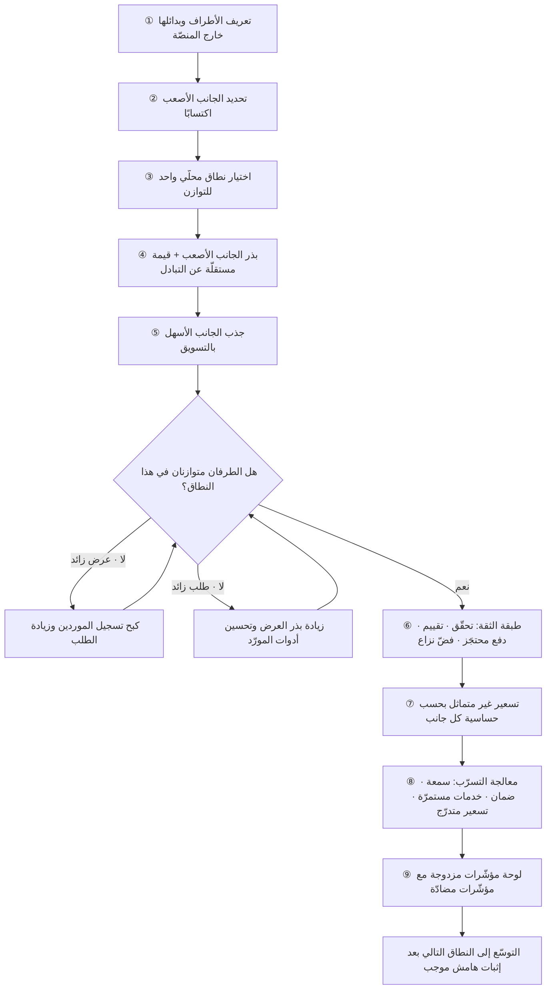

# السوق متعدّد الأطراف (Two-sided Marketplace)

> [!info] تعريف مختصر
> نموذج عمل تكون فيه المؤسّسة **وسيطًا يُمكّن التبادل بين مجموعتين مستقلّتين أو أكثر** لا يمكن لأيّهما تحقيق القيمة بدون الأخرى: مشترون وبائعون، ركّاب وسائقون، مطاعم وعملاء، مرضى وأطباء، مطوّرون ومستخدمون. الفارق الجوهري عن التاجر التقليدي أن المنصّة **لا تملك المعروض** غالبًا ولا تتحكّم في جودته بشكل مباشر، بل تصمّم القواعد والتسعير والثقة والمطابقة. وهذا يولّد مجموعة مشكلات فريدة لا توجد في المنتجات أحادية الجانب: البيضة والدجاجة، والتسعير غير المتماثل، والتسرّب خارج المنصّة، وحقيقة أن **تحسين تجربة طرف قد يضرّ الطرف الآخر مباشرةً** — ما يجعل قرار المنتج في المنصّات دائمًا مقايضة بين مصالح متعارضة لا تحسينًا خطّيًّا.

## الشرح العلمي والاحترافي
- **الطبيعة البنيوية: قيمة متبادلة لا قيمة متوازية.** المنصّة لا تبيع منتجًا لطرفين، بل تبيع لكل طرف **وصولًا إلى الطرف الآخر**. ومن هنا فإن أهمّ ما تنتجه ليس الواجهة بل ثلاثة أشياء: **المطابقة** (إيصال الطلب الصحيح إلى العرض الصحيح بسرعة)، و**الثقة** (ضمان أن المعاملة ستتمّ كما وُعد)، و**تخفيض كلفة المعاملة** (البحث، التفاوض، الدفع، فضّ النزاع). أي منصّة لا تتفوّق في هذه الثلاثة على البديل خارجها تكون عرضة للتجاوز.
- **مشكلة البيضة والدجاجة (Chicken-and-Egg)**: لا مشترون بلا بائعين، ولا بائعون بلا مشترين. وهي حالة خاصّة من مشكلة البدء من الصفر في [[Network Effects]]، لكنها أصعب لأن الطرفين يجب أن ينموا **متزامنين ومتوازنين**؛ فاختلال التوازن في أي اتجاه يُنتج تجربة سيّئة: عرض بلا طلب يُحبط الموردين ويدفعهم للمغادرة، وطلب بلا عرض يُحبط المشترين ويرفع الإلغاء. والحلول المتداولة: التركيز على نطاق ضيّق حتى الكثافة، وبذر أحد الجانبين يدويًّا، وتقديم قيمة مستقلّة عن التبادل لأحد الطرفين (أداة إدارة أو جدولة أو محاسبة يستخدمها المورّد حتى قبل أن يصله طلب).
- **الجانب الأصعب اكتسابًا (The Hard Side)**: في كل منصّة جانب أصعب في الاجتذاب والاحتفاظ، وهو غالبًا **جانب العرض** لأنه يتطلّب التزامًا ووقتًا واستثمارًا (سائق يشتري سيارة، حرفيّ يخصّص جدوله، مطعم يعيد تنظيم مطبخه)، بينما جانب الطلب يكلّف تنزيل تطبيق. تحديد الجانب الأصعب هو **القرار الاستراتيجي الأول** في المنصّة، لأنه يحدّد أين تُصرف الموارد وأين يُوجَّه التسعير وأين تُبنى الأدوات. القاعدة المتداولة: **ابنِ للجانب الأصعب، وسوّق للجانب الأسهل.** لكن الجانب الأصعب ليس ثابتًا: قد ينقلب في أسواق أو مراحل مختلفة، وفي بعض القطاعات يكون جانب الطلب هو النادر فعلًا.
- **التسعير غير المتماثل (Asymmetric Pricing)**: من الخصائص المميّزة للأسواق متعدّدة الأطراف أن السعر الأمثل لا يوزَّع بالتساوي، بل يُحمَّل على الجانب **الأقلّ حساسيّة للسعر والأكثر استفادةً من وجود الطرف الآخر**، وقد يُدعم الجانب الآخر أو يُخدَم مجّانًا تمامًا. مثاله المألوف: منصّة تُحمّل التاجر عمولة وتُبقي الاستخدام مجّانيًّا للمشتري. وقد نال هذا التحليل الاقتصادي للأسواق متعدّدة الأطراف اهتمامًا أكاديميًّا واسعًا منذ مطلع الألفية، وصار **قاعدة تصميم لا تفصيلًا ماليًّا**: قرار «من يدفع» يحدّد أي جانب ينمو وأيّهما يختنق. والخطأ الشائع تسعير الطرفين بمنطق «العدالة» بدل منطق مرونة الطلب والقيمة المتحقّقة.
- **التسرّب خارج المنصّة (Disintermediation / Leakage)**: بعد أن تُنجز المنصّة عملها — أي بعد أن يتعارف الطرفان ويثقا ببعضهما — يصبح استمرار الوساطة كلفةً في نظرهما، فيتّفقان على التعامل مباشرةً خارجها ويتجنّبان العمولة. الخطر أشدّ حين تكون: العمولة مرتفعة، والمعاملة متكرّرة مع الطرف نفسه، والخدمة عالية القيمة وطويلة الأمد، والثقة بين الطرفين تُبنى سريعًا. وسائل التخفيف المنشورة: إبقاء الدفع والضمان داخل المنصّة، وربط سجلّ التقييمات والسمعة بالمنصّة (فمغادرتها تعني فقدان رصيد السمعة)، وتقديم خدمات مستمرّة لا تُنجَز مرّة واحدة (فوترة، جدولة، تأمين، حلّ نزاعات، تسويق)، وتسعير يجعل البقاء أرخص من المغادرة، ومعالجة السبب الجذري بدل ملاحقة الأعراض. أمّا الاعتماد على البنود التعاقدية المانعة وحدها فضعيف عمليًّا: صعب الإثبات، ومكلف التطبيق، ويُنتج عداءً مع الجانب الذي تحتاجه أكثر.
- **التوتّر البنيوي بين الأطراف**: كل تحسين لطرف قد يكون خصمًا من الآخر. خفض العمولة يُسعد المورّد ويضغط الهامش. تشديد معايير الجودة يُسعد المشتري ويقلّص العرض المتاح. إظهار أرخص الخيارات أولًا يرفع التحويل ويحوّل السوق إلى حرب أسعار تُفقر الموردين وتدفع أفضلهم إلى المغادرة. تسريع الاسترداد يطمئن المشتري ويعرّض المورّد للاحتيال. ولهذا **لا يجوز أن يُدار منتج منصّة بمؤشّر واحد**؛ كل مؤشّر لطرف يحتاج [[Counter Metric]] للطرف المقابل، والتفكير المطلوب هنا تفكير نُظُمي بالحلقات لا خطّي بالميزات ([[Systems Thinking]]) — لأن أثر أي تغيير يعود إليك بعد دورة كاملة عبر الطرف الآخر.
- **الحوكمة وقواعد السوق**: المنصّة الناضجة تشبه المنظّم أكثر من التاجر: تضع معايير الدخول، وتحدّد آليات فضّ النزاع، وتصمّم نظام السمعة، وتوازن بين الشفافية والحماية من التلاعب، وتتعامل مع الاحتيال والحسابات المزيّفة. ضعف هذه الطبقة يُفسد السوق بصمت: يغادر الموردون الجيّدون أولًا فتنخفض الجودة المتوسّطة فيغادر المشترون الجيّدون، وتدخل المنصّة دوّامة انحدار يصعب عكسها ([[Governance]]).

## أين ومتى يُستخدم
- **عند تصميم نموذج عمل منصّة جديدة**: تحديد الأطراف والجانب الأصعب ونموذج التسعير قبل كتابة سطر برمجي واحد.
- **في تخطيط الإطلاق والتوسّع الجغرافي**: يتقاطع مع [[Network Effects]] لأن التوازن بين الجانبين يجب أن يتحقّق داخل كل نطاق محلّي على حدة.
- **في ترتيب أولويات المنتج**: كل بند في خارطة الطريق يُسأل عنه: أي جانب يخدم؟ وما أثره على الجانب الآخر؟
- **في تصميم لوحة المؤشّرات**: مؤشّرات مزدوجة (طلب/عرض) مع مؤشّرات مضادّة، ومؤشّرات توازن مثل نسبة الطلبات غير المُلبّاة ونسبة المورّدين بلا طلب.
- **في تحليل الاقتصاد**: تُحسب [[Unit Economics]] و[[Customer Acquisition Cost]] لكل جانب منفصلًا، ويُقاس [[Churn]] لكل جانب على حدة.
- **في سياسات الامتثال والمدفوعات**: تسوية المدفوعات بين الأطراف، والفوترة ([[E-invoicing]])، وحماية البيانات ([[PDPL]])، والتحقّق من هوية الموردين ([[KYC]]).

## مثال وسيناريو تطبيقي
> [!example] **الافتراض معلن: سيناريو تعليمي مُركَّب لمنصّة افتراضية؛ الأرقام للتوضيح ولا تُنسب إلى جهة حقيقية.**
> منصّة افتراضية في الرياض تربط **أصحاب المنازل** بـ**فنّيي الصيانة** (سباكة، كهرباء، تكييف). عمولة المنصّة 20% من قيمة الخدمة، ومتوسّط الزيارة 380 ريالًا.
> **السنة الأولى**: ركّز الفريق كل الجهد على الطلب — إعلانات، خصومات، تطبيق أنيق — فبلغ 74,000 مستخدم مسجَّل. لكن الفنّيين النشطين كانوا 210 فقط. النتيجة: 38% من الطلبات لا تجد فنّيًّا خلال ساعتين، ومتوسّط انتظار الموعد 2.6 يوم، وتقييم المنصّة في المتجر 2.9 من 5. **كان الفريق يسوّق للجانب الأسهل ويبني له أيضًا** — وأهمل الجانب الأصعب تمامًا.
> **إعادة التوجيه**: صُنّف الفنّي بوصفه الجانب الأصعب (يحتاج أدوات ورخصة ووقتًا والتزامًا، ولديه بدائل: زبائن أحياء يعرفهم منذ سنوات). فبُنيت له أدوات لا علاقة لها بجذب الطلب أصلًا: تقويم مواعيد، عروض أسعار جاهزة، تتبّع قطع الغيار، وسجلّ زبائن، وتقارير دخل شهرية تصلح لتقديمها للجهات التمويلية. أي **قيمة مستقلّة عن التبادل**، تجعل الفنّي يستخدم المنصّة حتى في أيام لا تصله فيها طلبات.
> **التسعير غير المتماثل**: خُفّضت العمولة من 20% إلى 12% مع فرض **رسوم خدمة على صاحب المنزل** بواقع 25 ريالًا للزيارة. المنطق: صاحب المنزل أقلّ حساسية لـ25 ريالًا (الخدمة نادرة وعاجلة وقيمتها العاطفية عالية: تسريب ماء يوم جمعة)، بينما الفنّي شديد الحساسية للعمولة لأنها تُقتطع من دخله المتكرّر ويقارنها يوميًّا ببديل صفري الكلفة. النتيجة: ارتفع عدد الفنّيين النشطين خلال خمسة أشهر من 210 إلى 940، وانخفضت الطلبات غير المُلبّاة إلى 6%.
> **مشكلة التسرّب**: بعد ستّة أشهر لوحظ أن 34% من صيانات التكييف المتكرّرة (عقود موسمية) تختفي بعد الزيارة الأولى: الفنّي وصاحب المنزل يتبادلان الأرقام ويتّفقان مباشرةً. السبب واضح: خدمة متكرّرة + طرفان يتعارفان + عمولة على كل زيارة لاحقة مقابل قيمة مضافة معدومة في الزيارة الثانية.
> ما جُرِّب ولم ينجح: بند تعاقدي يحظر التعامل المباشر + إخفاء أرقام الهواتف. النتيجة: التفافٌ سهل (يُكتب الرقم على الفاتورة الورقية)، واستياء الفنّيين، وارتفاع تسرّبهم.
> ما نجح: (١) **عقد صيانة سنوي** يُباع عبر المنصّة بأربع زيارات مجدولة وسعر أقلّ من مجموع الزيارات المنفردة، فصار البقاء أرخص للطرفين؛ (٢) **ضمان عمل لمدّة 60 يومًا** تتكفّل به المنصّة — قيمة لا يستطيع الفنّي تقديمها منفردًا ويهمّ صاحب المنزل كثيرًا؛ (٣) نقل رصيد السمعة إلى المنصّة: التقييمات والشارات وسجلّ الأعمال تُعرض في ملفّ يجلب للفنّي زبائن جددًا — فمغادرته تعني خسارة أصل بناه؛ (٤) خفض عمولة الزيارات المتكرّرة مع الزبون نفسه إلى 6%، اعترافًا بأن قيمة المطابقة تتناقص بعد أول لقاء. انخفض التسرّب المرصود إلى 11%.
> **التوتّر بين الطرفين ظهر بوضوح** حين اقترح فريق المنتج ترتيب النتائج بالسعر الأدنى أولًا لرفع التحويل. أظهر اختبار محدود على شريحة: ارتفاع التحويل 9%، لكن انخفاض متوسّط سعر الزيارة 17%، وخروج 14% من الفنّيين الأعلى تقييمًا خلال ستّة أسابيع لأن عائدهم لم يعد يبرّر البقاء. أُلغي الترتيب واستُبدل بترتيب مركّب (تقييم + قرب + توفّر + سعر)، وأُضيف مؤشّر مضادّ دائم: **متوسّط دخل الفنّي النشط شهريًّا** بجوار مؤشّر التحويل في اللوحة نفسها.

## خطوات أو مخطّط
1. **عرّف الأطراف بدقّة** وما يبحث عنه كلٌّ منها، وما البديل المتاح له خارج المنصّة اليوم.
2. **حدّد الجانب الأصعب** بالسؤال: أيّهما يتطلّب التزامًا أكبر ولديه بدائل أقوى؟ ووثّق القرار وراجعه دوريًّا.
3. **اختر نطاقًا محلّيًّا واحدًا** لبناء التوازن فيه، ولا توسّع قبل بلوغ كثافة كافية على الجانبين معًا.
4. **ابذر الجانب الأصعب** بجهد غير قابل للتوسّع مؤقّتًا (تعاقد مباشر، ضمان دخل، إدخال يدوي)، وقدّم له قيمة مستقلّة عن التبادل.
5. **صمّم التسعير غير المتماثل**: حمّل الجانب الأقلّ حساسية، واختبر مرونة كل جانب قبل التثبيت.
6. **ابنِ طبقة الثقة**: تحقّق من الهوية ([[KYC]])، ونظام تقييم مقاوم للتلاعب، ودفع محتجَز، وآلية واضحة لفضّ النزاع.
7. **عالج التسرّب من جذره**: اجعل البقاء أنفع لا مجرّد ممنوع مخالفته — عبر السمعة والدفع والضمان والخدمات المستمرّة والتسعير المتدرّج.
8. **ابنِ لوحة مؤشّرات مزدوجة**: لكل مؤشّر للطلب مؤشّر مقابل للعرض، ومؤشّرات توازن (نسبة غير المُلبّى، نسبة الموردين بلا طلب، وقت الاستجابة).
9. **اختبر كل تغيير على شريحة أو نطاق واحد** وقِس أثره على **الطرفين** قبل التعميم ([[AB Testing]]).

## ⚠️ مفاهيم خاطئة شائعة
> [!warning]
> - **معاملة المنصّة كمتجر إلكتروني**: المتجر يشتري ويبيع ويتحكّم في المخزون والجودة والسعر؛ المنصّة تصمّم قواعد لطرفين مستقلّين لا تملكهما. استيراد ممارسات التجزئة إلى المنصّة يُنتج قرارات تُغضب جانب العرض وتُفقد المنصّة موردَها الأندر.
> - **الظنّ بأن النموّ المتوازي كافٍ**: النموّ يجب أن يكون متوازنًا **داخل كل نطاق محلّي**؛ فمجموع وطني متوازن قد يخفي فائض طلب في مدينة وفائض عرض في أخرى، وكلاهما تجربة فاشلة.
> - **افتراض أن جانب العرض هو الأصعب دائمًا**: صحيح غالبًا لا دائمًا. في بعض القطاعات يكون الطلب هو النادر (خدمات متخصّصة جدًّا، أسواق بائعين متحمّسين). التشخيص يكون بالقياس لا بالقاعدة العامّة.
> - **اعتبار التسعير المتماثل «عدلًا»**: العدل في المنصّة ليس تساوي النسب، بل توزيع الكلفة على من يتحمّلها بأقلّ ضرر لنموّ النظام. التسعير المتماثل قد يخنق الجانب الأصعب ويقتل السوق كلّه.
> - **الظنّ بأن التسرّب مشكلة إنفاذ قانوني**: البنود المانعة صعبة الإثبات ومكلفة التطبيق ومُعادية للجانب الذي تحتاجه. التسرّب عرض لمشكلة قيمة: **إن كانت العمولة أعلى من القيمة المستمرّة، فالمغادرة قرار عقلاني**.
> - **الاعتقاد بأن رفع رضا المشتري هدف مطلق**: كل نقطة رضا تُنتزع من هامش المورّد أو حرّيته لها ثمن مؤجّل في العرض والجودة. المنصّة تُدار بالمقايضة الواعية لا بتعظيم طرف واحد.
> - **الخلط بين حجم المنصّة وصحّتها**: منصّة بعشرات آلاف الموردين المسجَّلين وقليل من النشطين هي منصّة صغيرة بمظهر كبير. المؤشّر الصحيح هو **النشط المتفاعل** لا المسجَّل.

## ❌ ممارسات خاطئة في المشاريع
> [!failure]
> - **الخطأ: إنفاق كامل ميزانية التسويق على جانب الطلب لأنه أسهل قياسًا.** → **لماذا يضرّ**: يُنتج طلبًا لا يجد عرضًا، فترتفع الإلغاءات وتنهار التقييمات ويُحرق جمهور مكتسَب بكلفة عالية لن يعود بسهولة. → **الحل**: خصّص ميزانية ومؤشّرًا مستقلًّا للجانب الأصعب، واربط زيادة إنفاق الطلب بمستوى عرض متاح مُعلن مسبقًا.
> - **الخطأ: إدارة المنصّة بمؤشّر واحد للنموّ (طلبات أو إيراد).** → **لماذا يضرّ**: يُحسَّن على حساب الطرف الآخر بصمت، فيتدهور العرض تدريجيًّا ويظهر الأثر بعد أشهر حين يصعب التصحيح ([[Goodhart's Law]]). → **الحل**: كل مؤشّر رئيسي يقابله [[Counter Metric]] للطرف الآخر في اللوحة نفسها وفي مراجعة الأداء نفسها.
> - **الخطأ: مكافحة التسرّب بالحظر والعقوبات بدل معالجة سببه.** → **لماذا يضرّ**: يخلق عداءً مع الموردين، ويدفع أفضلهم للمغادرة الكاملة لا الجزئية، ويصعب إثباته فيُطبَّق انتقائيًّا فيبدو ظالمًا. → **الحل**: اجعل البقاء أنفع اقتصاديًّا — تسعير متدرّج للمعاملات المتكرّرة، ضمان، سمعة قابلة للنقل داخل المنصّة فقط، خدمات مستمرّة.
> - **الخطأ: فتح التسجيل بلا معايير جودة لتسريع نموّ العرض.** → **لماذا يضرّ**: يدخل موردون رديئون تُنتج تجاربهم شكاوى ونزاعات، فتنخفض ثقة المشترين ويغادر الموردون الجيّدون أولًا، وتبدأ دوّامة انحدار الجودة. → **الحل**: عرّف حدًّا أدنى للقبول ([[Definition of Ready]] بمعناه التشغيلي هنا)، وطبّق تحقّقًا وتقييمًا مستمرًّا مع مسار إخراج واضح.
> - **الخطأ: إطلاق تغيير في الخوارزمية أو التسعير على كامل المنصّة دفعةً واحدة.** → **لماذا يضرّ**: أثر التغيير على المنصّة غير خطّي ويعود عبر الطرف الآخر بعد أسابيع، فقد تكتشف الضرر بعد فوات الأوان وبعد أن غادر موردون لن يعودوا. → **الحل**: اختبر على نطاق جغرافي أو شريحة واحدة، وقِس أثر الطرفين معًا لمدّة تكفي لدورة كاملة قبل التعميم.
> - **الخطأ: قياس صحّة المنصّة بعدد المسجَّلين في كل جانب.** → **لماذا يضرّ**: يخفي أن أغلب الموردين خاملون وأن الطلب يتركّز على قلّة منهم، فتُبنى خطط توسّع على قاعدة وهمية. → **الحل**: قِس النشطين والمتفاعلين، ونسبة تركّز الطلب، ونسبة الموردين الذين لم يصلهم أي طلب خلال فترة.
> - **الخطأ: تجاهل الامتثال المالي والتنظيمي في تدفّق المدفوعات بين الأطراف.** → **لماذا يضرّ**: تُبنى تدفّقات تسوية وفوترة يصعب تعديلها لاحقًا، وقد تصطدم بمتطلّبات الفوترة والضريبة وحماية البيانات فتوقف النموّ فجأة. → **الحل**: أشرك الامتثال مبكرًا في تصميم تدفّق الدفع والفوترة ([[E-invoicing]] و[[PDPL]] و[[Split Payment]]).

## 🔗 مصطلحات ومفاهيم ذات صلة
[[Network Effects]] | [[Unit Economics]] | [[Customer Acquisition Cost]] | [[Customer Lifetime Value]] | [[Switching Cost]] | [[E-invoicing]] | [[Counter Metric]] | [[Systems Thinking]] | [[Governance]] | [[Churn]] | [[Retention]] | [[KYC]] | [[Split Payment]] | [[Goodhart's Law]] | [[AB Testing]]
