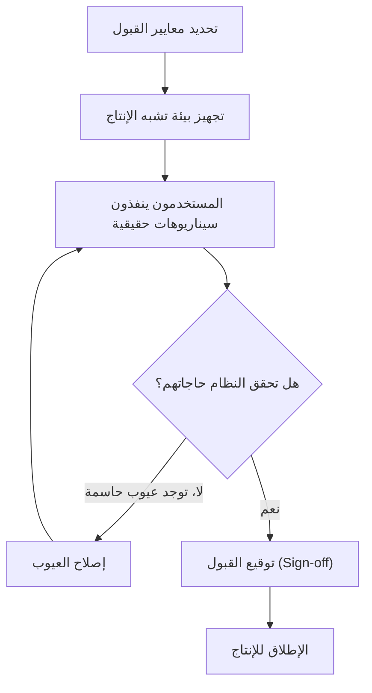

# اختبار قبول المستخدم (UAT)
> [!info] تعريف مختصر
> اختبار قبول المستخدم (User Acceptance Testing) هو مرحلة الاختبار الأخيرة قبل الإطلاق، حيث يقوم المستخدمون الفعليون أو أصحاب المصلحة (وليس فريق التطوير) بالتحقق من أن النظام يلبي احتياجاتهم الحقيقية ويعمل كما هو متوقع في بيئة قريبة من الواقع.

## الشرح العلمي والاحترافي
- الفرق الجوهري بين UAT وأنواع الاختبار الأخرى: اختبارات الوحدة (Unit Testing) والتكامل (Integration Testing) والانحدار ([[Regression Testing]]) يجريها المطورون أو فريق الجودة للتحقق من أن الكود "يعمل بشكل صحيح تقنيًا"، أما UAT فيجريه المستخدم النهائي أو صاحب المصلحة للتحقق من أن النظام "يحقق الحاجة الفعلية للعمل" (Business Need).
- تُبنى اختبارات UAT عادة على معايير القبول (Acceptance Criteria) المتفق عليها مسبقًا، وغالبًا بصيغة [[Given When Then]] لتكون واضحة وقابلة للتحقق.
- UAT هو غالبًا آخر بوابة قبل [[Sign-off]] الرسمي و[[Go or No-Go Decision]] بشأن الإطلاق.
- ينفَّذ عادة في بيئة تشبه الإنتاج قدر الإمكان (انظر [[Staging vs Production Environment]]) وليس في بيئة التطوير.
- نجاح UAT لا يعني خلو النظام من العيوب تمامًا، بل يعني أن النظام "مقبول للاستخدام" وفق المعايير المتفق عليها؛ قد تُسجَّل ملاحظات بسيطة (Minor Issues) تُعالَج لاحقًا دون تعطيل الإطلاق.

## أين ومتى يُستخدم
- في نهاية دورة التطوير، قبل الإطلاق للإنتاج مباشرة، سواء في Waterfall (كمرحلة رسمية محددة) أو في Agile (كجزء من [[09 - Sprint Review]] أو قبل إصدار كبير يضم عدة سبرنتات).
- عند تسليم مشاريع للعملاء الخارجيين (Client Projects)، حيث يكون UAT شرطًا تعاقديًا قبل الدفعة النهائية (انظر [[Milestone-based Payment]]).
- عند إطلاق ميزة جديدة حساسة تمس تجربة المستخدم مباشرة.

## مثال وسيناريو تطبيقي
> [!example] طوّرت شركة نظام حجز مواعيد لعيادة طبية. بعد انتهاء التطوير والاختبار الداخلي، خُصص أسبوع لاختبار قبول المستخدم شارك فيه ثلاثة موظفي استقبال حقيقيين من العيادة. طُلب منهم تنفيذ سيناريوهات حقيقية: حجز موعد جديد، إلغاء موعد، وتعديل بيانات مريض. اكتشف أحد الموظفين أن النظام لا يسمح بحجز موعدين لنفس المريض في نفس اليوم رغم أن العيادة تحتاج ذلك أحيانًا (مثل فحص وأشعة في نفس اليوم)، رغم أن هذا لم يكن مذكورًا بوضوح في متطلبات المطورين الأصلية. اعتُبر هذا شرطًا لازمًا للقبول، فعاد الطلب لفريق التطوير لتعديله، وأُعيد اختبار القبول بعد الإصلاح، وتم توقيع [[Sign-off]] بعد نجاح كل السيناريوهات.

## خطوات أو مخطّط
1. تحديد معايير القبول (Acceptance Criteria) بالتعاون مع أصحاب المصلحة قبل بدء الاختبار.
2. تجهيز بيئة اختبار قريبة من الإنتاج وبيانات واقعية.
3. اختيار مستخدمين حقيقيين أو ممثلين عنهم لتنفيذ سيناريوهات فعلية من الحياة اليومية.
4. تسجيل أي ملاحظات أو عيوب تظهر أثناء الاختبار.
5. تصنيف الملاحظات: عيب يمنع الإطلاق (Blocker) أم ملاحظة يمكن تأجيلها.
6. إصلاح ما يلزم، وإعادة الاختبار عند الحاجة.
7. الحصول على توقيع القبول الرسمي (Sign-off) من صاحب المصلحة.

## ⚠️ مفاهيم خاطئة شائعة
> [!warning]
> - الخلط بين UAT و[[Regression Testing]] أو الاختبار الوظيفي العادي؛ UAT يركّز على قبول المستخدم للحاجة الفعلية وليس فقط على صحة الكود تقنيًا.
> - الاعتقاد أن فريق الجودة (QA) يمكنه إجراء UAT نيابة عن العميل؛ الأصل أن يقوم به المستخدمون الفعليون أو من يمثلهم بشكل موثوق.
> - الظن بأن نجاح UAT يعني "صفر عيوب"؛ في الواقع يعني تحقق معايير القبول المتفق عليها، مع إمكانية وجود ملاحظات ثانوية تُؤجَّل.

## ❌ ممارسات خاطئة في المشاريع
> [!failure]
> - تحديد معايير القبول بعد بدء الاختبار وليس قبله، ما يفتح الباب لخلافات حول ما هو "مقبول". الحل: الاتفاق على معايير القبول كتابيًا في مرحلة مبكرة، ويُفضَّل عند صياغة [[11 - User Stories]].
> - إجراء UAT في بيئة تطوير غير مستقرة أو ببيانات وهمية غير واقعية، ما يعطي نتائج غير موثوقة. الحل: استخدام بيئة Staging مطابقة قدر الإمكان للإنتاج.
> - ضغط الجدول الزمني بحيث يُختصر UAT ليوم واحد فقط لمشروع كبير، فيغيب التمثيل الحقيقي للسيناريوهات. الحل: تخصيص وقت كافٍ يتناسب مع حجم المخاطر والتعقيد.

## 🔗 مصطلحات ومفاهيم ذات صلة
[[Regression Testing]], [[Sign-off]], [[Given When Then]], [[Go or No-Go Decision]], [[Staging vs Production Environment]], [[QA vs QC]], [[Milestone-based Payment]], [[Smoke Testing]], [[09 - Sprint Review]]
