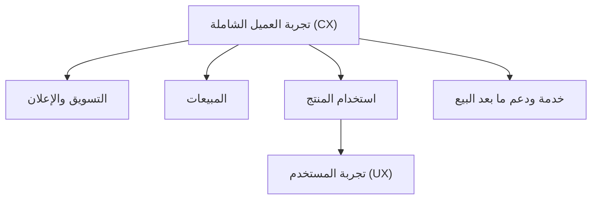

# تجربة المستخدم مقابل تجربة العميل (UX vs CX)

> [!info] تعريف مختصر
> تجربة المستخدم (User Experience - UX) هي شعور وسهولة تفاعل الشخص مع منتج أو واجهة رقمية تحديداً (كالتطبيق أو الموقع)، بينما تجربة العميل (Customer Experience - CX) أوسع نطاقاً، وتشمل كل نقاط تواصل العميل مع العلامة التجارية بالكامل، من الإعلان والمبيعات وحتى الدعم الفني وما بعد البيع.

## الشرح العلمي والاحترافي
- تُعنى UX بتفاصيل التفاعل المباشر مع المنتج الرقمي: سهولة التصفح، وضوح الأزرار، سرعة تحميل الصفحة، وترتيب المعلومات على الشاشة. مجالها محدد وملموس، ويقاس عادة بمقاييس مثل معدل إتمام المهمة (Task Completion Rate) وزمن إنجاز المهمة.
- تُعنى CX بالصورة الكاملة والشاملة: كيف يشعر العميل تجاه الشركة عموماً، بدءاً من أول إعلان يراه، مروراً بتجربة الشراء، استخدام المنتج (والتي تتضمن UX كجزء منها)، حتى تجربته مع خدمة العملاء عند الشكوى أو الاسترجاع.
- العلاقة بينهما احتوائية وليست تنافسية: UX هو جزء واحد من أجزاء عديدة تُشكّل CX الكلية. يمكن أن يكون تصميم التطبيق (UX) ممتازاً، لكن CX الإجمالية سيئة بسبب بطء الدعم الفني أو سياسة استرجاع معقدة، والعكس صحيح أيضاً.
- تقاس تجربة العميل الشاملة غالباً عبر مؤشرات مثل [[NPS]] (مدى استعداد العميل للتوصية بالشركة)، بينما تقاس تجربة المستخدم عبر مقاييس أكثر تحديداً كسهولة الاستخدام (Usability) ومعدل الأخطاء أثناء التفاعل.
- فهم الفرق بين المفهومين مهم لمديري المشاريع لأنه يوضّح مسؤولية كل فريق: فريق تصميم المنتج مسؤول غالباً عن UX، بينما CX مسؤولية مشتركة بين التسويق، المبيعات، المنتج، وخدمة العملاء معاً.

## أين ومتى يُستخدم
- يُستخدم UX تحديداً في مشاريع تطوير المنتجات الرقمية (تطبيقات، مواقع، أنظمة داخلية)، عند تصميم الواجهات وأثناء اختبارات القابلية للاستخدام (Usability Testing).
- يُستخدم CX في مشاريع أوسع تشمل استراتيجية الشركة الكاملة، مثل إعادة تصميم رحلة العميل بأكملها ([[User Journey Map]])، أو مشاريع تحسين ولاء العملاء والاحتفاظ بهم.
- يُفرَّق بينهما بوضوح عند تحديد نطاق ([[Scope Statement]]) أي مشروع تحسين تجربة، لتجنب الخلط بين تحسين شاشة واحدة (UX) ومشروع تحويل تنظيمي شامل (CX).

## مثال وسيناريو تطبيقي
> [!example] سيناريو ملموس في مشروع برمجي حقيقي
> شركة اتصالات تعيد تصميم تطبيقها لدفع الفواتير. يعمل فريق UX على تحسين واجهة الدفع فقط: تقليل خطوات الدفع من خمس إلى خطوتين، وتحسين وضوح الأزرار، فترتفع نسبة إتمام عملية الدفع داخل التطبيق من 60% إلى 85%.
> لكن رغم هذا التحسن، يلاحظ فريق CX أن مؤشر [[NPS]] العام للشركة لم يتحسن، لأن العملاء ما زالوا يشتكون من طول وقت الانتظار في مركز الاتصال عند حدوث خطأ في الفاتورة، وهي نقطة خارج نطاق تطبيق الدفع نفسه.
> بناءً على هذا، تُطلق الشركة مبادرة CX شاملة تغطي: تحسين تطبيق الدفع (UX)، تقليل وقت انتظار مركز الاتصال، وتبسيط سياسة تصحيح الفواتير الخاطئة، فيرتفع مؤشر NPS الإجمالي بعد ستة أشهر رغم أن واجهة التطبيق لم تتغيّر أكثر من ذلك.

## خطوات أو مخطّط
1. تحديد ما إذا كان الهدف تحسين تفاعل محدد مع منتج رقمي (UX) أم تحسين شامل لعلاقة العميل بالكامل مع العلامة التجارية (CX).
2. لتحسين UX: إجراء اختبارات قابلية استخدام، وقياس معدلات إتمام المهام وزمن التفاعل.
3. لتحسين CX: رسم [[User Journey Map]] كاملة عبر كل نقاط التواصل (تسويق، مبيعات، منتج، دعم).
4. تحديد نقاط الألم في كل مستوى وتحديد الفريق المسؤول عن كل نقطة.
5. قياس الأثر: مقاييس دقيقة للـ UX (كزمن المهمة)، ومقاييس شاملة للـ CX (كـ [[NPS]] ومعدل الاحتفاظ بالعملاء).

## ⚠️ مفاهيم خاطئة شائعة
> [!warning]
> - الظن أن UX وCX مصطلحان مترادفان يمكن استخدامهما بالتبادل؛ في الحقيقة UX جزء محدد ضمن CX الأوسع نطاقاً.
> - الاعتقاد أن تحسين واجهة التطبيق (UX) وحده كافٍ لإرضاء العملاء وزيادة ولائهم؛ العميل قد يترك الشركة بسبب تجربة سيئة في الدعم أو الفوترة رغم تطبيق ممتاز.
> - افتراض أن CX مسؤولية فريق التصميم فقط؛ في الواقع هي مسؤولية مشتركة بين عدة فرق (تسويق، مبيعات، منتج، دعم) يجب أن تتنسق معاً.

## ❌ ممارسات خاطئة في المشاريع
> [!failure]
> - قياس نجاح مشروع تحسين تجربة كامل (CX) بمقاييس UX فقط (كسرعة التطبيق)، متجاهلاً بقية نقاط تواصل العميل. التجنب: استخدام مقاييس شاملة مثل [[NPS]] بجانب مقاييس UX التفصيلية.
> - إسناد مشروع تحسين CX الشامل لفريق تصميم المنتج فقط دون إشراك فرق المبيعات والدعم. التجنب: تشكيل فريق متعدد الوظائف ([[Cross-functional Team]]) يمثّل جميع نقاط تواصل العميل.
> - تحسين واجهة رقمية بمعزل عن باقي رحلة العميل، فيظهر تحسّن في مقاييس UX الداخلية دون أي أثر ملموس على رضا العميل العام. التجنب: ربط كل مبادرة UX بهدف CX أكبر ورسم [[User Journey Map]] كاملة قبل البدء.

## 🔗 مصطلحات ومفاهيم ذات صلة
[[User Journey Map]] | [[Pain Point]] | [[NPS]] | [[Customer and Market Validation]] | [[Cross-functional Team]] | [[Scope Statement]] | [[21 - Stakeholder Communication]]
