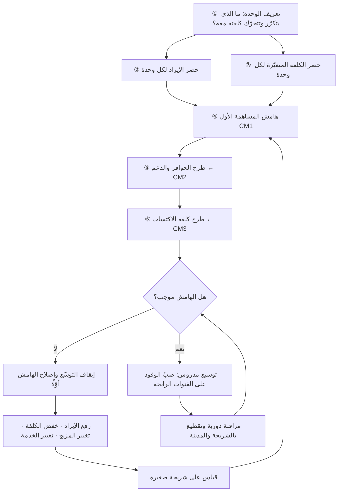

# اقتصاديات الوحدة (Unit Economics)

> [!info] تعريف مختصر
> تحليل يقيس الإيراد والكلفة المرتبطين بـ**وحدة واحدة** من نشاط المنتج — عميل واحد، أو طلب واحد، أو اشتراك واحد، أو استدعاء واحد لنموذج ذكاء اصطناعي — بدل النظر إلى إجمالي الشركة. السؤال المركزي فيه بسيط وقاسٍ: حين نبيع وحدة إضافية واحدة، هل نكسب أم نخسر؟ الجواب يُستخرج من **هامش المساهمة (Contribution Margin)**: الإيراد لكل وحدة ناقص الكلفة المتغيّرة لكل وحدة. إن كان الهامش موجبًا فالنموّ يقرّبك من الربح؛ وإن كان سالبًا فالنموّ نفسه هو ما يقتلك، لأن كل عميل جديد يوسّع الخسارة بدل أن يخفّفها. اقتصاديات الوحدة إذن ليست تقريرًا ماليًّا متأخّرًا، بل **أداة تصميم منتج**: تحدّد ما يجوز بناؤه، وبأي تسعير، ولأي شريحة.

## الشرح العلمي والاحترافي
- **الفكرة الجوهرية: فصل المتغيّر عن الثابت.** الكلفة الثابتة (رواتب الفريق الأساسي، الإيجار، الرخص السنوية، جزء كبير من البنية التحتية الأساسية) لا تتحرّك كثيرًا مع كل وحدة إضافية. الكلفة المتغيّرة (رسوم بوّابة الدفع، أجرة المندوب، كلفة الاستضافة المرتبطة بالاستخدام، كلفة استدعاء النموذج، الدعم البشري لكل طلب، تكلفة التغليف) تتحرّك تقريبًا خطّيًّا مع الحجم. اقتصاديات الوحدة تنظر إلى الطبقة المتغيّرة أوّلًا، لأن الطبقة الثابتة تُغطّى لاحقًا بحجم كافٍ من هامش المساهمة — بشرط أن يكون الهامش موجبًا أصلًا. هذا الترتيب مهم: **الحجم يحلّ مشكلة الكلفة الثابتة، ولا يحلّ أبدًا مشكلة الهامش السالب.**
- **هامش المساهمة (Contribution Margin) هو المخرَج الأساسي.** يُحسب: `الإيراد لكل وحدة − الكلفة المتغيّرة لكل وحدة`. ويُعبَّر عنه بالقيمة المطلقة (مثلًا: 7 ريالات لكل طلب) وبالنسبة المئوية من الإيراد (مثلًا: 18%). القيمة المطلقة تخبرك كم وحدة تحتاج لتغطية كلفتك الثابتة؛ والنسبة تخبرك كم أنت هشّ أمام ارتفاع الكلفة أو حرب الخصومات. ومن الشائع في المنصّات التمييز بين **هامش مساهمة أوّل (CM1)** يطرح الكلفة المتغيّرة المباشرة فقط، و**هامش ثانٍ (CM2)** يطرح إضافةً إليه الحوافز والخصومات ودعم العملاء، و**هامش ثالث (CM3)** يطرح كلفة التسويق والاكتساب المنسوبة إلى تلك الوحدة. الترقيم نفسه ليس معيارًا عالميًّا موحّدًا، لذا **لا معنى لمقارنة "CM2" بين شركتين قبل الاتفاق على ما بداخله**.
- **اختيار تعريف «الوحدة» قرار استراتيجي لا تفصيل محاسبي.** الوحدة الصحيحة هي أصغر شيء **يتكرّر ويُتّخذ حياله قرار تشغيلي**. في تطبيق توصيل: الوحدة هي الطلب، لأن كل طلب يستهلك مندوبًا ووقتًا ورسوم دفع. في منتج اشتراك B2B: الوحدة هي الحساب (Account) وليس المستخدم، لأن التعاقد والدعم والتكامل يحدث على مستوى الحساب. في منتج مبني على نماذج لغوية: قد تكون الوحدة هي «المحادثة» أو «المهمّة المنجزة» لا الاشتراك الشهري، لأن الكلفة الحقيقية تتحرّك مع الاستخدام لا مع العقد. القاعدة العملية: **اختر الوحدة التي إذا تضاعف عددها تضاعفت كلفتك المتغيّرة** — إن لم تتحرّك الكلفة معها فأنت تقيس شيئًا آخر.
- **خطر الوحدة الخاطئة أشدّ من خطر عدم القياس.** إن عرّفت الوحدة على مستوى «المستخدم الشهري النشط» في منتج يُستخدم بكثافة متفاوتة جدًّا، ستحصل على متوسّط يخفي شريحة خاسرة كبيرة داخل شريحة رابحة. الحل هو تحليل التوزيع لا المتوسّط ([[Percentiles and Median vs Average]]) وتقطيع الاقتصاديات بحسب الشريحة والقناة والمدينة ([[Cohort Analysis]]).
- **العلاقة بالكلفة الكلّية للملكية والإنفاق الرأسمالي.** اقتصاديات الوحدة تنظر أفقيًّا (لكل وحدة)، بينما [[TCO]] ينظر زمنيًّا (كامل عمر الأصل أو النظام)، و[[CapEx vs OpEx]] ينظر إلى **شكل** الإنفاق ومكانه في القوائم المالية. الثلاثة يجب أن تتّسق: تحويل بنية تحتية من شراء خوادم (CapEx) إلى سحابة مدفوعة بالاستخدام (OpEx) ينقل كلفة كانت ثابتة إلى خانة **المتغيّر**، وهذا يغيّر هامش المساهمة مباشرةً — قد يحسّنه في مرحلة الحجم المنخفض ويضرّه بشدّة عند الحجم العالي. والعكس صحيح.
- **الذكاء الاصطناعي أعاد اقتصاديات الوحدة إلى الواجهة.** في البرمجيات التقليدية كانت الكلفة الحدّية للمستخدم الإضافي قريبة من الصفر، فصار مقبولًا ثقافيًّا تجاهل الهامش والتركيز على النموّ. أما المنتجات المبنية على الاستدلال ([[Inference Cost]]) فكلفتها الحدّية حقيقية وتتحرّك مع كل طلب وكل رمز (Token). هذا يجعل تسعير «اشتراك ثابت بلا حدود» فوق منتج مكلف الاستدلال قنبلة موقوتة: أثقل 5% من المستخدمين قد يستهلكون أضعاف ما يدفعون، ويتحوّل نجاح المنتج إلى نزيف.
- **العلاقة بدراسة الجدوى وقرار الاستثمار.** [[Business Case]] يبرّر المشروع كاملًا؛ واقتصاديات الوحدة هي المحرّك الحسابي داخله. دراسة جدوى مبنية على افتراض هامش موجب لم يُختبر ميدانيًّا هي تمنٍّ مكتوب بلغة مالية. والاختبار الصحيح لا يكون بالافتراض بل بتشغيل شريحة صغيرة حقيقية ([[Pilot Launch]]) وقياس الهامش الفعلي بما فيه الاستثناءات والمرتجعات وإعادة المحاولة.
- **لماذا يعجّل النموّ موت المنتج سالب الاقتصاد؟** لأن السالب يتراكم بثلاث طرق في آن: (١) كل وحدة إضافية تزيد الخسارة النقدية مباشرةً؛ (٢) الحجم يستهلك رأس المال العامل ويقصّر مدرج السيولة (Runway)؛ (٣) النموّ نفسه يخلق التزامات تشغيلية جديدة — دعم، عمليات، امتثال — يصعب تفكيكها لاحقًا. والأخطر أن النموّ يُنتج مؤشّرات مبهجة ([[Vanity Metrics]]) تُقنع الفريق والمستثمر بأن المسار سليم، فتتأخّر لحظة المواجهة إلى حين لا تكفي فيه أي تسوية تدريجية. القاعدة: **لا تصبّ وقودًا على قناة اكتساب قبل أن يثبت أن الوحدة التي تشتريها رابحة أو تصير رابحة بمسار واضح ومحدَّد زمنيًّا.**

## أين ومتى يُستخدم
- **عند تسعير المنتج أو تعديل الباقات**: التسعير قرار اقتصاديات وحدة قبل أن يكون قرار تسويق. كل باقة يجب أن يكون لها هامش مساهمة معروف على حدة، لا هامش «متوسّط للمنتج».
- **قبل توسيع قناة اكتساب أو دخول مدينة/سوق جديدة**: تُحسب الاقتصاديات لكل قناة وكل جغرافيا على حدة، لأن كلفة التوصيل والدعم والدفع تختلف جذريًّا. يرتبط هذا مباشرةً بـ[[Customer Acquisition Cost]] و[[Market Entry Modes]].
- **عند تقييم ميزة مكلفة التشغيل**: ميزة تستهلك استدلالًا مكثّفًا أو دعمًا بشريًّا لكل استخدام تُقيَّم بأثرها على الهامش لا بإعجاب المستخدمين بها وحده ([[Cost of Delay]] و[[Opportunity Cost]] يكملان الصورة).
- **في بناء [[Business Case]] وطلب ميزانية**: كل رقم في دراسة الجدوى يجب أن يُردّ إلى وحدة قابلة للقياس والتحقّق.
- **عند اختيار البنية التقنية**: قرار السحابة مقابل الاستضافة الذاتية، أو نموذج كبير مقابل نموذج أصغر مع تحسين، هو في جوهره قرار بين [[CapEx vs OpEx]] وأثره على [[Inference Cost]] وبالتالي على الهامش.
- **في مراجعات الأداء الدورية**: يوضع هامش المساهمة إلى جانب مؤشّرات النموّ في لوحة القيادة، ليعمل بوصفه [[Counter Metric]] يمنع مطاردة النموّ على حساب الجدوى.

## مثال وسيناريو تطبيقي
> [!example] **الافتراض معلن: هذا سيناريو تعليمي مُركَّب لشركة افتراضية، والأرقام موضوعة للتوضيح لا منسوبة إلى شركة حقيقية.**
> منصّة افتراضية لتوصيل البقالة في مدينة خليجية، متوسّط قيمة السلة 95 ريالًا. الفريق يحتفل: الطلبات نمت من 4,000 إلى 26,000 طلب شهريًّا خلال ربعين، والتطبيق في المراكز الأولى بالمتجر.
> حسب المدير المالي الاقتصاديات لكل **طلب** (الوحدة المختارة، لأن كل طلب يستهلك مندوبًا ورسوم دفع وتغليفًا):
> - إيراد المنصّة لكل طلب: عمولة التاجر 12% = 11.4 ريال + رسوم توصيل من العميل 8 ريالات = **19.4 ريال**.
> - الكلفة المتغيّرة المباشرة: أجرة المندوب للرحلة 14 ريالًا + رسوم بوّابة الدفع 2.1% من 103 ريال ≈ 2.2 ريال + تغليف مبرَّد 1.5 ريال = **17.7 ريال**.
> - **هامش المساهمة الأول (CM1) = 1.7 ريال للطلب (≈ 8.8%).** موجب — وهذا ما كان يُعرض في اجتماعات مجلس الإدارة.
> ثم أُضيفت الطبقة الثانية: قسيمة خصم أولى بقيمة 25 ريالًا تُمنح لكل مستخدم جديد ويستخدمها 61% من الطلبات الأولى، ودعم عملاء بمعدّل 0.9 ريال للطلب، ومرتجعات وأصناف ناقصة تُعوَّض نقديًّا بمعدّل 1.6 ريال للطلب.
> - **CM2 ≈ سالب 2.4 ريال للطلب.**
> بمعنى أن المنصّة تدفع من جيبها 2.4 ريال في كل طلب. عند 4,000 طلب كانت الخسارة الشهرية من هذا البند نحو 9,600 ريال — مبلغ يذوب داخل ميزانية التسويق ولا يلفت النظر. وعند 26,000 طلب صارت نحو **62,400 ريال شهريًّا**، أي أن النموّ ستّة أضعاف ضاعف النزيف ستّة أضعاف بالضبط. النموّ لم يكن يقود إلى الربحية، بل يبتعد عنها بسرعة أكبر.
> عند التقطيع بحسب المنطقة داخل المدينة ظهر أن الصورة ليست موحّدة: أحياء المركز (كثافة عالية، مسافات قصيرة، سلة أكبر) كانت CM2 فيها **موجبًا** بنحو 3.1 ريال، بينما الأحياء الطرفية كانت سالبة بنحو 9 ريالات لأن رحلة المندوب تستغرق ثلاثة أضعاف الوقت وقيمة السلة أقل.
> ما فعله الفريق خلال ربع واحد: (١) رفع حدّ الطلب الأدنى للتوصيل المجاني إلى 120 ريالًا بدل 60، فارتفع متوسّط السلة إلى 118 ريالًا وارتفعت العمولة المطلقة؛ (٢) تجميع الطلبات المتقاربة في رحلة واحدة (Batching) فانخفض متوسّط أجرة المندوب للطلب إلى 9.8 ريال في الأحياء الكثيفة؛ (٣) تحويل قسيمة الـ25 ريالًا من خصم نقدي مباشر إلى توصيل مجاني لأول طلبين، فانخفضت كلفتها الفعلية إلى نحو 9 ريالات مع بقاء أثرها على التحويل قريبًا؛ (٤) تعليق التسويق المدفوع في الأحياء الطرفية مؤقتًا حتى تكفي الكثافة لتجميع الطلبات.
> النتيجة بعد ربع: عدد الطلبات **انخفض** إلى 21,000 (وهو ما بدا في البداية إخفاقًا)، لكن CM2 صار موجبًا بنحو 4.6 ريال للطلب، أي مساهمة شهرية موجبة تقارب 96,600 ريال بدل نزيف 62,400. الدرس الذي وثّقه الفريق في [[Decision Log]]: **رقم النموّ وحده لم يكن يخبرهم أي شيء عن اتّجاه الشركة.**

## خطوات أو مخطّط
1. **عرّف الوحدة صراحةً واكتبها**: ما الشيء الذي إذا تضاعف عدده تضاعفت كلفتنا المتغيّرة؟ (طلب · حساب · محادثة · شحنة).
2. **اجمع الإيراد لكل وحدة** بكل مصادره: عمولة، رسوم، إيراد إضافي (إعلانات، خدمات مدفوعة)، مع طرح ضريبة القيمة المضافة إن كانت محصَّلة نيابةً عن الجهة الضريبية لا إيرادًا لك.
3. **اجرد الكلفة المتغيّرة بندًا بندًا** ولا تنسَ البنود الخفيّة: رسوم الدفع، الاسترداد، الاحتيال، الدعم، إعادة المحاولة، التخزين والنقل، كلفة الاستدلال.
4. **احسب CM1** (المباشر) ثم أضف طبقة الحوافز والخصومات والدعم للحصول على **CM2**، ثم انسب كلفة الاكتساب للحصول على **CM3**. وثّق ما بداخل كل طبقة كتابةً.
5. **قطّع النتيجة** بحسب الشريحة والقناة والمدينة والباقة، ولا تكتفِ بالمتوسّط العام.
6. **حدّد نقطة التعادل**: كم وحدة شهريًّا تحتاج لتغطية كلفتك الثابتة عند الهامش الحالي؟ إن كان الرقم غير واقعي، فالمشكلة في الهامش لا في جهد المبيعات.
7. **ابنِ خطة تحسين الهامش** بأربعة مسارات فقط: رفع الإيراد لكل وحدة · خفض الكلفة المتغيّرة · تغيير مزيج الشرائح نحو الرابحة · تغيير تعريف الخدمة نفسها.
8. **راقب دوريًّا واضبط الحوكمة**: اجعل الهامش بندًا ثابتًا في مراجعة الأداء، واربطه بمعايير إيقاف واضحة ([[Kill Criteria]]) إن لم يتحسّن خلال مدى زمني معلن.

## ⚠️ مفاهيم خاطئة شائعة
> [!warning]
> - **«الهامش السالب طبيعي في البداية وسيُصلحه الحجم»**: هذا صحيح فقط إذا كان السالب ناتجًا عن **كلفة ثابتة موزَّعة على حجم صغير**، أو عن بند متغيّر لديه مسار انخفاض مثبت هندسيًّا أو تفاوضيًّا (كثافة أعلى، سعر تفاوضي عند حجم، تحسين تقني). أما السالب البنيوي — حيث لا يوجد سبب ميكانيكي لانخفاض الكلفة مع الحجم — فالحجم يضاعفه ولا يعالجه. الاختبار: **اكتب صراحةً الآلية التي ستخفض الكلفة، وإن عجزت عن كتابتها فلا آلية.**
> - **الخلط بين هامش المساهمة والهامش الإجمالي (Gross Margin)**: الهامش الإجمالي مصطلح محاسبي يطرح «كلفة البضاعة المباعة» بتعريفها المحاسبي، وقد يتضمّن بنودًا ثابتة ويستبعد بنودًا متغيّرة مهمّة. هامش المساهمة مصطلح إداري يطرح **المتغيّر فقط**. الرقمان مختلفان وقد يقودان إلى قرارين متعاكسين.
> - **اعتبار اقتصاديات الوحدة رقمًا واحدًا للشركة**: لا يوجد «هامش الشركة»؛ يوجد هامش لكل شريحة وقناة ومدينة وباقة. المتوسّط الموجب قد يخفي نصف عمليات خاسرة، والعكس ([[Simpson's Paradox]] يظهر هنا بوضوح).
> - **الظنّ بأن رفع السعر هو دائمًا الحل**: رفع السعر يحسّن الهامش لكل وحدة لكنه قد يخفض الكمية والاحتفاظ، فيقلّ إجمالي المساهمة. القرار الصحيح يقيس **إجمالي المساهمة** (الهامش × الحجم) لا الهامش وحده.
> - **معاملة كلفة السحابة والاستدلال كأنها ثابتة**: هي متغيّرة بطبيعتها في نماذج الدفع بالاستخدام، وإدراجها في الخانة الثابتة يجمّل الهامش تجميلًا زائفًا ([[Inference Cost]]).
> - **افتراض أن الوحدة الرابحة اليوم ستبقى رابحة**: أسعار المندوبين والدفع والاستدلال والامتثال تتغيّر، وكذلك سلوك المستخدمين. الهامش رقم حيّ يحتاج مراجعة دورية لا حسابًا مرّة واحدة.

## ❌ ممارسات خاطئة في المشاريع
> [!failure]
> - **الخطأ: إطلاق حملة اكتساب واسعة قبل حساب الهامش.** → **لماذا يضرّ**: تحوّل ميزانية التسويق إلى مضخّة تسرّع الخسارة، وتبني عادات مستخدمين مرتبطة بالسعر المدعوم يصعب فطامها لاحقًا. → **الحل**: اشترط في حوكمة الإنفاق أن يسبق أي زيادة في ميزانية الاكتساب تقريرُ هامش لكل قناة، واربط الصرف بسقف زمني ومعيار إيقاف.
> - **الخطأ: إخفاء الخصومات والحوافز خارج حساب الوحدة بحجّة أنها «استثمار تسويقي مؤقّت».** → **لماذا يضرّ**: يجعل CM1 يبدو موجبًا بينما الشركة تنزف فعليًّا، ويؤخّر لحظة الاكتشاف حتى تصير التسوية مؤلمة. → **الحل**: اعرض CM1 وCM2 وCM3 معًا دائمًا في اللوحة نفسها، ولا تُقدَّم أي طبقة منفردة إلى مجلس الإدارة.
> - **الخطأ: تسعير اشتراك ثابت غير محدود فوق منتج كلفة تشغيله تتحرّك مع الاستخدام.** → **لماذا يضرّ**: يجعل أكثف المستخدمين — وهم عادةً الأكثر ولاءً وصوتًا — أكبر مصدر خسارة، فيتحوّل نجاح التبنّي إلى أزمة نقدية. → **الحل**: صمّم التسعير بطبقات مرتبطة بالاستخدام أو بحدود عادلة معلنة، وراقب توزيع الاستهلاك في المئينات العليا لا المتوسّط.
> - **الخطأ: قياس الهامش على متوسّط الشركة وتجاهل التقطيع الجغرافي أو القطاعي.** → **لماذا يضرّ**: يستمرّ ضخّ الموارد في شرائح خاسرة بنيويًّا لأنها مغطّاة بشرائح رابحة، فيُهدر رأس المال ويُشوَّه فهم السوق. → **الحل**: اجعل التقطيع (مدينة · قناة · باقة · فوج) شرطًا في تعريف «تقرير هامش مكتمل».
> - **الخطأ: تحميل فريق المنتج مسؤولية النموّ وحده وترك الهامش للمالية.** → **لماذا يضرّ**: يفصل من يصنع القرار عن من يرى نتيجته، فتُبنى ميزات ترفع الاستخدام وتهدم الاقتصاد. → **الحل**: أدرِج هامش المساهمة ضمن مؤشّرات فريق المنتج نفسه، وليس مؤشّرًا ماليًّا موازيًا.
> - **الخطأ: بناء [[Business Case]] على هامش مستقبلي مفترض دون اختبار ميداني.** → **لماذا يضرّ**: يحوّل الافتراض إلى التزام مالي، وحين يتبيّن خطؤه تكون الشركة قد وظّفت وتعاقدت على أساسه. → **الحل**: اختبر الهامش على شريحة صغيرة حقيقية أوّلًا، وسجّل الفارق بين المفترض والفعلي في [[Decision Log]].
> - **الخطأ: تحسين الهامش بخفض الجودة أو الدعم دون قياس الأثر المتأخّر.** → **لماذا يضرّ**: يظهر تحسّن فوري في الرقم بينما يرتفع [[Churn]] بعد أشهر، فتخسر المساهمة كلها لا جزءًا منها. → **الحل**: اقرن كل إجراء لخفض الكلفة بمؤشّر مضادّ ([[Counter Metric]]) على الاحتفاظ والجودة، وراجعه بعد فوجين على الأقل.

## 🔗 مصطلحات ومفاهيم ذات صلة
[[TCO]] | [[CapEx vs OpEx]] | [[Inference Cost]] | [[Business Case]] | [[Customer Acquisition Cost]] | [[Customer Lifetime Value]] | [[Two-sided Marketplace]] | [[Churn]] | [[Retention]] | [[Cohort Analysis]] | [[Counter Metric]] | [[Vanity Metrics]] | [[Opportunity Cost]] | [[Percentiles and Median vs Average]] | [[Simpson's Paradox]]
