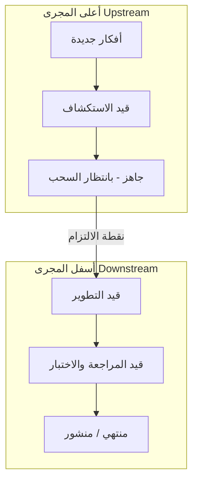

# كانبان أعلى المجرى مقابل أسفل المجرى (Upstream vs Downstream Kanban)
> [!info] تعريف مختصر
> "أعلى المجرى" (Upstream) هو الجزء من نظام كانبان الذي يهتم باكتشاف الفكرة وصياغتها وتحديد أولويتها قبل أن تصبح جاهزة للتنفيذ، بينما "أسفل المجرى" (Downstream) هو الجزء الذي ينفّذ العمل فعليًا حتى يصل إلى العميل. الفصل بينهما يمنع الفريق من الغرق في بند غير ناضج، ويمنع تراكم أفكار غير مُقيَّمة أمام فريق التنفيذ.

## الشرح العلمي والاحترافي
- نظام كانبان (Kanban) الكلاسيكي يُظهر عادةً أعمدة التنفيذ فقط (قيد الانتظار، قيد التنفيذ، منتهي)، لكنه يتجاهل السؤال الأهم: من أين تأتي هذه البنود؟ ومن قرر أنها تستحق التنفيذ؟
- **أعلى المجرى (Upstream)** يغطي المراحل التي تسبق الالتزام بالتنفيذ: جمع الأفكار، الاستكشاف (Discovery)، تحليل الجدوى، صياغة معايير الجاهزية ([[Definition of Ready]])، والتقييم بمقابل بنود أخرى في [[Backlog Refinement]].
- **أسفل المجرى (Downstream)** يغطي التنفيذ الفعلي بعد "نقطة الالتزام" (Commitment Point): التطوير، الاختبار، المراجعة، النشر، حتى الوصول إلى [[Definition of Done]].
- بين المنطقتين توجد نقطتان محوريتان يجب فهمهما جيدًا:
  1. **نقطة الالتزام (Commitment Point)**: اللحظة التي يقرر فيها الفريق رسميًا أن هذا البند سيُنفَّذ. قبلها يمكن التراجع عن أي فكرة بدون تكلفة تُذكر.
  2. **نقطة الإدخال في الطلب (Replenishment Point / Pull)**: عندما يتوفر مقعد فارغ في أسفل المجرى، يُسحب البند الأنضج من أعلى المجرى وفق [[Pull System]] و[[Replenishment]].
- الفائدة الجوهرية: تفصل "الاستكشاف غير المؤكد" عن "الالتزام المؤكد"، فلا يضغط أصحاب المصلحة على الفريق لتنفيذ فكرة لم تُدرَس بعد، ولا يتوقف الاستكشاف بسبب انشغال فريق التنفيذ.
- عمليًا، يُرسم لوح كانبان موسّع بعمودين رئيسيين مفصولين بخط عمودي واضح يمثل نقطة الالتزام، وكل جانب له أعمدة فرعية خاصة به وحدود عمل جارٍ ([[WIP Limit]]) مستقلة.

## أين ومتى يُستخدم
- في فرق [[03 - Kanban]] الناضجة، وخصوصًا في سياقات تطوير المنتجات حيث يقوم [[05 - Product Owner]] أو مدير المنتج بإدارة تدفق مستمر من الأفكار.
- يُستخدم بكثرة في الفرق التي تدير عدة أنواع طلبات (Service Classes) وتحتاج فرزًا مبكرًا، مثل [[Expedite Class]] مقابل الطلبات العادية.
- مفيد جدًا عندما تكون وتيرة الأفكار الواردة أعلى بكثير من قدرة التنفيذ، فيصبح أعلى المجرى بمثابة "مصفاة" تمنع الفوضى.
- يُستخدم أيضًا في [[Scrum-ban]] حيث يُدار الباكلوغ (Backlog) بمنطق كانبان أعلى المجرى قبل دخول السبرنت.

## مثال وسيناريو تطبيقي
> [!example]
> شركة "نُظُم" تطوّر تطبيق توصيل طعام. يستقبل مدير المنتج يوميًا عشرات الأفكار من المبيعات والدعم الفني ("أضيفوا خاصية تتبّع مباشر"، "العميل يشتكي من بطء الدفع"). بدلاً من إلقائها مباشرة على فريق التطوير:
> 1. تدخل الفكرة عمود "أفكار جديدة" في أعلى المجرى.
> 2. ينتقل مدير المنتج بها إلى عمود "قيد الاستكشاف" حيث تُجرى مقابلات مستخدمين سريعة وتُقدَّر الجدوى.
> 3. إذا ثبتت قيمتها، تنتقل إلى عمود "جاهز للقياس بالمقابل" حيث تُقارَن أولويتها بالبنود الأخرى ضمن حد عمل جارٍ لا يتجاوز 5 بنود.
> 4. عندما يُنجز فريق التطوير بندًا في أسفل المجرى، يتحرر مقعد، فيُسحب أعلى بند جاهز عبر نقطة الالتزام إلى عمود "قيد التطوير" في أسفل المجرى.
> النتيجة: فريق التطوير لا يرى إلا أفكارًا ناضجة ومُقيَّمة، وحجم الاستكشاف لا يُثقل كاهله.

## خطوات أو مخطّط
1. حدد أعمدة أعلى المجرى: أفكار → استكشاف → تقييم/تحديد أولوية → جاهز (Ready).
2. حدد نقطة الالتزام (Commitment Point) بوضوح بخط فاصل على اللوح.
3. حدد أعمدة أسفل المجرى: قيد التطوير → قيد المراجعة/الاختبار → جاهز للنشر → منتهي.
4. ضع حدود WIP مستقلة لكل جانب.
5. فعّل السحب (Pull) من أعلى المجرى إلى أسفل المجرى فقط عند توفر سعة.

## ⚠️ مفاهيم خاطئة شائعة
> [!warning]
> - الاعتقاد بأن أعلى المجرى "غير مهم" أو مجرد قائمة انتظار عشوائية؛ في الواقع هو نظام له حدود عمل جارٍ وقواعد سحب مثل أسفل المجرى تمامًا.
> - الخلط بين "وجود فكرة في الباكلوغ" و"الالتزام بتنفيذها"؛ نقطة الالتزام هي الفاصل الحقيقي، وليس مجرد الظهور على اللوح.
> - افتراض أن كل فكرة يجب أن تمر عبر نفس عدد المراحل؛ يمكن لبعض البنود (كالإصلاحات العاجلة ضمن [[Expedite Class]]) تجاوز أعلى المجرى بشكل شرعي ومُوثَّق.

## ❌ ممارسات خاطئة في المشاريع
> [!failure]
> - السماح لأصحاب المصلحة بالضغط لإدخال أفكار مباشرة إلى أسفل المجرى متجاوزين نقطة الالتزام، ما يكسر تدفق الفريق ويُنتج [[Scope Creep]]. تجنّبها بتثبيت قاعدة صريحة (Explicit Policy) لدخول العمل.
> - عدم وضع حدود WIP لأعلى المجرى، فتتراكم مئات الأفكار "قيد الاستكشاف" بلا نهاية ويصبح التحليل عبئًا بدل أن يكون فلترة. الحل: حدود WIP واضحة هنا أيضًا.
> - الخلط بين أعمدة أعلى وأسفل المجرى في لوح واحد بلا فاصل بصري، فيصعب على الفريق تمييز ما هو "مؤكد" مما هو "قيد الدراسة فقط"، ويُعامل الجميع كأنه التزام فعلي.

## 🔗 مصطلحات ومفاهيم ذات صلة
[[Pull System]] | [[WIP Limit]] | [[Replenishment]] | [[Backlog Refinement]] | [[Definition of Ready]] | [[Definition of Done]] | [[Expedite Class]] | [[Scrum-ban]] | [[Explicit Policies]] | [[03 - Kanban]] | [[13 - Backlog]] | [[Cycle Time]] | [[Lead Time]]

> [!tip] 💡 إثراء عملي — كورس الإنتاجية
> تصميم المجرى الأعلى بحالاته وحدوده وتعريف جاهزيته، ولماذا اقتصاده يختلف جذريًّا عن المجرى الأدنى: [[07 - المجرى الأعلى والمجرى الأدنى]].
