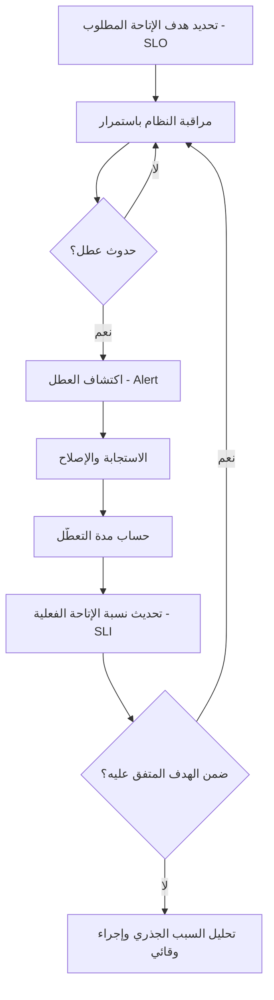

# نسبة الإتاحة (Uptime)
> [!info] تعريف مختصر
> نسبة الإتاحة (Uptime) هي النسبة المئوية من الوقت الذي يكون فيها نظام أو خدمة أو تطبيق متاحًا ويعمل بشكل صحيح خلال فترة زمنية محددة. هي أحد أهم مقاييس موثوقية الأنظمة الرقمية.

## الشرح العلمي والاحترافي
تُحسَب نسبة الإتاحة عادة بالمعادلة:
Uptime % = (الوقت الكلي − وقت التعطّل) ÷ الوقت الكلي × 100

كلما اقتربت النسبة من 100%، زادت موثوقية الخدمة. لكن الوصول إلى 100% الكاملة شبه مستحيل عمليًا وغير اقتصادي غالبًا؛ لذلك تُحدَّد أهداف واقعية تُعرف بـ"الأرقام التسعة" (Nines):
- 99% ("تسعتان") = حوالي 3.65 يوم تعطّل سنويًا.
- 99.9% ("ثلاث تسع") = حوالي 8.76 ساعة تعطّل سنويًا.
- 99.99% ("أربع تسع") = حوالي 52.6 دقيقة تعطّل سنويًا.
- 99.999% ("خمس تسع") = حوالي 5.26 دقيقة تعطّل سنويًا فقط.

كل "تسعة" إضافية تزيد التكلفة الهندسية بشكل كبير (بنية تحتية مكررة، مراقبة على مدار الساعة، فرق استجابة سريعة)، لذلك يجب اختيار هدف الإتاحة بناءً على حساسية الخدمة وليس السعي دومًا للأعلى.

ترتبط نسبة الإتاحة ارتباطًا مباشرًا باتفاقيات مستوى الخدمة (SLA - Service Level Agreement) مع العملاء: فهي غالبًا أحد بنود [[SLO]] (هدف مستوى الخدمة) الذي يُقاس عبر [[SLI]] (مؤشر مستوى الخدمة الفعلي المُقاس)، وقد تُحدَّد كذلك ضمن [[SLE]]. عندما يتجاوز التعطّل الحد المسموح، تدخل فرق [[SRE]] لتحليل السبب عبر [[Root Cause Analysis]] ولتقليل [[MTTR]] (متوسط وقت الإصلاح).

من المهم التفريق بين:
- **Uptime**: هل النظام "يعمل" (يستجيب) أم لا.
- **الأداء (Performance)**: النظام قد يكون "متاحًا" لكنه بطيء جدًا لدرجة تجعله غير مستخدَم فعليًا - وهذا لا يُحتسَب دائمًا كتعطّل رغم تأثيره السلبي على المستخدم.

## أين ومتى يُستخدم
- في إدارة العمليات التقنية ([[ITIL 4]]) وهندسة الموثوقية ([[SRE]]) لأي خدمة رقمية (مواقع، تطبيقات، واجهات API).
- عند صياغة عقود الخدمة مع العملاء أو مزودي الاستضافة (Cloud Providers)، كبند أساسي في [[SOW]] أو اتفاقيات الشراكة.
- عند التخطيط لـ[[RTO and RPO]] كجزء من خطط التعافي من الكوارث.
- في لوحات المراقبة (Dashboards) اليومية لفرق العمليات لمتابعة صحة النظام لحظيًا.

## مثال وسيناريو تطبيقي
> [!example] منصة "دفعة" للمدفوعات الإلكترونية توقّع عقدًا مع تجّار لضمان نسبة إتاحة 99.95% شهريًا.
> 1. الشهر يحتوي على 43,200 دقيقة تقريبًا. الحد المسموح للتعطّل = 0.05% × 43,200 ≈ 21.6 دقيقة فقط.
> 2. في أحد الأيام، يحدث عطل في قاعدة البيانات يستمر 15 دقيقة بسبب تحديث خاطئ.
> 3. فريق [[SRE]] يكتشف العطل عبر نظام تنبيهات آلي خلال دقيقتين، ويُصلحه خلال 13 دقيقة أخرى (إجمالي [[MTTR]] = 15 دقيقة).
> 4. في نهاية الشهر، إجمالي التعطّل المسجَّل = 18 دقيقة، أي أقل من الحد المسموح (21.6 دقيقة)، فيبقى الفريق ضمن اتفاقية مستوى الخدمة (SLA) المتفق عليها ولا تُطبَّق غرامات تعاقدية.
> 5. يُعقَد اجتماع تحليل السبب الجذري ([[Root Cause Analysis]]) لمنع تكرار نفس الخطأ، ويُحدَّث [[Issue Log]] بالإجراء الوقائي المتخذ.

## خطوات أو مخطّط

1. تحديد هدف الإتاحة (SLO) بناءً على حساسية الخدمة وتكلفة تحقيقه.
2. مراقبة النظام لحظيًا عبر أدوات تنبيه آلية.
3. عند حدوث عطل، قياس زمن الاستجابة وزمن الإصلاح (MTTR).
4. تسجيل مدة التعطّل الفعلية وحساب نسبة الإتاحة الشهرية أو السنوية.
5. مقارنة النتيجة بالهدف المتفق عليه في العقد أو الـ SLA.
6. عند التقصير، إجراء تحليل سبب جذري ووضع خطة وقائية.

## ⚠️ مفاهيم خاطئة شائعة
> [!warning]
> - الاعتقاد أن "نسبة إتاحة عالية جدًا" (99.999%) هدف يجب السعي إليه دائمًا؛ في الواقع تكلفته الهندسية قد تفوق فائدته لكثير من الأنظمة غير الحرجة.
> - الخلط بين Uptime والأداء (Performance)؛ فنظام بطيء جدًا لكنه "يستجيب" قد يُحتسب متاحًا رغم أن المستخدم يعتبره فعليًا "معطّلًا".
> - الظن أن التعطّل المخطَّط له (Planned Maintenance) لا يُحتسَب أبدًا ضمن حساب الإتاحة؛ هذا يعتمد على تعريف العقد بدقة - بعض الاتفاقيات تستثنيه وأخرى لا.

## ❌ ممارسات خاطئة في المشاريع
> [!failure]
> - **عدم تعريف "التعطّل" بدقة في العقد** (هل يشمل بطء الاستجابة؟ هل يُستثنى الصيانة المجدولة؟)، مما يؤدي لنزاعات مع العميل لاحقًا.
> - **الاعتماد على المراقبة اليدوية فقط** بدل أدوات تنبيه آلية، فيتأخر اكتشاف الأعطال وترتفع مدة [[MTTR]] بلا داعٍ.
> - **تجاهل تحليل السبب الجذري بعد كل حادثة** والاكتفاء بالإصلاح السطحي السريع، مما يؤدي لتكرار نفس العطل لاحقًا وتراكم الأثر على نسبة الإتاحة السنوية.

## 🔗 مصطلحات ومفاهيم ذات صلة
[[SLO]] | [[SLI]] | [[SLE]] | [[SRE]] | [[MTTR]] | [[Root Cause Analysis]] | [[RTO and RPO]] | [[ITIL 4]] | [[Staging vs Production Environment]] | [[Issue Log]]
